# 论文中文解读：《Mechanistic Interpretability for AI Safety: A Review》

## 一、综述定位

这是一篇机制可解释性综述。它追问：如果只看输入输出不足以保证安全，能否把神经网络内部的表示和计算逆向工程成人类可理解、可因果验证的算法？作者追求的不只是找到“相关神经元”，而是说明信息如何表示、传播并产生结果。

## 二、第 2 节：从外到内的解释范式

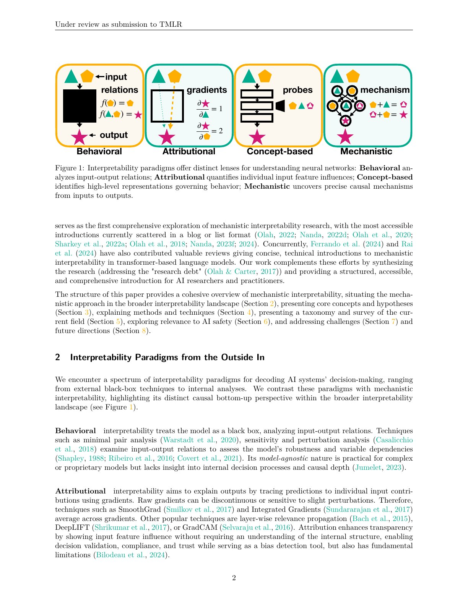

- **行为解释**比较输入输出，覆盖广但不知道内部实现。
- **归因解释**用梯度等方法估计输入贡献，但贡献不等于算法机制。
- **概念解释**用探针寻找高层表征；能证明信息可读出，不一定证明模型使用它。
- **机制解释**从组件与连接提出计算假设，再用干预验证，强调因果性和完整性。

## 三、第 3 节：核心概念

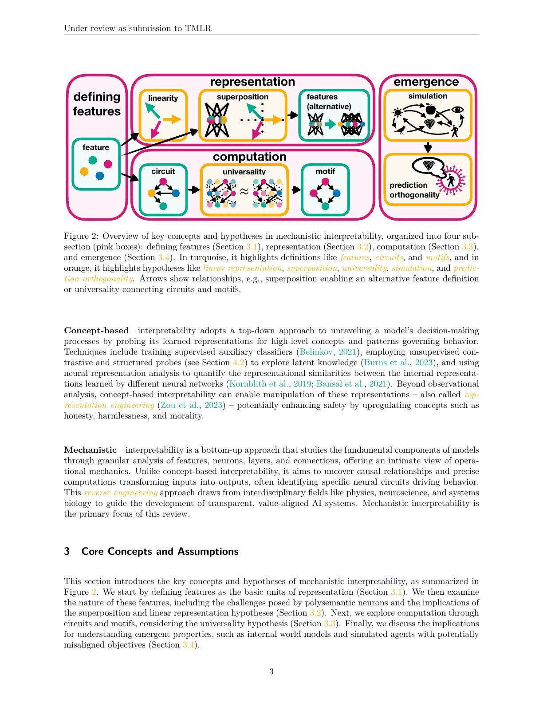

### 特征与表示

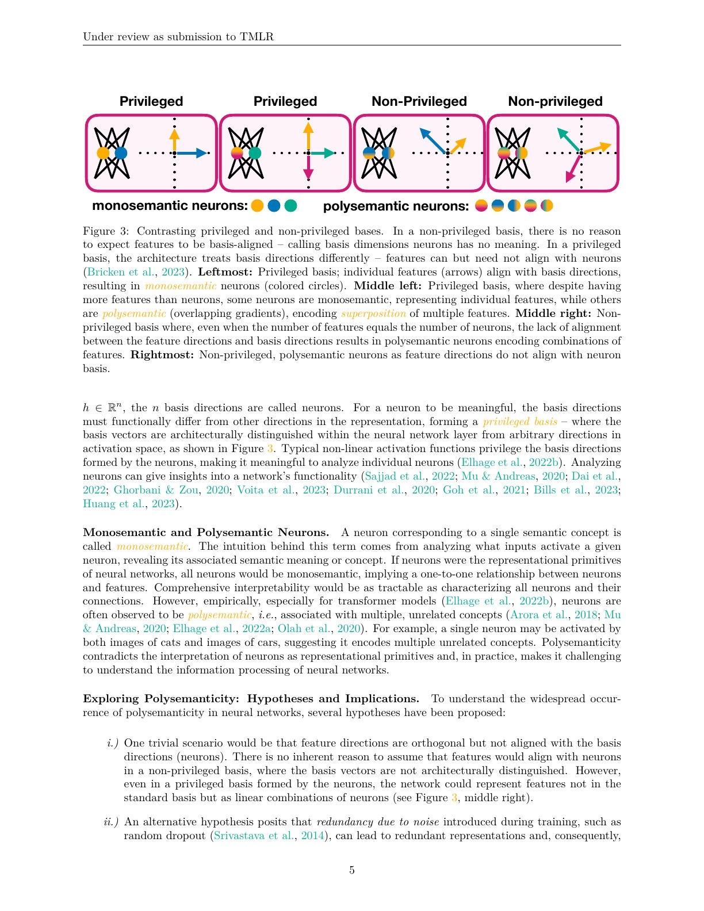

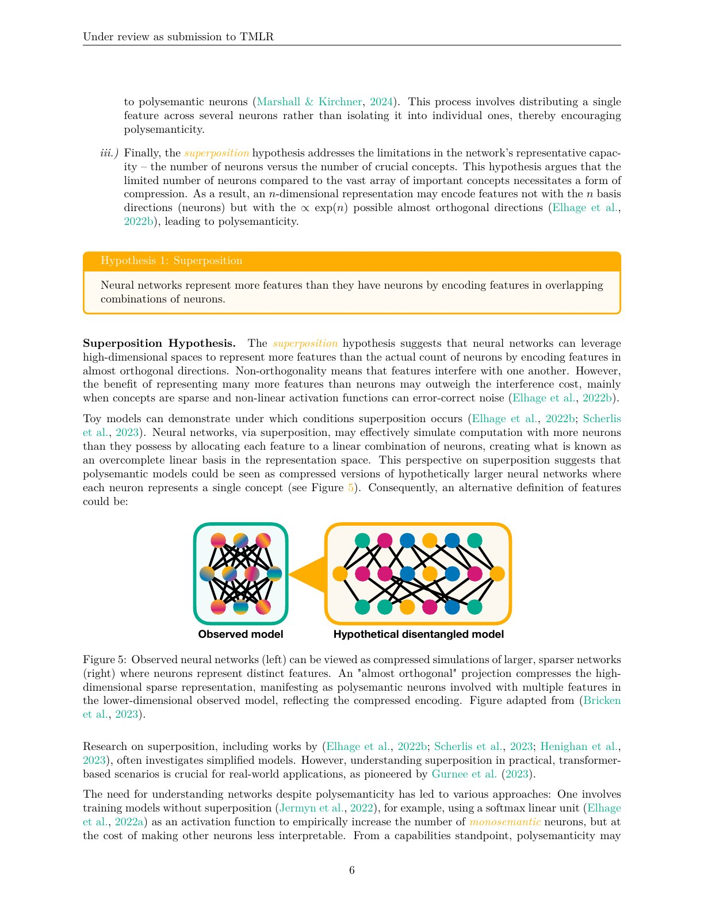

特征可能是单神经元、线性方向、稀疏编码成分或非线性流形。多义神经元很常见，“线性表征假设”认为不少概念对应激活方向；“叠加假设”认为模型把多于维度数的稀疏特征压入同一空间。

### 回路与模体

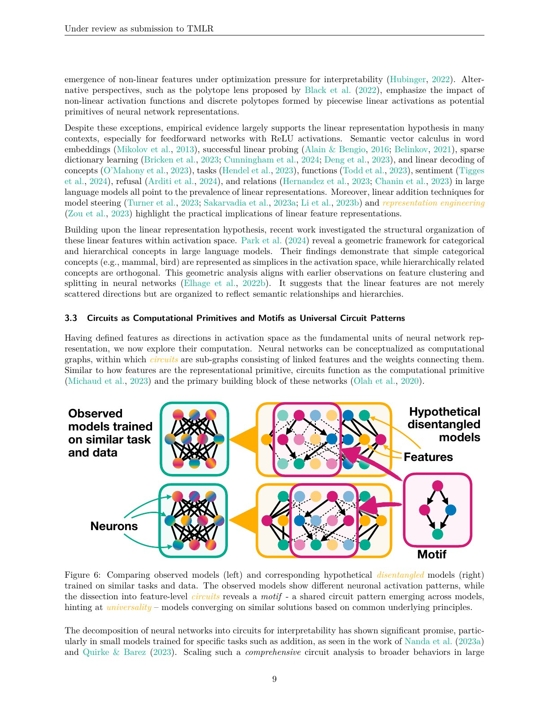

回路是共同实现计算的一组注意力头、MLP 等组件；模体是跨任务重复的计算结构。不同模型是否形成普适回路仍是经验问题。

### 世界模型与模拟代理

模型可学习环境与人物表征。安全研究想检测欺骗、规划或情境意识，但找到一个“欺骗方向”不等于模型正在欺骗，必须证明其对输出的因果作用。

## 四、第 4 节：方法

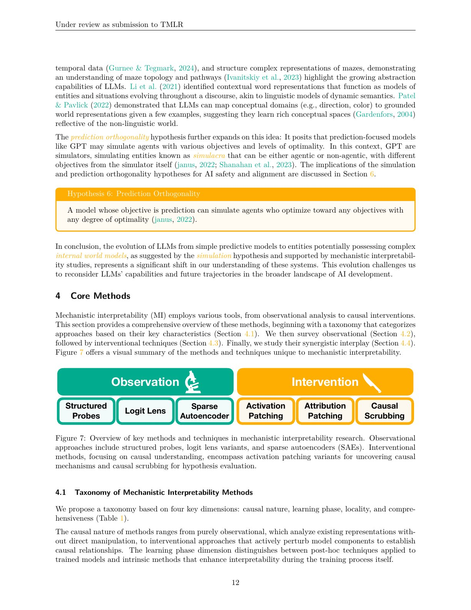

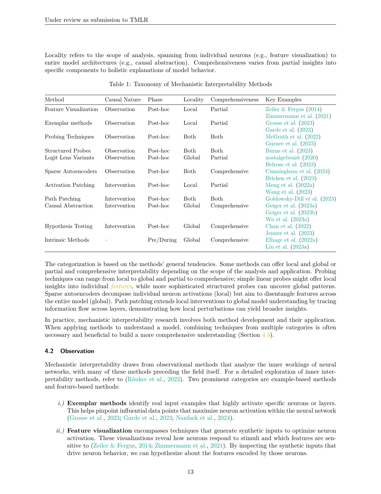

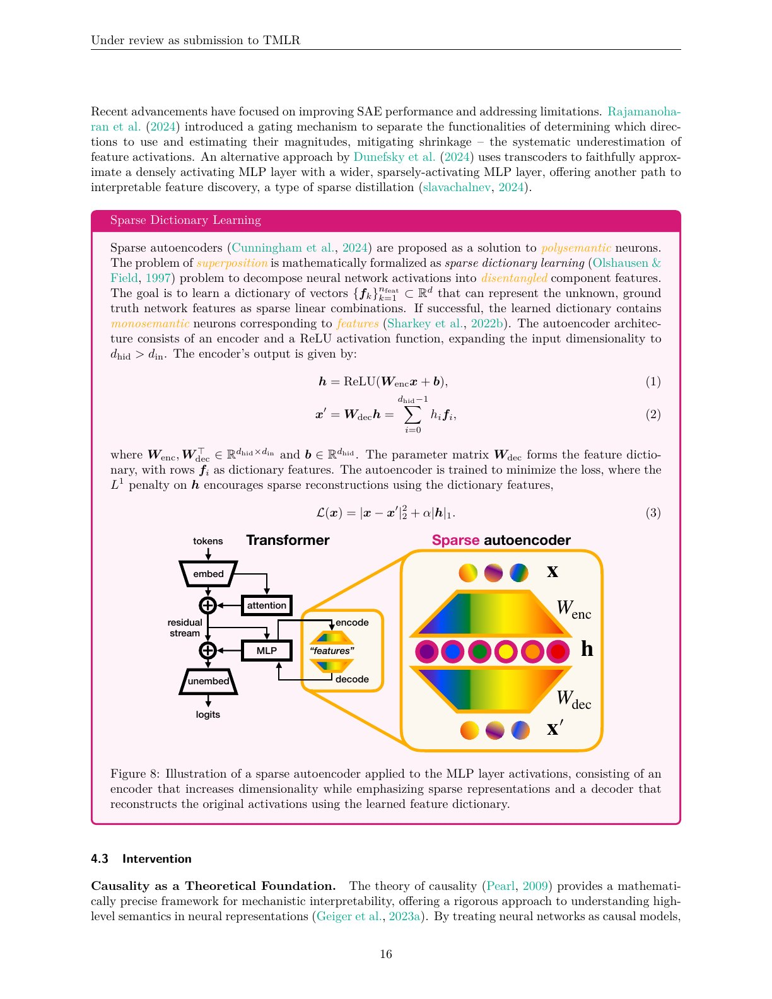

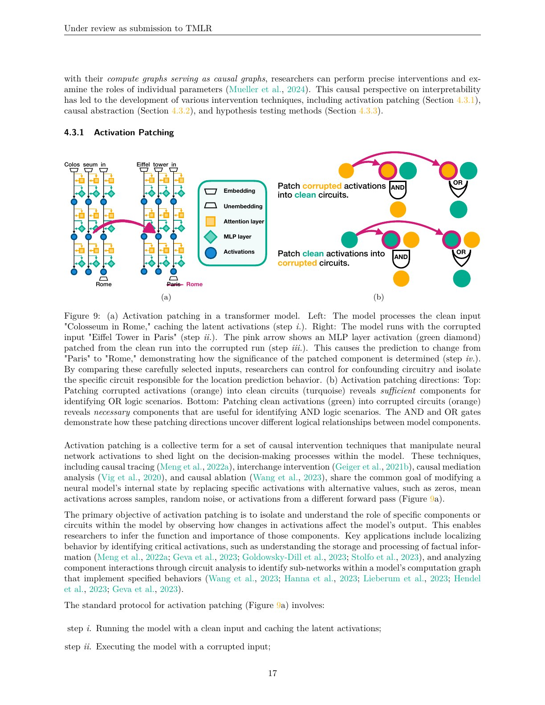

观察工具包括神经元可视化、注意力分析、探针、字典学习和稀疏自编码器。观察适合生成假设，却面临相关不等于因果、探针过强和樱桃采摘。

SAE 将密集激活编码成高维稀疏潜变量，再重构原激活。评价不能只看几个漂亮标签，还要看重构、稀疏度、跨输入稳定性和下游因果效应。

干预工具包括消融、激活 patching、路径 patching 和因果抽象。可靠流程应是：观察候选机制，干预验证必要性/充分性，再在未见输入和不同模型上复测。

## 五、逐图表精读

### 图 1：四种解释范式

从行为、归因、概念到机制逐步深入。它不是简单优劣排序：黑盒方法便宜且覆盖广，机制方法因果更强但规模小，安全评估需要组合。

### 图 2：概念地图

把特征、表示、计算和涌现连接起来。橙色项目多是尚未完全确立的假设，如线性、叠加、普适性和模拟；阅读时必须区分定义与研究纲领。

### 图 3：特权与非特权基

若坐标轴具有特殊意义，单神经元解释较自然；若任意旋转仍等价，方向或子空间更合适。这解释了为什么“一个概念一个神经元”常常失败。

### 图 4：叠加玩具模型

稀疏特征可在有限维度中超额编码，代价是干扰。玩具模型提供直觉，但不能证明真实大模型所有语义均如此组织。

### 图 5、图 6：压缩模拟与解缠

实际网络被视为更大稀疏网络的压缩模拟，SAE 尝试恢复解缠表示。“可解缠”不保证每个潜变量都有唯一自然语言标签。

### 图 7与表 1：方法分类

按观察/干预和研究对象整理工具，帮助区分知识存储、信息传播、行为回路和训练动态需要的证据。

### 图 8：SAE 架构

编码器产生稀疏潜变量，解码器重构激活。安全应用真正关心潜变量是否忠实、稳定并能控制行为，而不只是重构误差。

### 图 9：激活 patching

把干净运行某组件的激活替换进污染运行，若目标输出恢复，则该位置携带关键因果信息。结果仍受替换粒度、度量和补偿路径影响。

### 图 10：四项愿望

内生可解释、发展性解释、事后解释和自动化扩展互补。仅在训练后手工分析少量样本无法覆盖前沿模型。

### 图 11：安全收益与风险

收益包括检测欺骗、审计知识、定位危险能力与指导编辑；风险包括促进能力、帮助规避监控和制造虚假安全感。解释技术本身具有双重用途。

### 图 12：路线图

未来方向是澄清概念、建立标准、扩大规模、扩展到视觉、强化学习和代理。作者的立场是建立可证伪、可复现的工程标准，而非宣称问题已解决。

## 六、第 5—8 节精读

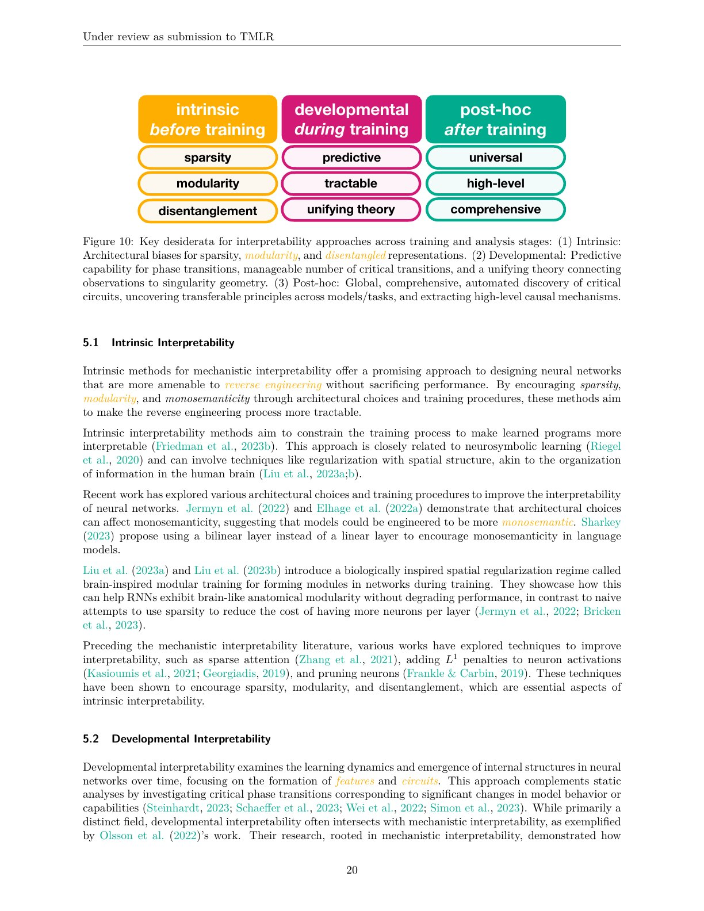

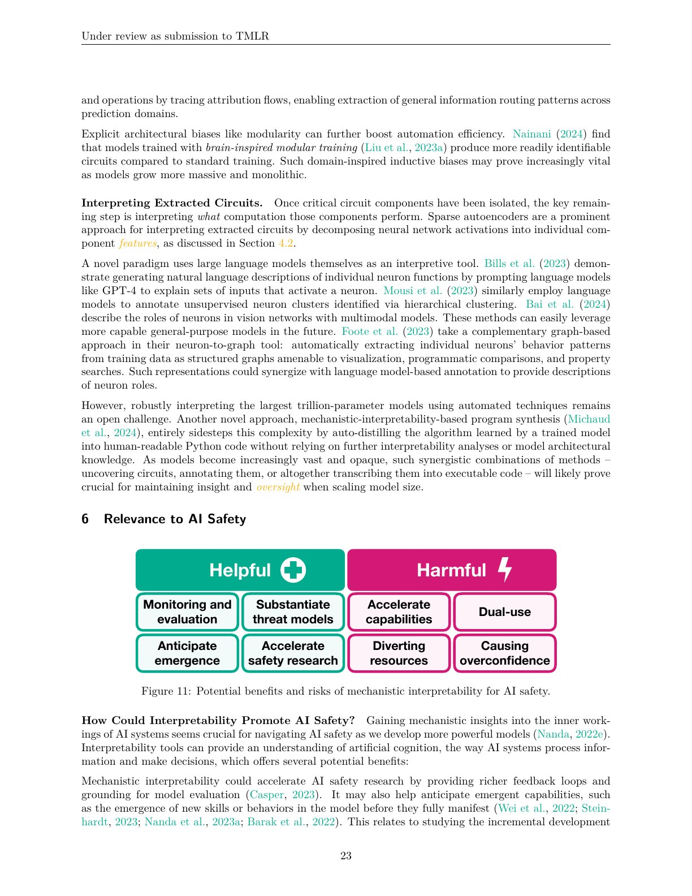

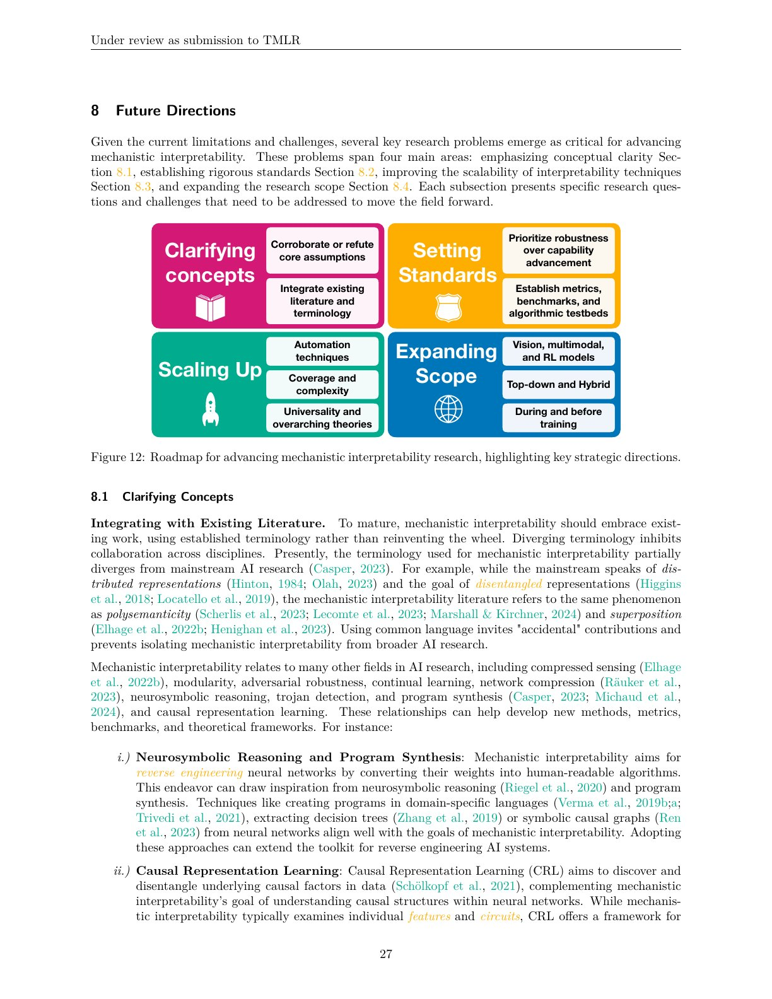

内生可解释性从架构设计入手，但可能损失能力或产生表面可读的伪解释；发展性解释跟踪回路在训练中何时形成；事后解释最成熟却难扩展；自动解释可提高覆盖率，却需要独立因果实验校验解释模型的幻觉。

安全用途包括后门定位、训练前后目标比较、危险知识审计和控制接口，但完整解释可能计算上不可行，模型也可能有冗余、分布式和上下文依赖路径。

领域缺少统一定义、标准基准和地面真值。高质量解释应预测未见输入、经受干预、报告覆盖与失败条件，并能由其他团队复现。

## 七、评价与结论

综述的优势是把零散研究组织成因果方法地图；局限是领域快速发展，部分宏大安全收益仍是愿景。最稳妥的结论是：机制可解释性是高价值的局部显微镜，还不是能给整个前沿模型出具完备安全证明的扫描仪。
## 八、按统一标准补充：综述的概念地图与安全证据

### 8.1 四个分析层级

行为描述回答模型做了什么；表示分析寻找哪些激活编码概念；回路分析追踪这些表示怎样被计算和传递；机制解释尝试给出可干预、可预测的因果模型。层级越深，成本越高，也越不能只凭相关性命名神经元。

### 8.2 Superposition 为什么是核心障碍

神经网络可在低维激活中叠加更多特征，单个神经元因而常是多义的。稀疏自编码器尝试恢复更接近单义的方向，但特征数量、稀疏惩罚和重构误差都会影响结果；“可解释标签”不自动等于忠实机制。

### 8.3 安全应用的证据阶梯

最弱证据是危险提示与某激活相关；更强证据是探针跨分布泛化；再强是 activation patching、ablation 或 steering 能稳定改变目标行为；部署级证据还要求低误报、抗规避、实时成本和对自适应模型稳健。综述中的许多工作停在前两级。

### 8.4 双用途与评估边界

公开内部机制可能帮助审计，也可能帮助攻击者绕过监控或精确操纵模型。解释方法本身也会产生“看起来合理”的故事，因此需要预注册任务、盲评、因果干预与反事实预测，而不是只展示漂亮可视化。

### 8.5 阅读这篇综述的正确结论

机制可解释性为发现欺骗、后门和危险能力提供了独特观测面，但尚不能替代行为评测、权限隔离和控制协议。它当前更像高价值诊断工具，而不是完备安全证明。
## 原论文图表页：完整渲染索引

> 以下页面包含本文全部已编号 Figure/Table。保留整页而不裁切，避免遗漏坐标轴、图例、表头、脚注或相邻说明；逐项解释在前文章节及后续补读中对应展开。

### PDF 第 2 页

### PDF 第 3 页

### PDF 第 5 页

### PDF 第 6 页

### PDF 第 7 页

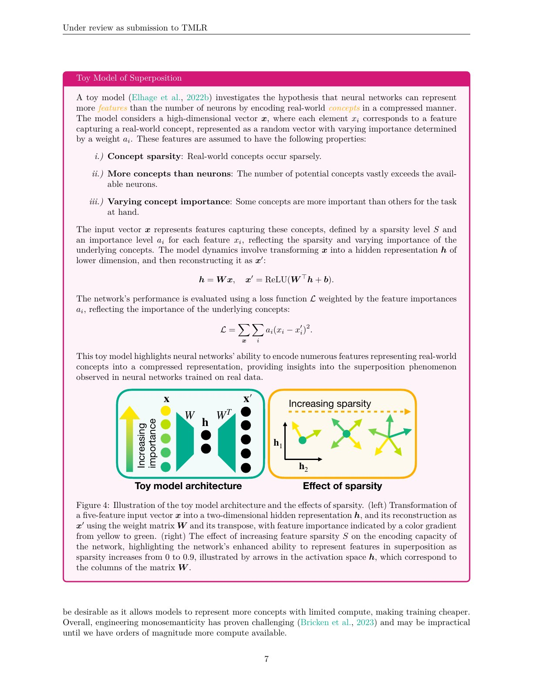

### PDF 第 9 页

### PDF 第 12 页

### PDF 第 13 页

### PDF 第 16 页

### PDF 第 17 页

### PDF 第 20 页

### PDF 第 23 页

### PDF 第 27 页

## 九、按原文逐节补读：概念不是结论

### 9.1 第 2 节：四类解释之间的证据差异

行为解释测输入输出规律，适合大规模和闭源模型；归因解释计算输入 token、像素或参数对输出的局部贡献；概念解释用探针或概念向量找高层表示；机制解释要求从表示到计算路径给出可干预的因果模型。

四类不是从“错误”到“正确”的单向排名。安全评测需要行为覆盖，机制研究提供深度；只做小样本回路分析会漏风险，只做黑盒测试又无法区分表面行为相同的内部策略。

### 9.2 第 3.1 节：Feature 的定义问题

特征可以指数据中的属性、神经元激活、线性方向、子空间、稀疏字典元素或非线性流形。若不声明表示单位，“找到一个欺骗特征”没有可复现含义。

线性表征假设认为很多概念可由激活空间方向表达；其吸引力来自线性探针和 steering，但探针可从未被模型使用的信息中读出信号，方向也可能随层、上下文和模型改变。

### 9.3 第 3.2 节：Monosemanticity 与 superposition

单义神经元对一个概念响应，多义神经元混合多个不相关概念。Figure 3 说明若基底无特权，任意旋转都等价，逐神经元命名没有理论依据。

Figure 4 的玩具模型显示：特征稀疏时，网络可在低维空间编码多于维度数的特征，以干扰换容量。Figure 5–6 把真实网络视为更大稀疏网络的压缩模拟，SAE 等字典学习试图恢复隐藏特征。玩具模型提供机制假说，不是对真实 LLM 的完整证明。

### 9.4 第 3.3 节：Circuit 与 motif

Circuit 是共同实现某计算的一组组件及连接，motif 是跨任务或模型重复出现的计算结构。Induction heads、IOI 等案例说明局部回路可被逆向工程；“同类功能在不同模型中复现”仍需表示对齐和因果检验，不能只看相似注意力图。

### 9.5 第 3.4 节：World model 与 simulated agent

棋类、迷宫和语言模型可形成环境状态表示。模型表征角色目标或信念，不等于内部存在统一代理，也不等于表征在当前输出中被使用。安全主张需把“可读出”“被计算”“因果驱动行为”分开。

## 十、第 4 节：观察方法与干预方法

### 10.1 Figure 7 / Table 1：方法分类

Table 1 按研究对象与工具整理神经元/特征可视化、探针、表示相似性、logit lens、注意力分析、字典学习、消融、patching、因果抽象、模型编辑和训练动态分析。分类的重要作用是提醒：同一行为可在参数、激活、组件、路径和训练时间多个尺度研究。

### 10.2 观察：生成假设，不自动给因果

Activation maximization 找令组件强响应的输入；dataset examples 看自然数据中的激活；probe 测信息可读性；logit lens 将中间残差投到词表；attention pattern 显示信息路由候选。

共同风险包括 cherry-picking、探针容量过强、相关特征共线、分布外失效和自然语言自动解释器幻觉。可靠报告要包含负例、覆盖率与跨数据验证。

### 10.3 Figure 8：SAE 应怎样评价

SAE 用编码器把密集激活映射到更高维稀疏 latent，再用解码器重构。特征看起来单义只是第一关，还应报告：

- reconstruction loss 与模型行为保真；
- 激活稀疏度、dead features 和 feature splitting；
- 不同随机种子/宽度下的稳定性；
- 自动标签在人类盲评中的准确率；
- latent intervention 是否按预测改变行为；
- 是否能组成忠实 circuit，而不只解释独立片段。

### 10.4 Figure 9：Activation patching

先运行 clean input 与 corrupted input，再把 clean 的某层/位置激活替换进 corrupted run；若目标指标恢复，该位置携带因果相关信息。Path patching 进一步限制发送者—接收者路径。

结果取决于 corruption、替换粒度和 metric；网络可能 self-repair，patch 也可能产生离分布激活。恢复输出说明介入变量足够重要，不等于已找到唯一机制。

### 10.5 Causal abstraction 与 hypothesis testing

Causal abstraction 试图把神经网络变量映射到高层算法变量，并检验干预是否交换。Hypothesis testing 则由机制模型预测未见输入、反事实和干预结果。能做新预测比事后解释一组样例更强。

### 10.6 第 4.4 节：观察与干预要闭环

推荐流程是观察生成候选特征/回路，干预检验必要性与充分性，再用失败案例更新假设。只做可视化容易讲故事，只做大范围消融又缺语义；二者结合才接近机制解释。

## 十一、第 5 节：四条研究路线

### 11.1 Intrinsic interpretability

从架构或训练目标让模型天然模块化、稀疏或可读。优势是解释性进入设计；风险是可读中间量可能只是伪装接口，真实计算绕路完成，且能力/效率可能下降。

### 11.2 Developmental interpretability

跟踪训练中 feature、circuit 和 phase transition 何时形成，例如 grokking 与 induction heads。它能提供因果历史，帮助设计训练干预；但 checkpoint、优化噪声与模型规模使实验昂贵。

### 11.3 Post-hoc interpretability

对已训练模型做 feature、circuit、知识定位和模型编辑，工具最成熟。局部成功很多，最大困难是覆盖：解释少量任务/头不等于理解模型整体。

### 11.4 Automation

用模型给 neuron/SAE feature 命名、搜索 circuit、生成与测试机制假说。自动化提高覆盖，却可能让解释模型与被解释模型共享盲点。自动文本说明必须由独立数据和因果干预验证。

## 十二、第 6 节：与 AI 安全的关系

Figure 11 将收益分为理解、控制、对齐和风险发现：识别后门/欺骗、审计危险知识、比较训练前后内部目标、定位可编辑机制、监控部署激活。

风险包括能力提升、精确操纵、帮助攻击者规避监控、把局部解释包装成安全认证，以及研究资源机会成本。完整内部信息也可能暴露模型或数据隐私。

机制证据的强度阶梯是：相关激活 → 跨分布 probe → 局部因果干预 → 可组合回路 → 对未见输入预测 → 低误报部署监控。多数现有研究停在前半段。

## 十三、第 7 节：研究与技术挑战

研究问题包括术语不统一、缺少 ground truth、结果选择性报告、不同团队复现困难，以及“解释好不好”的指标与人类理解不一致。

技术限制包括 superposition、非线性与上下文依赖表示、分布式/冗余路径、self-repair、模型规模、自动解释可靠性、跨模型普适性和训练/推理成本。模型也可能对可解释性工具产生自适应规避。

高质量解释至少应给出范围、预测、因果干预、覆盖率、失败条件、计算成本和外部复现，而不是只展示几个有语义的 feature。

## 十四、第 8 节与 Figure 12：路线图

路线图包含四组工作：

1. 澄清 feature、circuit、mechanism、completeness 等概念；
2. 建立带已知算法的标准模型、因果 benchmark 和报告规范；
3. 扩展 SAE、patching、自动 circuit discovery 与分布式计算工具；
4. 从玩具语言任务扩到视觉、强化学习、多模态和长时程代理。

该路线图是研究计划，不是已实现能力清单。尤其“全面解释前沿模型”仍缺少可行复杂度估计。

## 十五、Figure 1–12 与 Table 1 的证据边界

- Figure 1、2、7、10、11、12 是概念组织图，帮助分类，不提供实验效果。
- Figure 3–6 用几何与玩具模型解释表示假说，支持直觉而非证明真实网络完全遵循。
- Figure 8 给 SAE 架构，性能必须由外部实验衡量。
- Figure 9 给 patching 逻辑，具体因果结论依赖 corruption 和 metric。
- Table 1 是文献方法地图，不是方法排行榜。

最稳妥的总判断是：机制可解释性已经能对局部 feature 和 circuit 给出有价值的因果诊断，但离覆盖前沿模型、对自适应欺骗稳健、可部署的安全保证仍很远。

复现审计应记录模型/checkpoint、数据、激活位置、特征定义、probe 容量、SAE 宽度与稀疏正则、重构损失、patch corruption/metric、消融基线、随机种子、自动解释器、人工盲评、跨分布测试及负结果。

## 原文证据导航

以下页码按仓库内 PDF 的**文件页码**计，不等同于论文印刷页码。建议先读本节所指原文，再回看上面的中文解释。

- [打开原始 PDF](paper.pdf)
- [打开可检索文本](paper.txt)
