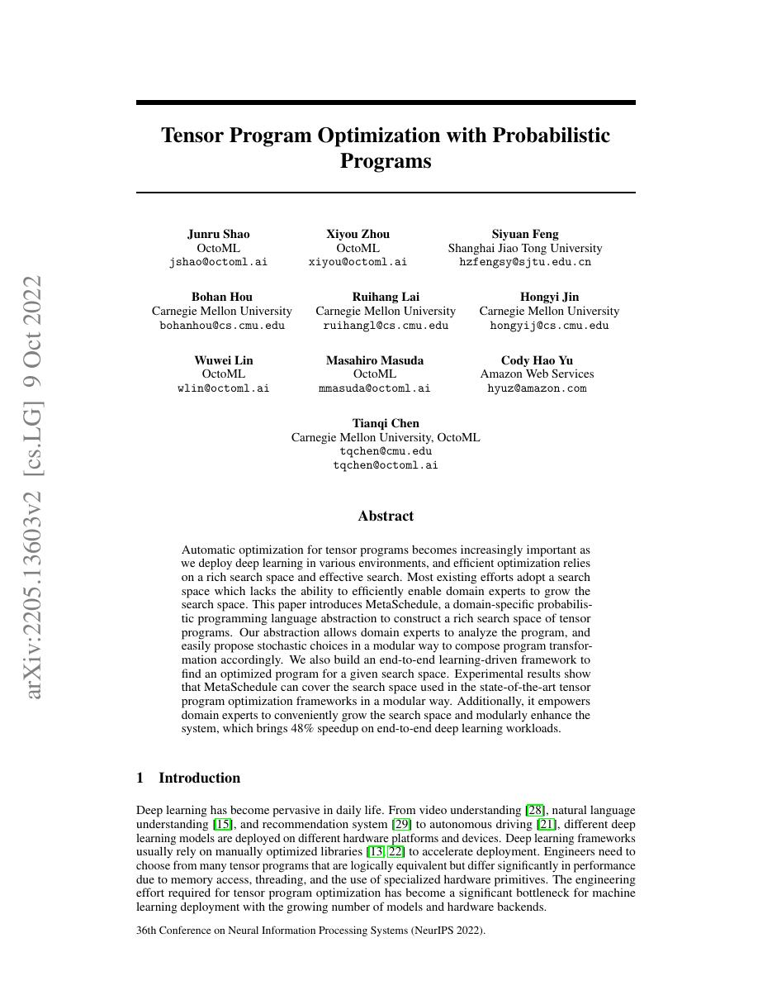
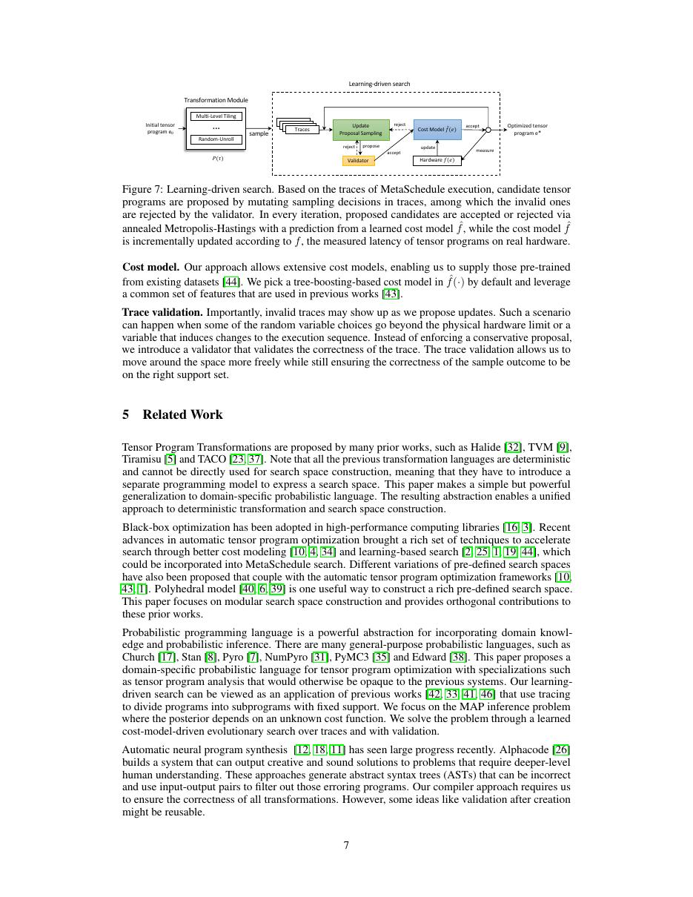
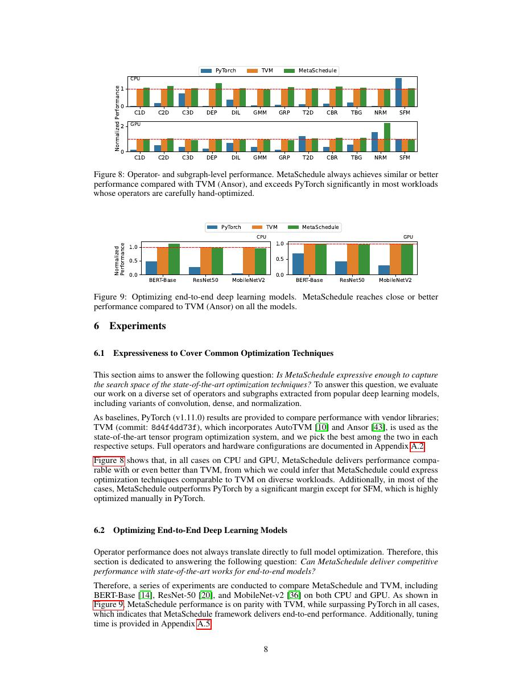
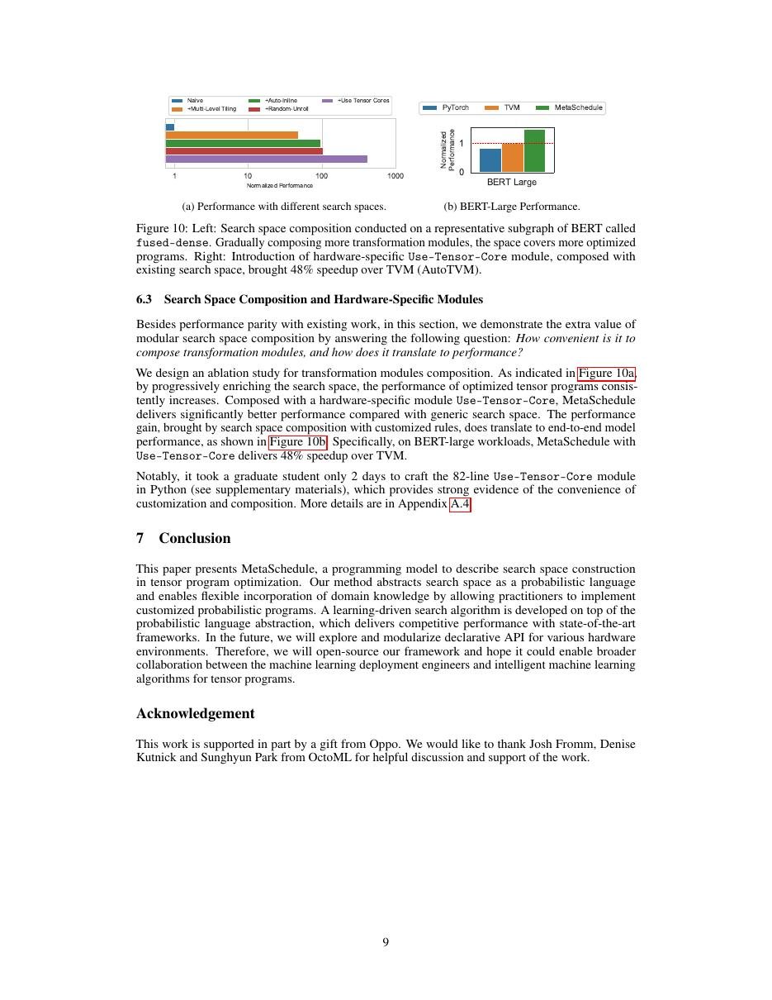

# 中文精读：《Tensor Program Optimization with Probabilistic Programs》

## 一、它解决了什么

MetaSchedule 把 tensor schedule 搜索空间表达为可组合的概率程序，让领域专家能模块化加入规则，同时保留学习型搜索。

## 二、编译抽象与优化路径

schedule rules 生成候选变换，postprocessors 保证合法性，mutator 定义邻域；cost model 与 evolutionary search 选择程序。相比固定模板或硬编码 auto-scheduler，搜索空间本身成为可编程对象。

## 三、为什么影响后续系统

它成为现代 TVM TensorIR 调优基础，连接人工硬件知识与自动测量，而不是把二者对立。

## 四、怎样读性能结果

编译器结果必须同时记录 frontend、shape、batch、精度、目标硬件、vendor library、调优预算和编译时间。单算子加速不等于端到端同倍加速，首次编译延迟也不能与缓存命中后的 steady-state 混为一谈。

## 五、局限与工程边界

模块越丰富，交互与调参越复杂；真实设备测量、数据库迁移和动态 shape 仍昂贵。概率程序表达能力不保证搜索能在预算内找到最优。

## 六、放进十年编译器演进史

与 Ansor 的自动 sketch 比较；与 TensorIR 连读理解“搜索空间作用在哪种 IR 上”。

## 七、原文入口

[论文/官方页面](https://arxiv.org/abs/2205.13603)

## 八、原文论证链

MetaSchedule 认为调优系统不应把搜索空间硬编码在 auto-scheduler 内。它把 schedule generation 表达为可组合概率程序：schedule rules 逐步采样变换，postprocessor 检查/修复合法性，mutator 定义候选邻域；搜索策略和 learned cost model 在此空间中选择，再以真实测量校准。专家可以新增 tensor-core、缓存或特定算子的规则，而不重写整个搜索器。

> 原文定位：[PDF 文件第 1 页](paper.pdf#page=1) · [对应截图](rendered_figures/page-1.jpg)

## 九、概率程序是什么意思

一次 trace 记录每个随机决策，如 tile 因子、compute-at 位置、绑定轴和缓存层次。相同规则可采样出不同 TensorIR；evolutionary search 对 trace 变异，cost model 预测运行时间排序。概率不表示程序结果随机，而是搜索阶段对 schedule 选择建模；最终部署的是确定 candidate。

postprocessor 过滤线程数、内存容量、tensorize 对齐等非法配置，使生成规则可保持模块化。

> 原文定位：[PDF 文件第 7 页](paper.pdf#page=7) · [对应截图](rendered_figures/page-7.jpg)

## 十、实验怎样读

论文比较 Ansor 等系统的最终 latency、搜索收敛与跨 workload 适应。应查看相同 measurement budget 下的 anytime curve，而不只最终最好点。可扩展性还可由新增硬件 rule 所需代码和复用程度评估。

> 原文定位：[PDF 文件第 8 页](paper.pdf#page=8) · [对应截图](rendered_figures/page-8.jpg)

## 十一、复现检查

- 保存 design-space trace、rule 顺序、postprocessor 和数据库 schema。
- cost model 的训练数据按硬件/shape 隔离，防止评测泄漏。
- 报告编译失败率、有效候选率和真实测量数。
- 动态 shape 要明确是多 bucket 调优还是符号化 schedule。

## 十二、常见误读

把搜索空间写成概率程序不会保证找到全局最优；它改善的是可组合性和探索接口。性能仍取决于规则质量、预算、cost model 与 backend codegen。

> 原文定位：[PDF 文件第 9 页](paper.pdf#page=9) · [对应截图](rendered_figures/page-9.jpg)

## 原文证据导航

以下页码按仓库内 PDF 的**文件页码**计，不等同于论文印刷页码。建议先读本节所指原文，再回看上面的中文解释。

- [打开原始 PDF](paper.pdf)
- [打开可检索文本](paper.txt)

| 中文笔记中的证据 | 原文位置 | 复核重点 |
|---|---|---|
| 原文首页、摘要或官方架构概览 | [PDF 文件第 1 页](paper.pdf#page=1) · [截图](rendered_figures/page-1.jpg) | 回到该页上下文，复核定义、图表或实验论证 |
| IR、架构、搜索空间或执行模型关键页 | [PDF 文件第 7 页](paper.pdf#page=7) · [截图](rendered_figures/page-7.jpg) | 回到该页上下文，复核定义、图表或实验论证 |
| 实验、性能或设计分析所在原文页 | [PDF 文件第 8 页](paper.pdf#page=8) · [截图](rendered_figures/page-8.jpg) | 回到该页上下文，复核定义、图表或实验论证 |
| 讨论、结论或补充设计所在原文页 | [PDF 文件第 9 页](paper.pdf#page=9) · [截图](rendered_figures/page-9.jpg) | 回到该页上下文，复核定义、图表或实验论证 |
