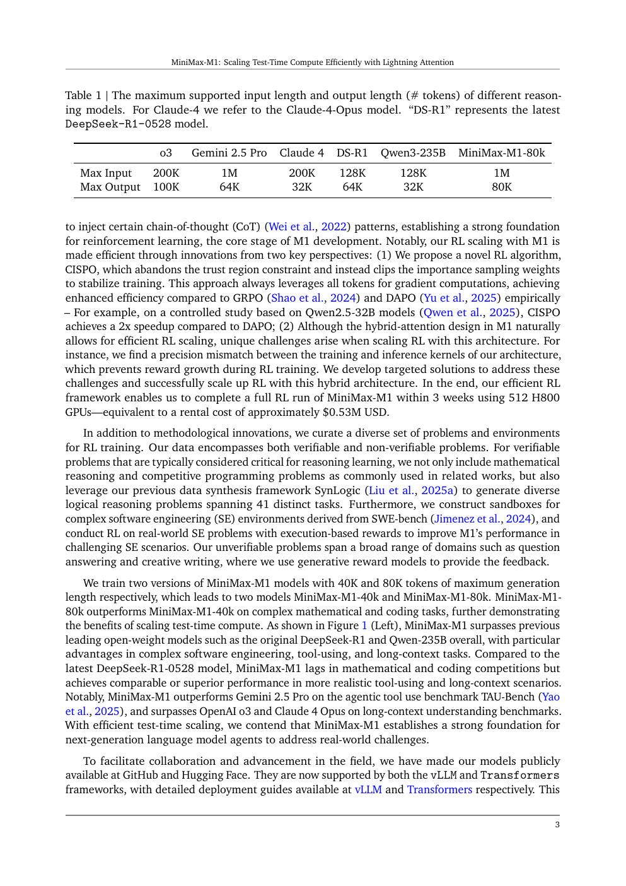
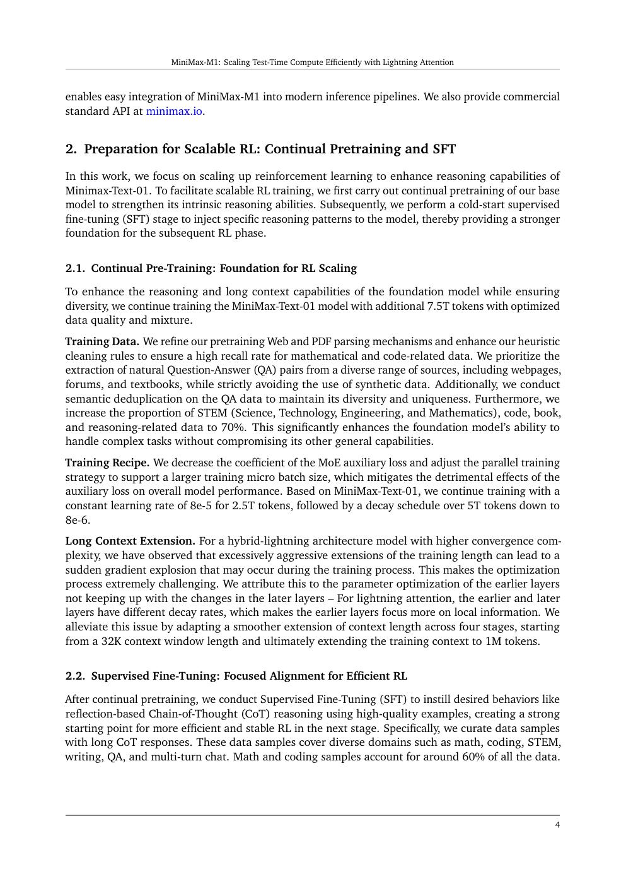
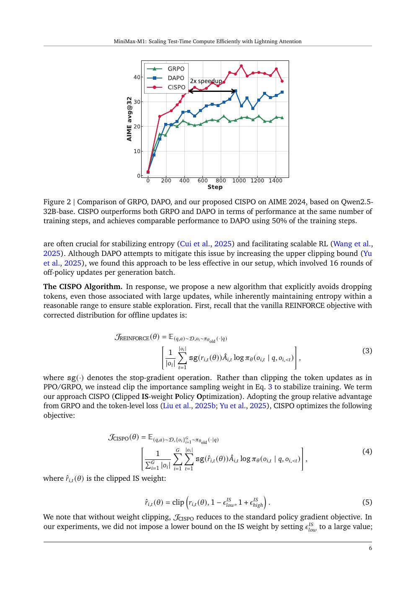
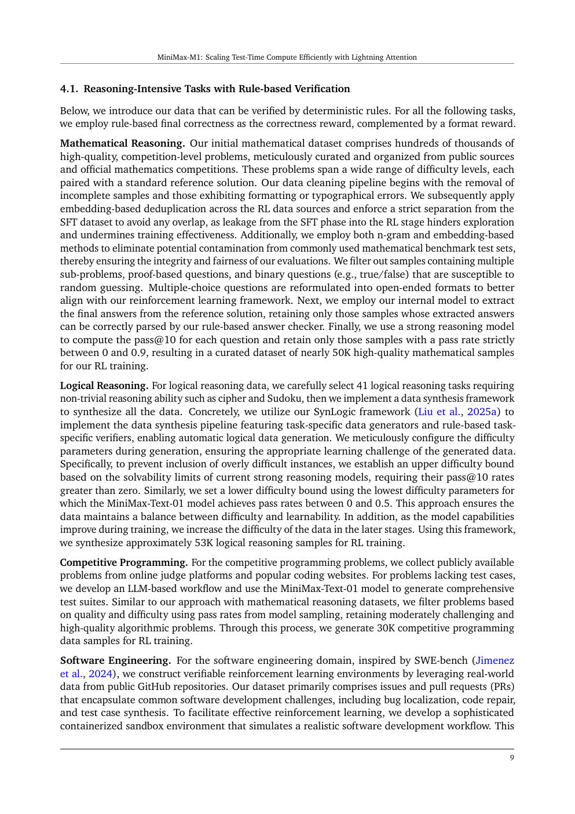
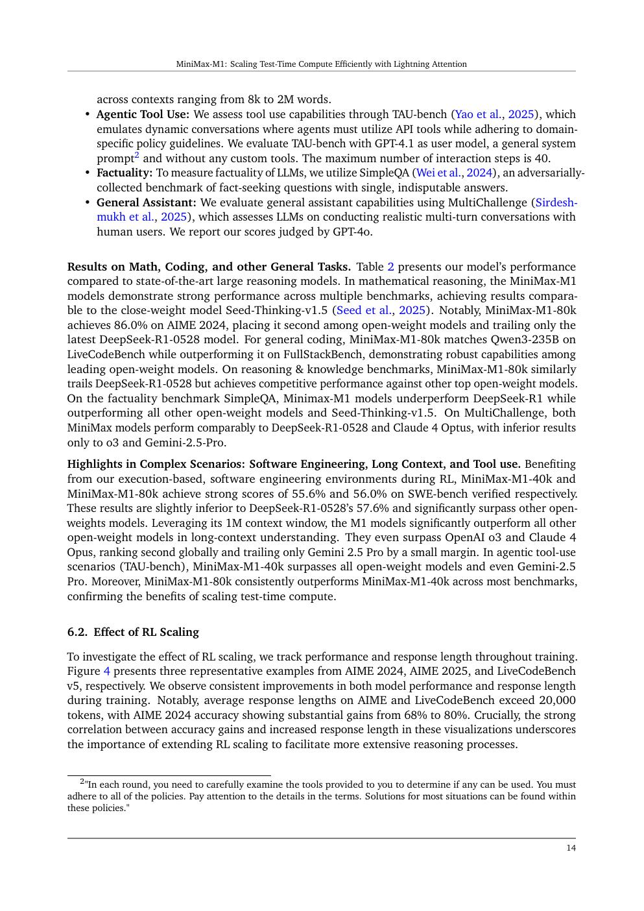

# 论文中文解读：《MiniMax-M1》

## 一、核心组合：便宜的长序列 + 不丢 token 的 RL 更新

Reasoning RL 的成本主要来自 rollout。若 attention 成本随生成长度持续二次/线性积累，80K CoT 极贵。M1 沿用 MiniMax-01 的 7:1 Lightning/softmax hybrid，使 100K 生成的理论 FLOPs 约为 DeepSeek-R1 的 25%，再用 CISPO 改善长回答中的 token-level policy update。

论文发表于 2025-06，arXiv:2506.13585。本地保存 [PDF](paper.pdf)、[文本](paper.txt) 与 [概要](论文概要.md)。

## 二、模型与准备阶段



M1 仍是 456B total、45.9B active、32 experts 的 Text-01 backbone。团队额外 continual pretrain 7.5T tokens，70% 数据偏 STEM、代码、书籍与 reasoning，然后用 long-CoT SFT cold start。

上下文扩展采取 32K → 1M 的平滑多阶段方案。作者观察到 hybrid lightning architecture 若激进拉长，会因前后层 decay 行为不同出现 gradient explosion；“线性 attention 理论可扩”不等于训练天然稳定。

## 三、CISPO 为什么修改 clipping



PPO/GRPO 的 clipped surrogate 在 ratio 超界且 advantage 方向相应时，把该 token 的梯度贡献截掉。M1 的 16 次 off-policy updates 场景中，`Wait/Recheck/Aha` 等低概率反思 token 往往 ratio 很大，第一轮后就不再学习。

CISPO 改写为：

```text
clipped stop-gradient(IS ratio)
× group-relative advantage
× ∇ log π(token)
```

裁剪的是用于重加权的 importance weight，不是整个 token update；所有 token 仍有 `log π` gradient。它会引入一定 bias，但作者认为比丢掉关键稀有 token 更好。

## 四、与 GRPO/DAPO 的关系



CISPO 沿用组内 reward 标准化，不训练 value model；使用动态采样和长度惩罚；报告配置没有 KL penalty。论文还用 token-wise mask 把 PPO/GRPO/DAPO/CISPO 放进统一表达。

受控实验在 Qwen2.5-32B-base 上进行，CISPO 约用 DAPO 一半 steps 达到相近 AIME 表现。它支持算法有效，但 full M1 的最终优势还混合了 backbone、数据、SFT、reward 和系统差异。

## 五、hybrid kernel 的隐藏坑



rollout inference kernel 与 training kernel 若精度不一致，训练端算出的 token likelihood 与实际采样 policy 不一致，importance ratio 失真，reward 可能停止增长。M1 专门修复 hybrid attention 的 precision mismatch。

这是很实用的教训：RLHF/RLVR 不只需“数学算法正确”，还要求生成引擎、训练实现、tokenizer 和 logprob 逐 token 一致。

## 六、任务与 reward

RL 数据包括数学、竞赛代码、SynLogic 的 41 类逻辑题、基于 SWE-bench 的软件工程 sandbox，以及依赖生成式 reward model 的问答/写作。

对开放任务，作者记录 reward model 容易奖励无实质的长回答，因而监控输出长度与任务成功率，在检测 reward hacking 时重新校准 GenRM。这说明“长 CoT”本身不是 reward，正确/有效才是。

## 七、结果与口径



M1-80k 在部分 agent/tool/long-context 任务上强，在竞赛数学/代码上落后当时更新后的 DeepSeek-R1-0528。对 SWE-bench，论文只评估内部可运行的 486 个 verified tasks；不同 agent scaffold 与排除样本会显著改变分数。

M1-80k 优于 M1-40k 支持 test-time compute scaling，但应报告达到同一正确率所需 token，而非只看无限预算最高分。

## 八、成本数字怎样解释

“512 H800、3 周、约 0.53M 美元”只指 RL full run，并按特定租价估算。不包括 Text-01 初始预训练、额外 7.5T continual pretraining、数据/奖励模型、失败实验、人员和 serving。

## 九、与 R1/k1.5 的对照

| 模型 | policy update | 长 rollout 系统点 | backbone |
|---|---|---|---|
| DeepSeek-R1 | GRPO | 大规模 rollout/verifier | MLA + DeepSeekMoE |
| Kimi k1.5 | online mirror descent 变体 | partial rollout 复用历史片段 | 未完整披露 |
| MiniMax-M1 | CISPO | hybrid attention + kernel 一致性 | Lightning/softmax + MoE |

## 十、原文入口

[arXiv](https://arxiv.org/abs/2506.13585) · [官方仓库](https://github.com/MiniMax-AI/MiniMax-M1)


## 原文证据导航

以下页码按仓库内 PDF 的**文件页码**计，不等同于论文印刷页码。建议先读本节所指原文，再回看上面的中文解释。

- [打开原始 PDF](paper.pdf)
- [打开可检索文本](paper.txt)

| 中文笔记中的证据 | 原文位置 | 复核重点 |
|---|---|---|
| M1 的输入/输出长度与长推理效率 | [PDF 文件第 3 页](paper.pdf#page=3) · [截图](rendered_figures/page-3.jpg) | 回到该页上下文，复核定义、图表或实验论证 |
| CISPO 与 GRPO/DAPO 的受控比较 | [PDF 文件第 4 页](paper.pdf#page=4) · [截图](rendered_figures/page-4.jpg) | 回到该页上下文，复核定义、图表或实验论证 |
| CISPO 公式、token clipping 与统一视角 | [PDF 文件第 6 页](paper.pdf#page=6) · [截图](rendered_figures/page-6.jpg) | 回到该页上下文，复核定义、图表或实验论证 |
| Lightning Attention RL 的精度问题与修复 | [PDF 文件第 9 页](paper.pdf#page=9) · [截图](rendered_figures/page-9.jpg) | 回到该页上下文，复核定义、图表或实验论证 |
| 数学、代码、软件工程、工具与长上下文评测 | [PDF 文件第 14 页](paper.pdf#page=14) · [截图](rendered_figures/page-14.jpg) | 回到该页上下文，复核定义、图表或实验论证 |
