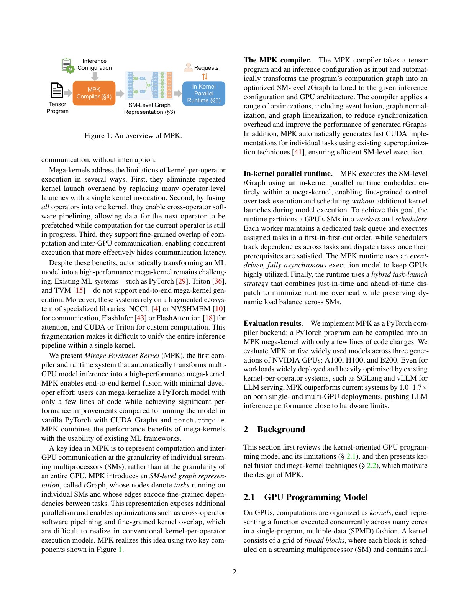
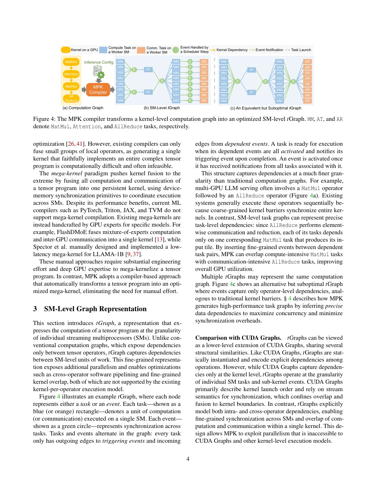
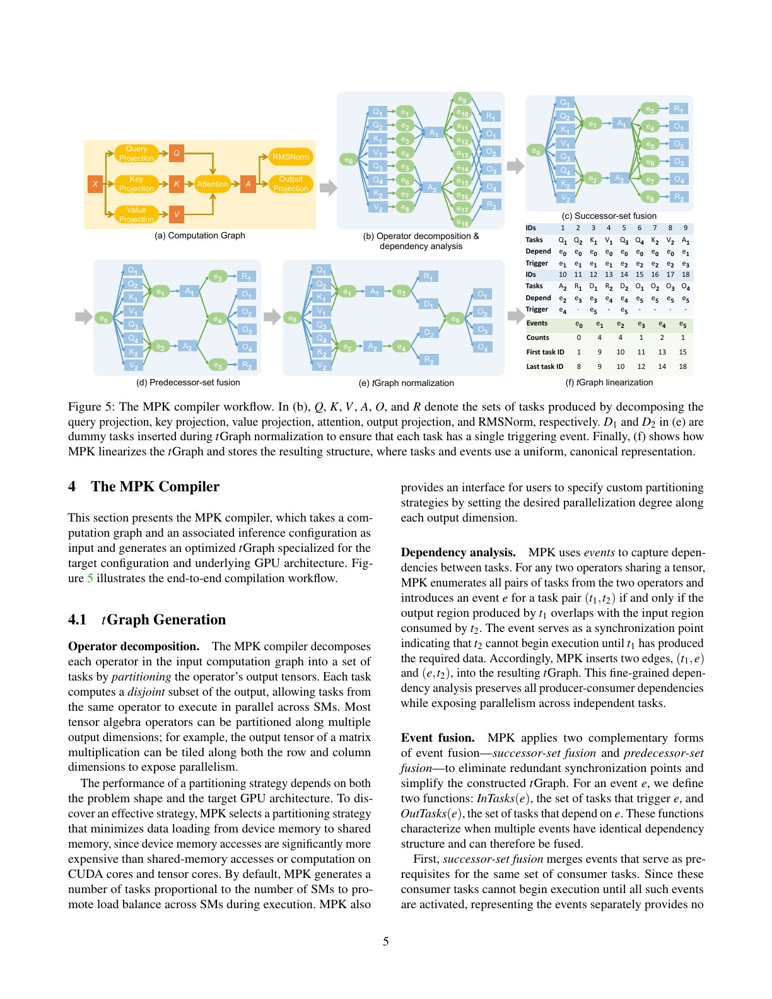
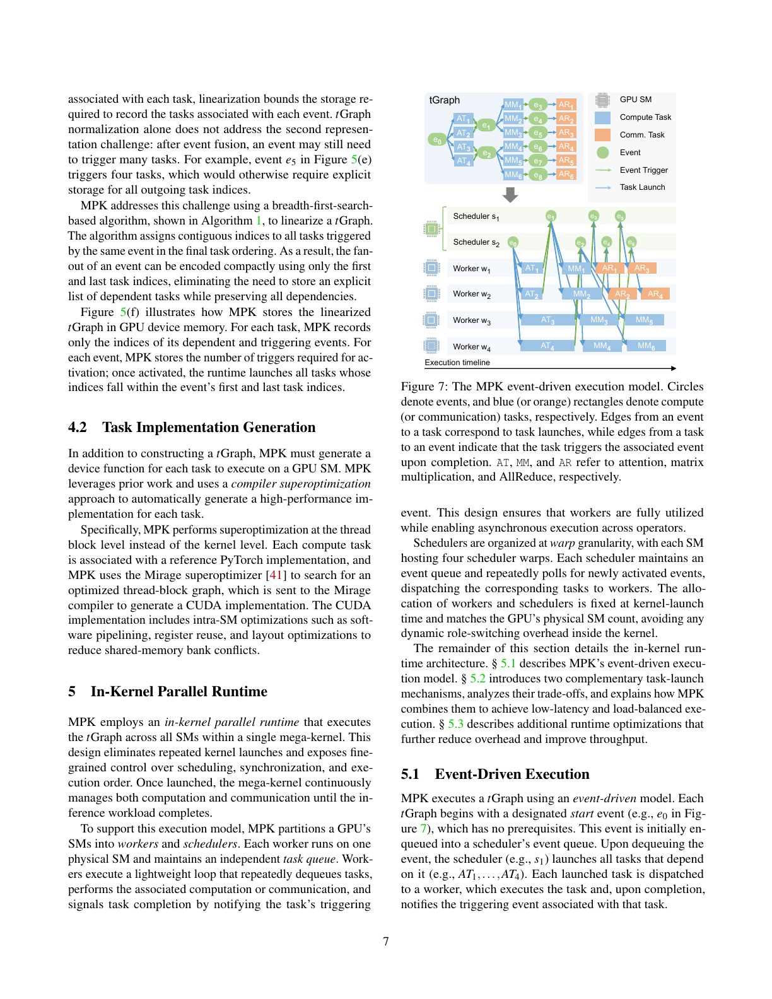
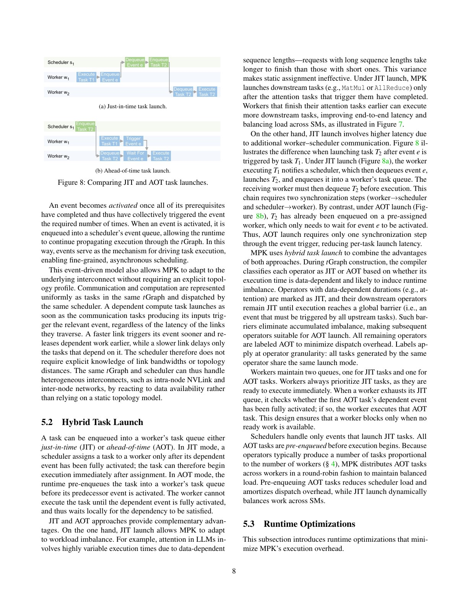
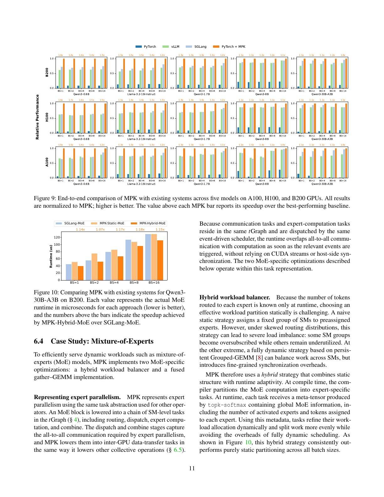
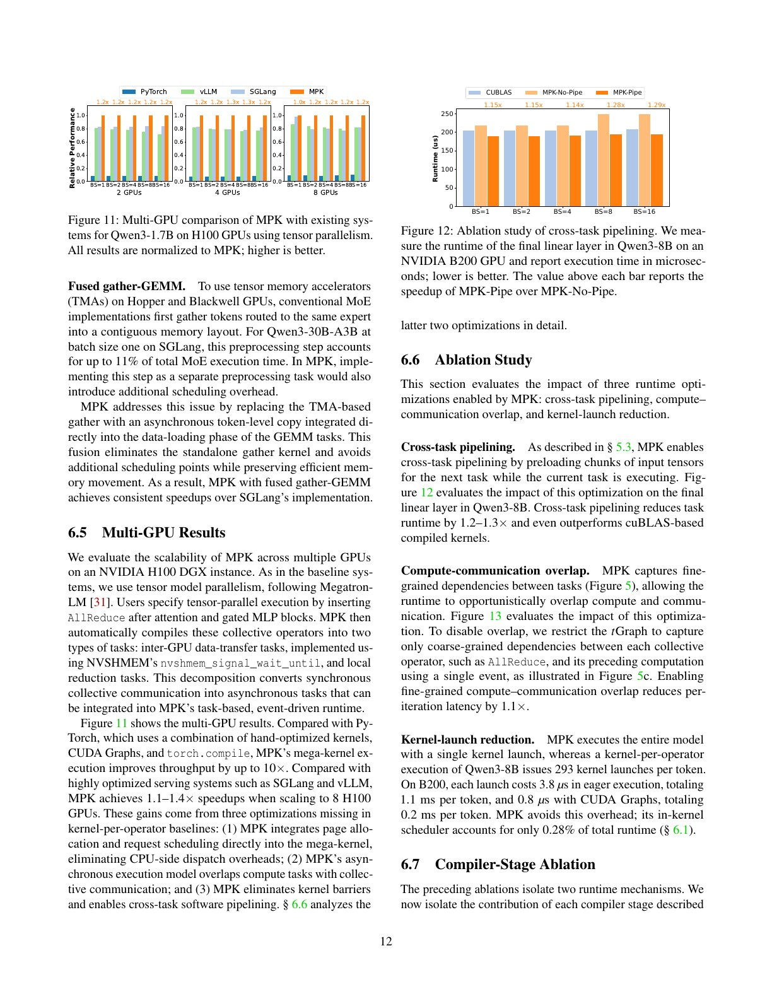
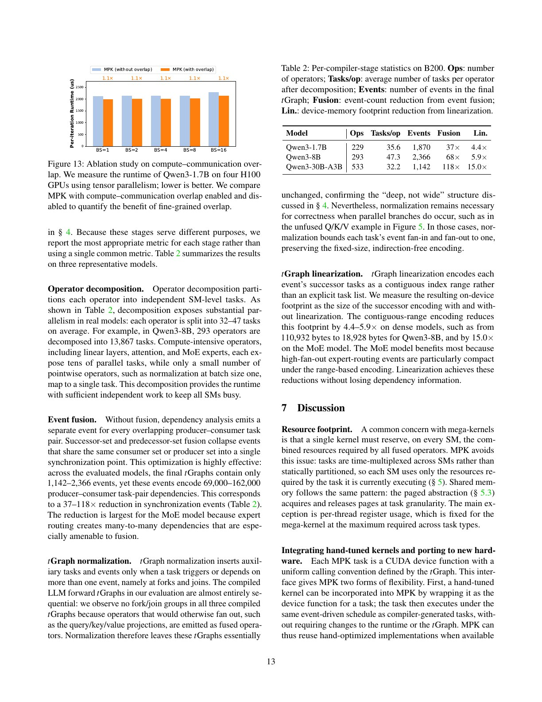

# Mirage Persistent Kernel（MPK）中文精读

## 1. MegaKernel 与普通 fusion 的分界

普通 vertical fusion 常把相邻 elementwise/reduction 合成一个静态 kernel。MPK 处理的是完整模型级任务：

- operator 并行模式不同；
- tasks 可跨 SM、跨 GPU；
- 依赖细到 tile；
- batch 和 MoE 路由在运行时变化；
- 需要在 kernel 内重新引入 scheduler。

因此 MegaKernel 不是无限放大的 fused loop，而更像驻留在 GPU 上的 task runtime。

## 2. 为什么 CUDA Graph 仍不够

CUDA Graph 能把许多 launches 录制并用一次 host call replay，降低 CPU launch overhead；但 kernel 间仍保留：

- coarse global boundaries；
- 中间值经 HBM；
- 下游通常等整个上游 kernel 完成；
- 难在 operator 间做 tile pipeline；
- dynamic batch 需要多图或重捕获。

MPK 把 dependencies 降到 SM task/event，允许上游某些 tiles 完成后立即释放下游 work。

## 3. SM-level tGraph

每个 task 对应在某个 SM 上执行的一段 device function；event 记录一组 predecessor tasks 完成。Compiler 将 kernel-level graph 转为：

1. operator partitioning；
2. task implementation 生成；
3. event dependency 建立；
4. graph normalization/fusion；
5. 线性化为 device runtime 可消费的结构。

这比 operator DAG 更细，也比 thread-level CUDA 编程更可管理。

## 4. Compiler workflow 与 event 变换

MPK 会做 successor-set fusion 等变换，减少 events 和 runtime metadata。论文报告 event metadata overhead 在评测中低于 1%，但这依赖 graph 与 workload。

事件正规化还让 scheduler 可以只判断少量 counters，不需在运行时遍历复杂 DAG。

## 5. 设备侧调度

少量 SM 运行 scheduler warps，其他 SM 作为 workers。任务完成后触发 event；event ready 后后继 task 进入执行。

### AOT 与 JIT task launch

- AOT：任务归属预先确定，dispatch overhead 低，适合规则、平衡的 work。
- JIT：ready 后放入 worker queue，能动态负载均衡，但多 queue/synchronization。

MPK 用 hybrid strategy：规则部分 AOT，不确定 latency/route 的部分 JIT。

## 6. Shared memory 为什么要分页

若 mega-kernel 静态声明所有 operator 的最大 shared memory，occupancy 会被峰值和限制。MPK 建立 32 KB page pool，让生命周期不重叠的 tasks 复用 SMEM；任务在开始/结束时拿取和归还 pages。

这相当于 kernel 内的 scratch allocator。代价是管理、等待与碎片；论文用单调生命周期等约束降低复杂度。

## 7. 动态 LLM serving

MPK 在每轮 decode 的 start event 中：

1. 移除完成请求；
2. 接收新请求；
3. 更新 KV-cache metadata；
4. 选择与当前 batch 对应的 tGraph。

它为 powers-of-two batch 预生成多个 specialization。这个设计比每个精确 shape 一个 CUDA Graph 灵活，但并不是一个完全 shape-agnostic graph。

## 8. 端到端证据

5 个模型、3 代 GPU、batch 1–16 的 offline serving 中，MPK 相对 vLLM/SGLang 最佳基线约 1.0×–1.7×。收益在：

- 小模型；
- 小 batch；
- 更新 GPU

上最大，因为固定 launch/sync overhead 相对总计算更显著。

Qwen3-8B/A100 的例子从约 14.5 ms/token 降到 12.5 ms；论文按 16 GB 权重/1.6 TB/s 粗估约 10 ms 带宽下界。这个下界忽略缓存、其他 tensor 与效率损失，只用于量级判断。

## 9. MoE 与多 GPU

MoE 中 routing、dispatch、expert compute、combine 被放入同一 tGraph。纯静态分配在偏斜路由下会有 stragglers，纯动态 grouped GEMM 又有细粒度同步开销；MPK 用静态 expert tasks 加运行时 token metadata 做 hybrid balancing。

Collective 被拆成可与 compute overlap 的 tasks。多 GPU结果展示收益，但网络、拓扑、world size 和通信库会强烈影响可迁移性。

## 10. 常见误读

### “一次 kernel launch 就没有调度开销”

只是把 host launch 转成 device-side event、queue、scheduler 和 semaphore 开销。

### “MegaKernel 等于把所有代码串起来”

若只串行执行，最多省 launch；MPK 的主要新增空间是 tile-level pipeline、load balance 和通信重叠。

### “所有 batch 共用一个最优 kernel”

MPK 生成多个 batch-specialized tGraphs，runtime 再选择。

## 11. 复现检查点

- 报告被 scheduler 保留的 SM 数。
- 将 compile time、warmup 与 steady-state 分开。
- 记录 kernel-per-operator 基线是否启用 CUDA Graph、paged attention、continuous batching。
- 在线场景补充 arrival trace、TTFT、TPOT、P50/P99 和 SLO attainment。
- 对每种 batch/model/GPU 记录所选 tGraph。
- 检查 device scheduler 的 atomic/queue overhead 与 deadlock diagnostics。

## 12. 与其他路线的关系

- [FusionStitching](../fusion_stitching/论文中文解读.md) 和 [Welder](../welder/论文中文解读.md) 主要在编译期决定静态 fusion。
- [Event Tensor](../event_tensor/论文中文解读.md) 把动态依赖提升为一等 tensor abstraction。
- [Ada-MK](../ada_mk/论文中文解读.md) 在资源较小的 Ada GPU 上把 runtime search 尽可能提前到编译期，并嵌入 TensorRT-LLM。

## 13. 最终判断

MPK 的核心不是“大”，而是跨 operator 的细粒度执行模型。它用设备侧 runtime 换取更少 host boundary 和更多 pipeline/overlap；是否值得，取决于 launch overhead 相对计算的占比，以及动态调度本身是否足够轻。

## 原文证据导航

以下页码按仓库内 PDF 的**文件页码**计，不等同于论文印刷页码。建议先读本节所指原文，再回看上面的中文解释。

- [打开原始 PDF](paper.pdf)
- [打开可检索文本](paper.txt)
