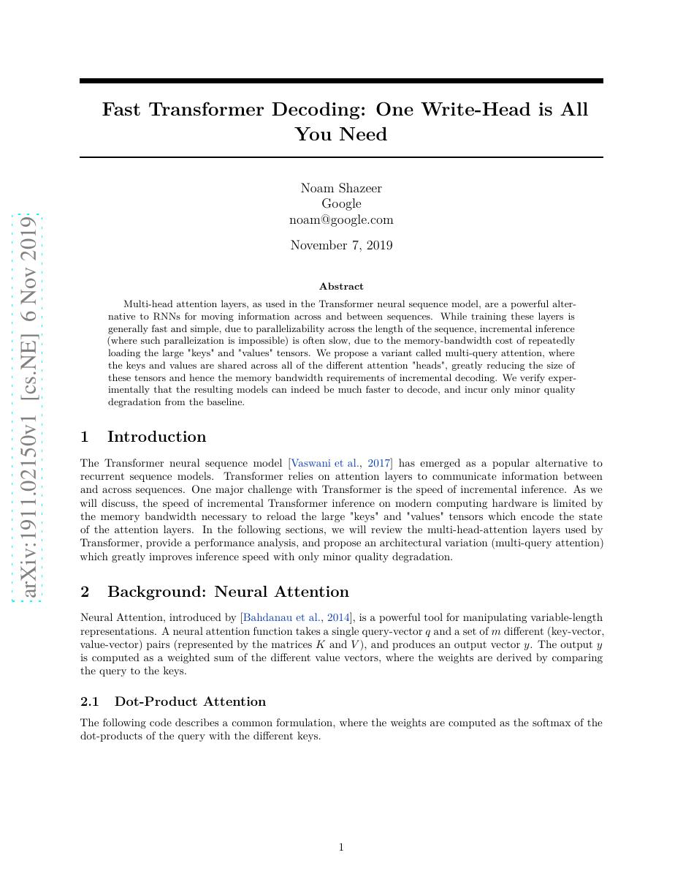
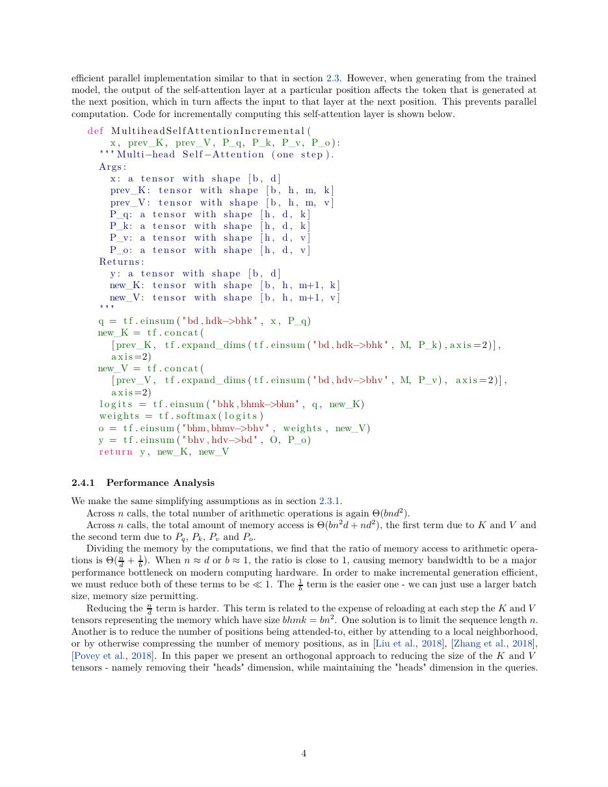
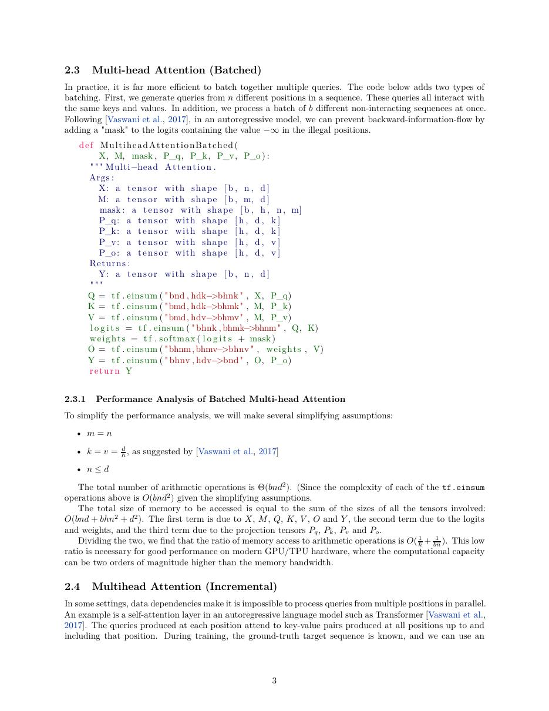
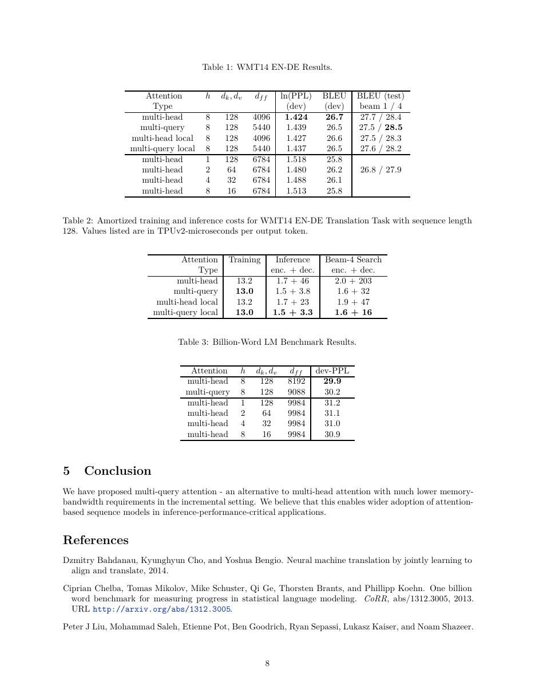

# 论文中文解读：《Fast Transformer Decoding: One Write-Head is All You Need》

## 一、它解决了什么

MQA 让多个 query heads 共享一组 key/value heads，显著减小自回归解码的 KV cache 和内存带宽。

## 二、核心机制

MHA 每个 head 都写入和读取独立 K/V；MQA 保留多头 Q 但只缓存单组 K/V。算术量变化不大，收益主要来自 decode 阶段更少的 HBM 读写和更大 batch。

## 三、为什么成为主线

它把 attention 设计从纯模型质量问题转成 serving memory wall 问题，后来 GQA 在质量与带宽之间折中，DeepSeek MLA 再做低秩 latent cache。

## 四、应该怎样读证据

论文里的结果首先证明方法在当时数据、模型规模、硬件和评测协议下成立。跨年代比较时要统一参数量、训练 tokens、数据质量、上下文长度、推理预算与系统实现，不能只横比单个最佳分数。

## 五、局限与易误读点

过度共享 K/V 可能损失质量；短序列、prefill 或 compute-bound 场景收益较小。论文的 TPU 解码结果不能直接外推所有 GPU kernel。

## 六、放进十年演进史

按 MHA→MQA→GQA→MLA 阅读，再结合 FlashAttention，可区分“减少缓存表示”与“减少 attention 中间 IO”两种优化。

## 七、原文入口

[官方论文/页面](https://arxiv.org/abs/1911.02150)

## 八、原文论证链

自回归 Transformer 推理时，每个新 token 都要读取此前所有 token 的 K/V cache。标准多头注意力为每个 query head 保存一套 key 和 value，解码带宽与头数成正比。论文提出保留多个 query heads，但所有头共享单一 K/V head，从而显著缩小 cache 和读取流量。

作者关心的是增量解码吞吐，不是训练 FLOPs 的全面下降。对 encoder–decoder 模型，decoder 的 self-attention 与 cross-attention 都可采用共享 K/V；实验显示速度明显提升而质量损失很小，支持“许多独立 K/V 头存在冗余”的工程假设。

> 原文定位：[PDF 文件第 1 页](paper.pdf#page=1) · [对应截图](rendered_figures/page-1.jpg)

## 九、张量形状与成本

标准 MHA：
$$
Q\in\mathbb R^{B\times h\times T_q\times d},\quad
K,V\in\mathbb R^{B\times h\times T_k\times d}.
$$
MQA 仍有 $h$ 个 query，但
$$
K,V\in\mathbb R^{B\times 1\times T_k\times d},
$$
在注意力计算时广播给各 query head。KV cache 从约 $2B h T d$ 个元素降为 $2B T d$。当 decode 阶段算术强度低、内存带宽主导时，这一变化能直接提高吞吐。

> 原文定位：[PDF 文件第 4 页](paper.pdf#page=4) · [对应截图](rendered_figures/page-4.jpg)

## 十、实验怎样读

论文比较 perplexity/翻译质量与增量推理时间。质量差异小证明共享 K/V 可接受，速度数据则必须结合 batch、序列长度和硬件读取。prefill 阶段一次处理多个 token，常更偏计算密集，MQA 的优势不一定与单 token decode 相同。

> 原文定位：[PDF 文件第 3 页](paper.pdf#page=3) · [对应截图](rendered_figures/page-3.jpg)

## 十一、复现检查

- 核对投影参数是“一个 K/V 头”而不是把多头计算后再平均。
- benchmark 分开报告 prefill latency、decode latency、tokens/s 与 cache 占用。
- 推理内核应避免物理复制广播后的 K/V，否则节省会被抵消。
- 与 MHA 比较时保持 query head 数和总模型宽度一致。

## 十二、常见误读

MQA 不是把所有 attention head 都合成一个头；多 query 子空间仍存在。它主要压缩 K/V，不消除随上下文长度增长的读取，也不改变 dense attention 的可见性。GQA 是后来在 MHA 与 MQA 之间引入若干 K/V 组的折中。

> 原文定位：[PDF 文件第 8 页](paper.pdf#page=8) · [对应截图](rendered_figures/page-8.jpg)

## 原文证据导航

以下页码按仓库内 PDF 的**文件页码**计，不等同于论文印刷页码。建议先读本节所指原文，再回看上面的中文解释。

- [打开原始 PDF](paper.pdf)
- [打开可检索文本](paper.txt)

| 中文笔记中的证据 | 原文位置 | 复核重点 |
|---|---|---|
| 原文首页、摘要与问题定义 | [PDF 文件第 1 页](paper.pdf#page=1) · [截图](rendered_figures/page-1.jpg) | 回到该页上下文，复核定义、图表或实验论证 |
| 核心方法、架构或算法定义所在关键页 | [PDF 文件第 4 页](paper.pdf#page=4) · [截图](rendered_figures/page-4.jpg) | 回到该页上下文，复核定义、图表或实验论证 |
| 实验、结果或关键分析所在原文页 | [PDF 文件第 3 页](paper.pdf#page=3) · [截图](rendered_figures/page-3.jpg) | 回到该页上下文，复核定义、图表或实验论证 |
| 讨论、结论或补充分析所在原文页 | [PDF 文件第 8 页](paper.pdf#page=8) · [截图](rendered_figures/page-8.jpg) | 回到该页上下文，复核定义、图表或实验论证 |
