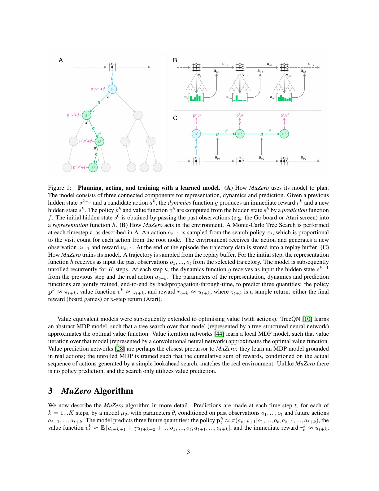
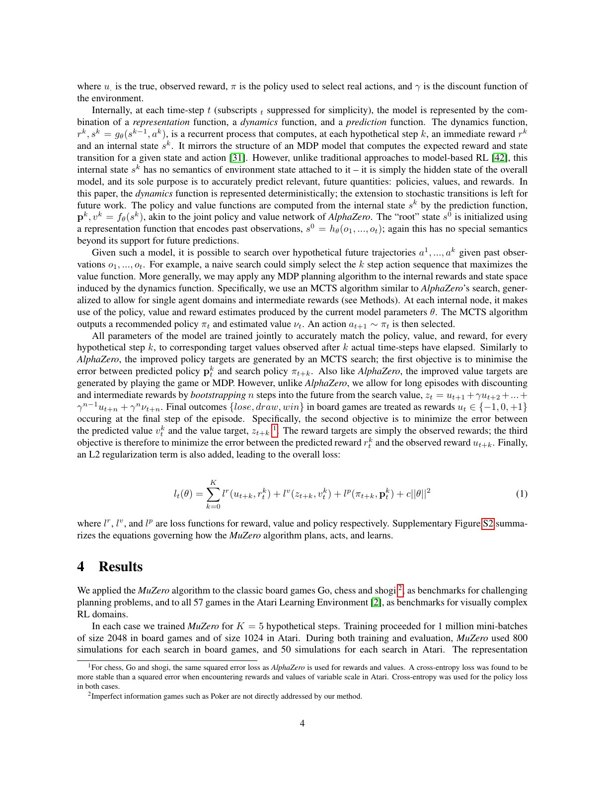
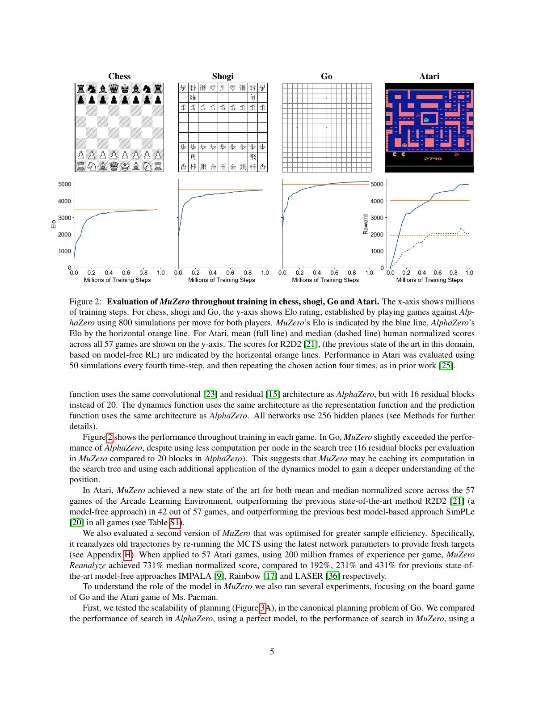
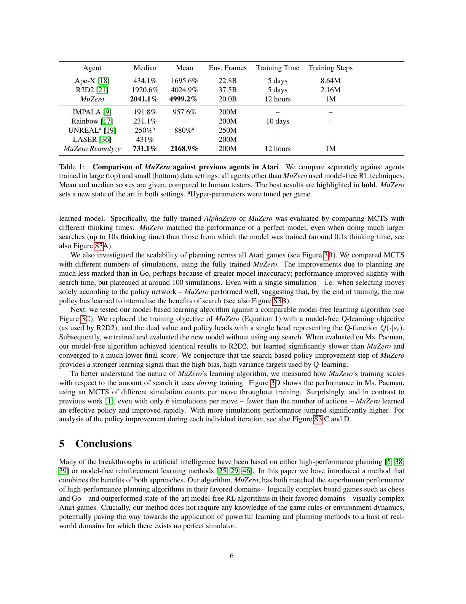
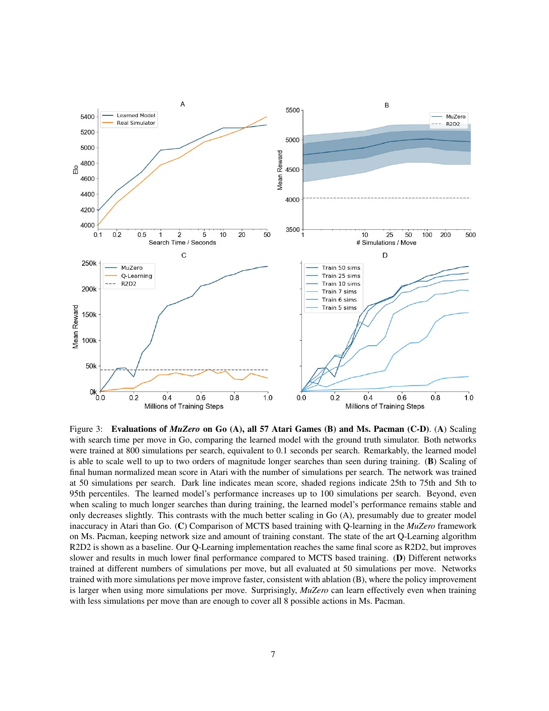
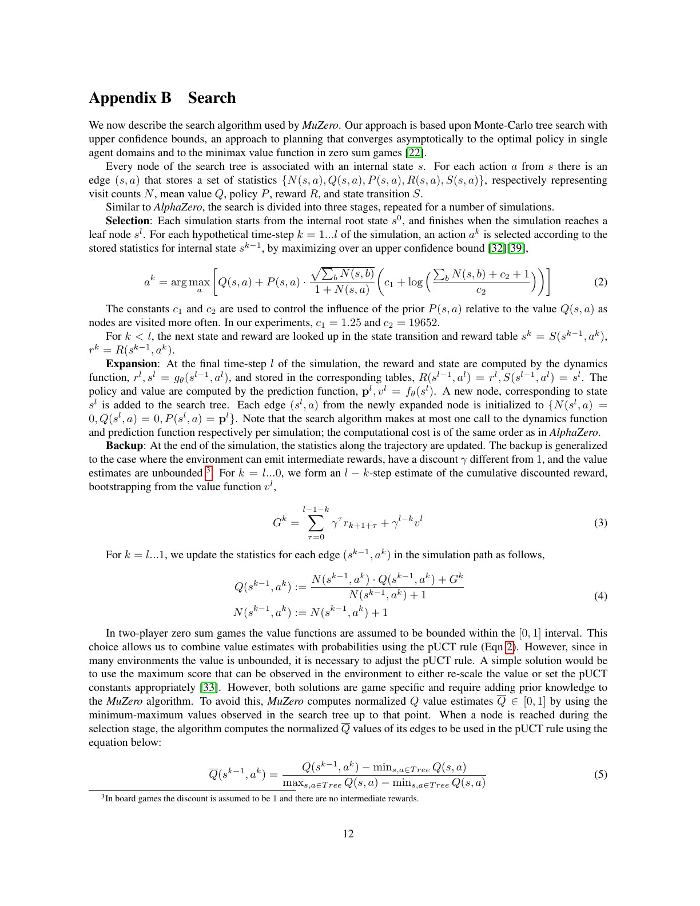
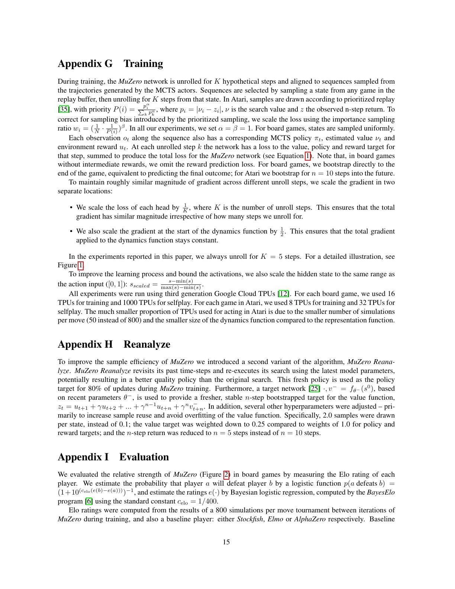
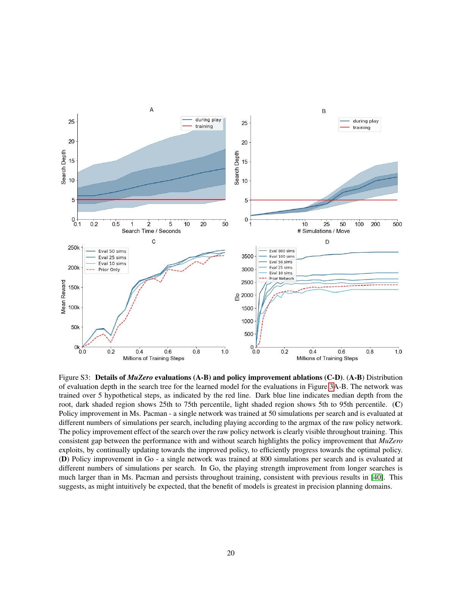

# 论文中文解读：MuZero

> 原文：[Mastering Atari, Go, Chess and Shogi by Planning with a Learned Model](https://arxiv.org/abs/1911.08265)
>
> Julian Schrittwieser 等，2019 预印本、2020 Nature；本文使用 arXiv v2（2020-02-21）。
>
> 本地材料：[`PDF`](paper.pdf) · [`全文`](paper.txt) · [`论文概要`](论文概要.md)

## 0. MuZero 反对哪种世界模型观

传统 model-based RL 常先预测下一真实状态或下一帧，再在模型上规划。像素预测会浪费容量在纹理等与决策无关的细节，长 rollout 误差还会累积；抽象状态模型若仍以重建为目标，也未必保留价值相关信息。

MuZero 改问：规划实际需要什么？答案是每个假想动作后的 reward、policy prior 和 value。只要隐状态能准确支持这三项，就不要求它可解释、可还原画面或等同真实状态。

## 1. 三组件 learned model

模型 $\mu_\theta$ 由：

1. **Representation**：
   $$s^0=h_\theta(o_1,\ldots,o_t)$$
   将真实观测历史压成根隐状态。
2. **Dynamics**：
   $$(r^k,s^k)=g_\theta(s^{k-1},a^k)$$
   在隐空间执行假想动作，预测即时 reward 与下一隐状态。
3. **Prediction**：
   $$(p^k,v^k)=f_\theta(s^k)$$
   输出 MCTS prior policy 与 value。

acting 时先编码当前历史，再在隐模型上 MCTS，按根 visit counts 构造 $\pi_t$ 并采动作；真实环境返回新 observation/reward，轨迹写入 replay。training 时从 replay 取真实动作序列，将 dynamics 展开 $K$ 步，对每步 reward/value/policy 监督端到端反传。

## 2. 它学的不是完整 simulator

隐状态 $s^k$ 没有 observation reconstruction loss，也没有与真实 latent state 对齐。其语义只由三种预测约束产生。这种 value-equivalent model 可能把视觉上不同但决策后果相同的状态合并，也可能忽略永远不影响当前训练目标的信息。

优点是容量集中于规划；风险是训练 target 未覆盖的后果可被抹掉。若 reward、policy 或 value model 在某类稀有状态上错误，MCTS 会系统地在错误模型里搜索，而且更深 search 未必更好。

## 3. 联合训练目标

在时刻 $t$ 从真实轨迹取动作 $a_{t+1:t+K}$，模型递归展开。总 loss：

$$
\ell_t(\theta)=
\sum_{k=0}^{K}
\left[
\ell_r(u_{t+k},r_t^k)
+\ell_v(z_{t+k},v_t^k)
+\ell_p(\pi_{t+k},p_t^k)
\right]
+c\|\theta\|^2.
$$

- $u$ 是真实环境 reward；棋类无中间奖励，reward loss 可省；
- $\pi$ 是当时 MCTS 根访问次数产生的改进策略；
- 棋类 $z$ 是终局输赢；
- Atari 为
  $$z_t=u_{t+1}+\gamma u_{t+2}+\cdots+\gamma^{n-1}u_{t+n}+\gamma^n\nu_{t+n},$$
  其中 $\nu$ 是未来 MCTS value。

policy/value target 又由当前或近期网络参与 search 产生，所以这是 bootstrap self-training，不是固定监督。search 负责 policy improvement，network 负责把 search 结果摊销成快速 policy/value 并学习下一轮搜索模型。

## 4. 训练规模与主学习曲线

所有领域均展开 $K=5$ 假想步，训练 1M minibatches；棋类 batch 2048、每步 800 simulations，Atari batch 1024、每 4 帧 50 simulations。网络用 256 hidden planes，representation/dynamics 主体为 16 个 residual blocks。

棋类 Elo 通过对 AlphaZero 比赛估计，Go 中 MuZero 略超 AlphaZero。Atari 同时看 57 游戏 human-normalized mean/median，MuZero 超过 R2D2。

这不是“一套权重同时玩四类任务”：每个 board game 和每个 Atari game 都分别训练模型；通用性来自算法结构与超参数迁移，而非多任务共享参数。

## 5. Table 1：大数据与低数据设置必须分开

| Agent | Median | Mean | Env. frames |
| --- | ---: | ---: | ---: |
| Ape-X | 434.1% | 1695.6% | 22.8B |
| R2D2 | 1920.6% | 4024.9% | 37.5B |
| MuZero | **2041.1%** | **4999.2%** | 20.0B |
| IMPALA | 191.8% | 957.6% | 200M |
| Rainbow | 231.1% | — | 200M |
| LASER | 431% | — | 200M |
| MuZero Reanalyze | **731.1%** | **2168.9%** | 200M |

MuZero 标准版与 R2D2 属于数百亿 frame 档；Reanalyze 才与 200M 档比较。把 2041% 与 Rainbow 231% 直接称为同预算提升是不公平的。

mean 明显高于 median，且逐游戏分数出现上万百分比，说明少数游戏极端值强烈影响均值。论文在 42/57 游戏上超过 R2D2，但 Montezuma's Revenge 为 0、Pitfall 近零，稀疏探索并未解决。

## 6. Figure 3：search 什么时候有效

### Go

模型训练时搜索约 0.1 秒/步；评估把 thinking time 增到 10 秒，MuZero 的 learned model 仍像 AlphaZero perfect simulator 一样继续受益。这说明隐动力学在搜索实际访问深度上足够一致。

### Atari

增加 simulations 只到约 100 次持续改善，之后平台甚至稍降。作者推测 Atari 模型误差更大。即使只用一次 simulation、近似直接按 raw policy 行动，最终也很强，说明网络通过持续拟合 MCTS policy 内化了 search 收益。

### Ms. Pac-Man

将 MuZero objective 换成 R2D2 风格 Q-learning，并去掉 search，所得 model-free 版本最终接近 R2D2，但学习更慢、远低于 MCTS 版本。保持相近网络和训练量后，差异支持 search-based policy improvement，而非仅仅网络更大。

训练时哪怕每步 6 simulations、少于 8 个动作数，也能有效学习；更多 simulations 提升明显。这说明 tree search 不必穷举全部动作，prior 可集中计算。

## 7. MCTS 的 selection、expansion、backup

每条边存 $\{N,Q,P,R,S\}$。selection 选择：

$$
a^k=\arg\max_a
\left[
\bar Q(s,a)+P(s,a)
\frac{\sqrt{\sum_bN(s,b)}}{1+N(s,a)}
\left(c_1+\log\frac{\sum_bN(s,b)+c_2+1}{c_2}\right)
\right].
$$

到叶节点后，dynamics 产生 $(r^l,s^l)$，prediction 产生 $(p^l,v^l)$ 并扩展；然后把多步 reward 加末端 value 的折扣回报沿路径 backup。

棋类 value 天然有界，Atari 回报尺度不同。MuZero 在当前搜索树上用观测到的 Q 最小/最大值做 $[0,1]$ 归一化，避免为每个游戏手调 pUCT 尺度。若树早期极值不稳定，这个归一化也会改变 exploration pressure。

“不知道规则”有三个具体含义：树内不调用真实 transition、不查询树内合法动作、不用真实 terminal value。根节点仍可从真实环境获得合法动作，真实 episode 仍由环境终止。

## 8. 输入与网络细节

Atari representation 输入最近 32 个 $96\times96$ RGB frames 和对应 32 个动作；动作作为 bias planes 编码，因为某个动作未必立刻在画面可见。多次 stride/pooling 将空间降到 $6\times6$、256 planes，再由 dynamics 在该分辨率递归。

Atari reward/value 先用可逆压缩变换，再表示成 -300 到 300 的 601 类 categorical distribution；标量 target 以相邻整数的线性组合编码。这避免可变尺度下直接 MSE 不稳定。棋类则使用 AlphaZero 式平方 value/reward loss。

模型虽然只展开 5 步训练，搜索可走得更深。附录 Figure S3 显示评估深度常超过 5；参数共享的 recurrent dynamics 允许外推，但没有理论保证深度增加不累积误差。

## 9. Reanalyze：用新模型重标旧经验

旧轨迹当时的 MCTS policy 来自旧网络。Reanalyze 用最新模型重新对旧状态搜索，80% 更新使用刷新后的 policy target；value 则由近期 target network 提供更稳定 bootstrap。它把固定 replay 变成可反复改善标签的数据集，提高 200M frames 下的样本利用。

同时还改了多项超参数：每状态样本复用从 0.1 提到 2.0，value loss 权重降到 0.25，$n$-step 从 10 改 5。因此 Reanalyze 的增益不能纯粹归因于“重新搜索”单一因素。

算力规模也很关键：每个棋类任务 16 TPUs training + 1000 TPUs self-play；每个 Atari 游戏 8 TPUs training + 32 TPUs acting。Table 1 的“12 hours”不是普通单机复现成本。

## 10. Figure S3：模型只训 5 步，为何能搜更深

Figure S3 A/B 把训练展开深度 5 标成红线，实际 MCTS 评估深度分布可明显超过它。Go 的深 search 增益远大于 Ms. Pac-Man，支持“精确规划域更能利用模型”的解释。

C/D 比较 raw policy 与不同 simulations 的搜索 policy，训练全过程中都存在 search improvement gap；网络不断向更强 search target 学习，search 又基于更新网络产生下一轮 target。这是 MuZero 的 generalized policy iteration 核心。

深度外推仍可能出现 model exploitation。图只显示所测任务的平均行为，不能证明任意深度稳定；Atari 100 simulations 后平台已经是反例信号。

## 11. “无规则”最容易被夸大的地方

MuZero 不需要把 game rules 写进 search simulator，但仍需要：

- 可交互真实环境；
- 环境返回 observation、reward 和 episode termination；
- 自我对弈或大量 actor 生成数据；
- 根节点可知合法动作；
- 棋类 action encoding、board history 等领域接口设计。

它不是仅看视频就学会下棋，也不是完全无先验。更准确的说法是：**树内状态转移、合法动作与终止不由手写 simulator 提供，而由 learned latent dynamics/policy/value 近似。**

## 12. 论文没有覆盖什么

1. dynamics 是确定性的；Poker 等 imperfect information/stochastic hidden-state 问题未处理。
2. 任务分别训练，没有跨游戏共享世界模型。
3. 奖励由环境给出，不解决 reward specification。
4. 没有真实机器人或非平稳现实系统验证。
5. latent state 不可解释，错误诊断比像素模型困难。
6. self-play/search 算力极大，开源复现门槛高。

## 13. 与 DQN、PPO、SAC 的关系

- DQN：直接学 $Q$，无显式 search；MuZero 学隐模型并用 MCTS 生成改进 policy/value targets。
- PPO：直接对 on-policy surrogate 做梯度更新；MuZero 的策略改进主要发生在 search，网络做监督拟合。
- SAC：用 replay 的 off-policy maximum-entropy actor-critic；MuZero 也用 replay，但 target 来自 search、环境 reward 与 bootstrapped value，没有最大熵 actor 目标。

MuZero 不是把三者简单叠加，而是把“规划本身”当成训练时 teacher。

## 14. 最终结论

MuZero 的核心洞见是：有用的 world model 不必能生成世界，只需在 agent 会搜索的反事实动作序列上，保留 reward、policy 和 value。这个任务导向抽象让 model-based RL 同时进入棋类精确规划和 Atari 高维视觉域。

论文最强证据是跨域 search scaling 与同架构 Q-learning 消融；最重要限制是计算量、逐任务训练和隐模型深度误差。它展示了“学模型 + 搜索 + 再蒸馏到策略”的强大闭环，但离低成本、可解释、真实世界通用规划仍有距离。

## 原文证据导航

以下页码按仓库内 PDF 的**文件页码**计，不等同于论文印刷页码。建议先读本节所指原文，再回看上面的中文解释。

- [打开原始 PDF](paper.pdf)
- [打开可检索文本](paper.txt)
