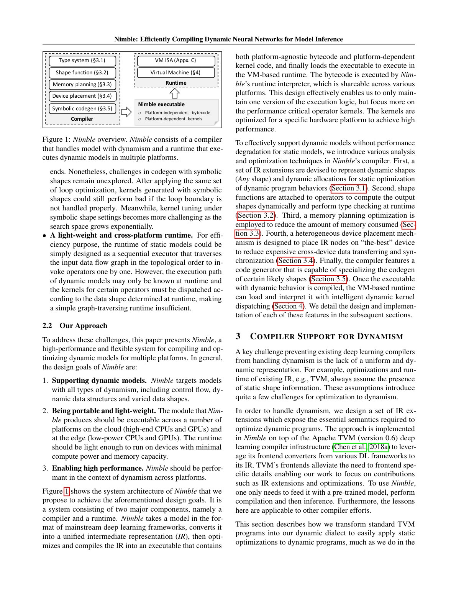
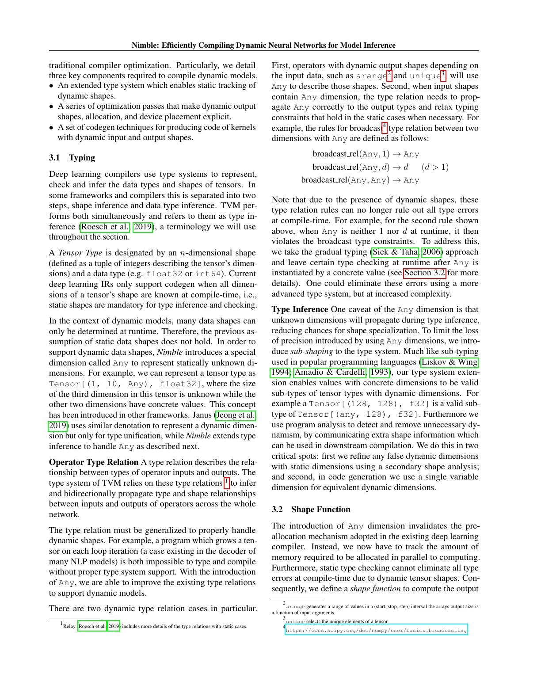
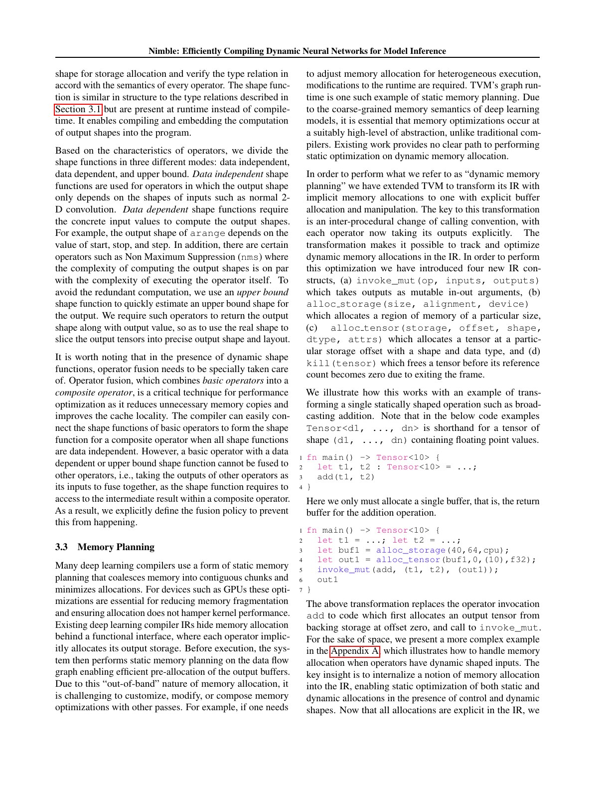
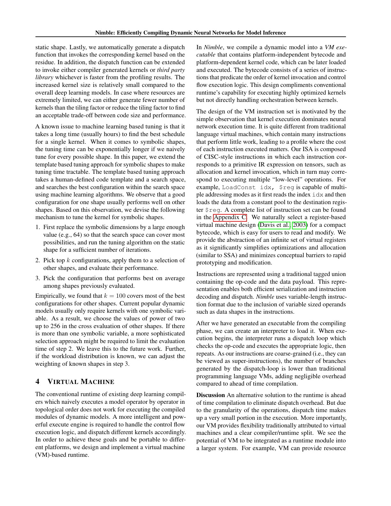
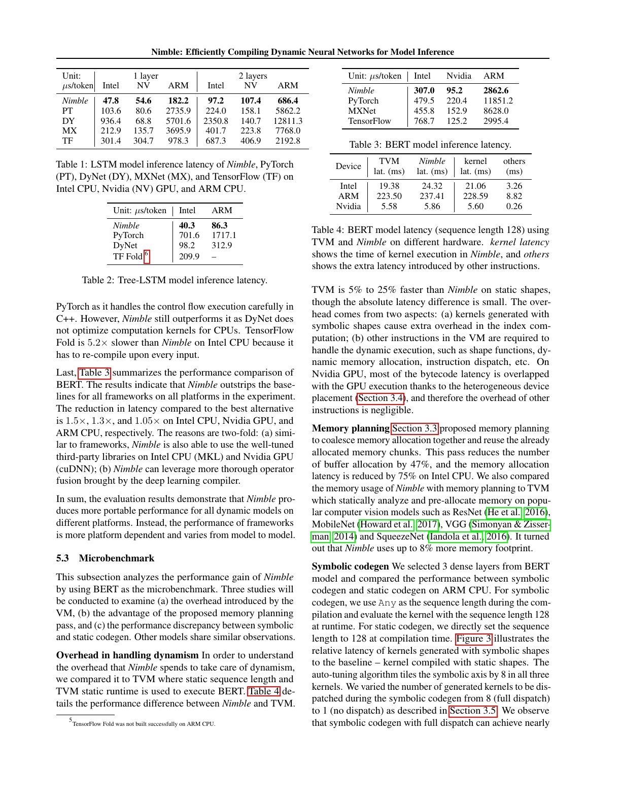
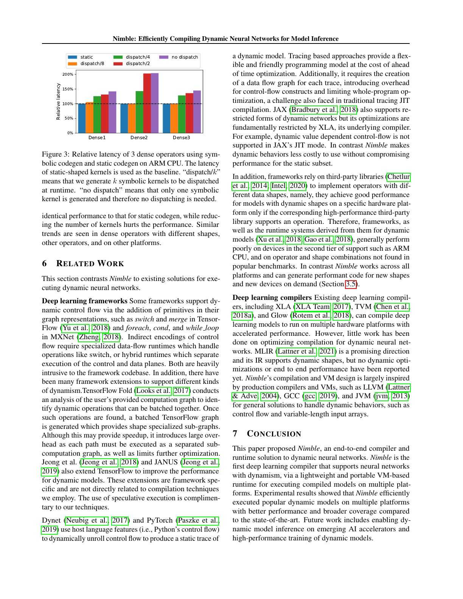

# Nimble 中文精读：动态神经网络的编译与 Runtime

## 1. 动态性至少有三类

Nimble 不把 dynamic model 只理解成变长 batch：

1. Dynamic control flow：branch/loop path 到运行时才确定。
2. Dynamic data structure：list、tree 等结构随输入改变。
3. Dynamic tensor shape：rank 通常固定，但 dimension size 或 data-dependent output 改变。

静态 compiler 默认 graph topology、buffer size 和 kernel shape 都已知。任一假设失效，type inference、memory planning、device placement、codegen 和 runtime 都需要改变。

## 2. Compiler + VM 的总体结构

Nimble 输入 framework model，经过：

- dynamic type inference；
- shape function insertion；
- explicit memory planning；
- heterogeneous device placement；
- symbolic shape codegen；
- 生成 platform-independent bytecode 与 platform-dependent kernels。

runtime VM 解释 bytecode，根据实际 path 和 shape dispatch kernels。

这种分工把“控制动态性”放给 VM，把性能关键 tensor computation 放给 native kernels。

## 3. Any dimension 与渐进类型

静态 tensor type 可能是 Tensor[(1, 10, 128), float32]；Nimble 引入 Any：

    Tensor[(1, 10, Any), float32]

Any 不表示任意 rank，而是某一维在编译期未知。

operator 的 type relation 也要扩展。例如 broadcast(Any, d) 在 d 大于 1 时可得到 d，但若 runtime 的 Any 既不是 1 也不是 d，才发现不合法。

因此 Nimble 采用 gradual typing：

- 可静态证明的约束提前检查；
- 不确定约束推迟到运行时；
- sub-shaping 允许 concrete tensor 成为含 Any tensor 的 subtype；
- 分析尽量把误标为 dynamic 的维度恢复成 static。

## 4. Shape function 是什么

当 output buffer 大小未知，runtime 必须先算 shape 才能 allocation。Nimble 为 operator 附加 shape function：

### Data-independent

output shape 只依赖 input shapes，例如常规 convolution。

### Data-dependent

output shape 依赖 input values，例如 arange 或 unique。

### Upper-bound

精确算 shape 与执行 operator 一样贵，例如某些 NMS。先计算便宜的 upper bound 分配空间，operator 同时返回真实 shape，再 slice。

这三类对应不同的同步和数据搬运成本。data-dependent shape 可能迫使 device value 回到 host，不能只看“多执行一个小函数”。

## 5. 动态内存规划

传统 static graph 可预先算 tensor lifetime 和 offset；dynamic shape 只能等运行时。

Nimble 把隐式 allocation 改写成显式 IR：

- alloc_storage；
- alloc_tensor；
- invoke_mut，令 output buffer 成为显式参数；
- kill，提前结束 lifetime。

这样 compiler 仍可做 liveness、reuse 和 allocation coalescing。

论文报告该 pass 减少 47% buffer allocations，在 Intel CPU 上把 allocation latency 降低 75%；总 footprint 相对 TVM static plan 最高多约 8%。

## 6. Heterogeneous placement

shape computation 通常小且 control-heavy，放 CPU 合理；tensor kernel 放 GPU。可若 shape function 依赖 GPU data，把结果搬回 CPU 会引入同步。

Nimble 用 device-domain constraints 分析：

- 哪些 values 必须同 device；
- 哪些 shape function 可在 CPU；
- 哪些动态 allocation 与 kernel launch 需要 runtime instruction；
- 如何减少不必要的 cross-device copy。

这也是动态图 compiler 与单纯 kernel compiler 的边界：它必须管理 host/device control dependency。

## 7. Symbolic codegen 与多版本 dispatch

unknown dimension 会扩大 schedule search space。Nimble：

1. 以较大的 representative value 代替 symbolic dimension 搜索；
2. 选 top-k configurations；
3. 在若干 sampled shapes 上评估；
4. 生成多个 symbolic kernels；
5. runtime 按当前 shape dispatch。

版本多，性能更接近 static specialization，但 binary size、compile/tuning 成本和 dispatch table 也更大。

## 8. 端到端结果

论文测试：

- LSTM：动态 sequence；
- Tree-LSTM：动态 tree topology；
- BERT：动态 sequence length；
- Intel CPU、NVIDIA GPU 与 ARM CPU。

摘要的“最高 20×”来自特定 model/platform/baseline，不能作为统一加速比。更稳健的观察是不同 framework baseline 在二线平台差异大，而 compiler-generated kernels 提供更一致的 portability。

BERT 对最佳替代方案的改善约为：

- Intel CPU 1.5×；
- NVIDIA GPU 1.3×；
- ARM CPU 1.05×。

## 9. 动态的固定税

与 TVM static shape 比：

- CPU 上 TVM 可快 5%–25%；
- symbolic indexing 增加 kernel 成本；
- VM 需要 shape、allocation、dispatch instructions；
- GPU 上部分 VM 开销可与 device execution overlap。

多版本 symbolic codegen 可接近 static kernel；减少候选会明显损害某些 dense operator 性能。这说明“一个完全通用 kernel”往往不是免费答案。

## 10. 与 PyTorch 动态 shape 的联系

现代 PyTorch 使用 SymInt、guards、FakeTensor/meta functions、functionalization 和 Inductor。术语不同，但问题高度相似：

| Nimble | 现代 PyTorch 概念 |
| --- | --- |
| Any dimension | symbolic dimension/SymInt |
| shape function | fake/meta implementation 与 runtime shape logic |
| runtime type check | guard/runtime assertion |
| symbolic kernel dispatch | specialization/autotuning/multi-version |
| VM instructions | compiled wrapper/runtime control |

不要把这种对应理解成代码沿袭；它用于建立问题结构。

## 11. 常见误读

### “支持 dynamic shape 就不再编译多个版本”

通用图可以覆盖多个 shape，但 kernel schedule 仍可能针对 shape family 多版本化。

### “Any 越多越灵活，所以越好”

Any 会丢失优化信息。好的系统尽量只让真正变化的维度动态。

### “shape function 都很轻”

data-dependent output 的精确 shape 可能和主计算一样贵，甚至产生 host-device synchronization。

## 12. 最终判断

Nimble 最重要的贡献是让动态性穿透 compiler 全栈：type、shape、memory、placement、codegen 和 runtime 缺一不可。它适合在 PyTorch frontend 论文之后阅读，用来理解图捕获之后还剩多少系统工作。
