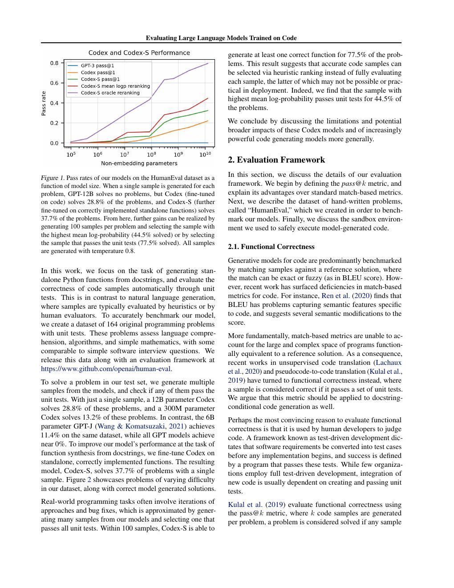
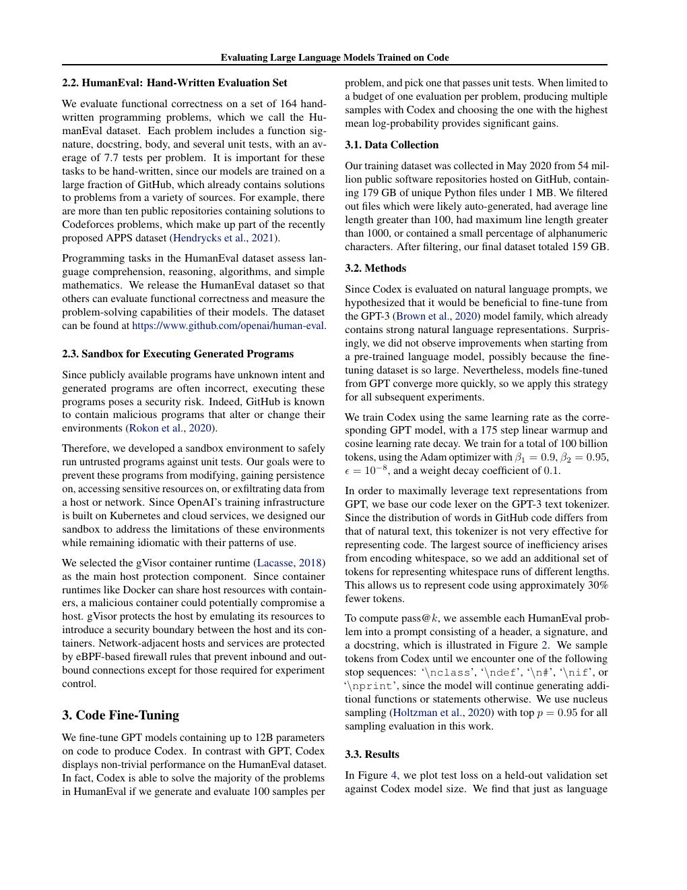
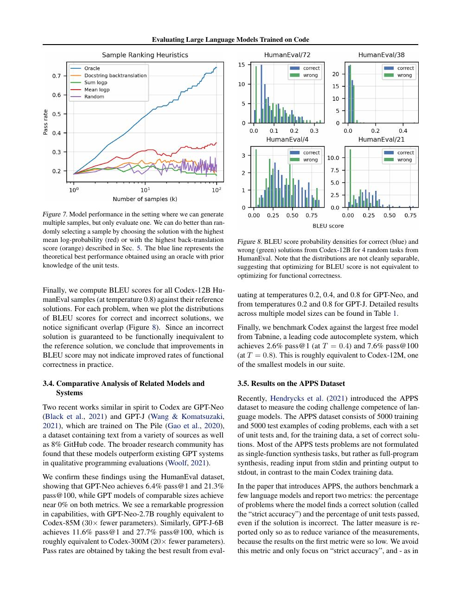
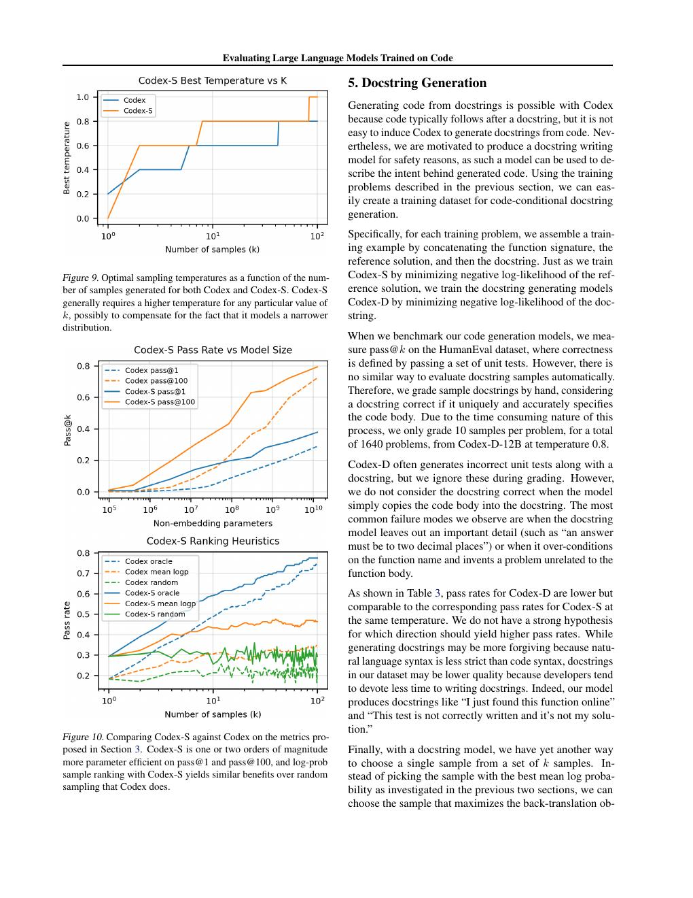
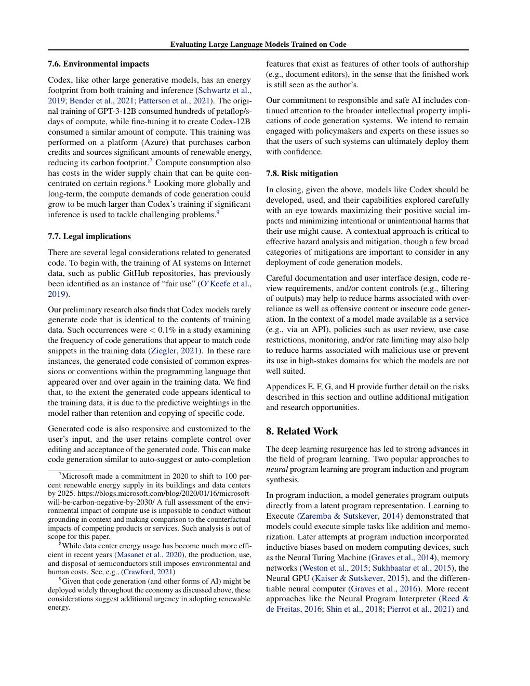

# 论文中文解读：《Evaluating Large Language Models Trained on Code》

## 一、这篇论文的长期影响大于历史 Codex 产品

Codex 把“代码看起来像答案”改成“代码在执行环境中是否通过测试”。HumanEval 与 pass@k 随后成为代码模型的标准语言；今天的 coding agent 虽已从单函数生成扩展到仓库级编辑，核心闭环仍是生成—执行—反馈。

论文发表于 2021 年，arXiv:2107.03374。本地保存 [PDF](paper.pdf)、[文本](paper.txt) 和 [概要](论文概要.md)。

## 二、HumanEval：语义 correctness 而非文本相似度



HumanEval 含 164 个手写 Python 函数问题。模型看到函数签名/docstring，补全实现；隐藏单元测试执行候选。两个文本完全不同的程序可能同样正确，BLEU 无法表达这一点。

但单元测试只是有限 oracle：未覆盖边界条件、性能、资源消耗与安全副作用时，错误代码仍可能通过。HumanEval 更适合比较局部算法生成，不代表真实软件工程。

## 三、pass@k：为什么采样次数不能被省略



若生成 `n` 个样本，其中 `c` 个正确，从中随机取 `k` 个至少有一个正确的概率可用组合数无偏估计。pass@1 衡量单次成功率，pass@100 衡量给模型 100 次机会后的覆盖能力。

Codex-12B 的 pass@1 约 28.8%，pass@100 约 72.3%。两者差距说明模型的分布中包含正确方案，但高概率样本并不总正确。真正系统还需要测试、verifier 或 reranker 找出那一个，而非把 pass@100 当成用户一次请求的可靠率。

## 四、模型与数据



作者从 GPT 模型继续训练，使用来自约 5400 万公共 GitHub 仓库的代码，清理自动生成、超大和低质量文件，并以 Python 为主要评测语言。最大模型 12B。

代码数据的独特之处是可执行，但也带来许可证、秘密、恶意代码与重复 fork。论文早于今天更成熟的数据治理规范；“公开可抓取”不等于“适合无条件训练和再分发”。

## 五、采样与排序的反直觉

较低 temperature 对 pass@1 往往好，较高 temperature 能增加 pass@k 的多样性。论文发现按模型平均 token log-probability 选择候选有时不如随机：模型更自信的常见实现未必通过边界测试。

实践上，代码模型最好与外部信号结合：编译、单测、静态分析、类型检查、fuzzing、性能测试和仓库 CI。模型概率只是候选生成分数，不是正确性证明。

## 六、从单函数到真实 coding agent 的缺口



真实仓库任务多出：定位文件、理解依赖、编辑多个位置、运行长测试、处理环境失败和回滚。HumanEval 不测这些。Codex 论文已经尝试 APPS 等更复杂问题，但今天评估 Claude Code、Codex CLI、Kimi Code 等产品，应使用统一 agent scaffold 的 SWE-bench 类任务，并记录工具权限、token/时间预算和失败类型。

## 七、安全分析



论文指出模型会复现 prompt 中的细微 bug，也可能建议不安全依赖、硬编码 secret 或表面可运行但脆弱的方案。模型越大不保证这些风险单调下降。

可靠工作流应把模型当候选作者，而不是最终授权者：

```text
任务/issue → 模型补丁 → sandbox → tests + lint + security scan
         → diff review → 最小权限合并
```

## 八、与 Claude Code 的比较边界

Codex 论文研究的是底层代码模型，Claude Code 是带文件、终端、搜索、权限与上下文管理的 agent 产品。产品表现 = 基础模型 × harness × 工具 × 预算 × evaluator。没有 Claude Code 架构论文可与 Codex 12B 做纯模型对照。

## 九、开放性

OpenAI 开放了论文与 HumanEval，但没有开放原始 Codex 权重。后续“Codex”产品名称也不等于论文中的 12B checkpoint；比较时必须写清模型年代与产品层。

## 十、原文入口

[arXiv](https://arxiv.org/abs/2107.03374) · [HumanEval](https://github.com/openai/human-eval)


## 原文证据导航

以下页码按仓库内 PDF 的**文件页码**计，不等同于论文印刷页码。建议先读本节所指原文，再回看上面的中文解释。

- [打开原始 PDF](paper.pdf)
- [打开可检索文本](paper.txt)

| 中文笔记中的证据 | 原文位置 | 复核重点 |
|---|---|---|
| HumanEval 任务与不同规模模型的通过率 | [PDF 文件第 2 页](paper.pdf#page=2) · [截图](rendered_figures/page-2.jpg) | 回到该页上下文，复核定义、图表或实验论证 |
| pass@k 与采样温度、候选数的关系 | [PDF 文件第 4 页](paper.pdf#page=4) · [截图](rendered_figures/page-4.jpg) | 回到该页上下文，复核定义、图表或实验论证 |
| 模型规模、训练 loss 与代码能力 | [PDF 文件第 6 页](paper.pdf#page=6) · [截图](rendered_figures/page-6.jpg) | 回到该页上下文，复核定义、图表或实验论证 |
| APPS、docstring generation 与更复杂任务 | [PDF 文件第 9 页](paper.pdf#page=9) · [截图](rendered_figures/page-9.jpg) | 回到该页上下文，复核定义、图表或实验论证 |
| 代码生成中的错误延续与安全风险 | [PDF 文件第 13 页](paper.pdf#page=13) · [截图](rendered_figures/page-13.jpg) | 回到该页上下文，复核定义、图表或实验论证 |
