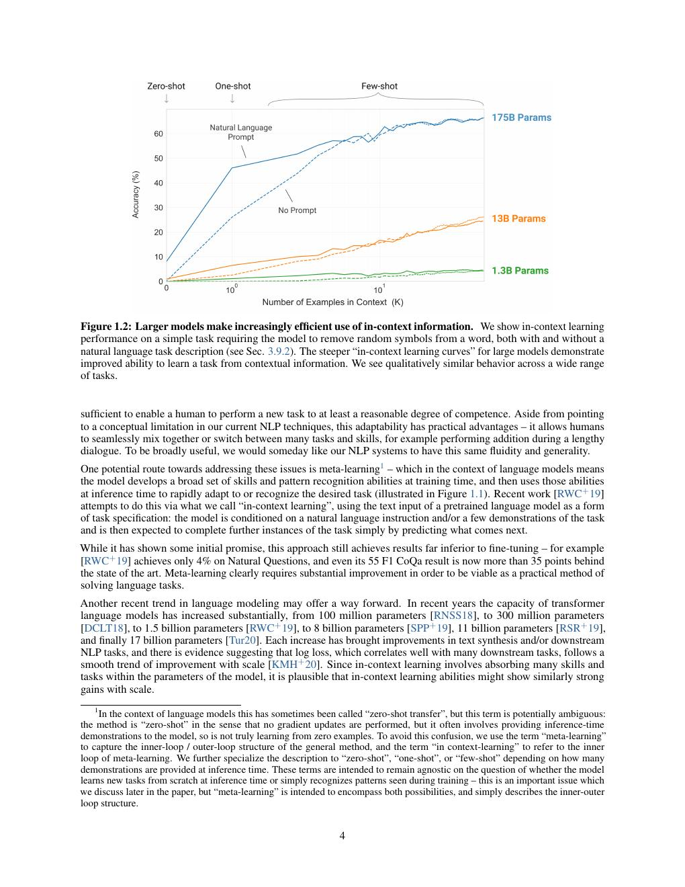
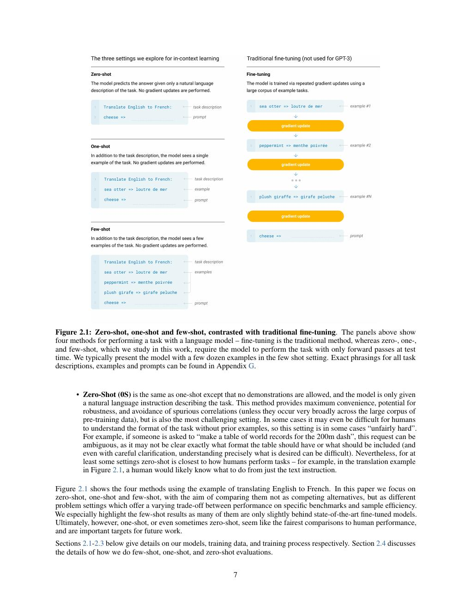
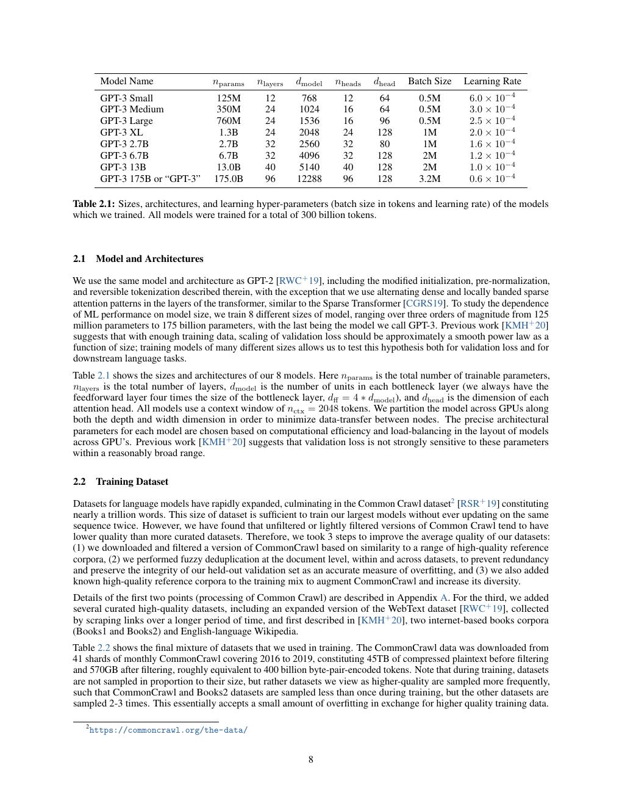
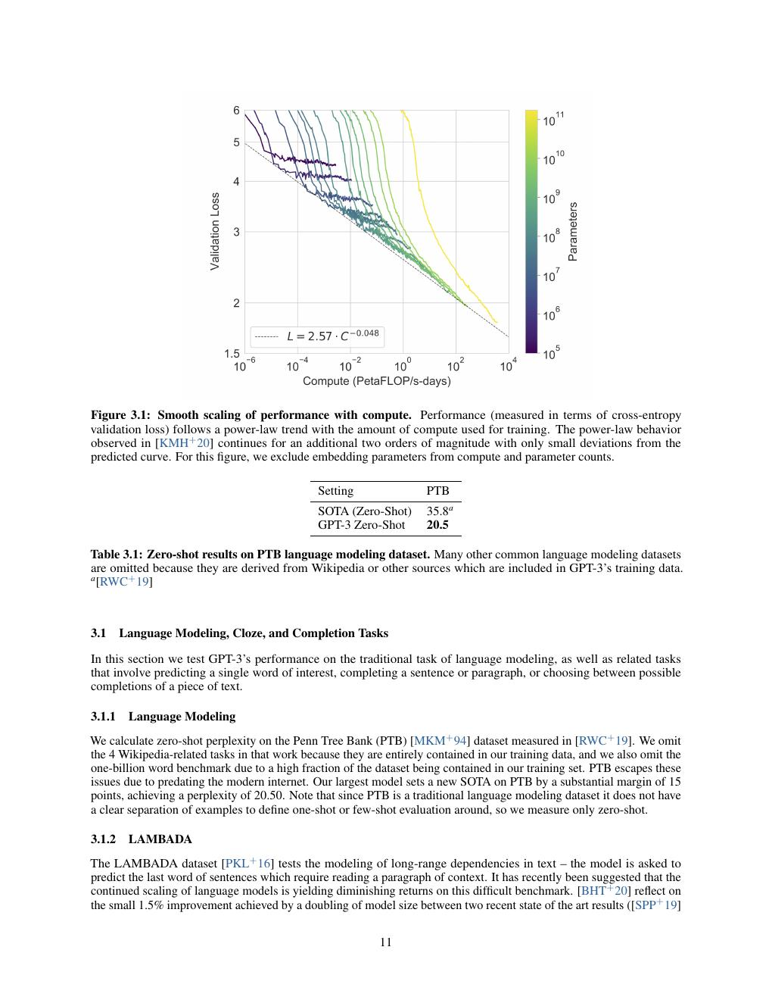
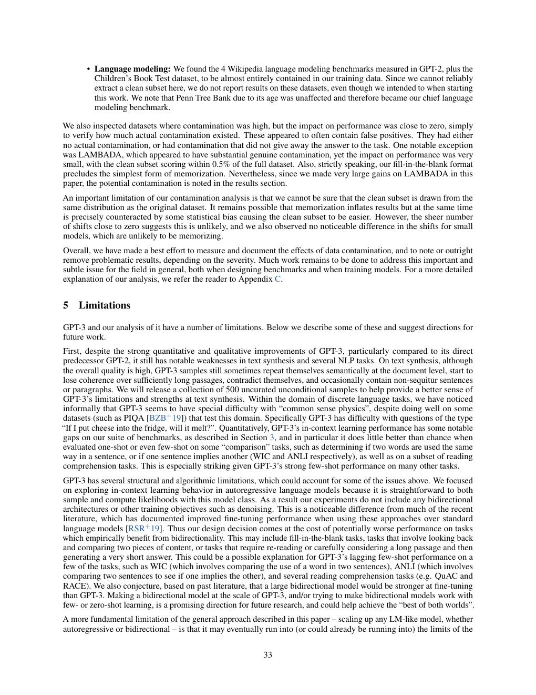

# 论文中文解读：《Language Models are Few-Shot Learners》

## 一、这篇论文改变的是“如何使用模型”

GPT-3 没有发明全新的 Transformer block。它把 decoder-only LM 扩到 175B，并系统展示：任务可以由自然语言指令和上下文示例临时指定，不必为每个任务训练独立 head 或 fine-tune checkpoint。今天的 prompting、API 通用模型与 agent 基座，都沿着这个接口范式发展。

论文发表于 2020 年，arXiv:2005.14165。本地保存 [PDF](paper.pdf)、[文本](paper.txt) 与 [概要](论文概要.md)。

## 二、Figure 1.1：in-context learning 不是参数更新



预训练阶段通过 next-token prediction 学习广泛分布；推理阶段把任务描述、输入输出示例和新输入放在同一上下文。模型根据 token 序列调整当前预测，但权重不变。

需要区分：

- **fine-tuning**：用梯度更新权重；
- **few-shot in-context**：只在 prompt 放若干演示；
- **one-shot**：一个演示；
- **zero-shot**：只有指令与待处理输入。

上下文学习更像在激活中临时构造任务，而非模型获得永久新知识。关闭会话后，它不会保留示例。

## 三、模型与数据规模





最大模型 175B、96 层、hidden size 12,288、96 heads、2048 context。论文训练从 125M 到 175B 的系列，用相同评估观察 scaling。

数据以过滤 Common Crawl 为主，混入 WebText2、Books 与 Wikipedia；高质量集合会多 epoch 重采样。这意味着“训练 token 比例”不等于原始数据量比例。论文还做模糊去重，但公开 benchmark 仍可能出现在网页语料中。

## 四、scaling 与 few-shot 的关系



许多任务随模型规模平滑改善，few-shot 相对 zero-shot 的收益也往往在大模型更明显。重要原因不是 prompt 示例给了更多梯度，而是大模型更能从序列中识别任务格式、标签语义与映射规律。

但结果不统一：有的任务仍落后于 fine-tuned SOTA，NLI 等任务表现弱，算术能力随位数快速下降。论文真正证明的是“规模可让一个统一 LM 覆盖更多任务”，不是“few-shot 已取代训练数据和专用系统”。

## 五、定量结果为什么不能只看平均分

论文覆盖 42 个 accuracy-denominated benchmark 及翻译、问答、生成等任务。把它们平均可显示总体趋势，却会隐藏：

- prompt wording 与示例选择敏感性；
- label permutation 可能导致任务误解；
- 少量测试集上的高方差；
- contamination 对记忆型任务的影响；
- 生成任务的人评标准不一致。

今天复测 GPT-3 式模型时，应对多个 prompt/template 报均值和方差，而不是选择最佳 prompt 后与别家单点比较。

## 六、benchmark contamination

论文用 n-gram overlap 查找训练语料与测试集重合，并构造 clean 子集比较。这个做法很重要，但无法证明无泄漏：网页中的题目改写、答案解析、近重复和语义等价样本未必被字符串规则发现。

因此在开放互联网数据训练的大模型时代，动态/私有测试集、时间切分和可执行 verifier 比静态公开选择题更可靠。

## 七、局限与社会影响



GPT-3 会生成看似流畅但错误的内容，对物理常识、文本一致性和双向推理仍有明显问题。论文还报告性别、种族、宗教关联偏差，并讨论垃圾信息、钓鱼、冒充新闻与能耗。

这部分今天仍有价值：能力 scaling 与可靠性/对齐不是同一个目标。后来的 InstructGPT 正是用人类偏好训练弥补“会续写但不一定遵循意图”。

## 八、与后续论文的关系

```text
GPT-3：规模 + in-context task interface
  ↓
Codex：在代码分布上继续训练，并引入可执行测试
  ↓
InstructGPT：SFT + preference model + PPO
  ↓
GPT-4：多模态与可预测 scaling，但架构披露减少
  ↓
gpt-oss：重新公开权重与较完整 MoE 架构
```

## 九、开放性边界

论文是公开的，但 GPT-3 权重、完整数据与训练代码并未开源。把“有论文/API”写成“开源模型”是不准确的。OpenAI 真正重新发布开放权重 LLM，要到 gpt-oss。

## 十、原文入口

[arXiv](https://arxiv.org/abs/2005.14165) · [OpenAI 论文页](https://openai.com/research/language-models-are-few-shot-learners)


## 原文证据导航

以下页码按仓库内 PDF 的**文件页码**计，不等同于论文印刷页码。建议先读本节所指原文，再回看上面的中文解释。

- [打开原始 PDF](paper.pdf)
- [打开可检索文本](paper.txt)

| 中文笔记中的证据 | 原文位置 | 复核重点 |
|---|---|---|
| 预训练与上下文内任务学习 | [PDF 文件第 4 页](paper.pdf#page=4) · [截图](rendered_figures/page-4.jpg) | 回到该页上下文，复核定义、图表或实验论证 |
| zero/one/few-shot 与 fine-tuning 的区别 | [PDF 文件第 7 页](paper.pdf#page=7) · [截图](rendered_figures/page-7.jpg) | 回到该页上下文，复核定义、图表或实验论证 |
| 8 个 GPT-3 模型的架构与训练超参数 | [PDF 文件第 8 页](paper.pdf#page=8) · [截图](rendered_figures/page-8.jpg) | 回到该页上下文，复核定义、图表或实验论证 |
| 训练 loss 与计算量的平滑 scaling | [PDF 文件第 11 页](paper.pdf#page=11) · [截图](rendered_figures/page-11.jpg) | 回到该页上下文，复核定义、图表或实验论证 |
| 论文对局限、误用和偏见的系统讨论 | [PDF 文件第 33 页](paper.pdf#page=33) · [截图](rendered_figures/page-33.jpg) | 回到该页上下文，复核定义、图表或实验论证 |
