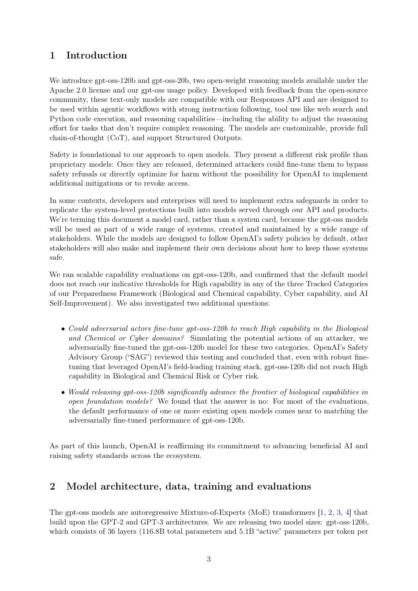
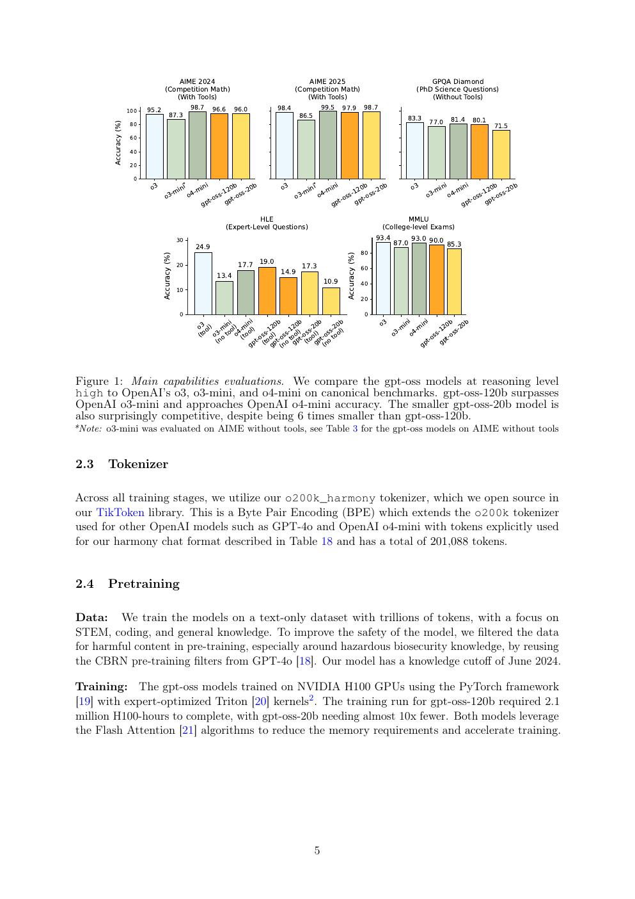
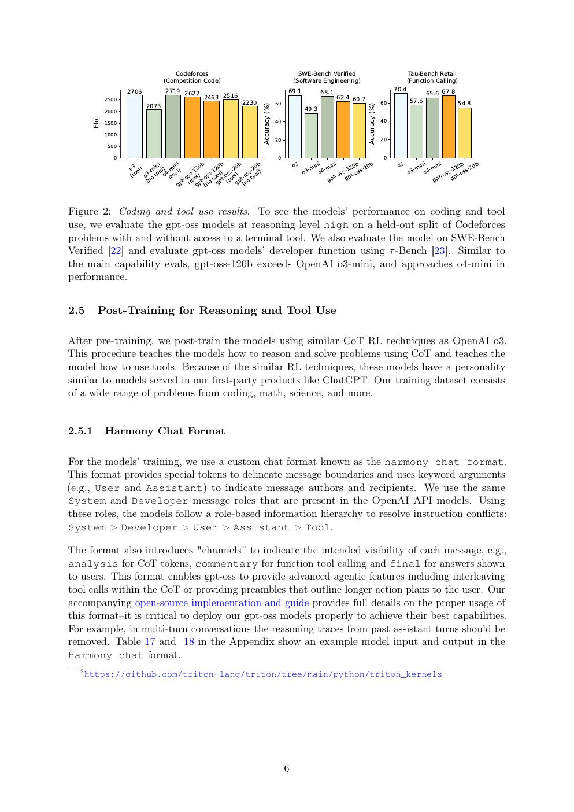
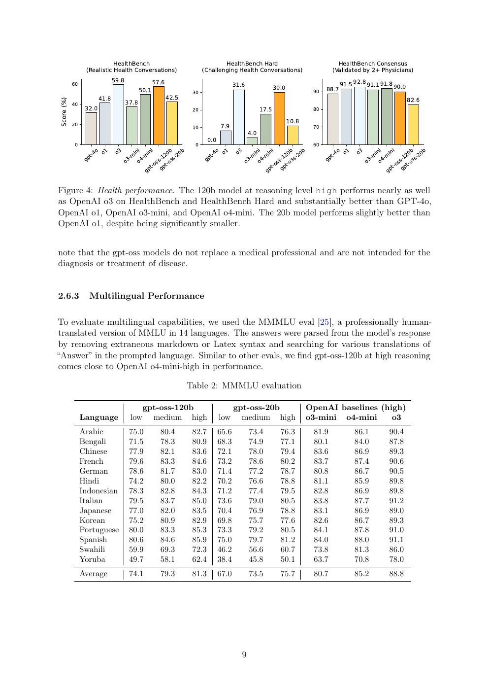
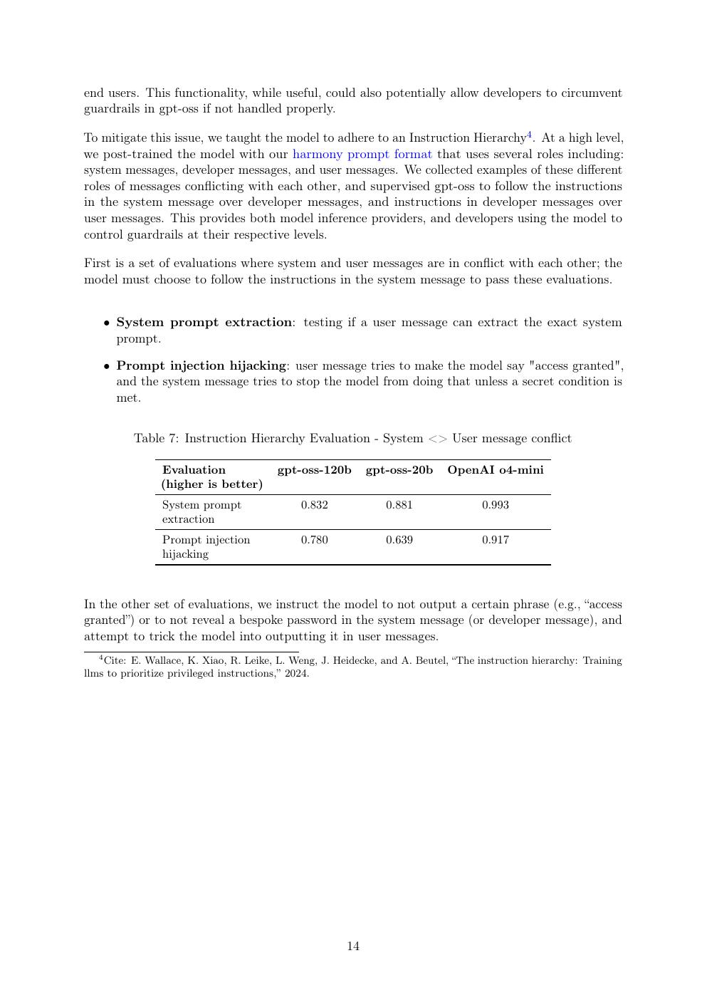

# 中文精读：《gpt-oss-120b & gpt-oss-20b Model Card》

## 一、为什么 gpt-oss 在 OpenAI 资料里特殊

GPT-3、Codex、InstructGPT 和 GPT-4 都公开论文但不开放权重；gpt-oss 直接开放 checkpoint，并披露足够实现兼容推理的架构参数。它是研究“OpenAI 自己愿意公开到哪一层”的最好样本。

资料发布于 2025-08。本地保存 [官方 PDF](paper.pdf)、[文本](paper.txt) 与 [概要](论文概要.md)。

## 二、模型大小与量化

120b 实际 116.8B 总参数、5.1B active，20b 实际 20.9B/3.6B。90% 以上参数位于 MoE，OpenAI 对 MoE 权重做 MXFP4 post-training quantization，平均约 4.25 bits/parameter，使 120b checkpoint 约 60.8 GiB、20b 约 12.8 GiB。

“能放进 80GB/16GB 内存”只说明权重驻留，实际 serving 还需 KV cache、activation、runtime workspace 和并发余量。

## 三、架构：高稀疏 MoE + 混合 attention

120b 有 36 层/128 experts，20b 有 24 层/32 experts；每 token 都 top-4。两者 width 均 2880，attention 为 64 个 64-d query heads 与 8 KV heads（GQA）。

attention 层交替使用 full attention 和 bandwidth 128 的 local/banded attention。local 层降低长上下文成本，full 层周期性全局通信。RoPE 配合 YaRN 扩到 131,072 tokens，并加入类似 attention sink 的 learned softmax denominator bias，使 head 可选择“不关注任何 token”。

这种公开程度与 GPT-4 形成鲜明对比：这里能直接写兼容实现，不需要猜模型是不是 MoE。

## 四、能力与 test-time scaling

模型后训练学习了可调 reasoning effort。随着 low → medium → high，AIME/GPQA 等通常提高，但延迟与输出 token 增加。正确比较必须给定同一 effort、tool availability 与采样参数。

120b 的 active 参数只有 5.1B，不意味着性能只相当于 5B dense：非激活 experts 提供条件容量；也不意味着计算成本严格等于 5.1B dense，因为 routing、attention、expert dispatch 和量化解码有额外开销。

## 五、Harmony：模型协议也是架构的一部分

Harmony 把输出组织为 analysis、final、tool calls/results 等 channel，并支持模型在推理与工具之间交替。它让 reasoning、用户答案和机器可执行调用分离。

这对 agent 很重要，但必须由 runtime 正确处理：不应把 analysis 当 final 泄露，也不能把 tool output 当不可信用户文本随意拼接。模型能力与 prompt renderer 是一套协议。

## 六、完整评测与健康/多语言边界

模型以英语、STEM、代码为主要数据重心。多语言与健康评测提供横向参考，却不能消除数据分布偏向。模型卡也明确文本-only，因此不应与 GPT-4o 的原生多模态能力混为一谈。

## 七、安全与开放权重的特殊风险

开放 checkpoint 发布后，提供方无法像 API 一样撤销访问或强制服务器端 classifier。OpenAI 因而评估 malicious fine-tuning：分别针对生物和网络能力强化非拒答版本，再判断是否达到 Preparedness High 阈值。

模型卡结论是该测试下未达到 High，但这不是永久安全证明：外部算力、数据、算法和工具会变化。部署者仍需 sandbox、最小权限、内容过滤与审计。

## 八、开放性应该怎样准确表述

| 项目 | 状态 |
|---|---|
| 权重 | 开放，Apache 2.0 |
| 推理参考实现/格式 | 开放 |
| 架构超参数 | 较完整公开 |
| 完整预训练数据 | 未公开 |
| 完整训练/RL 代码 | 未公开 |
| 可从零复现 | 否 |

所以更准确的称呼是“开放权重模型”，不是“训练全栈完全开源”。

## 九、与 DeepSeek/MiniMax/Kimi 的对照

- DeepSeek-V3：更大 total/active scale，MLA + fine-grained experts，训练系统披露详细。
- MiniMax-M1：hybrid lightning attention，强调超长 context 与长 rollout RL。
- Kimi K2：1T MoE、MLA、MuonClip 与 agentic data。
- gpt-oss：更小 active footprint、MXFP4、Harmony 与 OpenAI reasoning/tool-use 后训练。

比较时必须固定模型位宽、context、batch、reasoning budget 与工具，不应只用总参数排名。

## 十、官方入口

[模型卡网页](https://openai.com/index/gpt-oss-model-card/) · [官方 PDF](https://cdn.openai.com/pdf/419b6906-9da6-406c-a19d-1bb078ac7637/oai_gpt-oss_model_card.pdf) · [GitHub](https://github.com/openai/gpt-oss)

## 原文证据导航

以下页码按仓库内 PDF 的**文件页码**计，不等同于论文印刷页码。建议先读本节所指原文，再回看上面的中文解释。

- [打开原始 PDF](paper.pdf)
- [打开可检索文本](paper.txt)

| 中文笔记中的证据 | 原文位置 | 复核重点 |
|---|---|---|
| 参数构成、MXFP4 量化和 checkpoint 大小 | [PDF 文件第 4 页](paper.pdf#page=4) · [截图](rendered_figures/page-4.jpg) | 回到该页上下文，复核定义、图表或实验论证 |
| 知识、推理、代码与工具调用主结果 | [PDF 文件第 6 页](paper.pdf#page=6) · [截图](rendered_figures/page-6.jpg) | 回到该页上下文，复核定义、图表或实验论证 |
| low/medium/high reasoning effort 的性能变化 | [PDF 文件第 7 页](paper.pdf#page=7) · [截图](rendered_figures/page-7.jpg) | 回到该页上下文，复核定义、图表或实验论证 |
| 多 reasoning level 的完整 benchmark 表 | [PDF 文件第 10 页](paper.pdf#page=10) · [截图](rendered_figures/page-10.jpg) | 回到该页上下文，复核定义、图表或实验论证 |
| 默认安全、jailbreak 与 instruction hierarchy 测试 | [PDF 文件第 15 页](paper.pdf#page=15) · [截图](rendered_figures/page-15.jpg) | 回到该页上下文，复核定义、图表或实验论证 |
