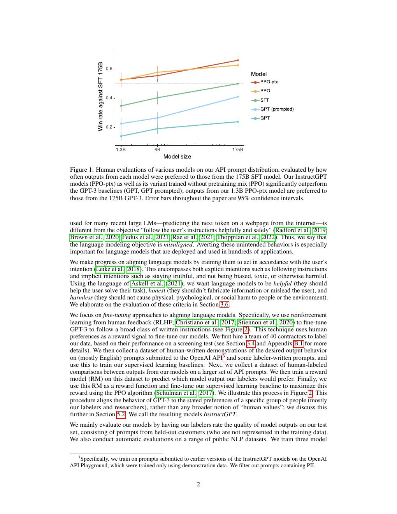
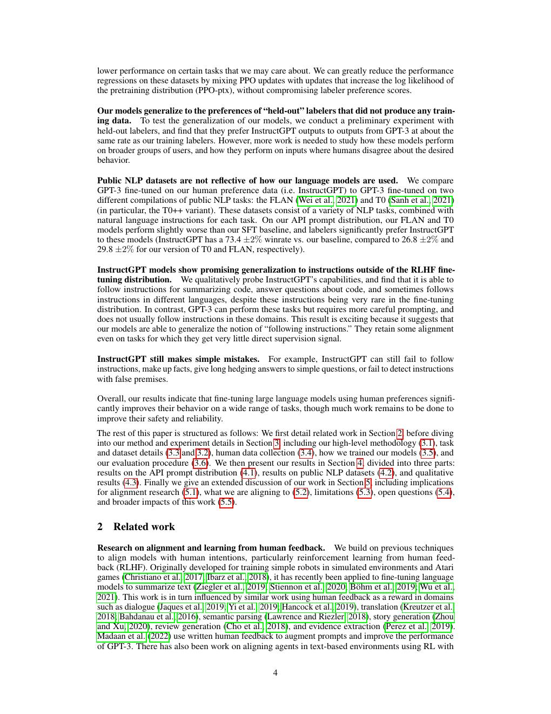
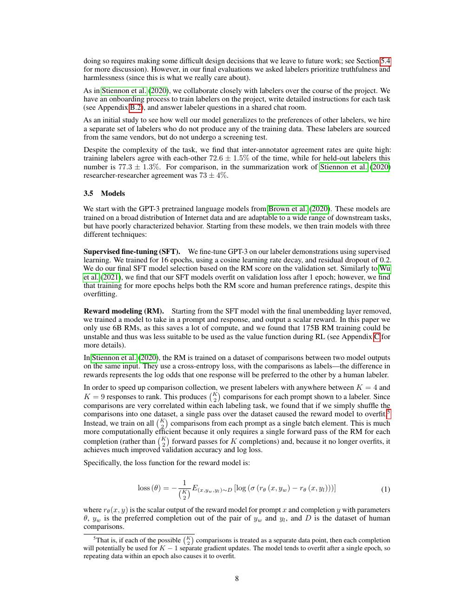
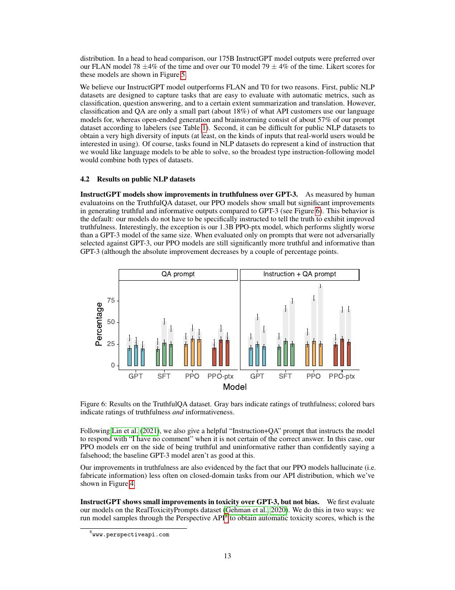
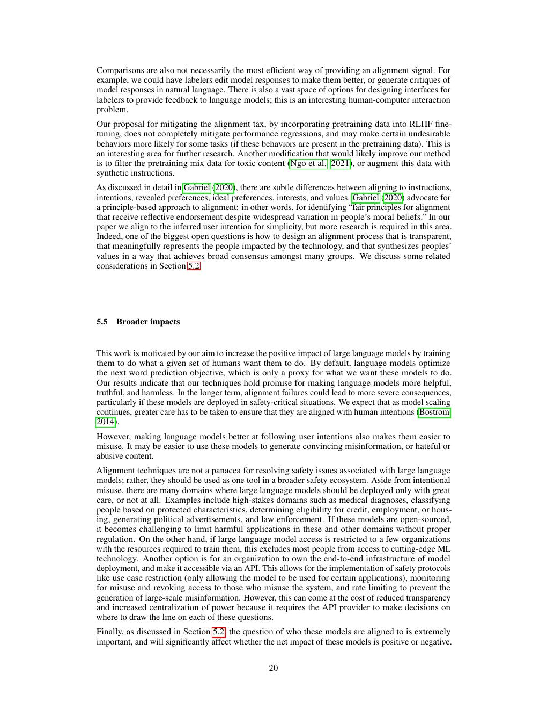

# 论文中文解读：《Training Language Models to Follow Instructions with Human Feedback》

## 一、为什么更大的 GPT-3 不一定更“听话”

预训练目标只要求预测互联网文本的下一个 token，不要求回答用户、承认不确定性或拒绝伤害。模型扩大能提高语言建模和知识能力，却不会自动把“用户真实意图”变成训练目标。InstructGPT 的核心是显式学习一个偏好目标。

论文发表于 2022 年，arXiv:2203.02155。本地有 [PDF](paper.pdf)、[文本](paper.txt) 与 [概要](论文概要.md)。

## 二、人评结果先说明了什么



1.3B InstructGPT 可被标注者偏好于 175B GPT-3。这不表示 1.3B 获得更多世界知识，而表示人评目标更看重相关、清晰、遵循指令与少胡说。参数规模与行为对齐是两个轴。

## 三、Figure 2：现代 RLHF 三阶段



### SFT

人类示范理想回答，模型最大化这些回答的 token likelihood。SFT 提供稳定起点，却受示范数量限制。

### Reward Model

对同一 prompt 采样多份模型输出，由标注者排序。RM 学习为回答打标量分。成对比较比直接打绝对分更容易一致，但只表达被采样候选之间的偏好。

### PPO / PPO-ptx

policy 生成回答，RM 给 reward，PPO 更新 policy。KL penalty 防止策略离 SFT/reference 太远。PPO-ptx 再混入预训练 loss，缓解公开 NLP 能力下降。

## 四、reward model 不是“人类价值函数”

RM 近似的是：在该 prompt 分布、候选分布、标注指南和标注者群体下，哪个输出更受偏好。部署后用户和任务变化会造成分布漂移。policy 还会主动寻找 RM 的盲点，即 reward hacking。

所以训练时要监控 reward 与真实人评是否同时上升；只追 RM 分数通常会过优化。KL penalty 是护栏，但 reference model 本身也不等于正确价值。

## 五、主要结果与 alignment tax



论文在真实 API prompts 上做人评，并测试 TruthfulQA、RealToxicityPrompts 等。InstructGPT 总体更受偏好、更真实、毒性更低，但不会消除幻觉或伤害。

纯 PPO 可能损失部分预训练 benchmark 能力，论文称为 alignment tax。混入 pretraining distribution 的梯度后，PPO-ptx 在保持偏好的同时减少回退。这是多目标优化：

```text
目标 = 人类偏好 reward - β·KL(policy || reference)
     + γ·pretraining likelihood
```

系数变化会移动 helpfulness、稳定性与基础能力的平衡点。

## 六、数据分布决定你对齐了谁



数据来自 OpenAI API 用户 prompts 与标注者撰写 prompts。为避免同一用户模式泄漏到 train/test，论文按 user ID 划分。这个细节比随机切 prompt 更合理。

但标注者仍主要讲英语、拥有特定教育与文化背景。论文诚实指出，它对齐的是一组标注者与研究团队偏好，而非“整个人类”。后来 Constitutional AI 尝试用可审计原则减少逐样本人类 harm labels，但仍需人决定 constitution。

## 七、局限与未解决问题



- RM 对分布外 prompt 的可靠性未知。
- 模型可同时更 helpful、也更会执行有害指令，需要单独 safety objective。
- labeler agreement 不高时，单一标量 reward 会压平真实分歧。
- 人评偏好容易受语气、长度和自信度欺骗。
- PPO 系统复杂，policy/value/RM/reference 同时驻留成本高。

## 八、与 DeepSeek-R1/GRPO 的联系

R1 仍属于“从反馈优化策略”，但在可验证推理任务上，reward 可由答案规则或测试直接给出；GRPO 又取消独立 value model。两者差别不只是 PPO vs GRPO，更关键是 reward 来源：

- InstructGPT：偏好模型近似人类主观评价；
- R1：数学/代码主要使用可验证 outcome reward；
- 开放式 helpfulness/safety 仍需要模型或人类反馈。

## 九、原文入口

[arXiv](https://arxiv.org/abs/2203.02155) · [OpenAI 论文页](https://openai.com/research/instruction-following)


## 原文证据导航

以下页码按仓库内 PDF 的**文件页码**计，不等同于论文印刷页码。建议先读本节所指原文，再回看上面的中文解释。

- [打开原始 PDF](paper.pdf)
- [打开可检索文本](paper.txt)

| 中文笔记中的证据 | 原文位置 | 复核重点 |
|---|---|---|
| 不同规模 SFT/PPO 模型相对 GPT-3 的人类偏好 | [PDF 文件第 2 页](paper.pdf#page=2) · [截图](rendered_figures/page-2.jpg) | 回到该页上下文，复核定义、图表或实验论证 |
| SFT、Reward Model 与 PPO 三阶段流程 | [PDF 文件第 4 页](paper.pdf#page=4) · [截图](rendered_figures/page-4.jpg) | 回到该页上下文，复核定义、图表或实验论证 |
| API prompt 人评、真实性、毒性与公开 benchmark 结果 | [PDF 文件第 8 页](paper.pdf#page=8) · [截图](rendered_figures/page-8.jpg) | 回到该页上下文，复核定义、图表或实验论证 |
| SFT、RM 与 PPO prompt 数据的来源和划分 | [PDF 文件第 13 页](paper.pdf#page=13) · [截图](rendered_figures/page-13.jpg) | 回到该页上下文，复核定义、图表或实验论证 |
| 论文讨论的泛化、标注者代表性与安全局限 | [PDF 文件第 20 页](paper.pdf#page=20) · [截图](rendered_figures/page-20.jpg) | 回到该页上下文，复核定义、图表或实验论证 |
