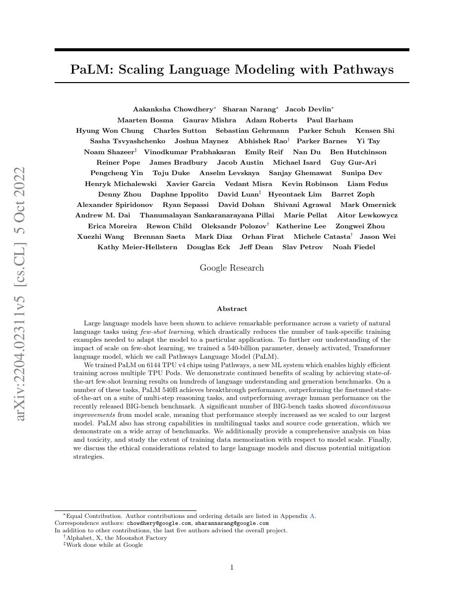
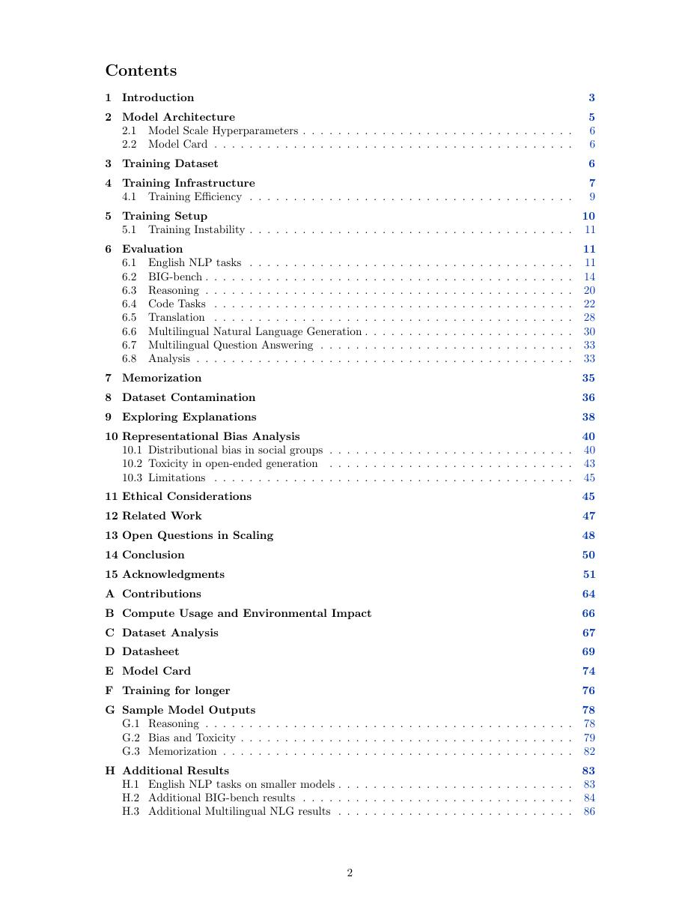
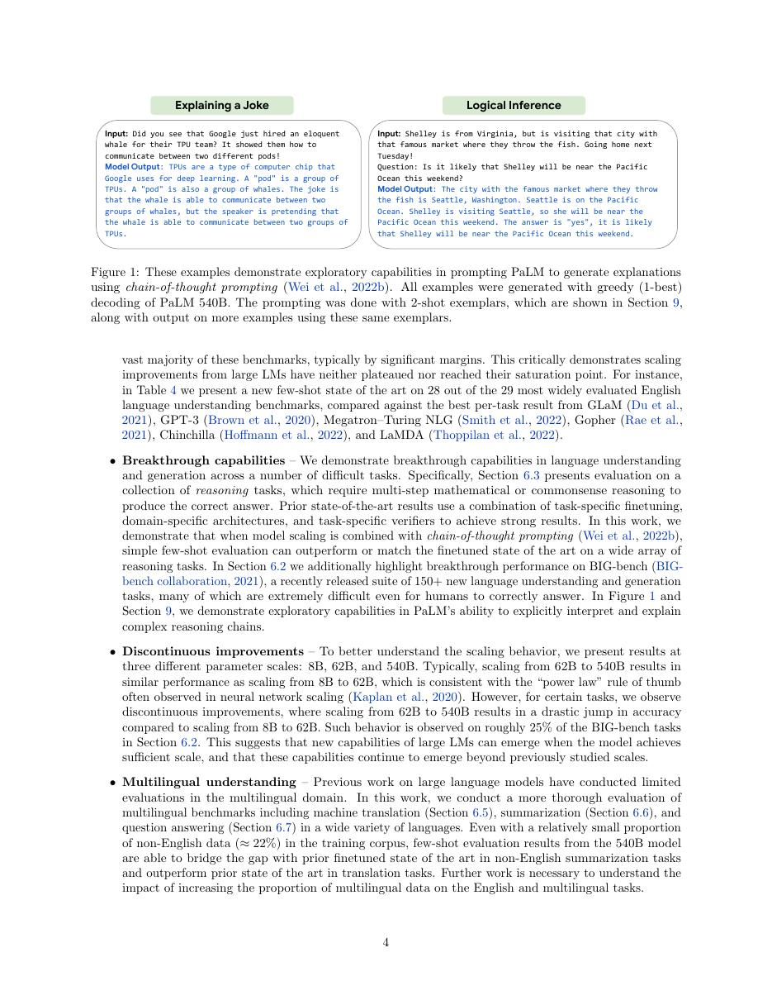
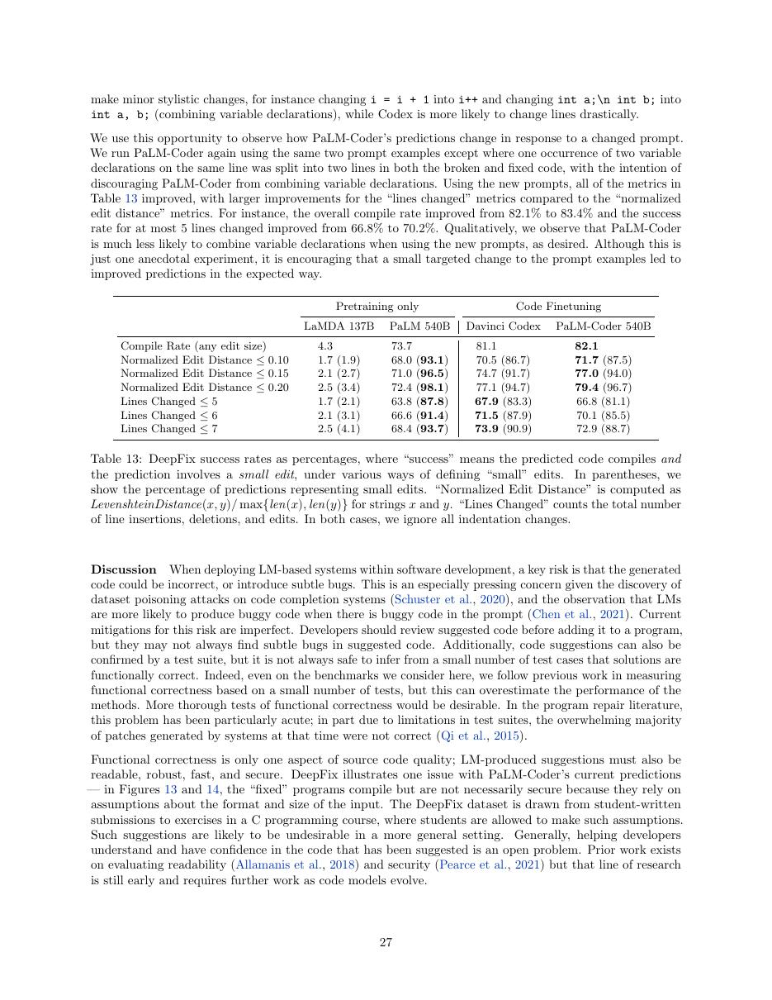

# 论文中文解读：《PaLM: Scaling Language Modeling with Pathways》

## 一、它解决了什么

PaLM 展示 540B dense decoder-only 模型在 Pathways/TPU pod 上扩展，并系统报告 few-shot、推理、代码与多语言能力。

## 二、核心机制

模型采用 SwiGLU、RoPE、parallel attention/FFN 等设计，并以大规模数据并行和模型并行训练。论文把架构、规模、数据和硬件系统作为一个整体，而非只提供参数表。

## 三、为什么成为主线

PaLM 是超大 dense Transformer 时代的重要工业标杆，并使 chain-of-thought 等规模相关能力受到广泛关注。

## 四、证据应该怎样读

速度、显存、精度或 benchmark 数字只在论文给定的模型、数据、硬件、kernel 版本和评测预算下成立。跨论文比较前要统一训练 tokens、输入长度、batch、精度、采样/思考预算与是否使用工具。

## 五、局限与易误读点

权重、完整数据和训练系统未开放；few-shot prompt 与 benchmark contamination 影响可比性。540B dense 参数带来巨大推理和部署成本。

## 六、放进十年演进史

与 Chinchilla 对照规模和 token 配比；与 Switch/DeepSeekMoE 对照 dense 与稀疏激活；与 LLaMA 对照开放权重路线。

## 七、原文入口

[官方论文/页面](https://arxiv.org/abs/2204.02311)

## 八、原文论证链

PaLM 研究超大 decoder-only Transformer 在 Pathways 系统上的规模化训练及能力变化。论文训练到 540B 参数，并在语言理解、生成、推理、代码和多语言任务上用 few-shot/zero-shot 评测。中心主张包含两部分：硬件与并行系统能高效扩展单一模型；随着规模增加，某些任务表现平滑提升，另一些能力在大规模处出现显著跃升。

架构使用 parallel attention/FFN、SwiGLU、RoPE、共享输入输出 embedding 等选择。结果不能只归因参数量：更大训练计算、数据混合和具体训练配方共同变化。

> 原文定位：[PDF 文件第 1 页](paper.pdf#page=1) · [对应截图](rendered_figures/page-1.jpg)

## 九、训练目标与提示评测

模型仍最大化自回归似然
$$
\sum_t\log p(x_t\mid x_{<t}).
$$
few-shot 评测把若干输入—答案示例放进上下文，不更新参数。chain-of-thought 结果则通过在示例中展示中间推理文本，诱导模型继续产生推理步骤。它证明特定提示可释放能力，不证明生成的每一步都是忠实内部因果过程。

parallel block 让 attention 与 FFN 从同一归一化输入并行计算后相加，有利于大规模效率；这与经典串行 Transformer block 有差异。

> 原文定位：[PDF 文件第 2 页](paper.pdf#page=2) · [对应截图](rendered_figures/page-2.jpg)

## 十、实验怎样读

应按模型规模看曲线，而非只看 540B 单点。BIG-bench、GSM8K、代码任务的跃升用于讨论“breakthrough capabilities”，但少量 benchmark 上的非线性也可能受指标阈值、提示和方差影响。污染分析、偏见和毒性评估是结论边界的一部分。

> 原文定位：[PDF 文件第 4 页](paper.pdf#page=4) · [对应截图](rendered_figures/page-4.jpg)

## 十一、复现检查

- 固定并公开 few-shot exemplar、顺序、答案解析和打分规则。
- 训练数据混合、语言比例、去重与评测污染检查不可省略。
- 并行效率要同时报告芯片数、利用率、通信与故障恢复。
- scaling 对比需区分参数规模、训练 token 和总 FLOPs。

## 十二、常见误读

PaLM 的“涌现”是经验曲线描述，不是已经证明的相变定律。few-shot 能力也不等于模型权重中存有可靠数据库；事实错误、偏见和提示敏感性仍被论文明确展示。

> 原文定位：[PDF 文件第 27 页](paper.pdf#page=27) · [对应截图](rendered_figures/page-27.jpg)

## 原文证据导航

以下页码按仓库内 PDF 的**文件页码**计，不等同于论文印刷页码。建议先读本节所指原文，再回看上面的中文解释。

- [打开原始 PDF](paper.pdf)
- [打开可检索文本](paper.txt)

| 中文笔记中的证据 | 原文位置 | 复核重点 |
|---|---|---|
| 原文首页、摘要与问题定义 | [PDF 文件第 1 页](paper.pdf#page=1) · [截图](rendered_figures/page-1.jpg) | 回到该页上下文，复核定义、图表或实验论证 |
| 核心方法、架构或算法定义所在关键页 | [PDF 文件第 2 页](paper.pdf#page=2) · [截图](rendered_figures/page-2.jpg) | 回到该页上下文，复核定义、图表或实验论证 |
| 实验、结果或关键分析所在原文页 | [PDF 文件第 4 页](paper.pdf#page=4) · [截图](rendered_figures/page-4.jpg) | 回到该页上下文，复核定义、图表或实验论证 |
| 讨论、结论或补充分析所在原文页 | [PDF 文件第 27 页](paper.pdf#page=27) · [截图](rendered_figures/page-27.jpg) | 回到该页上下文，复核定义、图表或实验论证 |
