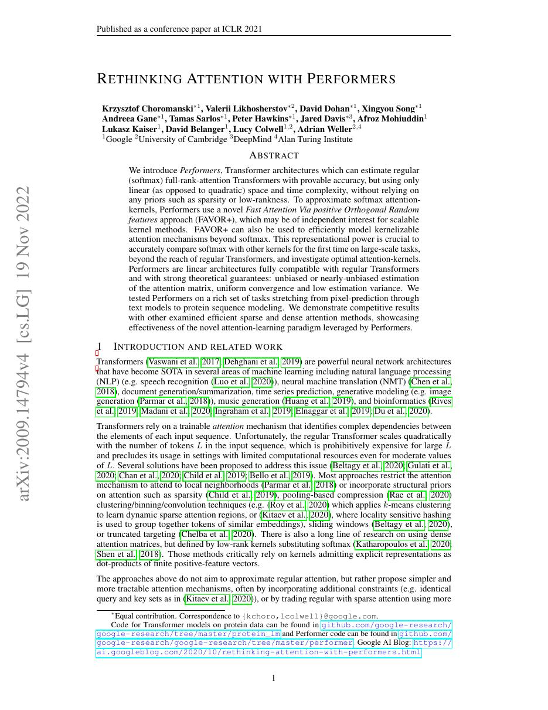
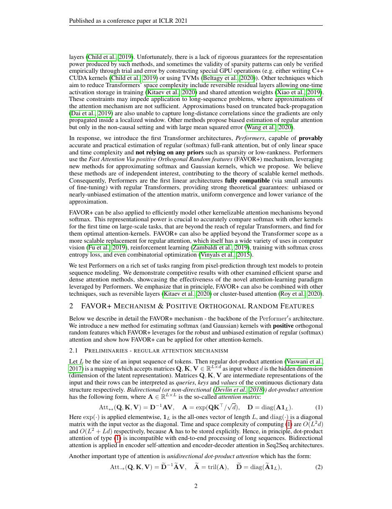
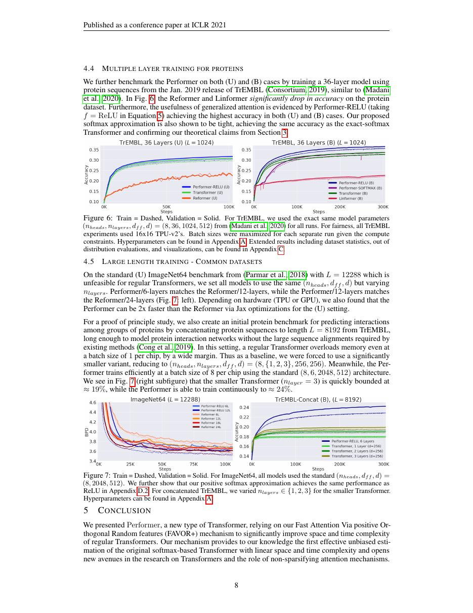
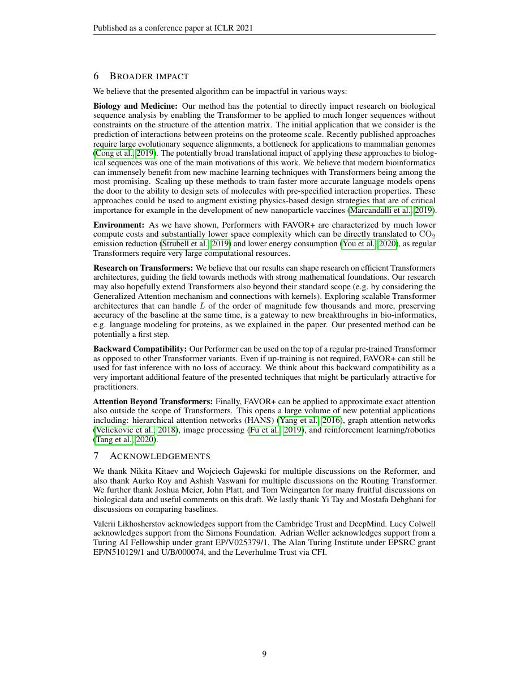

# 论文中文解读：《Rethinking Attention with Performers》

## 一、它解决了什么

Performer 用 FAVOR+ 正随机特征近似 softmax attention kernel，把二次 attention 改写为可结合的线性计算。

## 二、核心机制

将 exp(qᵀk) 近似为 φ(q)ᵀφ(k)，先累计 φ(K)ᵀV，再乘 φ(Q)，避免显式 n×n 矩阵。正交随机特征降低方差，causal 情况用 prefix sums。

## 三、为什么成为主线

它展示 kernelization 可在不固定稀疏图的情况下线性化 attention，并影响后续 recurrent/linear attention 研究。

## 四、应该怎样读证据

论文里的结果首先证明方法在当时数据、模型规模、硬件和评测协议下成立。跨年代比较时要统一参数量、训练 tokens、数据质量、上下文长度、推理预算与系统实现，不能只横比单个最佳分数。

## 五、局限与易误读点

这是近似注意力，随机特征数控制误差、显存和速度；数值稳定、causal kernel 实现和短序列常数开销都重要。近似误差可能在深层累积。

## 六、放进十年演进史

与 Linformer 的低秩投影、Longformer/BigBird 的稀疏图、FlashAttention 的精确 IO-aware 算法并列阅读。

## 七、原文入口

[官方论文/页面](https://arxiv.org/abs/2009.14794)

## 八、原文论证链

Performer 不改变可见性图，而是近似 softmax attention 的核。若相似度核可写成特征内积
$$
\exp(q^\top k)\approx \phi(q)^\top\phi(k),
$$
便可利用结合律先计算 $\phi(K)^\top V$，避免构造 $n\times n$ 矩阵。作者提出 FAVOR+：使用正值随机特征近似指数核，并用正交化降低估计方差。

这与“直接去掉 softmax”不同；目标是以随机特征逼近原 softmax kernel。近似误差由随机特征数、数值稳定化和输入分布共同决定。论文同时给出无偏/一致性分析和多任务实验。

> 原文定位：[PDF 文件第 1 页](paper.pdf#page=1) · [对应截图](rendered_figures/page-1.jpg)

## 九、线性化公式

令
$$
A_{ij}=\exp(q_i^\top k_j).
$$
标准归一化输出为
$$
Y=D^{-1}AV,\quad D=\operatorname{diag}(A\mathbf1).
$$
用 $\phi(Q)\phi(K)^\top$ 近似 $A$ 后：
$$
Y\approx
\frac{\phi(Q)\left(\phi(K)^\top V\right)}
{\phi(Q)\left(\phi(K)^\top\mathbf1\right)}.
$$
括号中的两项可先沿序列聚合，成本约 $O(nrd)$，$r$ 为随机特征数。因果版本用前缀累积保证位置 $t$ 只使用 $j\le t$。

> 原文定位：[PDF 文件第 2 页](paper.pdf#page=2) · [对应截图](rendered_figures/page-2.jpg)

## 十、实验怎样读

图像、文本、蛋白质等任务用于证明方法不是只在单一语言 benchmark 有效；与 exact attention 的近似误差和下游质量共同验证 FAVOR+。速度/内存优势随序列变长更明显。必须同时看同等质量下的 $r$，因为过小特征数虽然快，却可能改变模型。

> 原文定位：[PDF 文件第 8 页](paper.pdf#page=8) · [对应截图](rendered_figures/page-8.jpg)

## 十一、复现检查

- 使用论文的正随机特征映射及稳定化，普通正弦 RFF 不能直接等价。
- softmax 分母必须同时近似；漏掉归一化就变成另一种线性 attention。
- 因果实现需用 prefix scan，禁止把未来 K/V 加入全局和。
- 对多个随机 seed 报告方差，并扫描随机特征维度 $r$。

## 十二、常见误读

Performer 的线性是对序列长度而言，仍依赖 head dimension 和随机特征数。它不是精确重排 softmax，而是统计近似；“理论无偏”也不表示一次有限随机映射没有误差。

> 原文定位：[PDF 文件第 9 页](paper.pdf#page=9) · [对应截图](rendered_figures/page-9.jpg)

## 原文证据导航

以下页码按仓库内 PDF 的**文件页码**计，不等同于论文印刷页码。建议先读本节所指原文，再回看上面的中文解释。

- [打开原始 PDF](paper.pdf)
- [打开可检索文本](paper.txt)

| 中文笔记中的证据 | 原文位置 | 复核重点 |
|---|---|---|
| 原文首页、摘要与问题定义 | [PDF 文件第 1 页](paper.pdf#page=1) · [截图](rendered_figures/page-1.jpg) | 回到该页上下文，复核定义、图表或实验论证 |
| 核心方法、架构或算法定义所在关键页 | [PDF 文件第 2 页](paper.pdf#page=2) · [截图](rendered_figures/page-2.jpg) | 回到该页上下文，复核定义、图表或实验论证 |
| 实验、结果或关键分析所在原文页 | [PDF 文件第 8 页](paper.pdf#page=8) · [截图](rendered_figures/page-8.jpg) | 回到该页上下文，复核定义、图表或实验论证 |
| 讨论、结论或补充分析所在原文页 | [PDF 文件第 9 页](paper.pdf#page=9) · [截图](rendered_figures/page-9.jpg) | 回到该页上下文，复核定义、图表或实验论证 |
