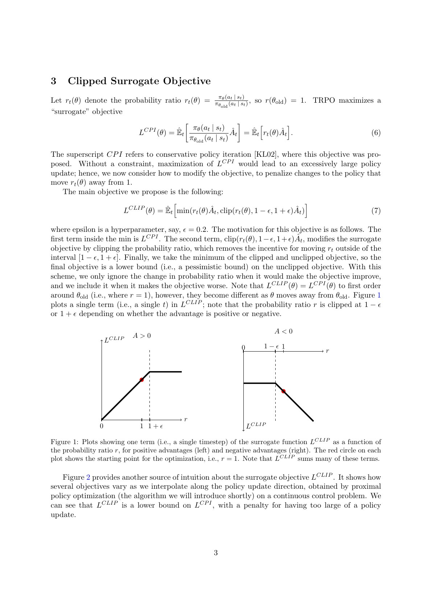
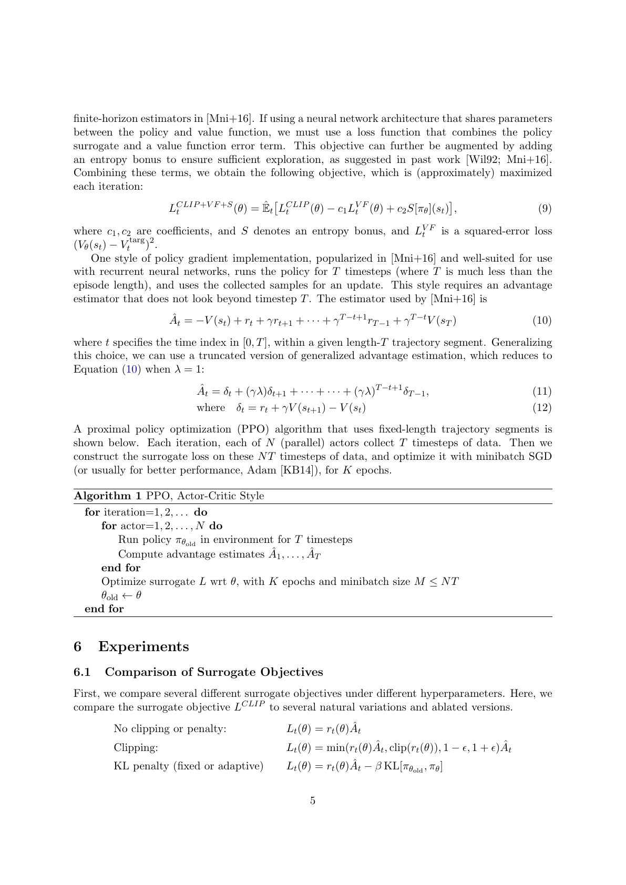
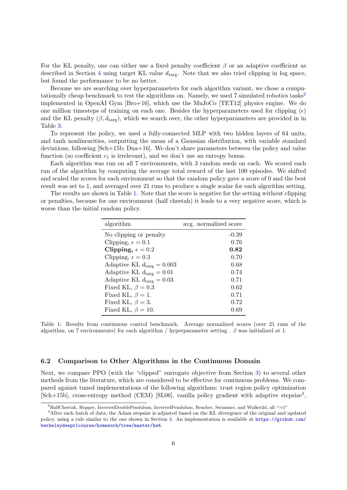
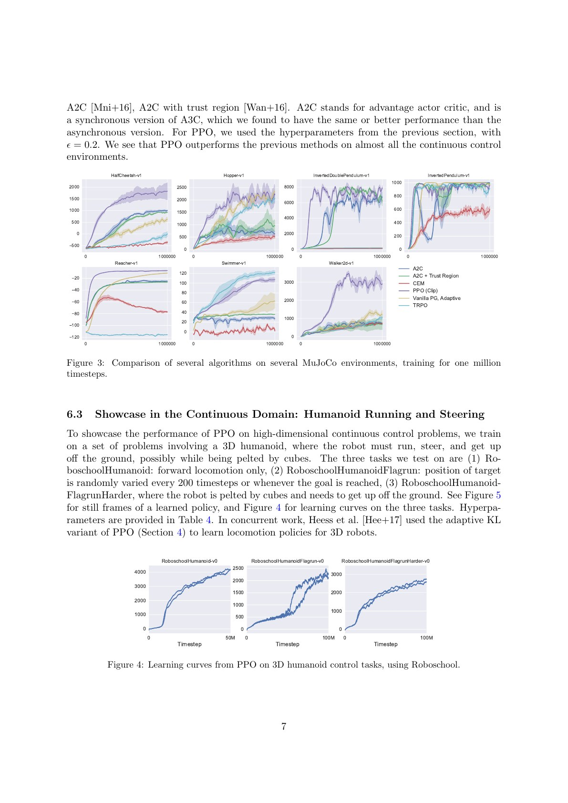
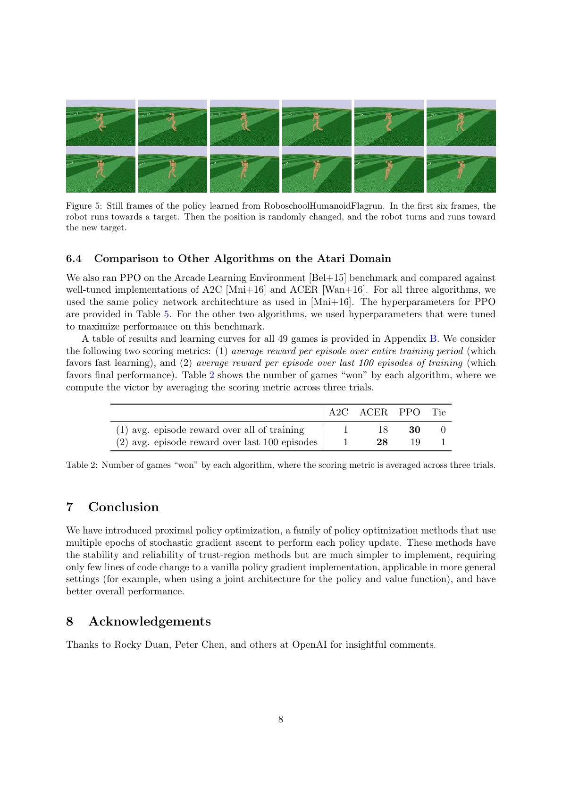
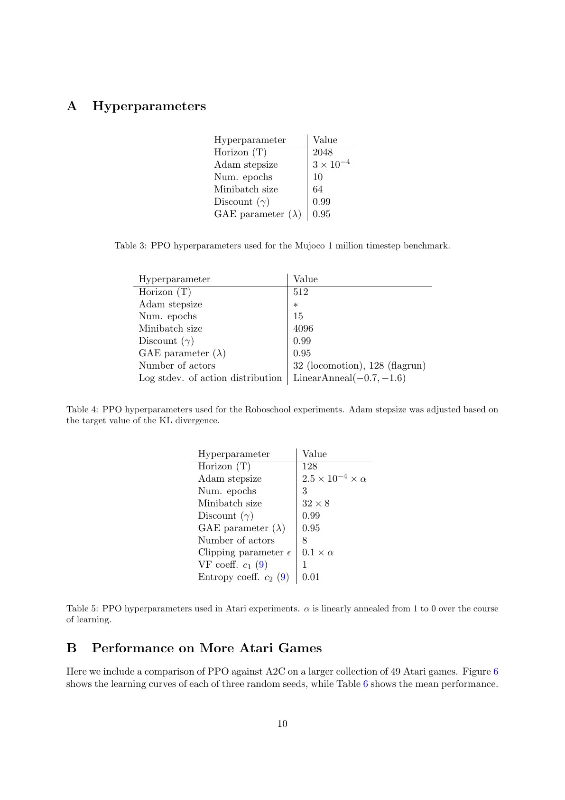

# 论文中文解读：Proximal Policy Optimization Algorithms

> 原文：[Proximal Policy Optimization Algorithms](https://arxiv.org/abs/1707.06347)
>
> John Schulman、Filip Wolski、Prafulla Dhariwal、Alec Radford、Oleg Klimov，2017，本文使用 arXiv v2。
>
> 本地材料：[`PDF`](paper.pdf) · [`全文`](paper.txt) · [`论文概要`](论文概要.md)

## 0. PPO 真正要修的故障

标准 policy gradient 的样本梯度为：

$$
\hat g=\hat{\mathbb E}_t[
\nabla_\theta\log\pi_\theta(a_t\mid s_t)\hat A_t].
$$

如果用同一批轨迹做很多轮 SGD，策略会越来越偏离生成数据的旧策略，原来的梯度估计逐渐失效；某些动作概率会被成倍放大或压低，导致性能突然崩坏。TRPO 用平均 KL 约束和二阶近似控制更新，但实现复杂，也不易与共享参数、dropout 等结构结合。

PPO 的设计问题是：能否只改 loss、仍用 Adam/minibatch SGD，却保留“更新不要太远”的主要效果？

## 1. 从 TRPO 到概率比率

TRPO 的 surrogate objective 是：

$$
\hat{\mathbb E}_t\left[
\frac{\pi_\theta(a_t\mid s_t)}
{\pi_{\theta_{\rm old}}(a_t\mid s_t)}\hat A_t
\right],
$$

并约束旧策略到新策略的平均 KL 不超过 $\delta$。定义

$$
r_t(\theta)=
\frac{\pi_\theta(a_t\mid s_t)}
{\pi_{\theta_{\rm old}}(a_t\mid s_t)},
$$

则无约束目标是 $r_t\hat A_t$。如果 $\hat A_t>0$，优化器希望提高该动作概率；若 $\hat A_t<0$，则希望降低它。问题是线性收益不会自行停止。

## 2. Clipped objective 逐象限理解

PPO-Clip 为：

$$
L^{\mathrm{CLIP}}(\theta)=
\hat{\mathbb E}_t\left[
\min\left(
r_t(\theta)\hat A_t,
\operatorname{clip}(r_t(\theta),1-\epsilon,1+\epsilon)\hat A_t
\right)
\right].
$$

逐种情况读：

- $\hat A_t>0$：提高动作概率是有利更新；当 $r_t>1+\epsilon$ 后，继续提高不再增加目标。
- $\hat A_t<0$：降低动作概率是有利更新；当 $r_t<1-\epsilon$ 后，继续降低不再增加目标。
- 若更新方向让目标变坏，`min` 不会替你截掉惩罚；这正是“悲观”部分。

因此，clipping 不是把 $r_t$ 永远裁进区间后再算 loss，也不是所有越界样本梯度都为零。它只移除越界后继续获得有利收益的激励。

论文常用 $\epsilon=0.2$ 作直觉示例，但实验参数并非所有领域统一：MuJoCo 使用 0.2，Atari 的初始 clipping 参数为 0.1 并随训练退火。

## 3. clipping 与 trust region 的差别

PPO 经常被概括为“简单版 TRPO”，但两者的约束对象不同：

- TRPO 直接约束状态分布上的平均 KL；
- PPO-Clip 对采样到的每个动作概率比构造分段目标；
- 未采样动作的概率变化不会被该样本直接约束；
- 共享归一化使一个动作概率变化会牵动其余动作；
- 多轮 minibatch 更新后，最终 KL 不由 $\epsilon$ 唯一决定。

所以 clipping 只是产生 trust-region-like 行为的启发式 surrogate，不提供严格 KL 上界，也没有论文中 TRPO 理论对应的单调改进保证。

## 4. 完整 actor-critic 算法

完整目标组合三部分：

$$
L_t^{\mathrm{CLIP+VF+S}}(\theta)=
\hat{\mathbb E}_t\left[
L_t^{\mathrm{CLIP}}(\theta)
-c_1(V_\theta(s_t)-V_t^{\rm targ})^2
+c_2\mathcal H[\pi_\theta](s_t)
\right].
$$

- policy surrogate 负责策略改进；
- value loss 学 baseline，降低优势估计方差；
- entropy bonus 防止策略过早塌缩。

论文采用截断 GAE：

$$
\delta_t=r_t+\gamma V(s_{t+1})-V(s_t),
$$

$$
\hat A_t=\delta_t+(\gamma\lambda)\delta_{t+1}+\cdots.
$$

每轮 $N$ 个并行 actor 各采 $T$ 步，得到 $NT$ 个样本；再进行 $K$ 个 epoch 的随机 minibatch 优化。这里的“样本复用”只发生在当前 batch 内。下一轮必须用更新后的策略重新采样，因此 PPO 仍然是 on-policy。

## 5. adaptive KL 是另一种 PPO

论文还给出自适应 KL penalty：

$$
L^{\mathrm{KLPEN}}=
\hat{\mathbb E}_t[r_t\hat A_t-\beta D_{KL}(\pi_{old},\pi_\theta)].
$$

若实际 KL 低于目标的 $1/1.5$，就把 $\beta$ 减半；若高于目标的 1.5 倍，就把 $\beta$ 加倍。它比固定 penalty 更能适应训练阶段变化，但 Table 1 中仍逊于 clipped objective。后来的工程实现有时同时用 clip、KL 监控和 KL early stopping，这已经是实用扩展，不是论文唯一算法。

## 6. Table 1：clipping 是否真的必要

7 个 MuJoCo 环境、每个 3 个 seed、每项 1M timesteps。各环境先把随机策略映射到 0、最好结果映射到 1，再对 21 次运行求平均：

| 目标 | 设置 | 平均归一化分数 |
| --- | --- | ---: |
| 无 clipping/penalty | — | -0.39 |
| clipping | $\epsilon=0.1$ | 0.76 |
| clipping | $\epsilon=0.2$ | **0.82** |
| clipping | $\epsilon=0.3$ | 0.70 |
| adaptive KL | 最好设置 | 0.74 |
| fixed KL | 最好设置 | 0.72 |

无约束版本在 HalfCheetah 上甚至比随机策略差，直接支持“对同一 batch 多轮优化需要近端限制”。但 Table 1 同时承担超参数搜索与算法比较，且只有 3 个 seed；它能说明 clipping 在这套协议中有效，不能证明 $\epsilon=0.2$ 是通用最优。

## 7. 连续控制与 humanoid 应用

Figure 3 比较 PPO-Clip、TRPO、A2C、带 trust region 的 A2C、CEM 与自适应步长 vanilla PG。论文称 PPO 在几乎所有环境上最好。需注意这是当时实现之间的比较；深度 RL 对代码细节、归一化和超参数非常敏感，不能把曲线读成算法家族的永久排序。

RoboschoolHumanoid、Flagrun 和 FlagrunHarder 展示 PPO 能在高维连续动作中学会跑向变化目标、转向、受到方块撞击后起身。它证明并行 on-policy 优化能扩展到复杂模拟控制，不证明真实机器人可直接部署。

## 8. Atari 结果：两个指标给出不同赢家

49 个 Atari 游戏上，论文比较 A2C、ACER、PPO：

- 按全训练期 episode 平均回报，PPO 赢 30 个、ACER 赢 18 个，说明 PPO 学得快；
- 按最后 100 episodes 平均回报，PPO 赢 19 个、ACER 赢 28 个，说明 ACER 在更多游戏上终局分数高。

这组结果很好地提醒我们：“样本效率”“最终性能”“稳定性”是不同指标。只引用“PPO 赢 30/49”而不说明计分方式，会误导为 PPO 全面压过 ACER。

## 9. 超参数表也是算法的一部分

MuJoCo 主设置为 horizon 2048、Adam $3\times10^{-4}$、10 epochs、minibatch 64、$\gamma=0.99$、$\lambda=0.95$。Atari 则为 horizon 128、8 actors、3 epochs，学习率和 clipping 随 $\alpha$ 从 1 线性退火到 0。

复现时至少还应明确：

- observation 与 advantage 是否归一化；
- policy/value 是否共享网络；
- value target、value clipping 与 loss coefficient；
- action distribution 的方差参数化；
- batch 打乱方式、梯度裁剪与 KL early stopping；
- time-limit truncation 是 bootstrap 还是 terminal；
- 每个“step”是环境 frame、action repeat 后 step，还是优化 update。

后来的 PPO 实现差异很大，常见的 value clipping、normalized advantages 等并不都由这篇短论文完整规定。

## 10. PPO 为什么适合 RLHF，但公式并不等于 RLHF

PPO 只解决“怎样稳定地更新策略”。在 RLHF 中通常还需：

- 奖励模型给序列打分；
- reference policy 的 KL penalty 限制语言模型偏离 SFT 初始化；
- token/sequence 级 advantage 与 value model；
- 长度偏差、reward normalization、采样和拒答处理。

RLHF 中对 reference model 的 KL 与原论文中 old/new policy 的 proximal 关系不同：前者是保持行为接近参考模型的持续正则，后者是控制相邻更新步。二者可以同时存在，不能混为一谈。

## 11. 最终结论

PPO 的成功来自一个务实判断：与其精确解一个二阶约束问题，不如构造一个在坏方向保留惩罚、在好方向越界后停止奖励的目标，再用成熟的一阶优化器多轮训练。它牺牲了严格 trust-region 保证，换来极低实现门槛、对离散/连续动作和共享架构的兼容性。

正确评价不是“PPO 永远最好”，而是：当环境采样可以并行、稳定性比极致样本复用更重要时，PPO 提供了很强的默认基线；若真实交互昂贵，SAC 一类 off-policy 方法通常更值得比较。
