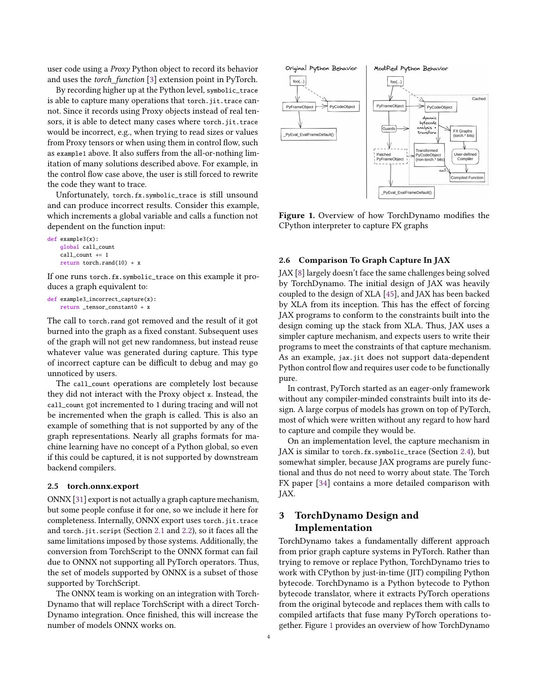
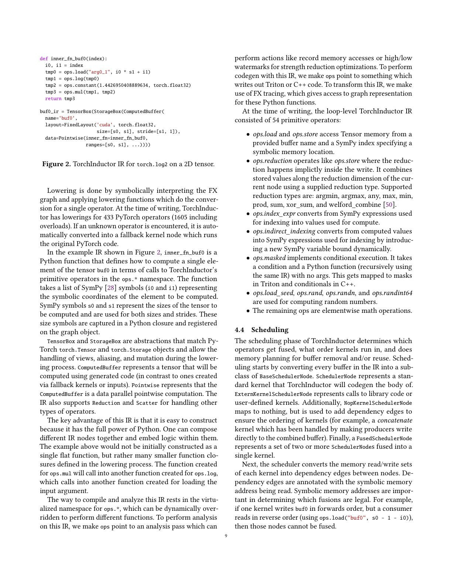
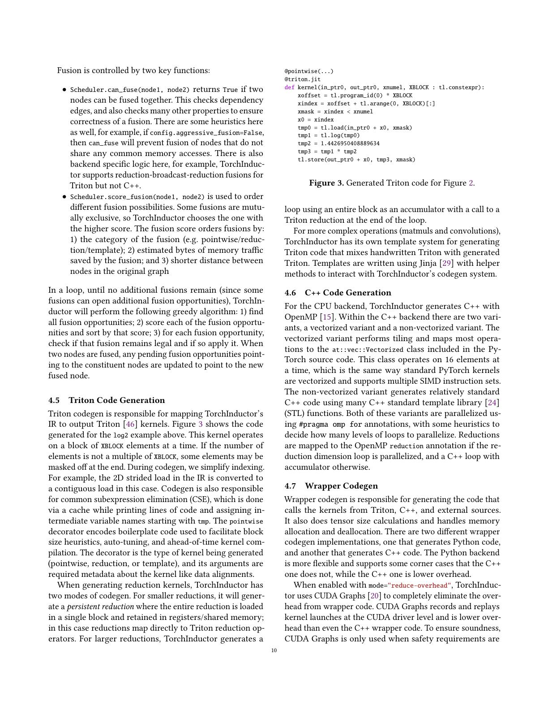
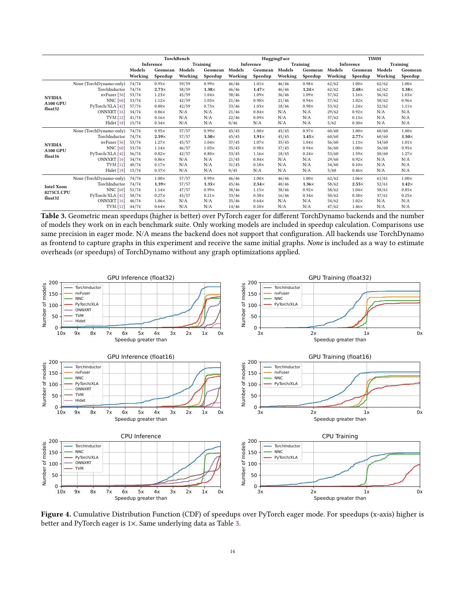
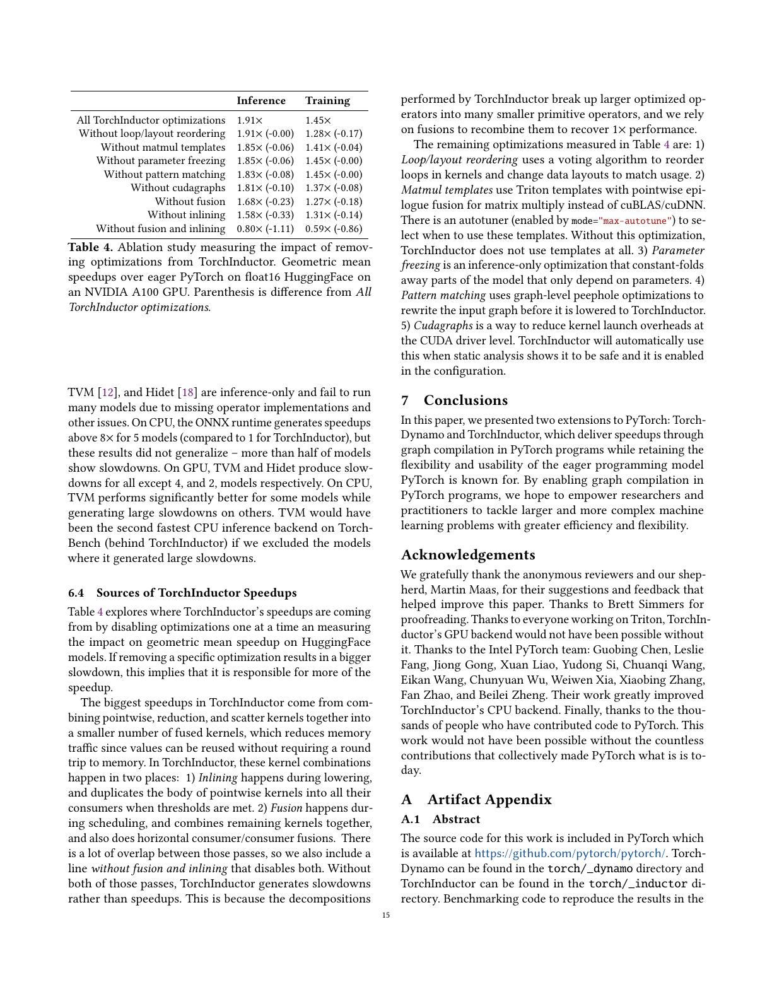

# 论文中文解读：《PyTorch 2: Faster Machine Learning Through Dynamic Python Bytecode Transformation and Graph Compilation》

## 一、先给结论

PyTorch 2 的突破不是发明了某一种 kernel 优化，而是把一个长期被认为很难兼得的组合做成了实用系统：

- 用户继续写动态、命令式、可调试的 Python；
- 编译器在运行时捕获能可靠编译的区域；
- 遇到不支持的行为可以局部退出，而非整个模型报废；
- 后端把大量细粒度算子融合，并在 GPU 上生成 Triton kernel。

论文报告 NVIDIA A100 上、180 余个真实模型的整体几何平均加速约为推理 2.27×、训练 1.41×。这个数字属于 **TorchDynamo + AOTAutograd + decomposition + TorchInductor + Triton/CUDA Graphs/模板** 的完整系统，不是 Triton 单独的加速比。

论文由 Jason Ansel 等人发表于 ASPLOS 2024，DOI `10.1145/3620665.3640366`。本地材料包括 [PDF](paper.pdf)、[提取文本](paper.txt) 与 [概要](论文概要.md)。

## 二、为什么动态图一直难编译

PyTorch eager 的吸引力来自 Python 本身：控制流、列表、对象、模块属性、调试器和第三方库可以自由混用。传统图系统通常要求用户预先构造静态图，或只接受受限 Python 子集。

编译器若试图一次性捕获整个程序，会遇到：

- 数据依赖的 Python 分支；
- 张量值转成 Python `bool`、`int` 或列表；
- 模块属性和全局状态可能变化；
- alias、view、in-place mutation 语义复杂；
- 训练还要生成反向图并处理保存/重算；
- shape、stride 和 dtype 可能在调用之间变化。

PyTorch 2 的策略不是证明所有 Python 都能静态编译，而是让编译与 eager 共存。能够捕获的部分交给后端；无法安全建模的地方 graph break，执行原 Python 后再继续捕获。

## 三、第 3 节：TorchDynamo 如何从 Python 中拿到图



### 3.1 入口在 CPython frame evaluation

TorchDynamo 使用 CPython 的 frame evaluation hook，在一个 frame 的 bytecode 正式执行前接管它。它符号执行 Python bytecode，遇到 PyTorch 张量操作时记录 FX graph，同时追踪栈、局部变量和对象属性。

这比仅在 `torch.*` operator 层拦截更有上下文，因为 Dynamo 看得到控制流和 Python 对象；又比要求用户改写成一门图语言更兼容，因为源程序仍是普通 Python。

### 3.2 Guards 是“这份图何时仍然有效”的合同

捕获时，Dynamo 会依据当次执行作出假设，例如：

- 某个对象仍是同一 module/type；
- 一个全局函数没有被替换；
- tensor 的 dtype、device、rank 或某些 shape 条件符合要求；
- 某个 Python 分支条件仍取同一方向。

这些假设被编码为 guards。下一次调用若 guards 通过，可以复用已编译图；失败则重新捕获/编译或 fallback。

因此动态图编译的真实性能不只看 kernel latency，还要看 shape 是否稳定、guards 是否频繁失效、缓存能否命中。论文中的稳态 benchmark 不等同于每次输入都触发编译的服务负载。

### 3.3 Graph break 是兼容性机制，也是一种性能边界

碰到不支持的 Python 行为时，Dynamo 可先编译已有子图，回到解释器执行那段行为，再从后续位置继续。这避免了“一个不支持算子导致整个模型无法编译”的 all-or-nothing 失败。

常见 graph break 来源包括：

- 使用论文当时未支持的 NumPy/第三方库；
- `tolist()` 等张量到 Python 值的转换；
- 数据依赖控制流；
- 某些副作用或难以 guard 的对象行为。

但 graph break 会缩小可融合范围、增加 launch/dispatch，并可能让中间张量落回全局内存。正确运行不代表性能仍好。

### 3.4 字节码改写与 resume function

Dynamo 不只是“旁路记录”operator。它生成新的 Python bytecode，把捕获区域替换为调用已编译函数，并为 graph break 后的状态构造恢复执行路径。这样既复用 CPython 的语义，又把图区域交给后端。

这是论文标题中 “Dynamic Python Bytecode Transformation” 的实质。

## 四、AOTAutograd：训练图怎样进入同一后端

训练比推理多出反向传播、保存激活和 mutation 等问题。AOTAutograd 在编译阶段运行 autograd tracing，生成可进一步编译的 forward/backward graph。

它还用 min-cut 思路权衡：哪些中间值在前向保存，哪些在反向重算。保存更多占显存，重算更多耗计算；编译器能在整张联合图上做选择。

在进入 TorchInductor 前，还会进行 functionalization 和 decomposition：

- functionalization 尽量把 mutation/view 等复杂别名语义转成更易分析的函数式形式；
- decomposition 把复杂 ATen operator 展开成较小的核心算子。

论文快照中有 191 个 decomposition，覆盖 387 个 overload。这个数字说明工程规模，不应当成今天版本的固定清单。

## 五、第 4 节：TorchInductor 的设计原则



论文强调三条设计原则。

### 5.1 PyTorch-native

IR 必须能承接真实 PyTorch 的 stride、view、alias、mutation 和动态 shape，而不是只优化干净的连续张量。否则前端覆盖再高，落到后端仍会大量失败。

### 5.2 Python-first

Inductor 本身大量用 Python 实现，方便直接调用 SymPy 处理符号索引，也便于与 PyTorch 的 dispatch、decomposition 和调试基础设施集成。编译器不一定要把每一层都写成静态 C++ IR 才能高效，因为 Python 运行在编译期，不在 kernel 热路径。

### 5.3 Breadth-first

先覆盖广泛 operator 与模型，再逐步优化，而不是只让少数 benchmark 极快。对不认识的算子允许 fallback 到现有 PyTorch kernel，使系统可渐进部署。

这一原则解释了为什么 PyTorch 2 比一些更激进的全图编译器更容易运行真实模型，也解释了为什么 fallback 边界需要在性能分析中单独检查。

## 六、Loop-level define-by-run IR

Inductor 把输出元素的计算表示成 Python closure。closure 接收符号索引，内部调用约 54 个 primitive op；索引表达式由 SymPy 表示。

例如二维 `log2` 可被理解为：

```text
for i0, i1:
    x = load(input, index(i0, i1, strides))
    y = log(x) * constant(1 / ln(2))
    store(output, index(i0, i1), y)
```

真正 IR 不需要立刻决定循环顺序、GPU block 或向量宽度。调度和 codegen 可以在保留符号 shape/stride 的情况下重排。

### 6.1 为什么 primitive 集合要小

PyTorch 有大量 operator 与 overload。若每个后端各自实现所有高层算子，维护成本极高。decomposition 把它们展开为 pointwise、reduction、scatter 等更小语义，Inductor 只需围绕小 primitive 集合建立融合和代码生成。

代价是分解会把一个原本高度优化的复合算子拆成许多小操作。如果后续融合失败，性能可能比 eager 更差。论文消融恰好验证了这一点。

## 七、Scheduler：融合不是越多越好

Inductor 先从 load/store 建立依赖关系，再判断两个节点是否可以合法融合。合法之后还要用启发式排序，考虑：

- 是 pointwise、reduction 还是 template；
- 融合能省多少内存读写；
- 两节点在原始图中距离多远；
- 融合是否引入重复计算、过大 kernel 或不利调度。

两种重要机制是：

- **inlining**：在 lowering 阶段把 pointwise producer 的计算体复制进 consumer；
- **fusion**：在 scheduler 阶段合并剩余 kernel，也可做 horizontal consumer-consumer fusion。

它们都在减少中间张量往返全局内存，但位置与实现不同，作用有重叠。

## 八、第 4.5 节：怎样生成 Triton



### 8.1 Block 化与索引

Inductor 把循环迭代域映射为 Triton program grid。一个 program 产生一组 block index，通过 mask 处理尾部。符号索引被化简后输出为 pointer arithmetic。

生成器还会做 common subexpression elimination，避免重复计算同一索引或中间表达式。

### 8.2 Reduction

小 reduction 可以常驻一个 Triton program 内，直接使用 Triton reduction primitive。更大的 reduction 可能需要分段循环或多阶段实现。选择会影响并行度、寄存器压力和同步成本。

### 8.3 Template

纯自动 loop codegen 并不擅长所有 GEMM/conv。Inductor 因而使用 Jinja template，把手写 Triton 骨架与自动生成的 pointwise epilogue 组合。模板可与 cuBLAS/cuDNN 等候选一起由 autotuner 选择。

这是一种实用混合设计：编译器自动处理广泛融合，专家模板覆盖少数高价值结构。论文不能支持“Inductor 完全摆脱手写优化”的说法。

### 8.4 为什么选 Triton

论文给出的核心理由是：Triton 已证明用较简洁的 block-level 代码可以达到或超过手写库的某些实现，并让 backend 免于直接生成复杂 thread-level CUDA。

从系统分层看，Inductor 决定“融合哪些循环、逻辑索引是什么”，Triton 决定“这个 block 怎样映射到 GPU 线程和内存层级”。两层优化必须配合。

## 九、CPU 路径与 wrapper

TorchInductor 并不只等于 Triton。CPU 端生成 C++，使用 OpenMP 并行和向量化；外层 wrapper 负责内存规划、调用 Triton/C++/外部 kernel。

在 `reduce-overhead` 一类模式中，还可安全时使用 CUDA Graphs 降低 driver launch overhead。这部分加速同样不能算到 Triton kernel 算力上。

## 十、动态 shape

论文使用 symbolic shape 与 stride，让一份图覆盖一组输入。系统会先对实际值建立 hint，用于需要具体分支的编译决策，同时保留符号表达以生成 guards 和动态索引。

动态并非无限制：有的优化要求特定整除或上界；shape 范围变化可能触发 recompile；过度泛化也可能让 kernel 无法针对固定 shape 优化。实用系统是在 specialization 与复用之间权衡。

## 十一、第 6.1 节：图捕获覆盖率

论文使用三组套件：

- TorchBench：来源多样的真实 PyTorch 模型；
- Hugging Face：Transformer 模型；
- TIMM：图像模型集合。

Table 1 中 TorchDynamo 能工作的模型数为：

- TorchBench：74/80，约 93%；
- Hugging Face：46/46，100%；
- TIMM：62/62，100%。

论文还统计被捕获 operator 比例，约为 91.8%、99.8%、100%。TorchBench 中 graph break 更多，因为代码来源和 Python 风格更杂。

这里“模型工作”表示在该测试条件下通过正确性/执行标准；不代表任意输入、任意 mode 和后续版本都无 graph break。

## 十二、第 6.2 节：捕获开销

Table 2 只比较 graph capture 本身，使用与 eager 相同的 kernel，因此尽量隔离前端开销：

| 方案 | 推理开销 | 训练开销 |
|---|---:|---:|
| TorchDynamo | 5% | 1% |
| Lazy Tensors | 38% | 90% |
| Lazy + 跨迭代流水 | 31% | 86% |

实验使用 V100、FP32 TorchBench，排除 warm-up iteration。结论是 bytecode/frame 级捕获的稳态开销较小；不是说首次 `torch.compile` 只增加 5%。首次 tracing、codegen、编译和 autotuning 可能远高于这个数。

Lazy Tensor 在 `tensor.item()`、打印或数据依赖分支处必须 flush，因为它看不到调用侧 Python 控制流。Dynamo 能看到 frame，因此可以更精确地恢复执行。

## 十三、第 6.3 节：性能主结果



### 13.1 A100 FP16

TorchInductor 相对 eager 的几何平均加速：

| 套件 | 推理 | 训练 |
|---|---:|---:|
| TorchBench | 2.59× | 1.50× |
| Hugging Face | 1.91× | 1.45× |
| TIMM | 2.77× | 1.50× |

FP32 对应大致为 TorchBench 2.73×/1.38×、Hugging Face 1.47×/1.24×、TIMM 2.48×/1.38×。

摘要把所有配置/真实模型概括为 A100 上推理 2.27×、训练 1.41×。使用具体数字时要说明 precision、suite 与 working models 分母。

### 13.2 与其他 backend 的比较

所有 backend 都接收同一个 TorchDynamo 图，因此主要比较下游编译器。TorchInductor 在覆盖率与平均性能组合上最好；其他系统有时在个别模型很快，但因算子缺失、失败或严重 slowdown，整体不稳定。

公平阅读还要注意：Table 3 的 speedup 只对每个 backend 能运行的模型计算。一个 backend 只跑通少数容易模型，其几何平均不能直接与覆盖全部模型的 backend 等价比较。论文同时给 `Models Working` 正是为了防止这一误读。

### 13.3 CDF 比单个均值更有价值

Figure 4 展示跨模型 speedup 分布。系统部署关心的不只是均值，还关心有多少模型低于 1×、尾部 slowdown 是否严重。均值可以被少数大加速拉高，CDF 能暴露收益是否普遍。

## 十四、第 6.4 节：加速来自哪里



Hugging Face、A100、FP16 的消融：

| 设置 | 推理 | 训练 |
|---|---:|---:|
| 全部优化 | 1.91× | 1.45× |
| 去掉 loop/layout reordering | 1.91× | 1.28× |
| 去掉 matmul templates | 1.85× | 1.41× |
| 去掉 CUDA Graphs | 1.81× | 1.37× |
| 去掉 fusion | 1.68× | 1.27× |
| 去掉 inlining | 1.58× | 1.31× |
| 同时去掉 fusion 和 inlining | 0.80× | 0.59× |

最关键的一行是最后一行：decomposition 会把大算子拆细，如果不把这些 primitive 重新融合，系统比 eager 还慢。Triton 提供生成融合 kernel 的载体，但决定组合哪些计算的 Inductor fusion/inlining 才是主要收益来源。

Matmul template 的边际影响在这个套件上较小，不表示 GEMM 不重要，而是 eager 基线已有高性能库，且此处聚合的模型/配置中，融合 pointwise/reduction 的内存收益更普遍。

## 十五、证据边界与局限

### 15.1 只统计成功模型

论文明确说明 speedup 计算只纳入 working models。覆盖率必须与速度一起报告，否则会产生 survivor bias。

### 15.2 排除 warm-up

主结果测稳态，不含首次捕获、编译和调优。训练数千 step 时合理；一次性脚本、短服务请求或 shape 持续变化时，编译摊销可能主导。

### 15.3 软件快照会老化

论文使用当时的 PyTorch nightly、CUDA 11.6 等环境。Dynamo、Inductor、Triton 与其他 backend 都高速变化，结果不能视为 2026 年排行榜。

### 15.4 数值正确不等于完全语义等价

测试覆盖有限输入。随机性、alias 边界、异常、非确定性 reduction、极端 dtype 值和用户自定义副作用仍可能暴露差异。

### 15.5 端到端优化归因复杂

一个结果可能同时受 graph partition、decomposition、layout、fusion、Triton codegen、厂商库和 CUDA Graphs影响。仅看到输出是 Triton kernel，不能把收益全部归给 Triton。

## 十六、与 2019 Triton 论文怎样衔接

两篇论文处理不同层级：

| 层级 | 主要问题 | 代表系统 |
|---|---|---|
| Python program → graph | 哪段动态程序可安全捕获？ | TorchDynamo |
| forward/backward → primitives | 训练语义怎样函数化与分解？ | AOTAutograd/decomposition |
| graph → fused loops | 哪些算子合并、怎样调度？ | TorchInductor |
| tile program → GPU code | tile 如何映射到线程和内存？ | Triton |

2019 Triton 论文设想 IR 可作为上层 DSL 的 backend；PyTorch 2 展示了这种设想在真实动态图框架中的大规模实现。

## 十七、调试 `torch.compile` 时可直接借用的分层方法

### 17.1 先查图捕获

确认 graph break 在哪里、guards 是否频繁失效、是否反复 recompile。若图被切得很碎，先解决前端边界，别急着看 PTX。

### 17.2 再查 lowering/fallback

确认关键 operator 是否被 decomposition、是否落到外部 eager kernel。fallback 可能正确但阻断融合。

### 17.3 再查融合与内存

看中间张量是否仍写回全局内存、kernel launch 是否过多、融合是否导致寄存器压力或 occupancy 下降。

### 17.4 最后查 Triton kernel

分析 block size、num warps、访存连续性、mask、reduction、tensor-core 使用和 autotune 选择。上层图不合理时，底层微调收益有限。

## 十八、最终评价

PyTorch 2 的研究价值在于证明：动态图框架不必为了编译性能彻底牺牲 Python 语义，也不必为了兼容性永远停留在逐算子 eager 执行。它通过 bytecode 捕获、guards、graph breaks 和 backend fallback 把“不完美但可渐进”的工程路径做成了优势。

对 Triton 学习者而言，这篇论文展示的是生态位置：Triton 不只是让专家手写几个漂亮 kernel，还成为一个上层编译器可稳定生成的目标语言。与此同时，消融结果也给出清晰警告——真正的系统收益来自跨层协同，任何单一组件都不应独占功劳。

## 十九、原文与关联阅读

- [PyTorch 官方 PDF](https://docs.pytorch.org/assets/pytorch2-2.pdf)
- [PyTorch 官方论文导读](https://pytorch.org/blog/pytorch-pytorch-2-paper-tutorial/)
- [本目录 Triton 时间线](../Triton论文阅读索引.md)
- 上一篇：[Triton 2019 中文解读](../triton_compiler/论文中文解读.md)
- 下一篇：[TritonBench 中文解读](../tritonbench/论文中文解读.md)


## 原文证据导航

以下页码按仓库内 PDF 的**文件页码**计，不等同于论文印刷页码。建议先读本节所指原文，再回看上面的中文解释。

- [打开原始 PDF](paper.pdf)
- [打开可检索文本](paper.txt)

| 中文笔记中的证据 | 原文位置 | 复核重点 |
|---|---|---|
| 原论文第 4 页：TorchDynamo 的 frame/bytecode 转换流程 | [PDF 文件第 4 页](paper.pdf#page=4) · [截图](rendered_figures/page-4.jpg) | 回到该页上下文，复核定义、图表或实验论证 |
| 原论文第 9 页：TorchInductor 的 define-by-run loop IR 与调度说明 | [PDF 文件第 9 页](paper.pdf#page=9) · [截图](rendered_figures/page-9.jpg) | 回到该页上下文，复核定义、图表或实验论证 |
| 原论文第 10 页：由 TorchInductor IR 生成的 Triton kernel | [PDF 文件第 10 页](paper.pdf#page=10) · [截图](rendered_figures/page-10.jpg) | 回到该页上下文，复核定义、图表或实验论证 |
| 原论文第 14 页：Table 3 与不同后端的加速 CDF | [PDF 文件第 14 页](paper.pdf#page=14) · [截图](rendered_figures/page-14.jpg) | 回到该页上下文，复核定义、图表或实验论证 |
| 原论文第 15 页：TorchInductor 优化消融 Table 4 | [PDF 文件第 15 页](paper.pdf#page=15) · [截图](rendered_figures/page-15.jpg) | 回到该页上下文，复核定义、图表或实验论证 |
