# PyTorch Graph Programming Model 官方资料精读

## 1. 资料性质与版本

这不是论文，而是 2026-10-03 保存的 PyTorch main 文档快照，包含：

- Dynamo Core Concepts；
- torch.export Programming Model；
- Dynamic Shapes。

API、默认选项和限制会随版本改变。这里的目标是建立稳定心智模型，不把某个 main-branch 参数当作长期兼容承诺。

## 2. 一张概念地图

    普通 Python + eager tensors
             |
        TorchDynamo
             |
      FX graph(s) + residual bytecode + guards
             |
      AOTAutograd / functionalization / decompositions
             |
        backend，例如 Inductor

若目标是部署：

    module + example inputs + dynamic specs
             |
         torch.export
             |
      ExportedProgram + graph signature + constraints

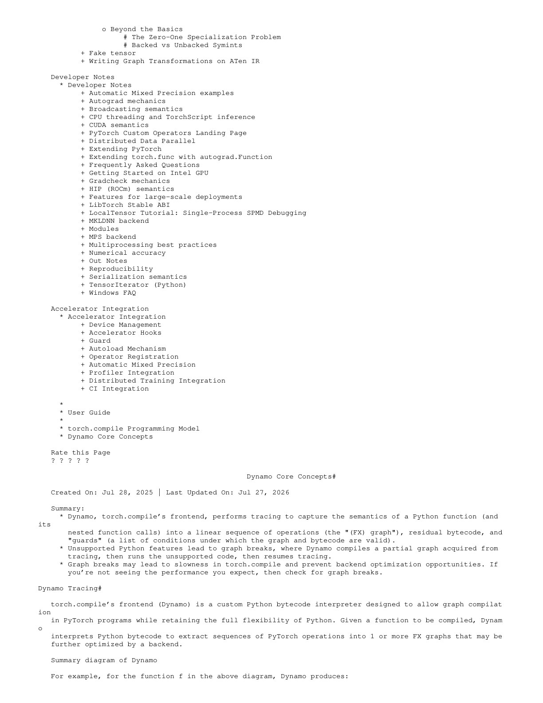

## 3. Dynamo 捕获的不是“整个 Python 世界”

Dynamo 是 Python bytecode interpreter。对一个 frame，它尝试产生：

1. 一张或多张 FX graphs；
2. residual bytecode，用于调用 graph 和执行没进入 graph 的 Python；
3. guards，声明这些 graph/bytecode 在什么条件下可复用。

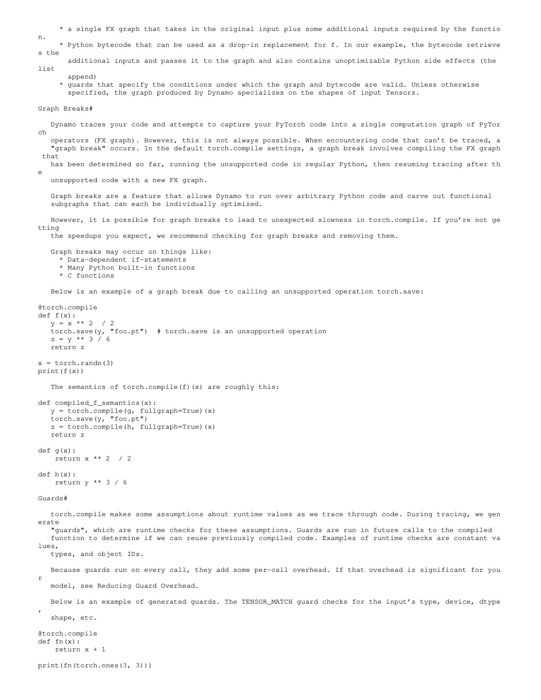

因此 compiled function 不是简单替换成单一 graph executor。它仍可能在 graph regions 之间执行 Python。

## 4. Graph break

遇到无法捕获的 Python feature 或 unsupported op 时，默认 torch.compile 可：

1. 结束当前 graph；
2. 编译并执行已捕获 region；
3. 以普通 Python 运行 unsupported part；
4. 从后续位置继续捕获新 graph。

Graph break 提供兼容性，但代价是：

- 多次 graph call；
- 丢失跨 break fusion；
- Python overhead 回归；
- 中间 tensor 可能必须 materialize；
- debugging 和 graph count 更复杂。

fullgraph 模式把 graph break 变成 error，适合发现问题，不表示所有 production workload 都必须一张图。

## 5. Guards 与重编译

捕获路径依赖许多事实：

- input type、dtype、device、rank/shape；
- Python constant；
- object identity；
- module/global state；
- 某个 branch 选择。

Dynamo 将这些事实编码为 guards。后续调用：

- 某个 cached version guards 全部通过：复用；
- 所有 versions 都失败：重新 trace/compile；
- 达到版本或重编译限制：可能 fallback。

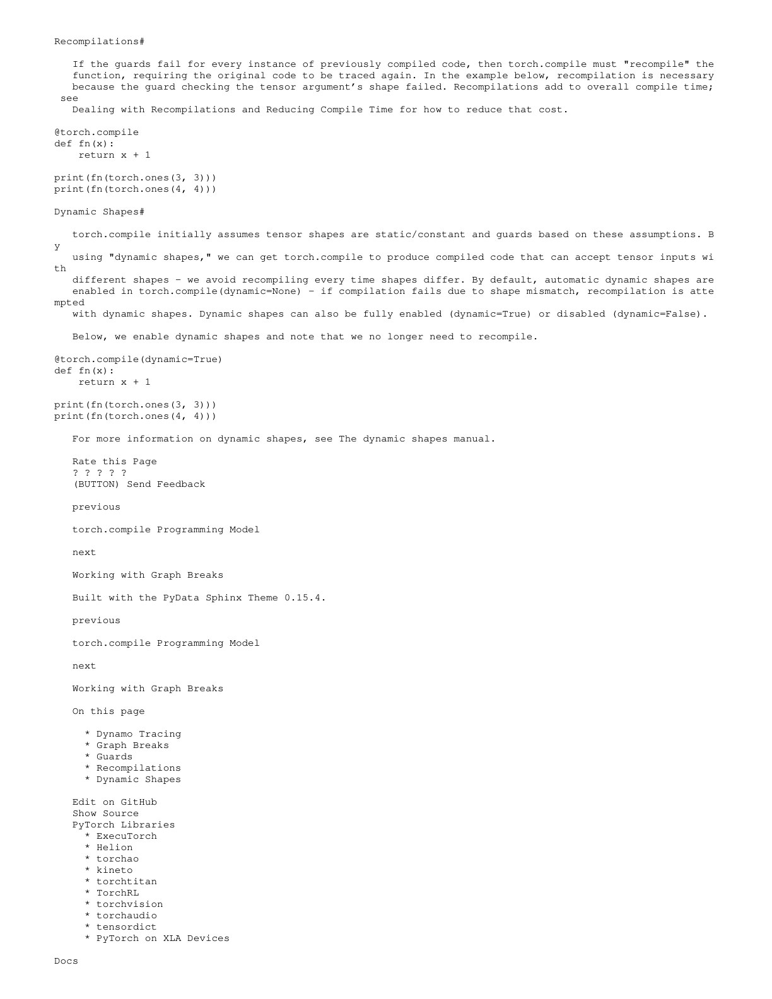

guard 不只是安全检查，也是 specialization 的边界。条件越具体，optimizer 信息越多；输入变化时复用率越低。

## 6. 四种 graph 不要混用

| Graph | 产生方式 | 包含内容 | 生命周期/用途 |
| --- | --- | --- | --- |
| Autograd graph | eager operator recording | backward dependencies | 本次训练 iteration |
| FX symbolic graph | Proxy tracing | 选定路径的高层 calls | graph transform |
| Dynamo FX graph | bytecode capture | 可编译 tensor regions | torch.compile frontend |
| ExportedProgram graph | export tracing + constraints | functional ATen-style full graph | AOT/deployment |

AOTAutograd 还会把 training computation 提前捕获成 forward/backward graphs；它与 eager autograd graph 的产生时机和用途不同。

## 7. torch.export 的两种 tracing

官方文档描述 strict 与 non-strict：

- strict：使用 Dynamo bytecode analysis，提供额外 Python-level safety checks，但可能遇到 unsupported Python；
- non-strict：使用普通 Python interpreter、FakeTensor 与 Proxy 记录 operations，同时捕获 shape conditions。

快照明确倾向 non-strict，且提示默认行为会改变。实际使用必须以目标 PyTorch release 为准。

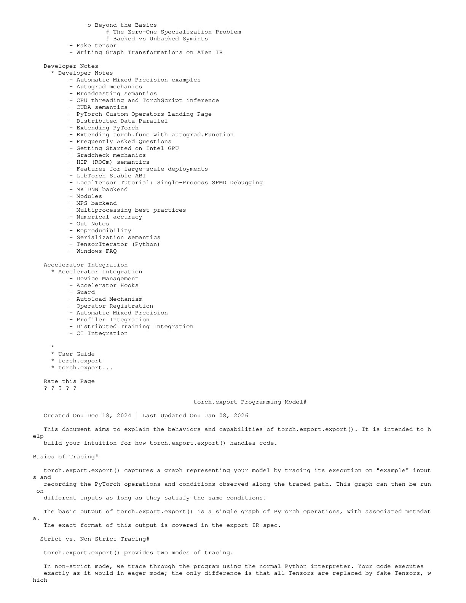

## 8. Static value 与 dynamic value

export 时：

- Python primitive 通常 static；
- tensor data dynamic；
- input tensor shape 默认可 static，也可由 specification 声明 dynamic；
- dtype/device 等 metadata 多为 static；
- container structure 通常 static；
- parameter/buffer shape 通常 static。

静态值会 constant fold 或 burn into graph。它们改变后不是“自动适配”，而是违反导出程序契约。

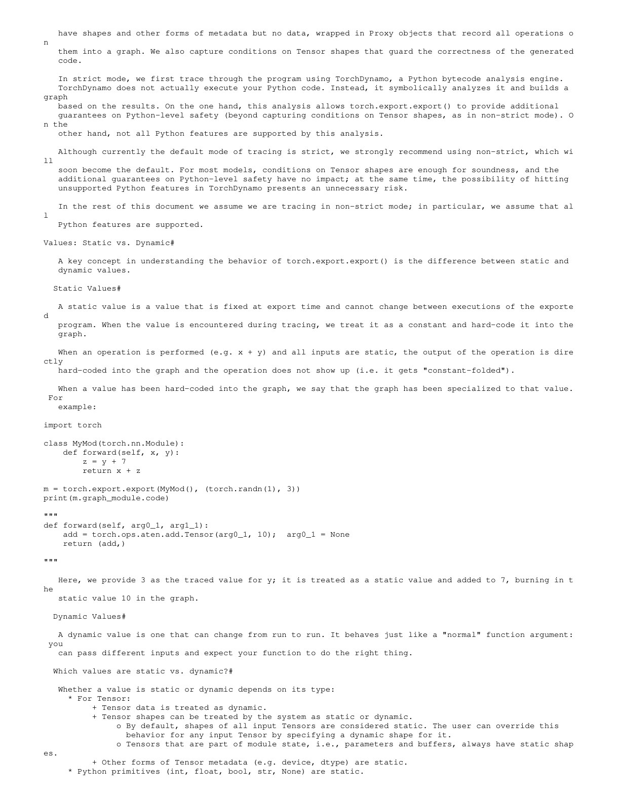

所以输入是函数参数，不代表它一定成为 graph runtime input。

## 9. 控制流：shape-dependent 与 data-dependent

Python if 的 condition 可能是：

### Static

trace 时直接选择分支，另一侧不进入图。

### Backed dynamic shape

symbolic shape 有 example input 的 concrete hint。trace 可用 hint 选路径，同时生成 guard，例如 $s_0 > 16$。

### Data-dependent

例如 x.sum() > 0。FakeTensor 没有真实 data，tracer 无法选择分支。要保留两侧需显式 torch.cond 等 higher-order operator。

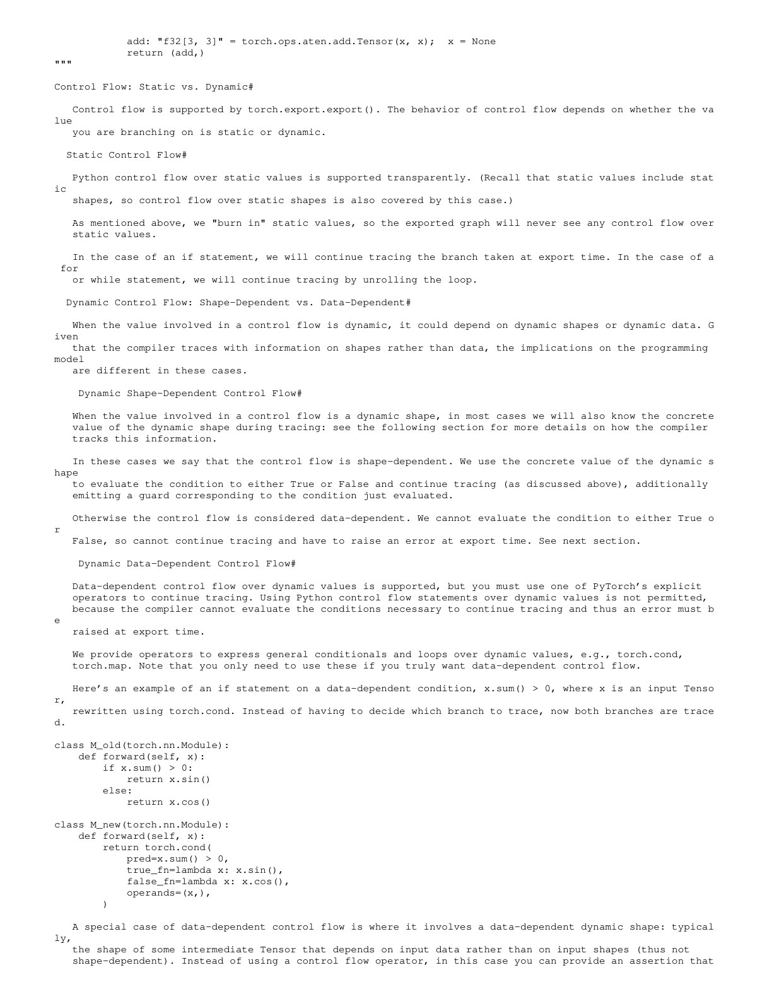

这解释了为什么“PyTorch eager 能运行”不等于“export 能自动得到完整控制流图”。

## 10. Backed 与 unbacked symbol

Backed symbol：

- 通常来自 input shape；
- example input 提供 concrete hint；
- trace 可用 hint 作决定，但必须记录 guard。

Unbacked symbol：

- 具体值取决于 runtime data；
- 例如 nonzero 输出第一维；
- trace 时没有 concrete hint；
- 需要显式 assertion 或 structured control flow 才能继续。

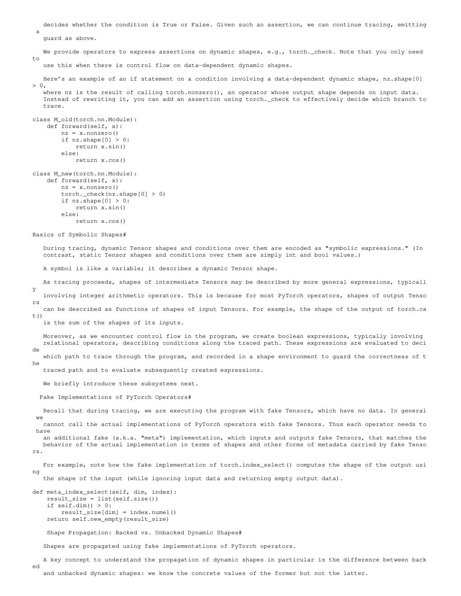

每个 custom operator 若要进入 FakeTensor/export pipeline，需要正确 fake/meta implementation，描述 shape、dtype、device 等 metadata，而不是执行真实 data computation。

## 11. Guards、assertions 与 Export contract

对 backed symbols 的 path condition 成为 input shape guards。用户给出的 dynamic shape specification 必须能够逻辑推出这些 guards，否则 export 会报告 constraint violation。

对 unbacked symbols 的约束常变成 graph 内 runtime assertion，出现在 data-dependent operator 之后。

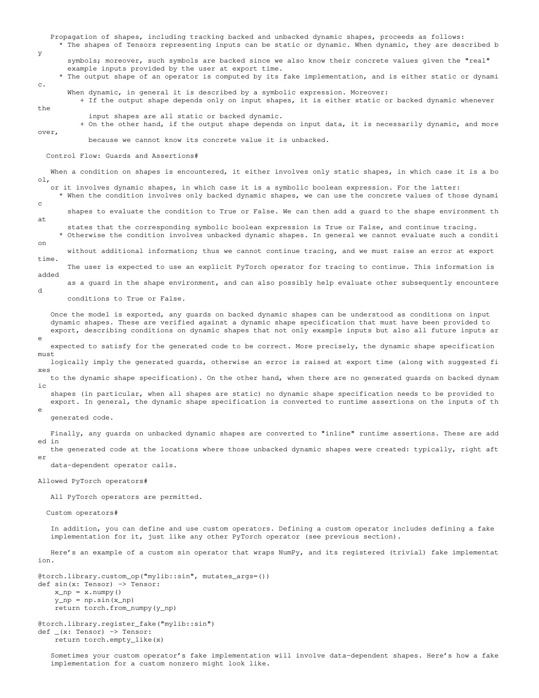

区别是：

- input guard 定义导出 artifact 接受哪些 inputs；
- inline assertion 检查运行中产生的动态事实。

## 12. Functionalization 为什么必要

后端更喜欢函数式 graph：

- output 只由 explicit inputs 决定；
- mutation 变成返回更新后的 value；
- alias relation 被显式处理；
- pass 不必模拟完整 Python object state。

export/AOT pipeline 会对 mutation 做 functionalization，但用户可观察 mutation、views 和 alias 仍需在 graph signature/wrapper 中恢复语义。

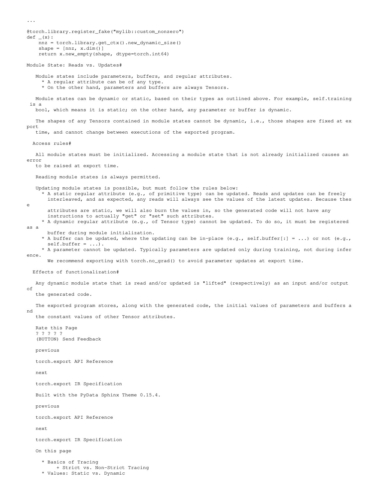

它不是简单“禁止 inplace”，而是把副作用分层：graph 内计算函数化，graph 外 wrapper 处理必要状态更新。

## 13. Dynamic shape 不等于不专门化

dynamic dimension 用 symbolic integer 表示，但程序仍可按条件 specialize：

    if x.shape[0] == 10:
        ...
    elif x.shape[0] <= 30:
        ...

不同 shape range 可能需要不同 compiled versions。dynamic 的意义是一个版本可覆盖一组值，不是所有输入共享一份机器码。

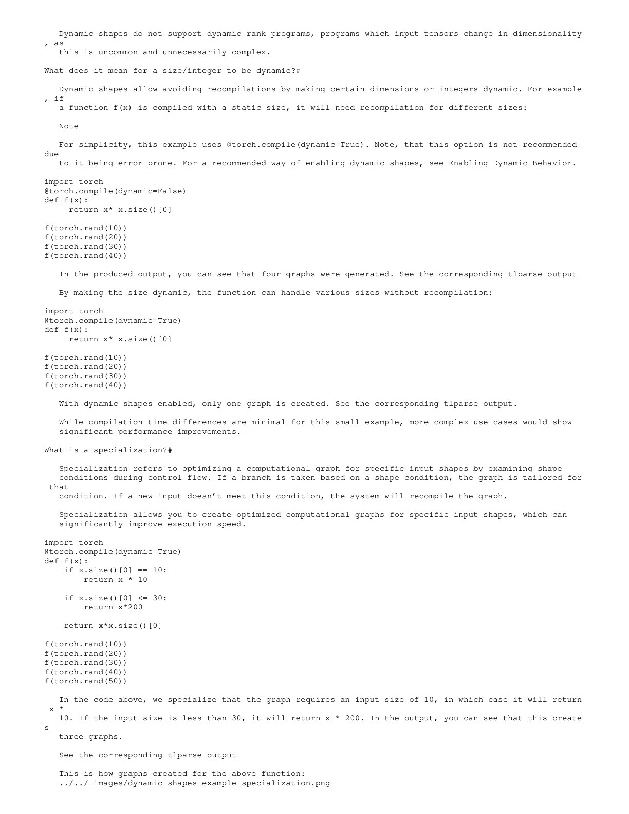

PyTorch 通常不支持 dynamic rank；batch、sequence、image size 等 dynamic dimensions 才是主目标。

## 14. Automatic dynamic 与 specialization

默认策略常先按 static shape 编译：

1. 首次调用生成 specialized graph；
2. shape 变化触发 recompile；
3. 系统观察变化的 dimensions；
4. 后续尝试把这些维度推广为 dynamic。

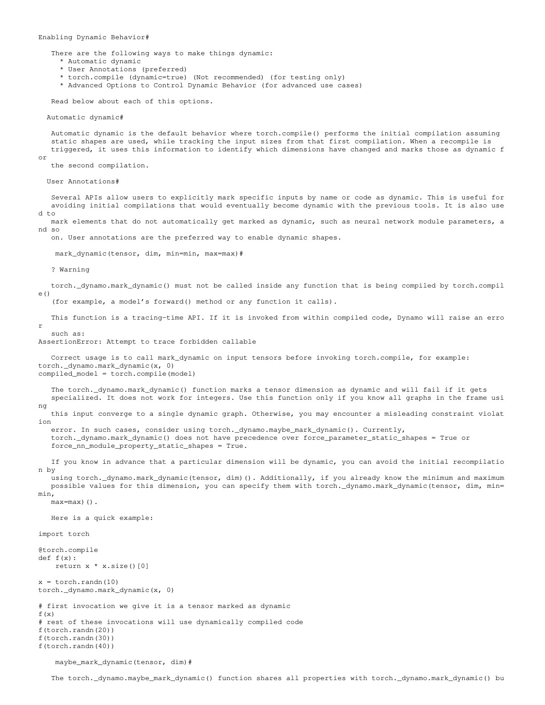

这保留首个 shape 的 kernel quality，但产生一次额外 compile。用户已知变化维度时可提前 annotation。

## 15. mark_dynamic 的使用边界

官方文档推荐有针对性地标记维度，而非盲目 dynamic=True：

- mark_dynamic 在调用 compiled function 前作用于 input；
- 不应写在正在被 compile 的 forward 内；
- 可提供 min/max range；
- 若某路径必然要求 static，强标 dynamic 可能 constraint violation；
- maybe_mark_dynamic 允许必要时继续 specialize。

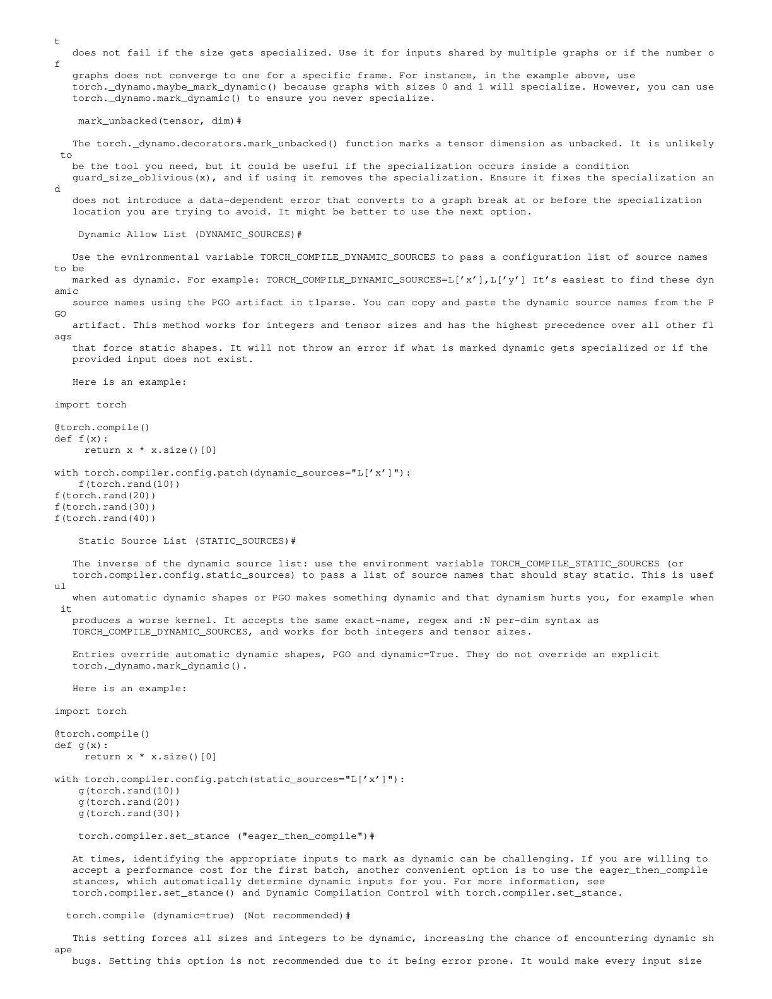

dynamic=True 会扩大 symbolic reasoning 和 codegen 空间，也可能损害性能或暴露不支持路径，适合诊断而非默认万能开关。

## 16. 一套实用诊断顺序

### 先看 correctness

- export 是否捕获了期望路径；
- mutation/alias 语义是否保持；
- custom op 是否有 fake implementation；
- dynamic specification 是否覆盖未来 inputs。

### 再看 graph quality

- graph breaks 在哪里；
- 每个 region 多大；
- 是否有意外 constant specialization；
- higher-order control flow 是否必要。

### 再看 cache behavior

- guard failure 原因；
- 同一 frame 有多少 versions；
- shape 变化是否收敛到 symbolic graph；
- compile/warmup 是否计入 latency。

### 最后看 backend

- fusion 和 generated kernel；
- dynamic indexing 的代价；
- kernel 是否为 range 内主要 shapes 选择良好 schedule。

## 17. 常见误读

### “torch.compile 会先得到完整静态图”

默认可得到多个 FX regions，中间仍运行 residual Python。

### “graph break 只影响编译时间”

它也影响 steady-state launch、fusion 和 memory materialization。

### “dynamic shape 会自动接受任意输入”

graph 仍受 rank、dtype、device、range 和 path guards 约束。

### “torch.export 比 compile 更灵活”

恰好相反：export 为了得到独立 artifact，不能依赖 eager fallback，因此对 full graph 和 constraints 更严格。

## 18. 最终判断

现代 PyTorch graph system 的核心不是从动态图改成静态图，而是管理一组有条件成立的图表示：用 guards 定义复用范围，用 graph breaks 保持兼容，用 symbolic shapes 扩大覆盖，再用 export 把可部署契约显式化。
