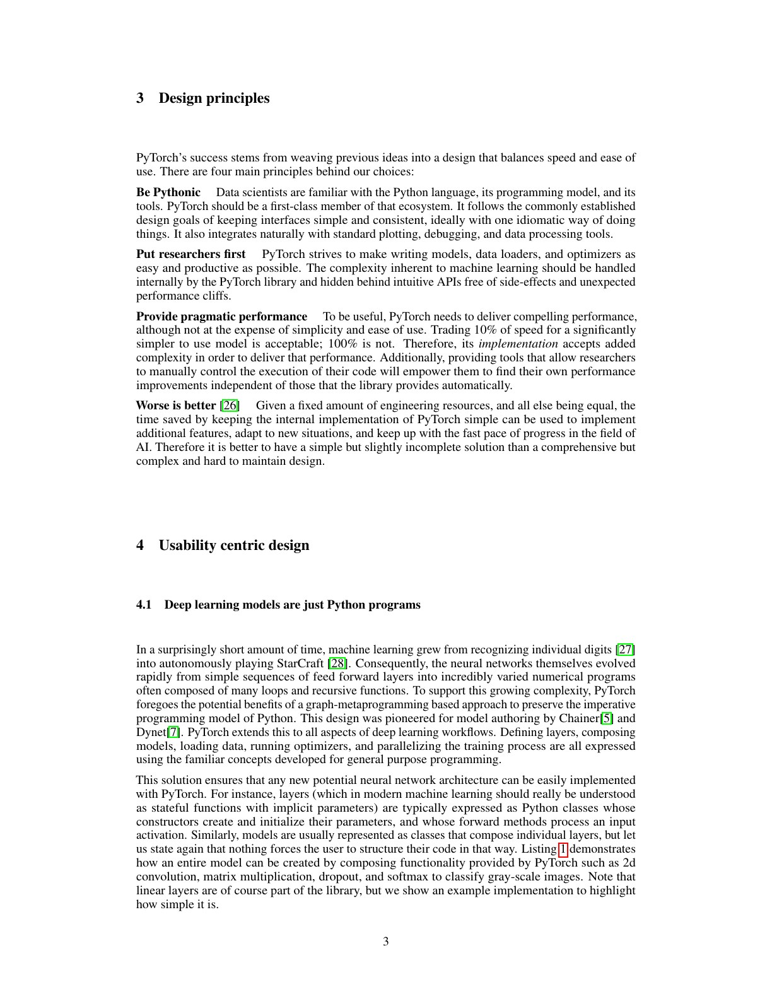
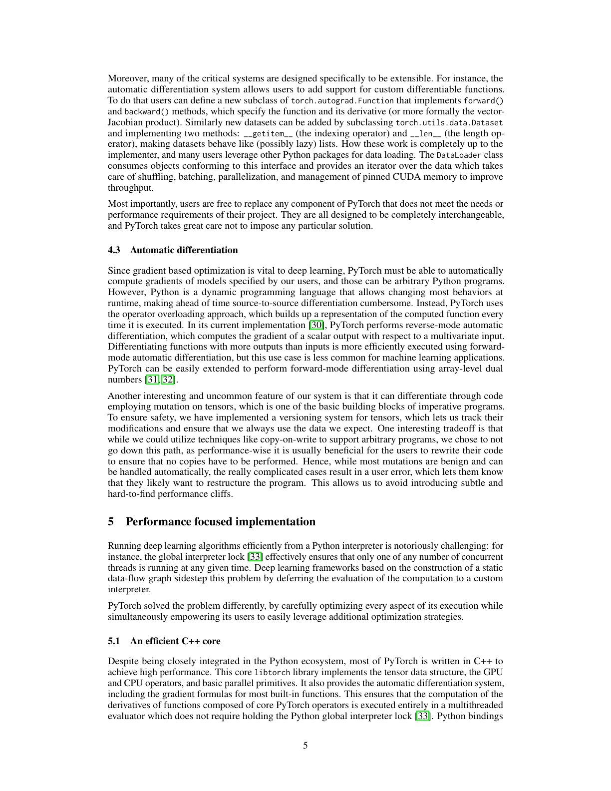
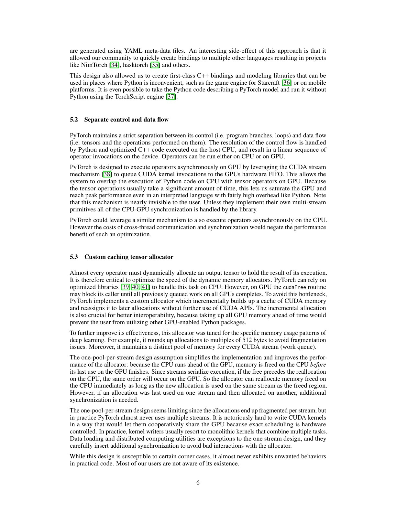
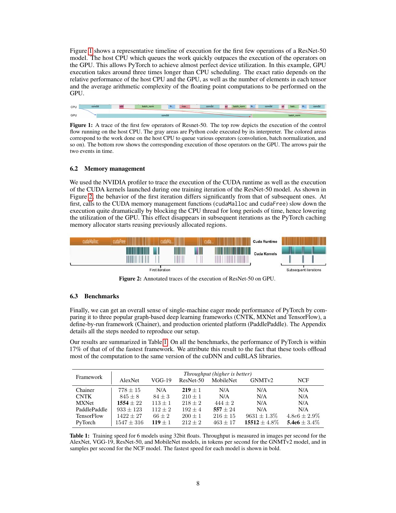
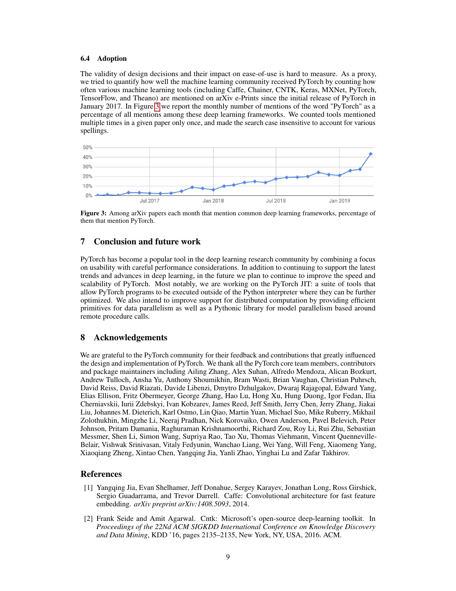

# PyTorch 中文精读：动态图、Eager 与 Autograd

## 1. 先拆开“动态图”这个词

讨论 PyTorch graph 时，至少有四种不同对象：

1. Python 程序：用户写的控制流和对象操作。
2. eager operator stream：本次运行实际发出的 tensor operations。
3. autograd graph：为了 reverse-mode differentiation 保存的依赖与 backward functions。
4. compiler IR：后来由 FX、Dynamo、AOTAutograd 等组件捕获的可变换图。

2019 年这篇论文主要解释前三项。把 autograd graph 直接叫成“PyTorch 的完整前向计算图”会产生误解：Python 分支已经在执行时选完，图中通常只保留被选路径上与梯度有关的操作。

## 2. 从 Define-and-Run 到普通 Python

静态 graph framework 先用 host language 构造 DSL graph，再把图交给独立 executor。PyTorch 选择：

- tensor operation 调用即执行；
- Python 负责 if、for、递归、对象和副作用；
- 本次执行走哪条路径，本次就记录哪条求导路径；
- 调试器、print 和 Python library 保持原语义。

论文把设计原则概括为 Pythonic、researcher first、pragmatic performance 和 worse is better。

这种设计的主要价值不是“图可以变化”这一句口号，而是模型结构、loss、优化器和数据处理都能共享同一种宿主语言。GAN 的交替更新、递归网络和输入相关循环不需要先翻译成 graph-building API。

## 3. Autograd graph 怎样动态构建

PyTorch 使用 operator overloading。一个需要梯度的 tensor 参与运算时，runtime：

1. 立即计算 forward output；
2. 为 output 记录相应 backward function；
3. 保存 backward 所需的 tensor 或 metadata；
4. 用 edge 把它连接到输入的 gradient history。

从 scalar loss 调用 backward 后，engine 沿反向依赖执行 vector-Jacobian products。它属于 reverse-mode AD，适合“输入/参数很多、最终 loss 很少”的训练场景。

### 为什么不是提前做 source transformation

Python 允许动态类型、monkey patching、运行时控制流和任意对象。完整、提前的 source-to-source differentiation 既复杂又容易偏离实际 Python 语义。运行时记录只处理已经发生的 tensor operations，缩小了必须理解的语言范围。

### 原地修改为何危险

假设 forward 保存了 tensor x，backward 需要旧值；用户却在两者之间执行原地更新。PyTorch 为 tensor 保存 version counter，backward 检测保存时和使用时版本是否一致。

论文的选择不是默默 copy-on-write，而是在难以安全处理时抛错。这避免隐藏的大复制和不可预测的性能悬崖。

## 4. 动态并不意味着所有工作都在 Python

PyTorch 把 tensor、operators 和 autograd engine 的核心放在 C++。只要 backward 由内置 operators 组成，gradient execution 可以在多线程 engine 中运行，不必持有 Python GIL。

更关键的是 control flow 与 data flow 分离：

- host/Python 决定 operator 调用顺序；
- CUDA call 把 kernel 异步排入 stream；
- Python 可以在 GPU 执行当前 kernel 时准备后续工作；
- 只有读取结果、跨 stream dependency 等事件才需要同步。

所以 eager 的性能条件是 host 足够快，能持续向 GPU queue 投递工作。当模型由大量极小 operator 组成时，这一前提会失效，后来才需要 fusion、CUDA Graph 和 torch.compile。

## 5. Caching allocator 是动态图性能的一部分

每个 operator 都可能产生新 tensor。直接频繁调用 cudaMalloc/cudaFree 会同步设备并破坏异步流水。

PyTorch allocator：

- 缓存已释放的 GPU memory block；
- 按 CUDA stream 管理复用；
- 对 allocation size 做取整，降低碎片；
- 不在启动时占满全部 GPU，保留与其他 library 互操作的空间。

第一页 iteration 与后续 iteration 的行为不同：第一次需要向 CUDA allocator 请求内存，稳定后大多命中 cache。benchmark 若只看首轮或不正确同步，会得到不同结论。

## 6. 性能证据怎样读

论文用 trace 展示 CPU dispatch 与 GPU execution 的重叠，也展示 allocator 在 warmup 后的变化。

六个 training benchmark 中，PyTorch 距当时最快结果不超过 17%。表中 CNN、GNMTv2 和 NCF 的计量单位不同，不能横向比较绝对数字；框架普遍调用相同版本的 cuDNN/cuBLAS，因此它主要证明 eager overhead 没有压倒 heavy kernels。

这不是“eager 永远与 compiled 一样快”。对 pointwise chain、小 batch inference、Python-heavy control 或频繁 graph break，host 和 launch 成本可能占主导。

## 7. 三个最常见误解

### “动态图就是每步把完整 forward graph 建一遍”

更准确地说，forward 立即执行；autograd engine 记录反向所需节点。它不是在 forward 前构造完整可执行 graph。

### “Python if 会成为 autograd graph 的 If 节点”

通常不会。Python 已经选择一个 branch，autograd graph 只看到该 branch 中实际执行的 tensor ops。要让编译后的图保留数据相关分支，需要显式 graph control-flow representation。

### “动态图天然支持任意 mutation”

用户可以写 mutation，但 backward correctness、alias analysis 和 compiler capture 都会受影响。version counter 只能检测一部分危险情况，现代 compiler 还需要 functionalization。

## 8. 与 PyTorch 2 的连接

PyTorch 2 没有抛弃 eager 语义，而是在其上增加分层捕获：

    Python bytecode
        -> TorchDynamo guards + FX graph
        -> AOTAutograd forward/backward graphs
        -> TorchInductor kernels

这篇论文解释为何 eager 是用户语义基线；[PyTorch 2 精读](../pytorch_2/论文中文解读.md)解释如何从这一基线安全抽取可优化区域。

## 9. 复现与实践检查点

- benchmark 前区分 warmup、compile 和 steady-state；
- GPU timing 前后正确同步；
- 查看 operator 粒度，判断 Python/launch 是否能被 kernel 隐藏；
- 原地操作出错时先检查 saved tensor version；
- 不要用 autograd graph 代替 FX/export graph 做部署分析；
- 对新版本结论重新测量，不沿用 2019 性能数字。

## 10. 最终判断

本文真正建立的是一种语义契约：用户写普通 Python，runtime 执行真实路径并记录求导信息。后续所有 PyTorch graph compiler 都必须在优化收益与这一契约之间做选择。

## 原文证据导航

以下页码按仓库内 PDF 的**文件页码**计，不等同于论文印刷页码。建议先读本节所指原文，再回看上面的中文解释。

- [打开原始 PDF](paper.pdf)
- [打开可检索文本](paper.txt)

| 中文笔记中的证据 | 原文位置 | 复核重点 |
|---|---|---|
| PyTorch 设计原则与模型即 Python 程序 | [PDF 文件第 3 页](paper.pdf#page=3) · [截图](rendered_figures/page-3.jpg) | 回到该页上下文，复核定义、图表或实验论证 |
| 自动微分、C++ 核心与运行时构图 | [PDF 文件第 5 页](paper.pdf#page=5) · [截图](rendered_figures/page-5.jpg) | 回到该页上下文，复核定义、图表或实验论证 |
| 控制流、数据流和 CUDA caching allocator | [PDF 文件第 6 页](paper.pdf#page=6) · [截图](rendered_figures/page-6.jpg) | 回到该页上下文，复核定义、图表或实验论证 |
| 异步 operator dispatch 与内存管理 trace | [PDF 文件第 8 页](paper.pdf#page=8) · [截图](rendered_figures/page-8.jpg) | 回到该页上下文，复核定义、图表或实验论证 |
| 训练吞吐、采用率与未来 JIT 方向 | [PDF 文件第 9 页](paper.pdf#page=9) · [截图](rendered_figures/page-9.jpg) | 回到该页上下文，复核定义、图表或实验论证 |
