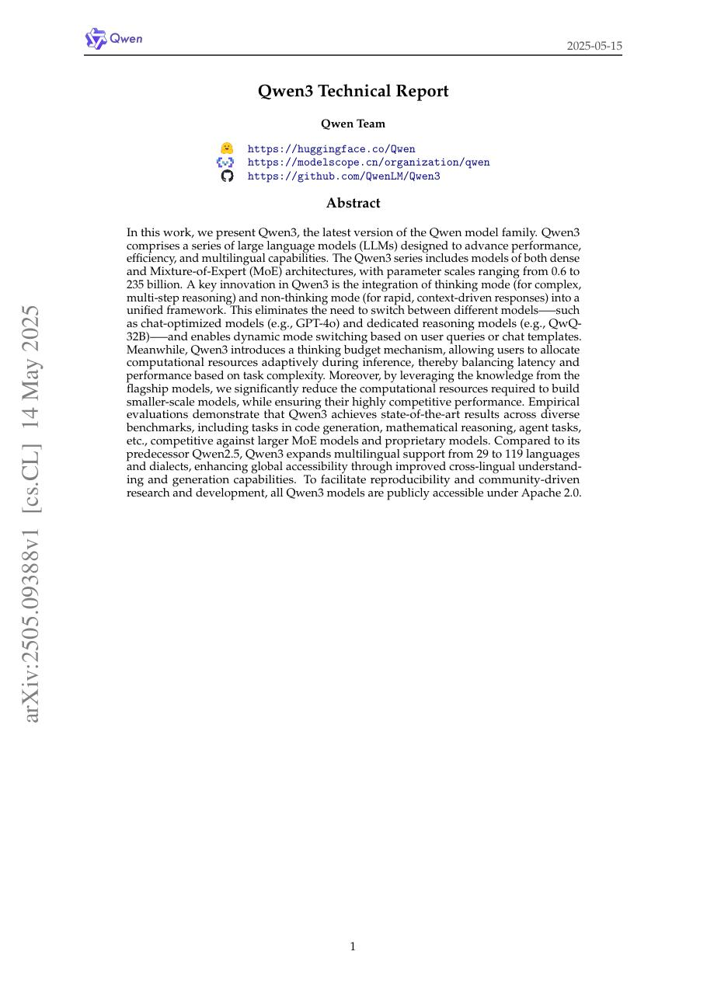
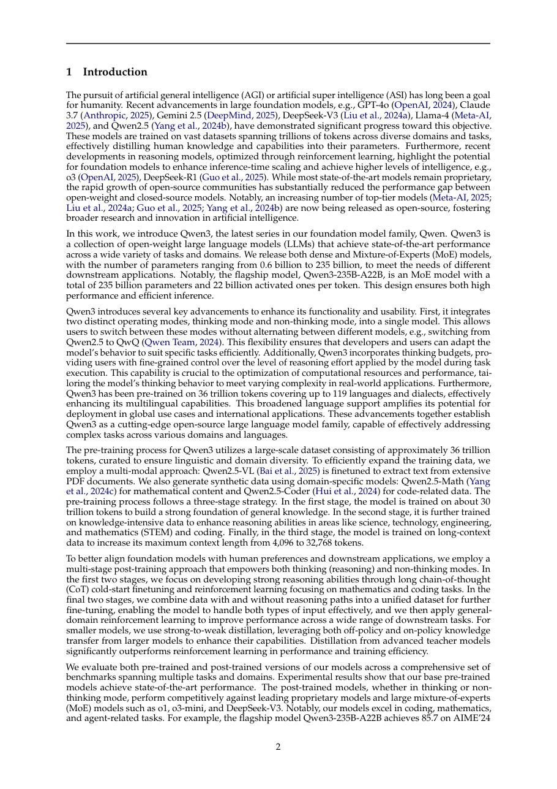
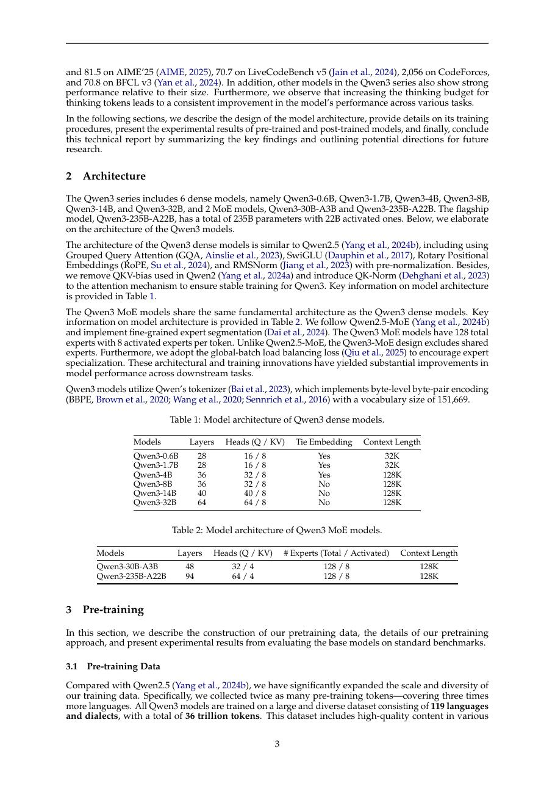
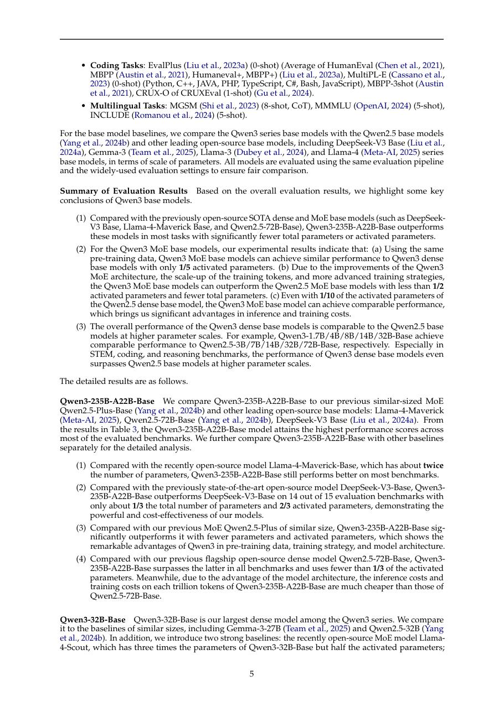

# 论文中文解读：《Qwen3 Technical Report》

## 一、它解决了什么

Qwen3 提供 dense 与 MoE 系列，并把 thinking 与 non-thinking 能力融合到同一模型，通过预算控制在推理质量与延迟间切换。

## 二、核心机制

预训练覆盖约 36T tokens 和 119 种语言；后训练包含 long-CoT cold start、reasoning RL、thinking-mode fusion 与通用 RL。MoE 型号用少量 active 参数承接大总容量，部署需处理 expert parallel 与路由通信。

## 三、为什么成为主线

它代表 2025 年开放模型从“单一聊天模式”转向可控 test-time compute、agent/tool 与多语言一体化。

## 四、证据应该怎样读

速度、显存、精度或 benchmark 数字只在论文给定的模型、数据、硬件、kernel 版本和评测预算下成立。跨论文比较前要统一训练 tokens、输入长度、batch、精度、采样/思考预算与是否使用工具。

## 五、局限与易误读点

thinking token 不是忠实内部因果解释；不同预算下 benchmark 不可直接横比。开放权重仍不等于数据和训练 pipeline 可复现。

## 六、放进十年演进史

与 DeepSeek-R1 比较 reasoning 后训练，与 Kimi K2 比较 MoE/agentic 路线，与 gpt-oss 比较可调 reasoning effort。

## 七、原文入口

[官方论文/页面](https://arxiv.org/abs/2505.09388)

## 八、原文论证链

Qwen3 报告构建同时覆盖 dense 与 MoE、多语言、代码、数学和 agent 能力的模型族，并把“思考模式”与“非思考模式”纳入同一模型接口。预训练使用约 36T token、覆盖 119 种语言和方言，随后通过长链推理冷启动、强化学习、思考模式融合与通用对齐等阶段形成后训练模型。

其中心主张不是只有更大规模：MoE 通过每 token 激活少量 expert 提高总容量，混合推理模式让用户按延迟/难度分配计算，强 teacher 生成与筛选数据帮助小模型迁移能力。需要把技术报告给出的系统结果与单组件因果证据区分开。

> 原文定位：[PDF 文件第 1 页](paper.pdf#page=1) · [对应截图](rendered_figures/page-1.jpg)

## 九、MoE 与混合思考接口

MoE 层对 token $x$ 计算 router 分数，选择 top-$k$ experts：
$$
y=\sum_{i\in\operatorname{TopK}(g(x))}p_i(x)E_i(x).
$$
总参数决定容量，激活参数更接近每 token FLOPs；但路由、通信和负载不均会增加实际成本。dense 型号则每 token 使用全部 FFN 参数。

思考预算控制允许模型产生较长推理文本或直接作答。它不是改变预训练目标，而是后训练数据与控制 token 让条件生成呈现不同计算轨迹。

> 原文定位：[PDF 文件第 2 页](paper.pdf#page=2) · [对应截图](rendered_figures/page-2.jpg)

## 十、实验怎样读

数学、代码、知识、指令、多语言与 agent 基准应按模型大小、是否 thinking、token budget 和工具设置分开。长思考通常提升难题，却增加延迟并可能产生冗余；非思考模式更适合低延迟任务。MoE 与 dense 的比较应对齐激活参数、总参数、训练 token 和部署硬件。

> 原文定位：[PDF 文件第 3 页](paper.pdf#page=3) · [对应截图](rendered_figures/page-3.jpg)

## 十一、复现检查

- 公开 top-$k$、expert 数、容量策略与负载均衡统计。
- 推理评测固定 thinking budget、temperature、最大输出和答案解析。
- 多语言结果需说明语种数据比例与是否翻译评测。
- agent 指标记录工具 schema、最大轮数、执行错误处理和外部环境版本。

## 十二、常见误读

总参数大的 MoE 不等同于每 token 计算同等大的 dense 模型；反过来，也不能只看激活参数而忽略内存与通信。可控思考是资源—质量接口，不保证更长输出必然更正确。

> 原文定位：[PDF 文件第 5 页](paper.pdf#page=5) · [对应截图](rendered_figures/page-5.jpg)

## 原文证据导航

以下页码按仓库内 PDF 的**文件页码**计，不等同于论文印刷页码。建议先读本节所指原文，再回看上面的中文解释。

- [打开原始 PDF](paper.pdf)
- [打开可检索文本](paper.txt)

| 中文笔记中的证据 | 原文位置 | 复核重点 |
|---|---|---|
| 原文首页、摘要与问题定义 | [PDF 文件第 1 页](paper.pdf#page=1) · [截图](rendered_figures/page-1.jpg) | 回到该页上下文，复核定义、图表或实验论证 |
| 核心方法、架构或算法定义所在关键页 | [PDF 文件第 2 页](paper.pdf#page=2) · [截图](rendered_figures/page-2.jpg) | 回到该页上下文，复核定义、图表或实验论证 |
| 实验、结果或关键分析所在原文页 | [PDF 文件第 3 页](paper.pdf#page=3) · [截图](rendered_figures/page-3.jpg) | 回到该页上下文，复核定义、图表或实验论证 |
| 讨论、结论或补充分析所在原文页 | [PDF 文件第 5 页](paper.pdf#page=5) · [截图](rendered_figures/page-5.jpg) | 回到该页上下文，复核定义、图表或实验论证 |
