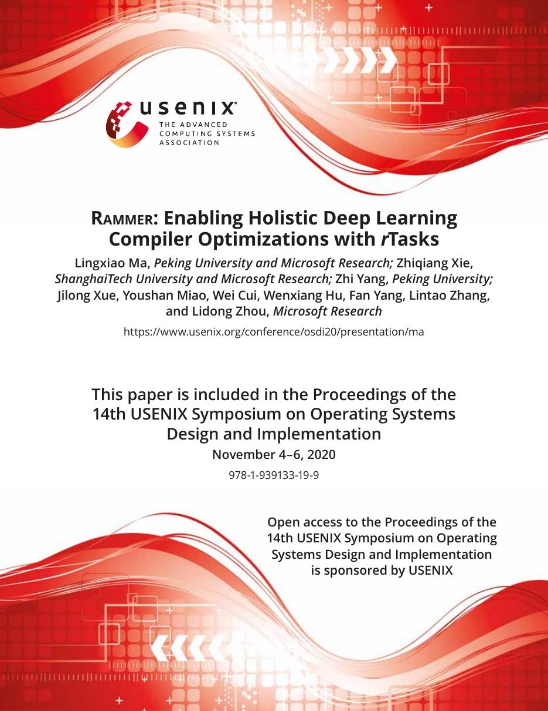
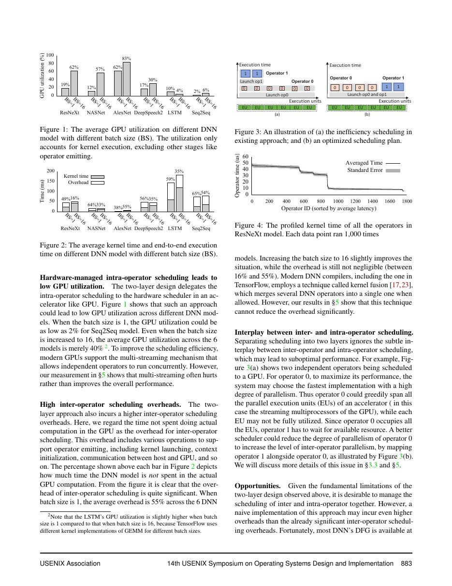
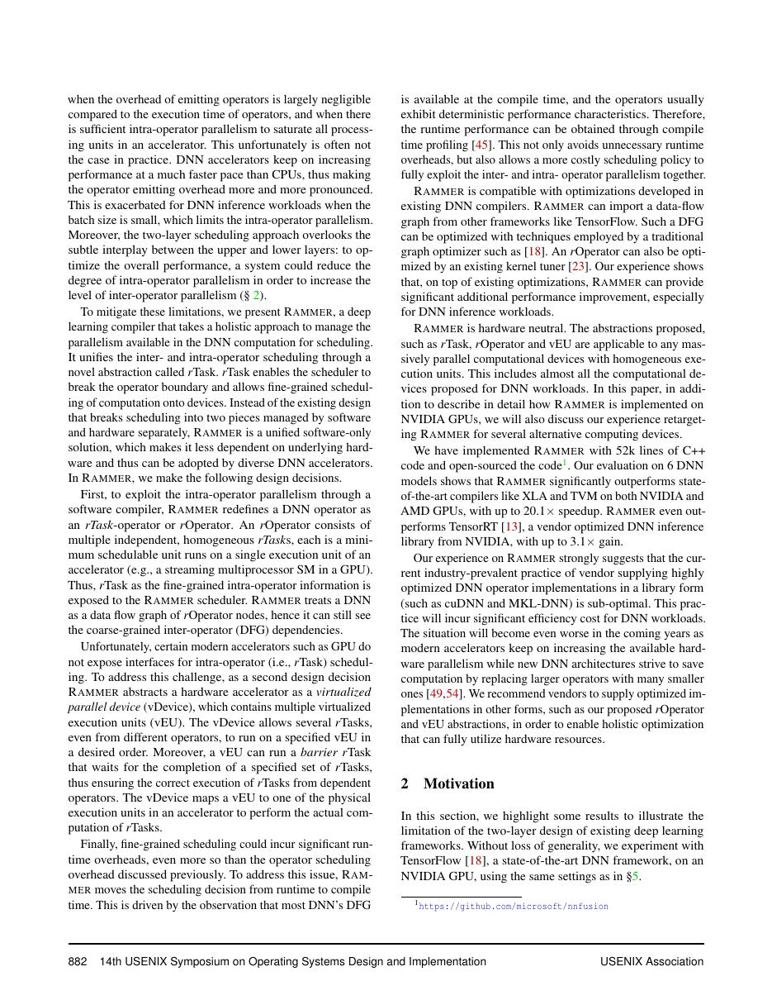
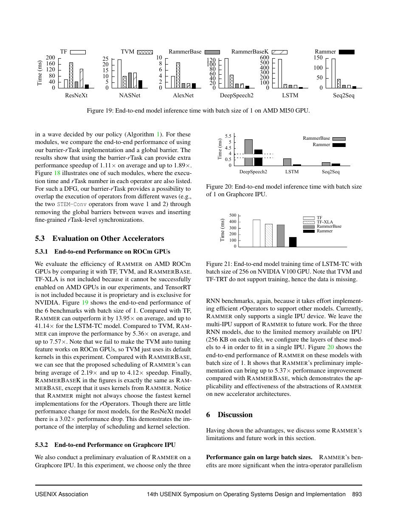

# 中文精读：《Rammer: Enabling Holistic Deep Learning Compiler Optimizations with rTasks》

## 一、它解决了什么

Rammer 打破“图层调度算子、硬件再调度线程”的两层黑盒，用 rTask 在编译期统一安排算子内外并行。

## 二、编译抽象与优化路径

rOperator 暴露细粒度 rTasks；编译器生成静态 spatial-temporal schedule，把任务映射到 virtualized devices，并用 barrier rTask 表达依赖。这样可减少逐 op launch/scheduling overhead，并跨 operator 利用并行资源。

## 三、为什么影响后续系统

它代表 AI compiler 从单算子 codegen 向模型级 holistic scheduling 扩展，尤其适合大量细粒度或不规则算子。

## 四、怎样读性能结果

编译器结果必须同时记录 frontend、shape、batch、精度、目标硬件、vendor library、调优预算和编译时间。单算子加速不等于端到端同倍加速，首次编译延迟也不能与缓存命中后的 steady-state 混为一谈。

## 五、局限与工程边界

静态调度依赖 shape 和硬件假设，动态 workload 或共享集群会破坏预测；手写 rKernel 和后端移植仍有工程成本。论文 AMD/NVIDIA 结果不能直接用于现代 GPU。

## 六、放进十年编译器演进史

与 Nimble 的动态图编译、Welder 的 tile-level fusion、Korch 的全局 kernel 组合比较不同层次的“整体优化”。

## 七、原文入口

[论文/官方页面](https://www.usenix.org/conference/osdi20/presentation/ma)

## 八、原文论证链

常规 DL 栈先由框架逐 operator 调度，再由每个 kernel 内部调度 thread；两层之间的黑盒造成大量小 kernel launch、同步和空闲资源。Rammer 用 rOperator 暴露细粒度 rTasks，编译器在统一的 spatial-temporal schedule 中安排算子内与算子间工作，并映射到 virtualized devices。barrier rTask 显式表达依赖。

核心主张是整体调度：编译期已知 DAG 与 shape 时，可以让不同 operator 的细粒度任务交错或并行，减少 host/runtime 决策，并提高设备利用率。

> 原文定位：[PDF 文件第 1 页](paper.pdf#page=1) · [对应截图](rendered_figures/page-1.jpg)

## 九、rTask 调度怎样理解

一个 rTask 是具有已知资源与依赖的可执行单元；空间维决定哪些 virtual devices 同时执行，时间维决定顺序。编译器把高层 op 展开为 task DAG，再做静态映射。与简单 operator fusion 不同，Rammer 可保留任务边界，同时在统一 schedule 中跨 op 协同。

barrier 节点确保消费者只在所需 producer tasks 完成后运行。静态化可消除动态 scheduler overhead，但也假设执行时间与资源行为较稳定。

> 原文定位：[PDF 文件第 4 页](paper.pdf#page=4) · [对应截图](rendered_figures/page-4.jpg)

## 十、实验怎样读

论文比较多类模型和 AMD/NVIDIA GPU，分别分析 kernel 数、设备利用率和端到端吞吐。要区分收益来自消除 launch、并行小 op、还是更好 kernel；模型含大量细粒度操作时优势更大。旧硬件结果不应直接换算现代 GPU 速度。

> 原文定位：[PDF 文件第 3 页](paper.pdf#page=3) · [对应截图](rendered_figures/page-3.jpg)

## 十一、复现检查

- 从原图到 rTask DAG 验证每条数据依赖和 barrier。
- 记录 virtual device 数、资源模型与静态 schedule。
- 用 timeline 检查并行是否真实发生，不能只看总时间。
- 对动态 shape、共享 GPU 和执行时间抖动做鲁棒性测试。

## 十二、常见误读

Rammer 不只是更激进的 fusion；它改变了调度单位与运行时边界。整体静态计划也不是任何环境都优越，动态 workload 会削弱其预测。

> 原文定位：[PDF 文件第 14 页](paper.pdf#page=14) · [对应截图](rendered_figures/page-14.jpg)

## 原文证据导航

以下页码按仓库内 PDF 的**文件页码**计，不等同于论文印刷页码。建议先读本节所指原文，再回看上面的中文解释。

- [打开原始 PDF](paper.pdf)
- [打开可检索文本](paper.txt)

| 中文笔记中的证据 | 原文位置 | 复核重点 |
|---|---|---|
| 原文首页、摘要或官方架构概览 | [PDF 文件第 1 页](paper.pdf#page=1) · [截图](rendered_figures/page-1.jpg) | 回到该页上下文，复核定义、图表或实验论证 |
| IR、架构、搜索空间或执行模型关键页 | [PDF 文件第 4 页](paper.pdf#page=4) · [截图](rendered_figures/page-4.jpg) | 回到该页上下文，复核定义、图表或实验论证 |
| 实验、性能或设计分析所在原文页 | [PDF 文件第 3 页](paper.pdf#page=3) · [截图](rendered_figures/page-3.jpg) | 回到该页上下文，复核定义、图表或实验论证 |
| 讨论、结论或补充设计所在原文页 | [PDF 文件第 14 页](paper.pdf#page=14) · [截图](rendered_figures/page-14.jpg) | 回到该页上下文，复核定义、图表或实验论证 |
