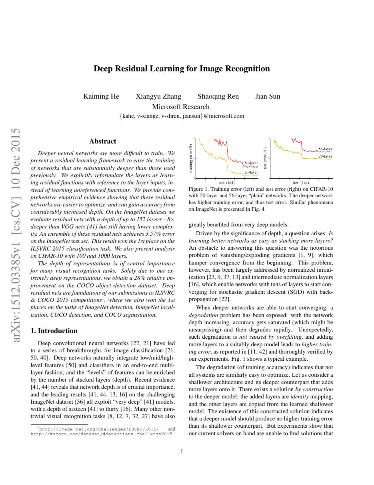
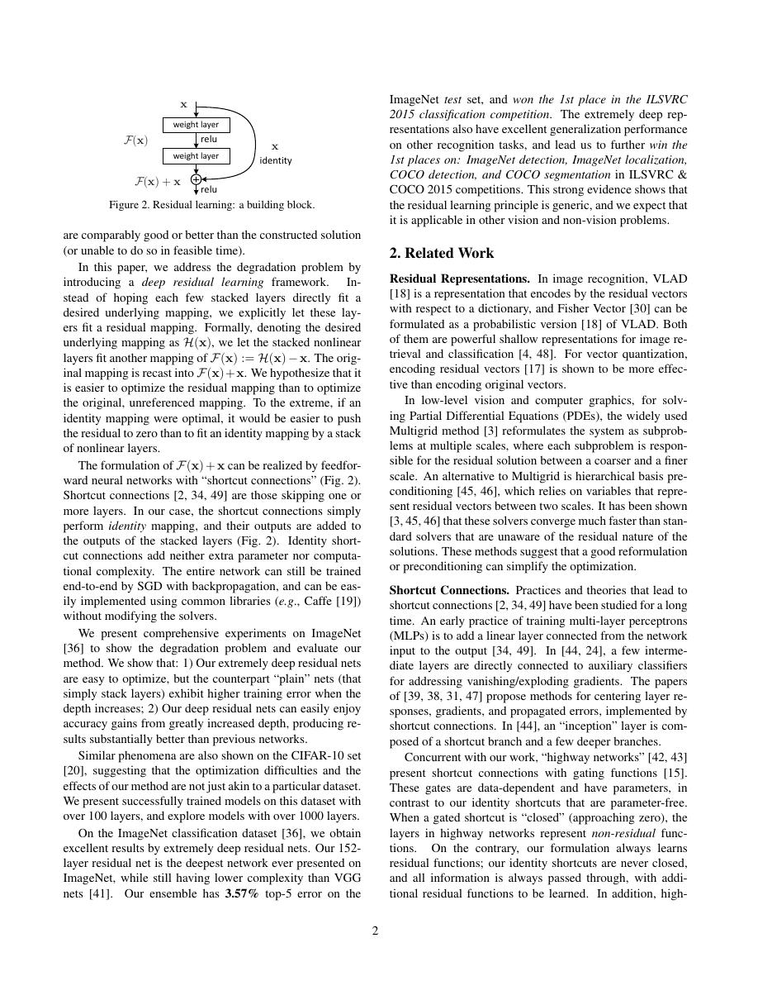
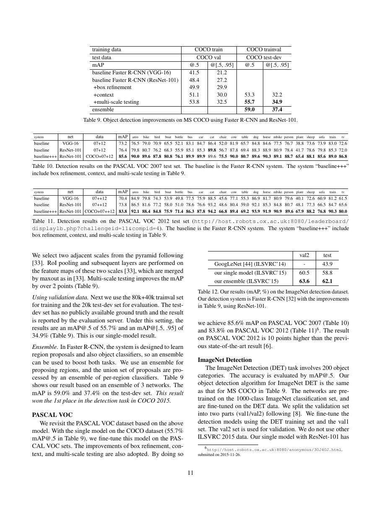
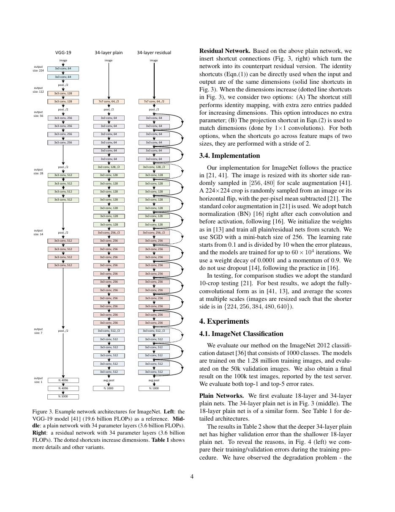

# 论文中文解读：《Deep Residual Learning for Image Recognition》

## 一、它解决了什么

ResNet 用残差块 y=F(x)+x 让网络学习相对 identity 的修正，解决更深网络训练误差反而升高的 degradation 问题。

## 二、核心机制

identity shortcut 为梯度提供直接通路，bottleneck 的 1×1–3×3–1×1 结构控制计算量。原论文的 152 层模型证明深度可以大幅增加；后来的 pre-activation ResNet 属于另一篇工作。

## 三、为什么成为主线

残差连接成为 CNN、Transformer、扩散 U-Net 和几乎所有现代深网的基础结构。

## 四、应该怎样读证据

论文里的结果首先证明方法在当时数据、模型规模、硬件和评测协议下成立。跨年代比较时要统一参数量、训练 tokens、数据质量、上下文长度、推理预算与系统实现，不能只横比单个最佳分数。

## 五、局限与易误读点

残差并不保证任意深度都易训练；归一化、初始化、宽度与优化器仍关键。ImageNet 分类提升也不能单独代表下游鲁棒性。

## 六、放进十年演进史

读 Transformer 时重点观察 residual + layer norm 如何继承这一思想；读扩散模型时看 U-Net 中跨尺度 skip connection 的另一种用途。

## 七、原文入口

[官方论文/页面](https://arxiv.org/abs/1512.03385)

## 八、原文论证链

论文观察到更深 plain network 不仅测试误差更高，训练误差也更高，所以不是普通过拟合。若新增层什么也不做，深网至少应能复制浅网；困难在于优化器不易让若干非线性层精确学成恒等映射。残差块改学 $F(x)=H(x)-x$，输出 $y=F(x)+x$，当恒等最优时只需把残差推向零。

> 原文定位：[PDF 文件第 1 页](paper.pdf#page=1) · [对应截图](rendered_figures/page-1.jpg)

## 九、为什么梯度更直接

$$
y=F(x,\{W_i\})+x,
\qquad
\frac{\partial L}{\partial x}
=\frac{\partial L}{\partial y}
\left(I+\frac{\partial F}{\partial x}\right).
$$
恒等 shortcut 提供直接的信息和梯度项，即使残差分支雅可比不理想也仍有通路。这不保证梯度永不爆炸/消失。通道或分辨率变化时需投影 shortcut；bottleneck 用 $1\times1,3\times3,1\times1$ 控制计算。

> 原文定位：[PDF 文件第 2 页](paper.pdf#page=2) · [对应截图](rendered_figures/page-2.jpg)

## 十、实验怎样读

18/34 层 plain 与对应 ResNet 的训练曲线最关键：plain 34 层训练误差更高证明 degradation，ResNet 34 层更好支持优化主张。ImageNet、CIFAR 和检测迁移说明可扩展性；最终排行榜还受模型规模、增强和 ensemble 影响。

> 原文定位：[PDF 文件第 11 页](paper.pdf#page=11) · [对应截图](rendered_figures/page-11.jpg)

## 十一、复现检查

- 区分 basic block、bottleneck 与 stride 位置。
- 维度变化时明确 projection 或 zero-padding shortcut。
- plain/residual 对照保持初始化、BN、优化器和日程一致。
- 必须报告训练误差，才能验证中心论点。

## 十二、常见误读

残差连接主要改变函数参数化和梯度通路，不是简单防过拟合。pre-activation ResNet 等是后续结构，不能倒写进原论文。

> 原文定位：[PDF 文件第 4 页](paper.pdf#page=4) · [对应截图](rendered_figures/page-4.jpg)

## 原文证据导航

以下页码按仓库内 PDF 的**文件页码**计，不等同于论文印刷页码。建议先读本节所指原文，再回看上面的中文解释。

- [打开原始 PDF](paper.pdf)
- [打开可检索文本](paper.txt)

| 中文笔记中的证据 | 原文位置 | 复核重点 |
|---|---|---|
| 原文首页、摘要与问题定义 | [PDF 文件第 1 页](paper.pdf#page=1) · [截图](rendered_figures/page-1.jpg) | 回到该页上下文，复核定义、图表或实验论证 |
| 核心方法、架构或算法定义所在关键页 | [PDF 文件第 2 页](paper.pdf#page=2) · [截图](rendered_figures/page-2.jpg) | 回到该页上下文，复核定义、图表或实验论证 |
| 实验、结果或关键分析所在原文页 | [PDF 文件第 11 页](paper.pdf#page=11) · [截图](rendered_figures/page-11.jpg) | 回到该页上下文，复核定义、图表或实验论证 |
| 讨论、结论或补充分析所在原文页 | [PDF 文件第 4 页](paper.pdf#page=4) · [截图](rendered_figures/page-4.jpg) | 回到该页上下文，复核定义、图表或实验论证 |
