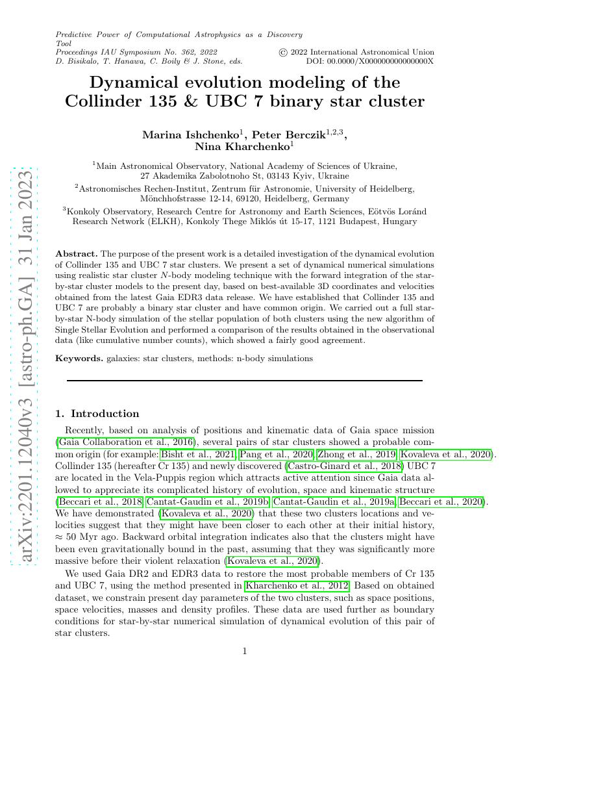
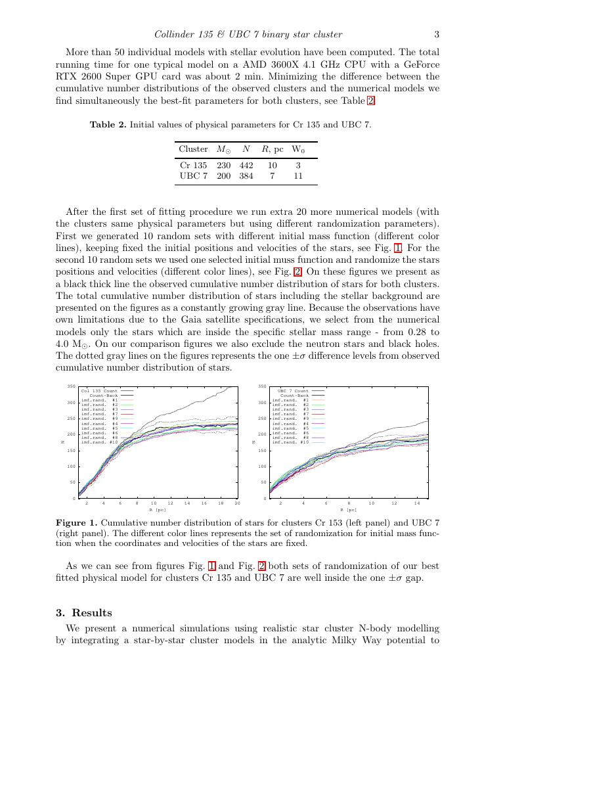
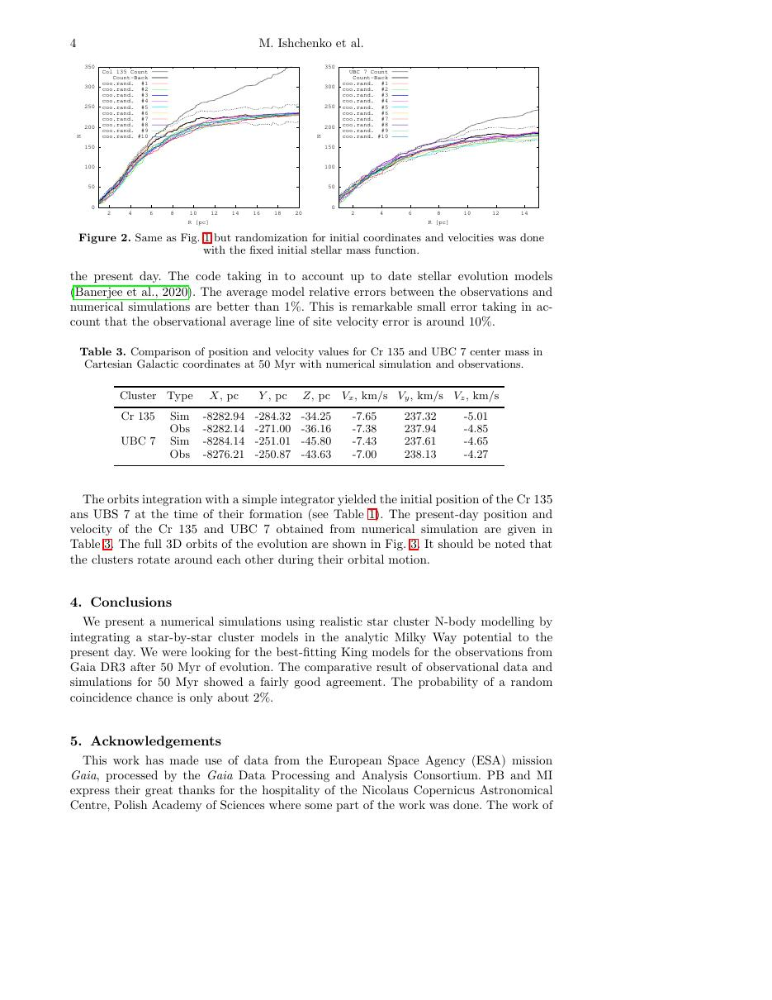
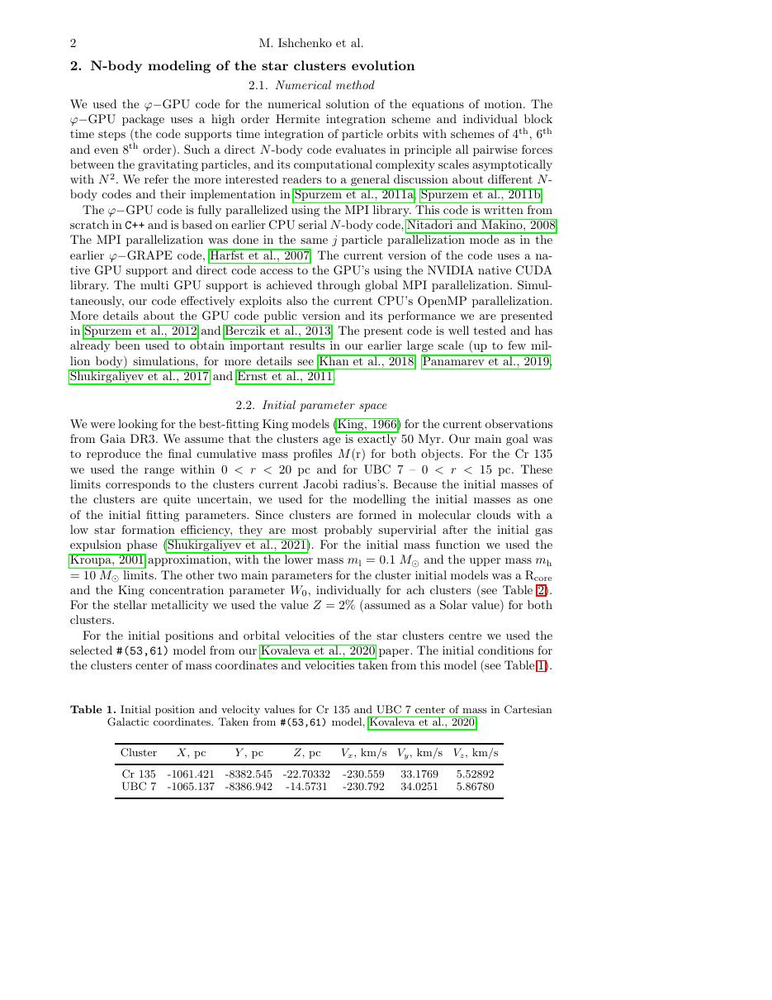

# 中文精读：《Roller: Fast and Efficient Tensor Compilation for Deep Learning》

## 一、它解决了什么

Roller 用硬件约束驱动的 tile 构造快速找到高性能 tensor program，目标是避免大规模黑盒 autotuning。

## 二、编译抽象与优化路径

编译器从能高效映射到硬件计算单元的 rTile 出发，逐层构造更大的 tile，并满足内存层次、线程和数据复用约束。搜索更多依赖解析式硬件知识，显著减少实际测量。

## 三、为什么影响后续系统

它代表从“海量候选+学习成本模型”转向“先用硬件约束缩小合法高性能空间”的路线。

## 四、怎样读性能结果

编译器结果必须同时记录 frontend、shape、batch、精度、目标硬件、vendor library、调优预算和编译时间。单算子加速不等于端到端同倍加速，首次编译延迟也不能与缓存命中后的 steady-state 混为一谈。

## 五、局限与工程边界

解析式模型难覆盖 cache contention、编译器细节和新指令；规则质量决定上限。短论文中的算子集合有限，端到端融合仍需上层系统。

## 六、放进十年编译器演进史

与 Ansor/MetaSchedule 比较搜索成本；与 Hidet/TileLang 比较显式 task/tile mapping 如何表达硬件结构。

## 七、原文入口

[论文/官方页面](https://arxiv.org/abs/2201.12040)

## 八、原文论证链

Roller 针对 autotuning 的高测量成本，提出从硬件约束反向构造 tile。系统先定义能高效映射计算单元的 rTile，再逐层扩展到寄存器、shared memory、线程块和更高内存层次，满足容量、并行度、数据复用和整除等约束。大量明显低效方案在生成前就被排除，因此无需海量黑盒试跑。

> 原文定位：[PDF 文件第 1 页](paper.pdf#page=1) · [对应截图](rendered_figures/page-1.jpg)

## 九、构造式搜索怎样工作

tensor program 的一个 tile 要覆盖输出迭代域及其所需输入 region。扩大 tile 能增加复用，却消耗更多 SRAM/寄存器并降低并发。Roller 用硬件参数估计合法/高效区域，再枚举少量候选。例如矩阵乘 tile 的 $M_t,N_t,K_t$ 同时受 tensor-core 形状、shared-memory 字节和 warp 数约束。

rTile 描述计算与数据 tile 的关系，而不只是三个整数。逐层 construction 将硬件层次纳入同一映射。

> 原文定位：[PDF 文件第 3 页](paper.pdf#page=3) · [对应截图](rendered_figures/page-3.jpg)

## 十、实验怎样读

论文重点是“分钟/秒级编译得到接近最优性能”，所以必须同时看 compile/tune time 与 runtime。与 Ansor 等比较时确认真实测量次数和是否使用历史数据库。解析规则在评测算子上成功，不表示能精确预测 cache contention 或所有新指令。

> 原文定位：[PDF 文件第 4 页](paper.pdf#page=4) · [对应截图](rendered_figures/page-4.jpg)

## 十一、复现检查

- 保存硬件资源表、rTile 约束和候选淘汰原因。
- 对不整除 shape、padding 和边界 tile 单独测。
- 用 profiler 验证估计的 occupancy、带宽和 tensor-core 利用率。
- 把规则预测失败案例加入回归集。

## 十二、常见误读

Roller 不是完全不搜索，而是用硬件知识把搜索变成小规模构造/选择。解析模型加速编译，但模型误差也可能排除真正高性能的反直觉方案。

> 原文定位：[PDF 文件第 2 页](paper.pdf#page=2) · [对应截图](rendered_figures/page-2.jpg)

## 原文证据导航

以下页码按仓库内 PDF 的**文件页码**计，不等同于论文印刷页码。建议先读本节所指原文，再回看上面的中文解释。

- [打开原始 PDF](paper.pdf)
- [打开可检索文本](paper.txt)

| 中文笔记中的证据 | 原文位置 | 复核重点 |
|---|---|---|
| 原文首页、摘要或官方架构概览 | [PDF 文件第 1 页](paper.pdf#page=1) · [截图](rendered_figures/page-1.jpg) | 回到该页上下文，复核定义、图表或实验论证 |
| IR、架构、搜索空间或执行模型关键页 | [PDF 文件第 3 页](paper.pdf#page=3) · [截图](rendered_figures/page-3.jpg) | 回到该页上下文，复核定义、图表或实验论证 |
| 实验、性能或设计分析所在原文页 | [PDF 文件第 4 页](paper.pdf#page=4) · [截图](rendered_figures/page-4.jpg) | 回到该页上下文，复核定义、图表或实验论证 |
| 讨论、结论或补充设计所在原文页 | [PDF 文件第 2 页](paper.pdf#page=2) · [截图](rendered_figures/page-2.jpg) | 回到该页上下文，复核定义、图表或实验论证 |
