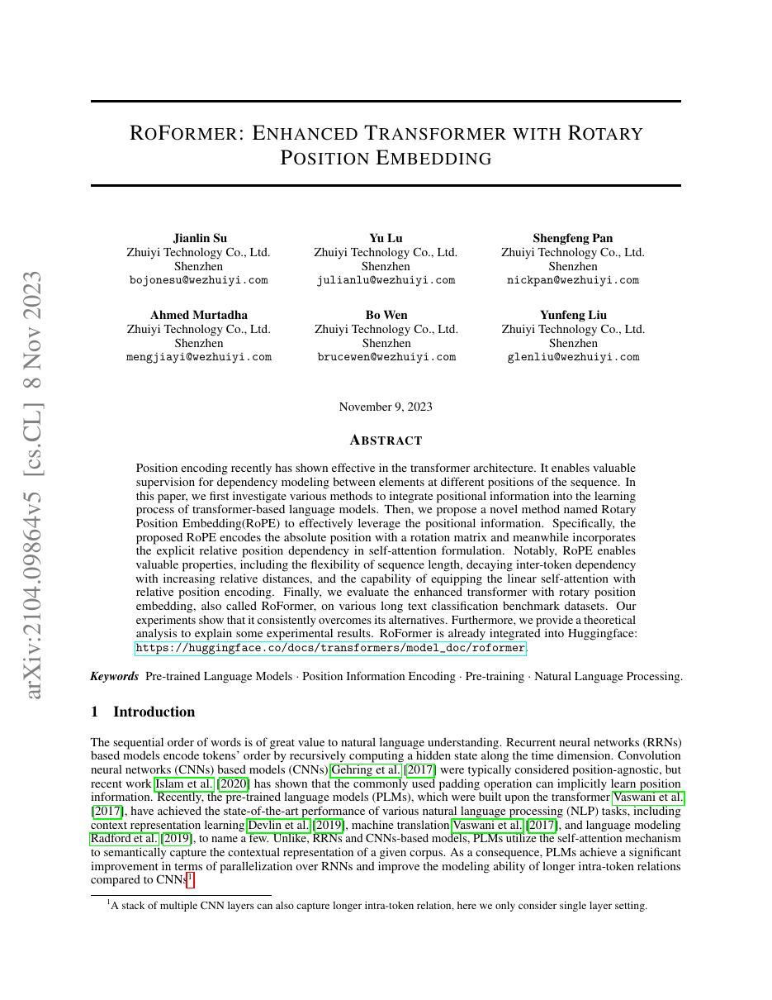
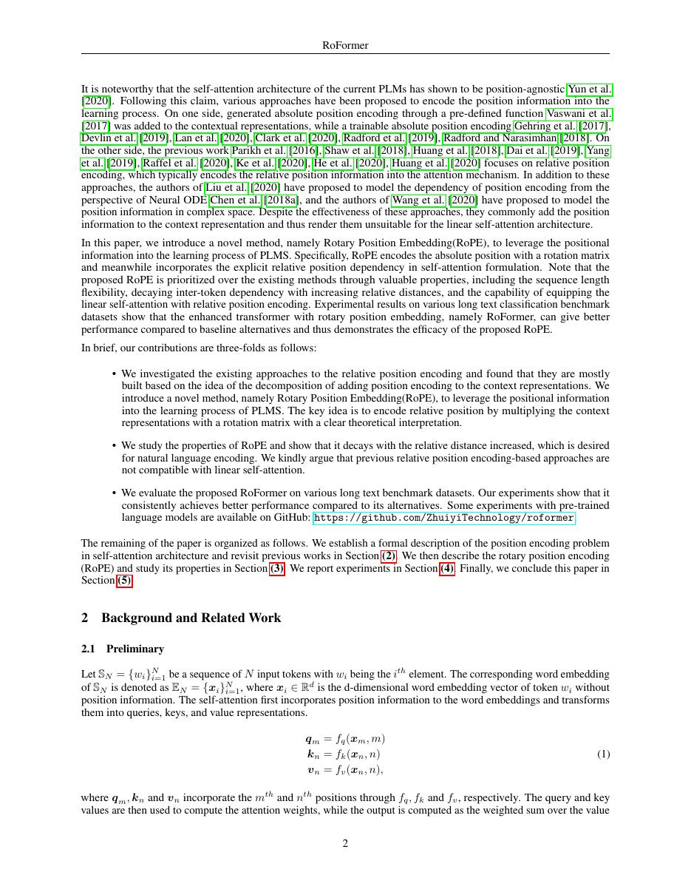
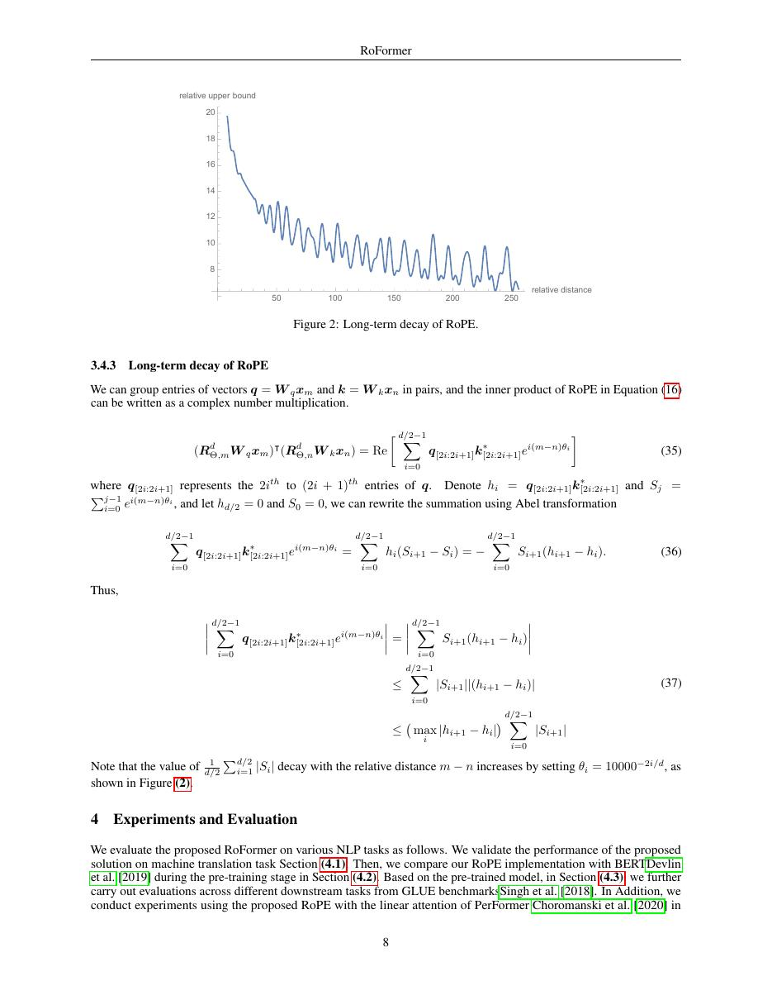
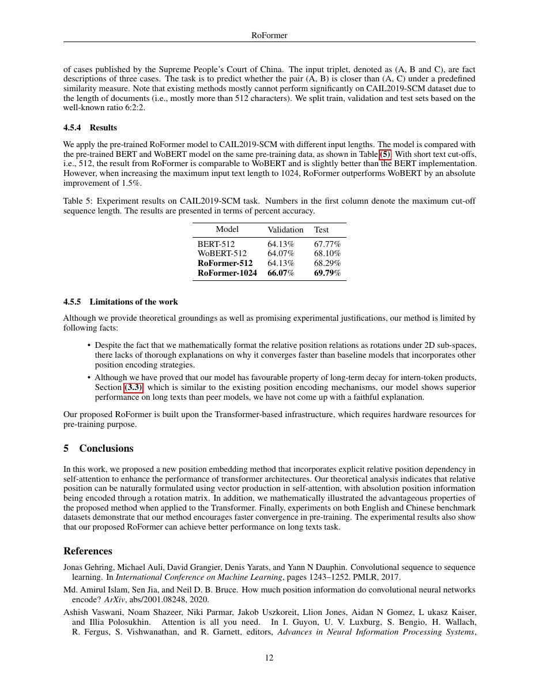

# 论文中文解读：《RoFormer: Enhanced Transformer with Rotary Position Embedding》

## 一、它解决了什么

RoPE 通过对 Q/K 的二维子空间施加随位置变化的旋转，使点积自然依赖相对位置，同时保留绝对位置信息。

## 二、核心机制

第 m 个位置按不同频率旋转向量对；R_mᵀR_n=R_{n-m}，因此 attention score 中位置关系以相对相位出现。它不增加 KV 维度，适合 decoder-only 与缓存推理。

## 三、为什么成为主线

RoPE 被 LLaMA、Qwen、DeepSeek 等大量 LLM 采用，并成为 context extension 技术的主要改造对象。

## 四、证据应该怎样读

速度、显存、精度或 benchmark 数字只在论文给定的模型、数据、硬件、kernel 版本和评测预算下成立。跨论文比较前要统一训练 tokens、输入长度、batch、精度、采样/思考预算与是否使用工具。

## 五、局限与易误读点

原始频率在远超训练长度时会产生相位分布偏移；所谓 RoPE scaling 包含插值、NTK-aware、YaRN 等不同方法，不能等同原论文保证。

## 六、放进十年演进史

与 ALiBi 对比旋转几何与线性 bias；与 Transformer-XL 对比相对位置如何进入 attention score。

## 七、原文入口

[官方论文/页面](https://arxiv.org/abs/2104.09864)

## 八、原文论证链

RoFormer 提出旋转位置编码（RoPE）：不把位置向量直接加到 token embedding，而是按位置对 query/key 的二维子空间做旋转。这样，位置 $m$ 与 $n$ 的内积只依赖相对位移 $m-n$，同时保留绝对位置信息在各自旋转相位中。论文将它用于 Transformer，并从内积形式、距离衰减直觉与语言建模实验说明效果。

> 原文定位：[PDF 文件第 1 页](paper.pdf#page=1) · [对应截图](rendered_figures/page-1.jpg)

## 九、旋转怎样产生相对位置

二维情况下，位置 $m$ 的旋转矩阵
$$
R_m=
\begin{bmatrix}
\cos m\theta&-\sin m\theta\\
\sin m\theta&\cos m\theta
\end{bmatrix}.
$$
query/key 分别变为 $R_mq_m,R_nk_n$，内积为
$$
(R_mq_m)^\top(R_nk_n)
=q_m^\top R_{n-m}k_n,
$$
因为 $R_m^\top R_n=R_{n-m}$。高维向量被分成二维对，每对使用不同频率 $\theta_i$。value 通常不旋转；RoPE 改变的是 attention score 的相位关系。

> 原文定位：[PDF 文件第 2 页](paper.pdf#page=2) · [对应截图](rendered_figures/page-2.jpg)

## 十、实验与外推怎样读

原文比较绝对位置、相对位置等方案，在语言建模和下游任务上验证 RoPE。论文讨论的理论性质不等于现代大模型的任意长度外推保证；训练长度外的相位分布、低频覆盖和数值精度都会变化。后来的 position interpolation、NTK scaling、YaRN 是针对外推的再设计。

> 原文定位：[PDF 文件第 8 页](paper.pdf#page=8) · [对应截图](rendered_figures/page-8.jpg)

## 十一、复现检查

- 两两配对维度的排列方式要与 checkpoint 一致，half-split 与 interleaved 不可混用。
- 旋转应用于 Q/K，在多头后的 head dimension 上计算。
- 记录 base、最大训练长度及任何缩放策略。
- KV cache 中保存已旋转还是未旋转 K 必须和位置索引一致。

## 十二、常见误读

RoPE 不会减少 attention 的二次复杂度，也不是简单的正弦加法编码。相对性来自旋转矩阵的乘法恒等式；仅看到 cos/sin 并不能把所有正弦位置编码都称为 RoPE。

> 原文定位：[PDF 文件第 12 页](paper.pdf#page=12) · [对应截图](rendered_figures/page-12.jpg)

## 原文证据导航

以下页码按仓库内 PDF 的**文件页码**计，不等同于论文印刷页码。建议先读本节所指原文，再回看上面的中文解释。

- [打开原始 PDF](paper.pdf)
- [打开可检索文本](paper.txt)

| 中文笔记中的证据 | 原文位置 | 复核重点 |
|---|---|---|
| 原文首页、摘要与问题定义 | [PDF 文件第 1 页](paper.pdf#page=1) · [截图](rendered_figures/page-1.jpg) | 回到该页上下文，复核定义、图表或实验论证 |
| 核心方法、架构或算法定义所在关键页 | [PDF 文件第 2 页](paper.pdf#page=2) · [截图](rendered_figures/page-2.jpg) | 回到该页上下文，复核定义、图表或实验论证 |
| 实验、结果或关键分析所在原文页 | [PDF 文件第 8 页](paper.pdf#page=8) · [截图](rendered_figures/page-8.jpg) | 回到该页上下文，复核定义、图表或实验论证 |
| 讨论、结论或补充分析所在原文页 | [PDF 文件第 12 页](paper.pdf#page=12) · [截图](rendered_figures/page-12.jpg) | 回到该页上下文，复核定义、图表或实验论证 |
