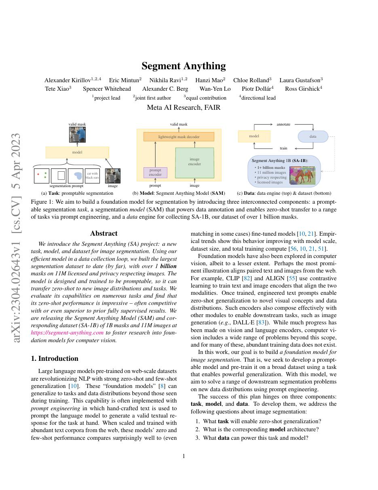
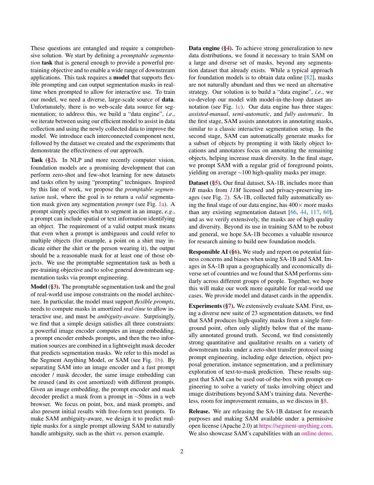
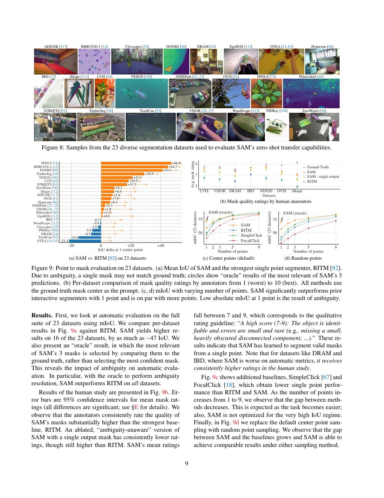
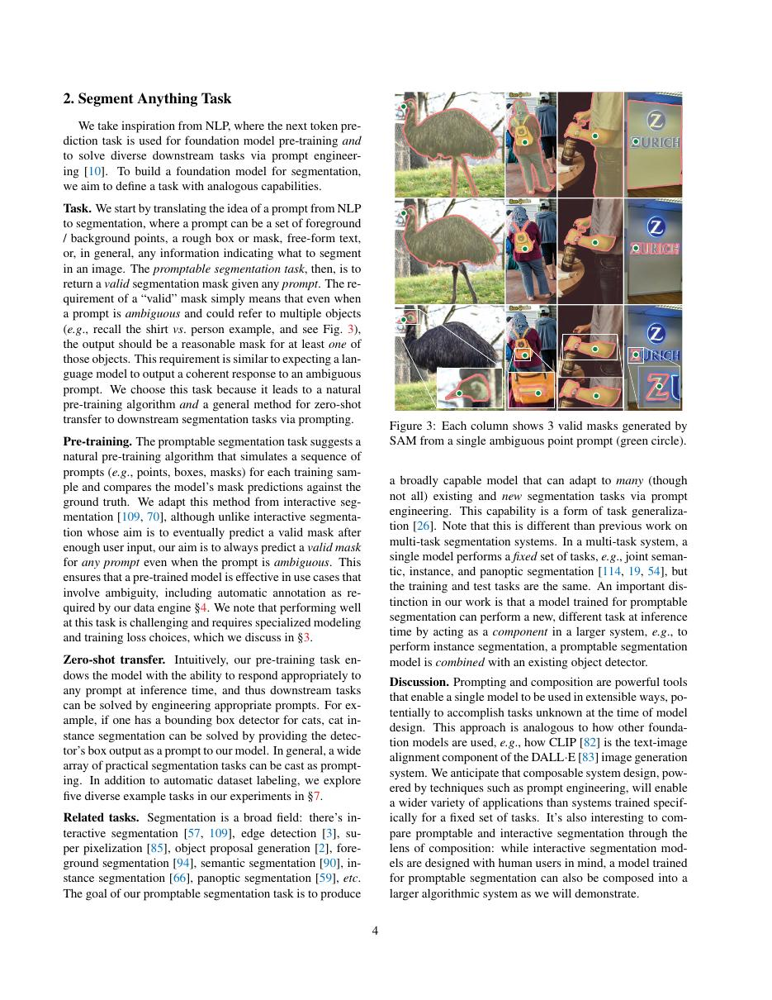

# 论文中文解读：《Segment Anything》

## 一、它解决了什么

SAM 把分割定义为 promptable task：同一模型接收点、框、粗 mask 等提示，输出可迁移到新类别的分割结果。

## 二、核心机制

重型 ViT image encoder 可预计算 embedding；轻量 prompt encoder 与 mask decoder 支持交互式低延迟。对歧义 prompt 输出多个 masks。SA-1B 通过模型辅助数据引擎迭代采集约十亿 masks。

## 三、为什么成为主线

它把视觉 foundation model 从分类/表征扩展到通用像素级接口，并形成大规模标注工具和下游适配生态。

## 四、证据应该怎样读

速度、显存、精度或 benchmark 数字只在论文给定的模型、数据、硬件、kernel 版本和评测预算下成立。跨论文比较前要统一训练 tokens、输入长度、batch、精度、采样/思考预算与是否使用工具。

## 五、局限与易误读点

“segment anything”不是语义理解保证；细结构、低对比和专业领域会失败。数据引擎中的模型偏差可能被放大，image encoder 计算仍重。

## 六、放进十年演进史

与 ViT/Swin 看视觉 backbone；与 CLIP 比较开放词汇语义对齐和 promptable geometry 两种 foundation interface。

## 七、原文入口

[官方论文/页面](https://arxiv.org/abs/2304.02643)

## 八、原文论证链

SAM 把分割改写为 promptable task：输入图像加点、框、粗 mask 或文本式提示，模型应返回相应 mask。作者希望用一个统一接口连接交互分割、自动标注和零样本迁移。系统由重型 image encoder、轻量 prompt encoder 与 mask decoder 组成；同一图像的 embedding 可缓存，因此用户每次点击只需运行轻量部分。

数据不是静态前提，而是“模型—标注—再训练”的 data engine。人工辅助阶段由标注员用模型修正 mask；半自动阶段让模型先提候选；全自动阶段以网格点生成并过滤 mask，最终形成 SA-1B。

> 原文定位：[PDF 文件第 1 页](paper.pdf#page=1) · [对应截图](rendered_figures/page-1.jpg)

## 九、歧义感知输出

一个点可能对应物体局部、整体或多个嵌套区域，所以单一 ground-truth mask 不足。SAM 对一个 prompt 输出多个候选 mask，并预测每个 mask 的 IoU/质量。训练损失组合 focal loss 与 dice loss，匹配候选中最接近标注的结果。这不是普通 semantic segmentation：输出不必带类别，目标由 prompt 指定。

mask decoder 使用 prompt token 与图像 embedding 的双向交互，再通过动态 mask head 生成结果。速度设计使 prompt 响应接近实时，但首次图像编码仍较重。

> 原文定位：[PDF 文件第 2 页](paper.pdf#page=2) · [对应截图](rendered_figures/page-2.jpg)

## 十、实验怎样读

零样本评测把其他分割任务转换为点/框提示，比较 mask quality；边缘检测等任务则通过后处理适配。结果证明接口广泛可迁移，但不同 prompt 质量对分数影响显著。SA-1B 的 11M 图像、约 1B mask 展示数据规模，也需结合许可、地域分布、隐私和偏差限制阅读。

> 原文定位：[PDF 文件第 9 页](paper.pdf#page=9) · [对应截图](rendered_figures/page-9.jpg)

## 十一、复现检查

- 固定 prompt 采样策略；中心点、随机点和错误点击难度不同。
- 多 mask 输出与 predicted IoU 排序不能在实现中省略。
- 区分 image encoder 延迟与每次 prompt decoder 延迟。
- 自动数据引擎的 stability、NMS、面积阈值会改变 mask 分布。

## 十二、常见误读

SAM 不是开放词汇语义识别模型，mask 本身没有类别名；强分割先验也不保证医学、遥感等领域零样本可靠。data engine 是系统贡献的一部分，不应只把论文读成一个网络结构。

> 原文定位：[PDF 文件第 4 页](paper.pdf#page=4) · [对应截图](rendered_figures/page-4.jpg)

## 原文证据导航

以下页码按仓库内 PDF 的**文件页码**计，不等同于论文印刷页码。建议先读本节所指原文，再回看上面的中文解释。

- [打开原始 PDF](paper.pdf)
- [打开可检索文本](paper.txt)

| 中文笔记中的证据 | 原文位置 | 复核重点 |
|---|---|---|
| 原文首页、摘要与问题定义 | [PDF 文件第 1 页](paper.pdf#page=1) · [截图](rendered_figures/page-1.jpg) | 回到该页上下文，复核定义、图表或实验论证 |
| 核心方法、架构或算法定义所在关键页 | [PDF 文件第 2 页](paper.pdf#page=2) · [截图](rendered_figures/page-2.jpg) | 回到该页上下文，复核定义、图表或实验论证 |
| 实验、结果或关键分析所在原文页 | [PDF 文件第 9 页](paper.pdf#page=9) · [截图](rendered_figures/page-9.jpg) | 回到该页上下文，复核定义、图表或实验论证 |
| 讨论、结论或补充分析所在原文页 | [PDF 文件第 4 页](paper.pdf#page=4) · [截图](rendered_figures/page-4.jpg) | 回到该页上下文，复核定义、图表或实验论证 |
