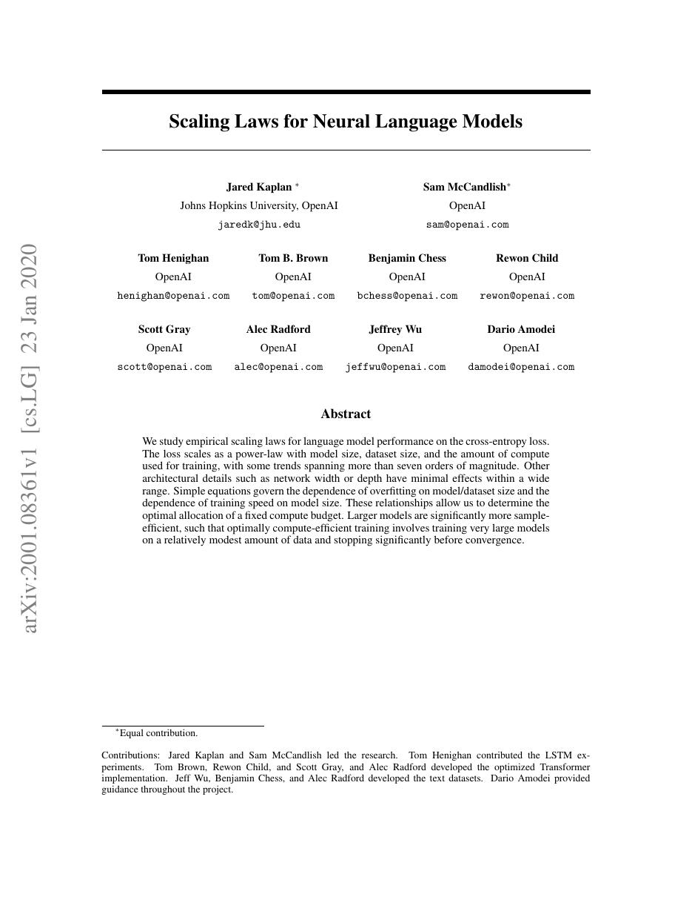
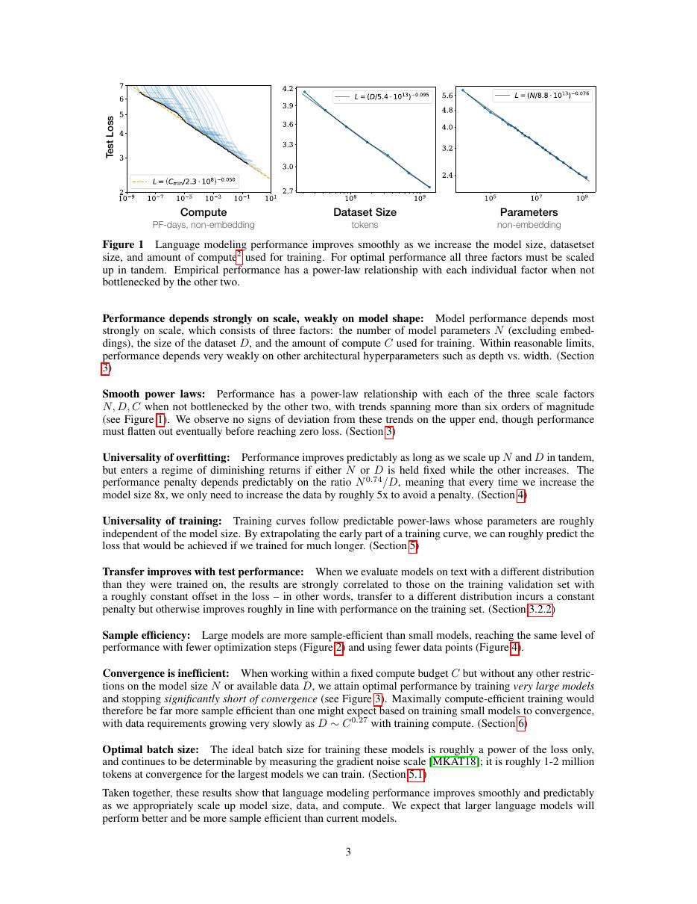
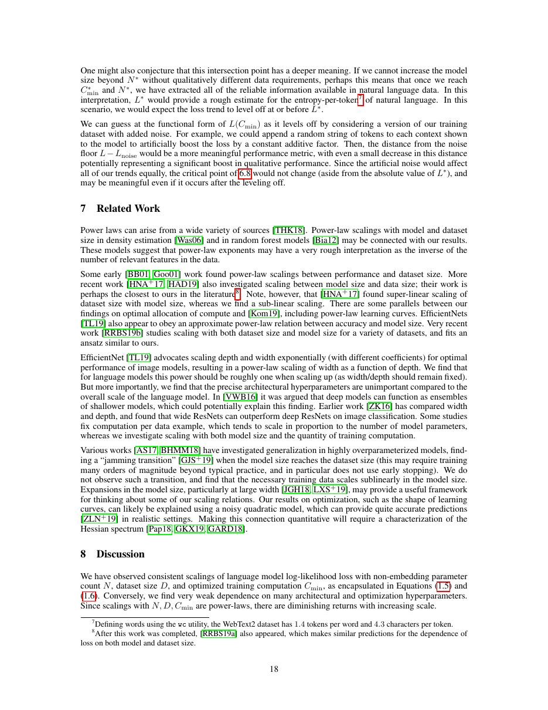
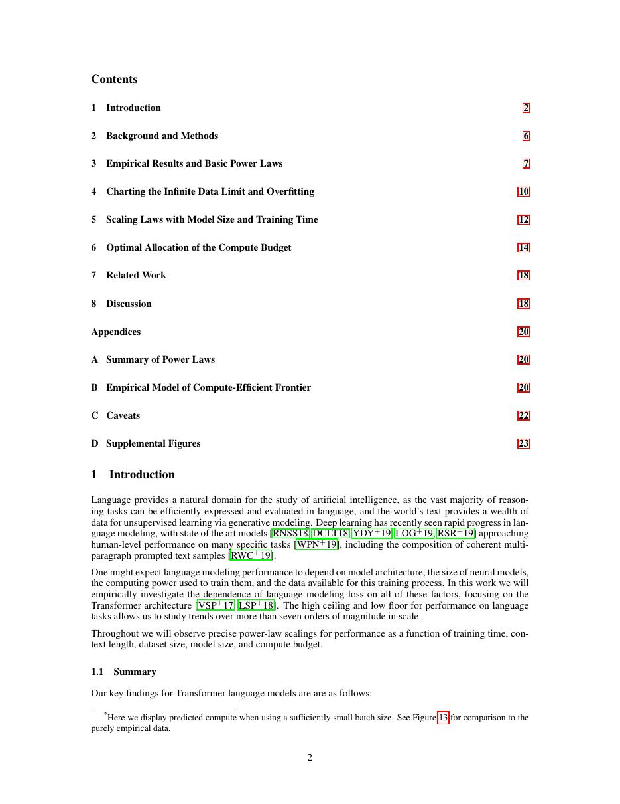

# 论文中文解读：《Scaling Laws for Neural Language Models》

## 一、它解决了什么

该论文用经验幂律描述语言模型 loss 随参数量、数据量和训练计算增长的变化，推动以可预测 scaling 规划大模型。

## 二、核心机制

在未被其他瓶颈限制的区域，cross-entropy 近似按 N、D、C 的幂下降；作者进一步讨论固定 compute 下参数与 token 的配置。关键是拟合平滑趋势和识别 bottleneck，而不是认为“规模自动解决一切”。

## 三、为什么成为主线

Scaling laws 让昂贵大训练从一次性豪赌变成可由小实验外推的工程决策，影响 GPT-3、GPT-4 与大量 frontier training。

## 四、应该怎样读证据

论文里的结果首先证明方法在当时数据、模型规模、硬件和评测协议下成立。跨年代比较时要统一参数量、训练 tokens、数据质量、上下文长度、推理预算与系统实现，不能只横比单个最佳分数。

## 五、局限与易误读点

原论文给出的 compute-optimal 配比后来被 Chinchilla 在更充分训练设置下修正；幂律只在所测分布和尺度内成立，且不预测安全、推理可靠性或下游效用。

## 六、放进十年演进史

紧接着读 Chinchilla，理解为什么同一 compute 下应使用更小模型、更多 tokens；再读 GPT-4 的 predictable scaling。

## 七、原文入口

[官方论文/页面](https://arxiv.org/abs/2001.08361)

## 八、原文论证链

论文研究的是语言模型损失如何随参数量 $N$、数据量 $D$ 和训练计算 $C$ 变化。作者在多个数量级上训练模型，观察到在尚未被其他瓶颈限制的区间，测试交叉熵可由幂律加不可约项近似。更重要的是，在固定计算预算下，参数、数据和训练步数应如何配比，而不是单纯“越大越好”。

原文先分别拟合单变量规模律，再分析有限计算的最优前沿，并讨论过拟合何时由 $N/D$ 比例触发。其结论属于当时的模型族、数据和优化设置；Chinchilla 后来用不同实验范围修正了 compute-optimal 配比。

> 原文定位：[PDF 文件第 1 页](paper.pdf#page=1) · [对应截图](rendered_figures/page-1.jpg)

## 九、幂律该怎样解释

典型形式可写成
$$
L(N)\approx L_\infty+\left(\frac{N_c}{N}\right)^{\alpha_N},
\quad
L(D)\approx L_\infty+\left(\frac{D_c}{D}\right)^{\alpha_D}.
$$
在 log–log 坐标中，去掉不可约项后近似直线。指数小意味着每降低同样比例的损失，需要成倍增加资源。固定计算近似 $C\propto N\times$ 训练 token；最优点来自“大模型训练少一些”与“小模型训练久一些”的权衡。

这些是经验拟合，不是从第一性原理推出的自然定律。外推必须检查模型架构、tokenizer、数据质量和训练是否仍处在同一 regime。

> 原文定位：[PDF 文件第 3 页](paper.pdf#page=3) · [对应截图](rendered_figures/page-3.jpg)

## 十、图表怎样读

应优先看散点是否覆盖多个数量级、拟合残差及不同受限条件的包络线，而非只记某个指数。论文发现模型大小是样本效率的重要决定因素，并给出当时倾向更大模型、较少训练步数的计算最优建议。不能拿单次训练曲线直接验证规模律；需要一组系统 sweep。

> 原文定位：[PDF 文件第 18 页](paper.pdf#page=18) · [对应截图](rendered_figures/page-18.jpg)

## 十一、复现检查

- 统一 tokenizer 和每 token loss 定义，注明是否排除 embedding 参数。
- 同时记录实际 FLOPs、训练 token、参数量和是否提前停止。
- 拟合时区分数据受限、参数受限和优化未收敛样本。
- 给出指数置信区间，并测试删除端点后是否稳定。

## 十二、常见误读

幂律不意味着性能无限无成本增长，也不预测具体涌现能力。本文的 compute-optimal 结论不是最终定论；它最重要的贡献是把扩容从“凭经验做一个大模型”变成可测量的资源配置问题。

> 原文定位：[PDF 文件第 2 页](paper.pdf#page=2) · [对应截图](rendered_figures/page-2.jpg)

## 原文证据导航

以下页码按仓库内 PDF 的**文件页码**计，不等同于论文印刷页码。建议先读本节所指原文，再回看上面的中文解释。

- [打开原始 PDF](paper.pdf)
- [打开可检索文本](paper.txt)

| 中文笔记中的证据 | 原文位置 | 复核重点 |
|---|---|---|
| 原文首页、摘要与问题定义 | [PDF 文件第 1 页](paper.pdf#page=1) · [截图](rendered_figures/page-1.jpg) | 回到该页上下文，复核定义、图表或实验论证 |
| 核心方法、架构或算法定义所在关键页 | [PDF 文件第 3 页](paper.pdf#page=3) · [截图](rendered_figures/page-3.jpg) | 回到该页上下文，复核定义、图表或实验论证 |
| 实验、结果或关键分析所在原文页 | [PDF 文件第 18 页](paper.pdf#page=18) · [截图](rendered_figures/page-18.jpg) | 回到该页上下文，复核定义、图表或实验论证 |
| 讨论、结论或补充分析所在原文页 | [PDF 文件第 2 页](paper.pdf#page=2) · [截图](rendered_figures/page-2.jpg) | 回到该页上下文，复核定义、图表或实验论证 |
