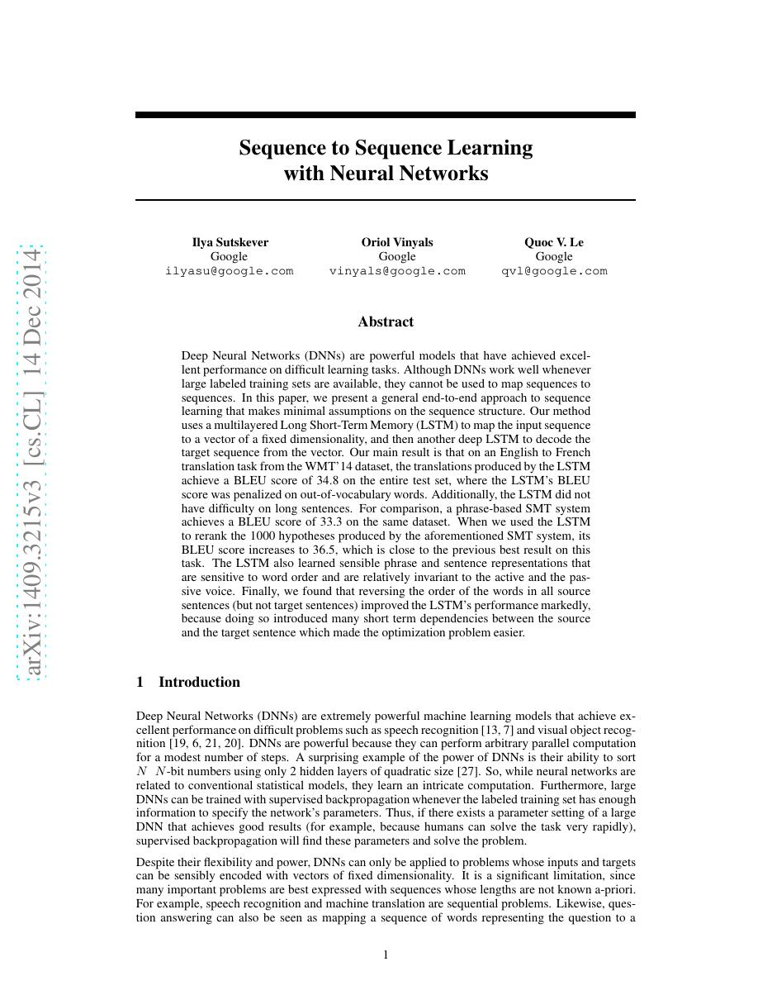
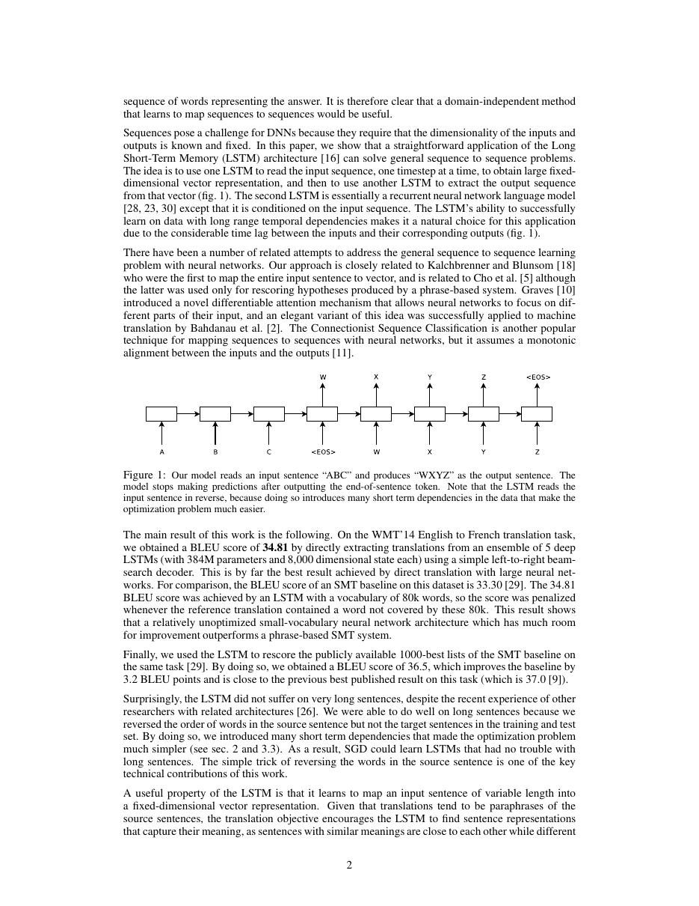
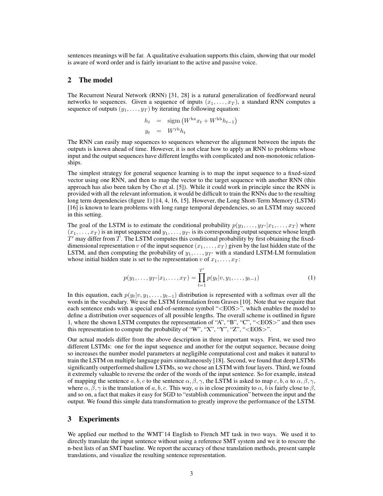
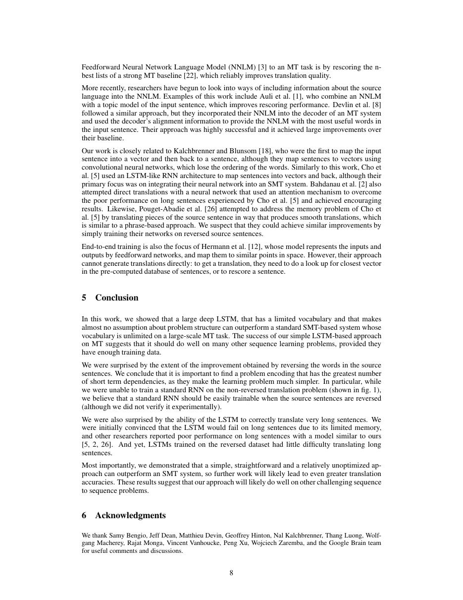

# 论文中文解读：《Sequence to Sequence Learning with Neural Networks》

## 一、它解决了什么

Seq2Seq 用一个多层 LSTM 编码输入、另一个 LSTM 自回归解码输出，把翻译等任务统一为条件序列生成。

## 二、核心机制

编码器把整句压进最后状态，解码器据此生成目标序列；beam search 搜索高概率输出。反转源句顺序缩短源端对应词与目标端早期词之间的最小依赖距离，是一个简单却关键的优化技巧。

## 三、为什么成为主线

它确立了 encoder–decoder 和 teacher forcing 范式，后来被 Attention、Transformer 以及现代多模态生成模型沿用。

## 四、应该怎样读证据

论文里的结果首先证明方法在当时数据、模型规模、硬件和评测协议下成立。跨年代比较时要统一参数量、训练 tokens、数据质量、上下文长度、推理预算与系统实现，不能只横比单个最佳分数。

## 五、局限与易误读点

单一固定长度向量形成信息瓶颈，长句退化明显；训练目标与自回归推理分布不一致，并且 RNN 时间维不能充分并行。

## 六、放进十年演进史

Bahdanau Attention 直接解决固定向量瓶颈；Transformer 再移除循环依赖。

## 七、原文入口

[官方论文/页面](https://arxiv.org/abs/1409.3215)

## 八、原文论证链

论文用一个深层 LSTM 把可变长源序列编码为向量 $v$，另一个 LSTM 自回归生成可变长目标序列，统一了机器翻译中的长度变化。作者还发现反转源句词序会缩短许多对应词之间的最小时间距离，使 SGD 更容易建立早期对齐。固定向量仍是瓶颈，后来的 attention 正是对此修正。

> 原文定位：[PDF 文件第 1 页](paper.pdf#page=1) · [对应截图](rendered_figures/page-1.jpg)

## 九、概率分解

编码器递推到最终状态：
$$
h_t=f(h_{t-1},x_t),\qquad v=h_T.
$$
解码器分解条件概率：
$$
p(y_1,\ldots,y_{T'}\mid x)
=\prod_{t=1}^{T'}p(y_t\mid v,y_{<t}).
$$
训练使用真实目标前缀（teacher forcing），推理用自身预测并通过 beam search 近似寻找高概率句子，因此存在 exposure error。反转只改变优化距离，没有消除 $v$ 的信息压缩。

> 原文定位：[PDF 文件第 2 页](paper.pdf#page=2) · [对应截图](rendered_figures/page-2.jpg)

## 十、实验怎样读

WMT 英法结果既报告模型单独解码，也报告作为传统系统重排序器的效果；两者不能混为同一结论。长句分桶分析与表示可视化用于支持模型捕获句义和词序，但 BLEU 是语料级近似指标，不保证逐句忠实。

> 原文定位：[PDF 文件第 3 页](paper.pdf#page=3) · [对应截图](rendered_figures/page-3.jpg)

## 十一、复现检查

- 明确 BOS/EOS、词表截断、未知词和最大长度。
- loss 按有效 token 归一化并屏蔽 padding。
- 报告 beam size、长度归一化和是否 ensemble。
- 反转源序消融要保持容量、训练步数和数据相同。

## 十二、常见误读

Seq2seq 是条件序列建模范式，不等于固定层数的 LSTM。原文没有 attention 或 subword；源序反转也是优化技巧，不意味着语言应倒序表示。

> 原文定位：[PDF 文件第 8 页](paper.pdf#page=8) · [对应截图](rendered_figures/page-8.jpg)

## 原文证据导航

以下页码按仓库内 PDF 的**文件页码**计，不等同于论文印刷页码。建议先读本节所指原文，再回看上面的中文解释。

- [打开原始 PDF](paper.pdf)
- [打开可检索文本](paper.txt)

| 中文笔记中的证据 | 原文位置 | 复核重点 |
|---|---|---|
| 原文首页、摘要与问题定义 | [PDF 文件第 1 页](paper.pdf#page=1) · [截图](rendered_figures/page-1.jpg) | 回到该页上下文，复核定义、图表或实验论证 |
| 核心方法、架构或算法定义所在关键页 | [PDF 文件第 2 页](paper.pdf#page=2) · [截图](rendered_figures/page-2.jpg) | 回到该页上下文，复核定义、图表或实验论证 |
| 实验、结果或关键分析所在原文页 | [PDF 文件第 3 页](paper.pdf#page=3) · [截图](rendered_figures/page-3.jpg) | 回到该页上下文，复核定义、图表或实验论证 |
| 讨论、结论或补充分析所在原文页 | [PDF 文件第 8 页](paper.pdf#page=8) · [截图](rendered_figures/page-8.jpg) | 回到该页上下文，复核定义、图表或实验论证 |
