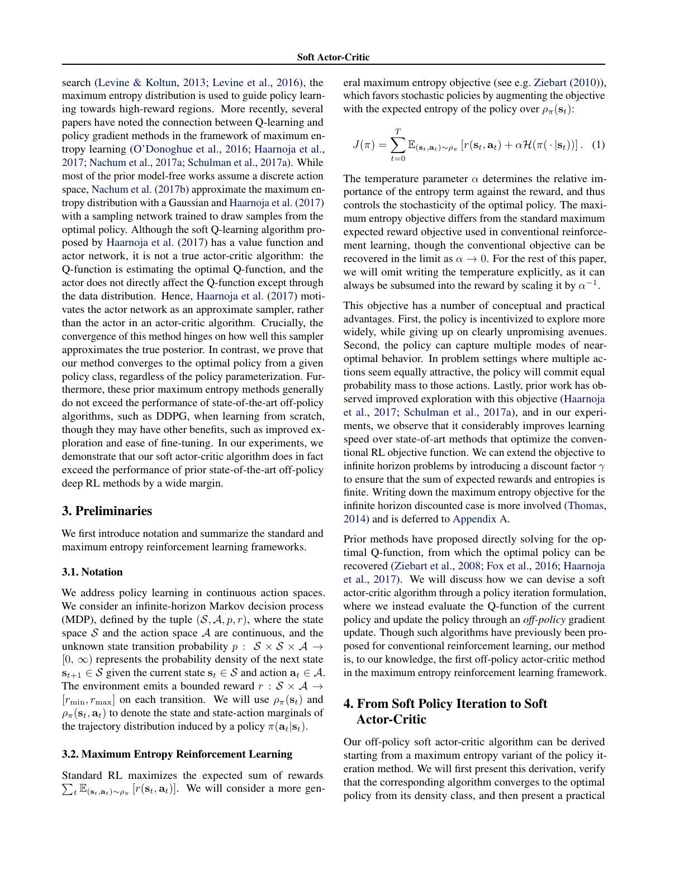
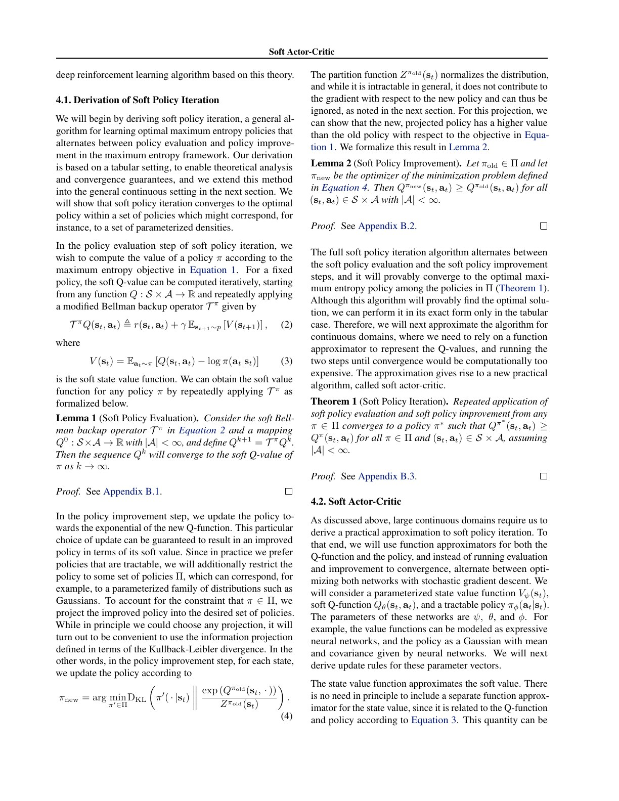
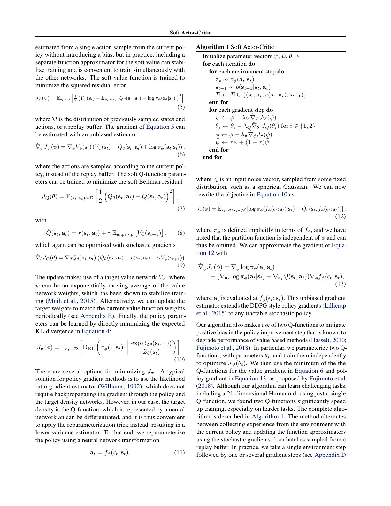
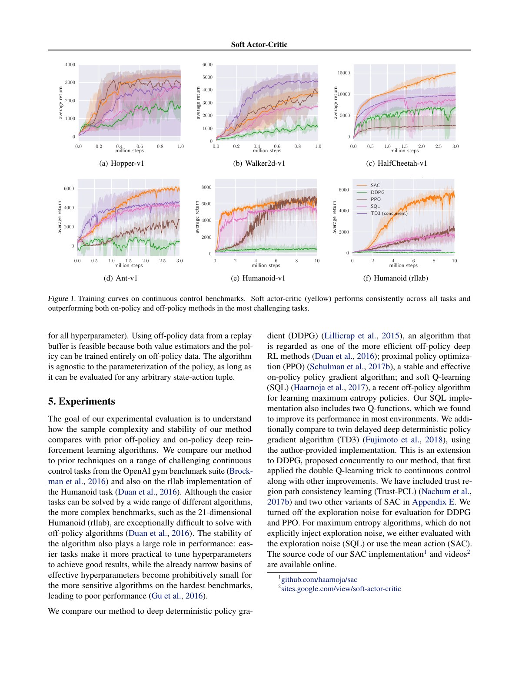
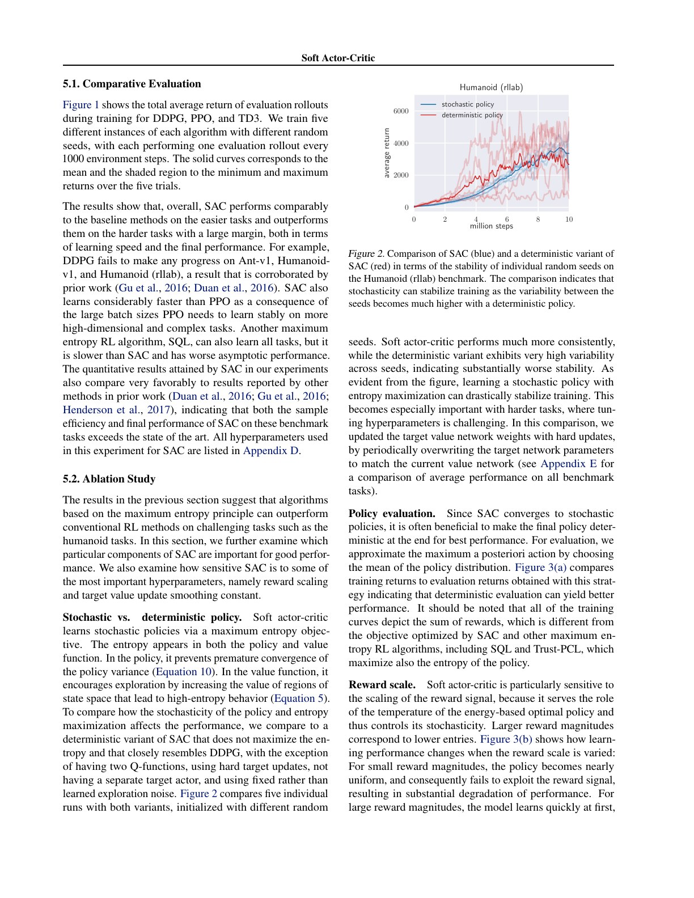
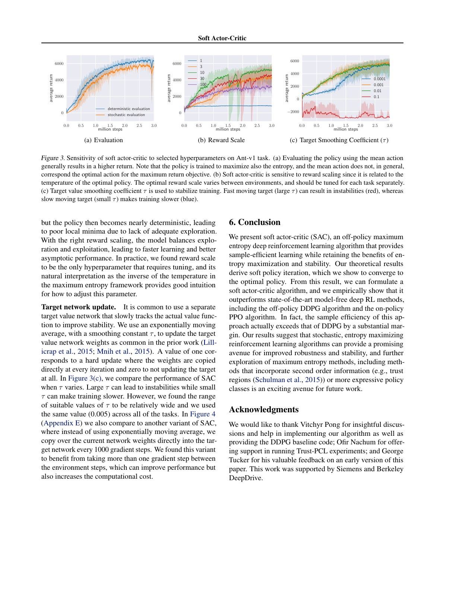

# 论文中文解读：Soft Actor-Critic

> 原文：[Soft Actor-Critic: Off-Policy Maximum Entropy Deep Reinforcement Learning with a Stochastic Actor](https://proceedings.mlr.press/v80/haarnoja18b.html)
>
> Tuomas Haarnoja、Aurick Zhou、Pieter Abbeel、Sergey Levine，ICML 2018。
>
> 本地材料：[`PDF`](paper.pdf) · [`全文`](paper.txt) · [`论文概要`](论文概要.md)

## 0. 论文要同时解决的两个矛盾

2018 年的连续控制方法大致有两难：

- PPO/TRPO 这类 on-policy 方法稳定，但每次策略更新都要重新收集数据；
- DDPG 这类 off-policy 方法能复用 replay data，却对超参数和随机种子很敏感，复杂 Humanoid 上常崩。

SAC 的回答是把三件事绑在一起：off-policy actor-critic、随机策略、最大熵目标。replay 提高数据效率，随机 actor 处理连续动作，熵目标让策略保留多种高价值行为并持续探索。

## 1. 最大熵不是“越随机越好”

论文目标为：

$$
J(\pi)=\sum_{t=0}^{T}
\mathbb E_{(s_t,a_t)\sim\rho_\pi}
[r(s_t,a_t)+\alpha\mathcal H(\pi(\cdot\mid s_t))].
$$

$\alpha$ 是温度：$\alpha\to0$ 时回到普通最大回报 RL；$\alpha$ 较大时，更愿意牺牲部分回报以保留随机性。一个等价直觉是最优策略满足

$$
\pi^*(a\mid s)\propto \exp(Q^*(s,a)/\alpha).
$$

所以高 Q 动作仍更可能被选，只是多个近优解不会过早塌成一个点。这在模型误差、未建模扰动或多模态行为中可能更稳健。

论文正文为简化推导常把 $\alpha$ 吸收到 reward scale 中；这也直接造成原始实现对奖励尺度敏感。

## 2. 软 Bellman 方程与策略改进

固定策略的 soft value 定义为：

$$
V^\pi(s)=\mathbb E_{a\sim\pi}
[Q^\pi(s,a)-\alpha\log\pi(a\mid s)].
$$

于是 soft Bellman backup 为：

$$
\mathcal T^\pi Q(s,a)=r(s,a)+\gamma\mathbb E_{s'}[V^\pi(s')].
$$

策略改进不是直接求连续动作上的 $\arg\max_aQ$，而是把可表示策略族 $\Pi$ 投影向能量分布：

$$
\pi_{new}=\arg\min_{\pi'\in\Pi}
D_{KL}\left(
\pi'(\cdot\mid s)\,\middle\|\,
\frac{\exp(Q^{\pi_{old}}(s,\cdot)/\alpha)}{Z(s)}
\right).
$$

论文在有限动作的 tabular 设置证明软策略评估收敛，软策略改进不会降低 soft Q，交替执行收敛到策略族中的最优最大熵策略。这个定理不等于深网版本的全局收敛保证：实用算法使用函数逼近、有限 minibatch 和交替一步更新。

## 3. 从理论迭代到实用 SAC

原始 SAC 有四类参数：policy $\pi_\phi$、value $V_\psi$、target value $V_{\bar\psi}$、两套 Q $Q_{\theta_1},Q_{\theta_2}$。

### 3.1 Value loss

$$
J_V(\psi)=\mathbb E_{s\sim D}\left[
\frac12\left(
V_\psi(s)-
\mathbb E_{a\sim\pi_\phi}[Q_\theta(s,a)-\alpha\log\pi_\phi(a\mid s)]
\right)^2
\right].
$$

实际取两个 Q 的较小值。单独 value 网络理论上可省，但论文发现它便于稳定训练。

### 3.2 Q loss

$$
J_Q(\theta_i)=\mathbb E_{(s,a,r,s')\sim D}\left[
\frac12(Q_{\theta_i}(s,a)-\hat Q)^2
\right],
$$

$$
\hat Q=r+\gamma V_{\bar\psi}(s').
$$

target value 用指数滑动平均更新，作用与 DQN 的 target network 同源。

### 3.3 Policy loss

通过重参数化 $a=f_\phi(\epsilon;s)$，可写成：

$$
J_\pi(\phi)=\mathbb E_{s\sim D,\epsilon}
[\alpha\log\pi_\phi(a\mid s)-\min_iQ_{\theta_i}(s,a)].
$$

第一项奖励高熵，第二项推动高 Q 动作。重参数化能把 Q 对动作的梯度直接传回 actor，通常比 likelihood-ratio 估计方差低。

## 4. 为什么要双 Q

actor 会主动寻找 critic 估得最高的动作，也会放大 Q 网络的正误差。SAC 独立训练两个 Q，并在 value/policy target 中取较小值，降低过估计偏差。这与 Double Q/TD3 的思想相近，但不能消除欠估计或两 critic 相关误差。

论文指出单 Q 也能训练 Humanoid，但双 Q 明显加速困难任务。这是组件层面的经验结论，不是最大熵理论本身的必然要求。

## 5. Figure 1：样本效率和稳定性主结果

比较包含 SAC、DDPG、PPO、soft Q-learning 与同期 TD3。每个算法 5 个 seed，实线为均值，阴影为最小到最大值。

- Hopper/Walker/HalfCheetah 等较易任务上，多种算法都能学习；
- Ant 与两个 Humanoid 上差距扩大，DDPG 常完全无进展；
- SAC 相比 PPO 使用 replay，因而以环境步数计学习更快；
- SAC 在复杂任务上的 seed 区间相对集中。

不过“样本效率”以 simulator environment steps 计，不包含每步梯度计算、网络规模和 wall-clock；off-policy 每个环境步可做更多计算。论文也用了作者实现、调参方式不同的多套基线，不能把图当作跨代码库的绝对排行榜。

## 6. 随机策略是否真的带来稳定性

Figure 2 在 rllab Humanoid 上比较 SAC 与去掉熵最大化的确定性变体。确定性版本虽然仍保留双 Q 等部分组件，但 5 个 seed 分叉明显；SAC 更一致。证据支持“随机最大熵目标有助于稳定”，但不是纯粹只改变一个变量：确定性变体的探索方式和目标结构也随之改变。

训练时随机、部署评估时论文使用 Gaussian mean 作为近似 MAP 动作。Figure 3a 显示确定性评估通常取得更高原始回报，因为训练目标含熵，而报告的任务分数只计算环境 reward。这不是矛盾，而是两个目标不同。

## 7. 原始 SAC 最敏感的地方：reward scale

在省略显式 $\alpha$ 的写法中，把 reward 乘以常数等价于改变相对温度：

- reward 太小：熵占主导，策略接近均匀，无法充分利用奖励；
- reward 太大：策略很快接近确定性，探索不足，容易落入局部最优；
- 中间尺度才平衡探索与利用。

论文称 reward scale 是唯一需要按任务调的主要超参数，这也是后续 SAC 引入自动温度调节的重要动机。target smoothing $\tau$ 太大，target 跟在线网络太快而不稳；太小则学习慢。论文在所有任务用 $\tau=0.005$。

## 8. 这篇 SAC 与今天常用实现不完全相同

原论文版本：

- 有显式 $V_\psi$ 与 target $V_{\bar\psi}$；
- 通过 reward scale 间接控制温度；
- policy/value/Q 四类网络交替更新。

后续常用版本：

- 消去独立 value network；
- Q target 直接使用下一状态动作的 $\min Q-\alpha\log\pi$；
- 把 $\alpha$ 作为参数，针对目标熵自动优化。

因此阅读代码时看到“两 Q + actor + target Q，没有 V 网络”并不表示实现错了，而是采用后续修订版。实验比较必须锁定版本。

## 9. PPO、SAC、DQN 怎样选

| 情况 | 更自然的起点 | 原因 |
| --- | --- | --- |
| 离散动作、可大量模拟 | DQN 系 | 可枚举动作，replay 高效 |
| 连续动作、真实交互昂贵 | SAC | off-policy 复用、随机探索 |
| 环境易并行、实现与稳定优先 | PPO | on-policy 简单、调试直观 |
| 离线固定数据 | 都不能直接照搬 | 需处理分布外动作与 extrapolation error |

SAC 并不天然适合纯离线 RL：actor 会寻找数据支持之外被 Q 高估的动作，通常需要 conservative regularization 或 behavior constraint。

## 10. 复现审计

至少记录：

1. 使用原始 SAC 还是自动温度版；
2. reward scale 或 $\alpha$、目标熵及其优化方式；
3. Gaussian 是否 tanh-squash，以及 log-prob 的 Jacobian 修正；
4. 两个 Q 是否独立初始化、target 用何种最小值；
5. replay size、warm-up、update-to-data ratio、batch size；
6. terminal 与 time-limit truncation 的 bootstrap 处理；
7. 训练动作与评估动作是随机采样还是均值；
8. 每环境多个 seed 的均值、方差和最好/最坏轨迹。

## 11. 最终结论

SAC 的概念贡献是把“探索”写进最优控制目标，而不是在确定性策略外面临时加噪声；算法贡献则是把这套最大熵策略迭代做成可用 replay buffer 训练的连续动作 actor-critic。

它的证据最强处是困难连续控制上的样本复用和 seed 稳定性，最需要历史化理解的地方是 reward scale 与显式 value network。后续版本修掉了这两项主要工程负担，但最大熵、双 Q、replay 与随机 actor 的骨架保留至今。
