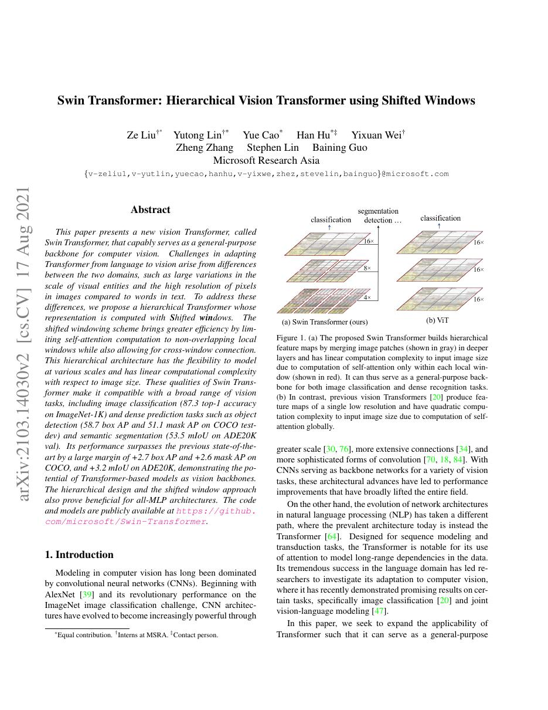
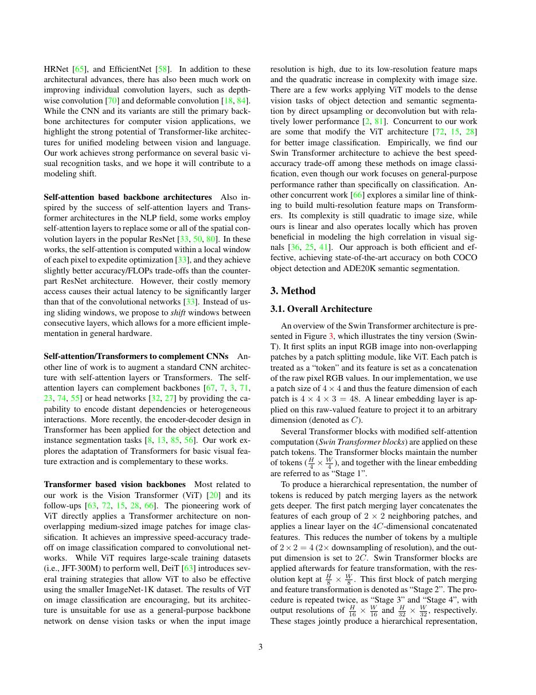
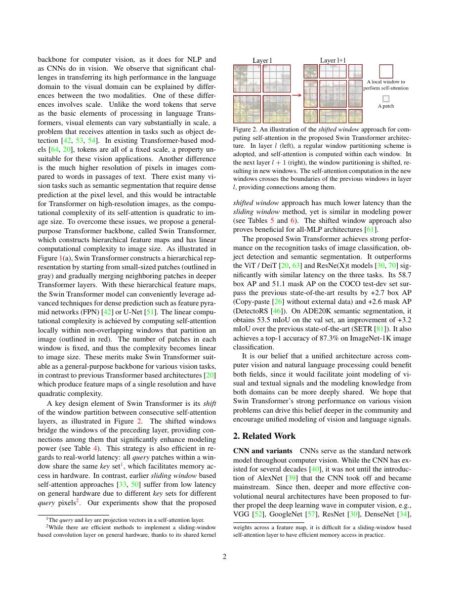
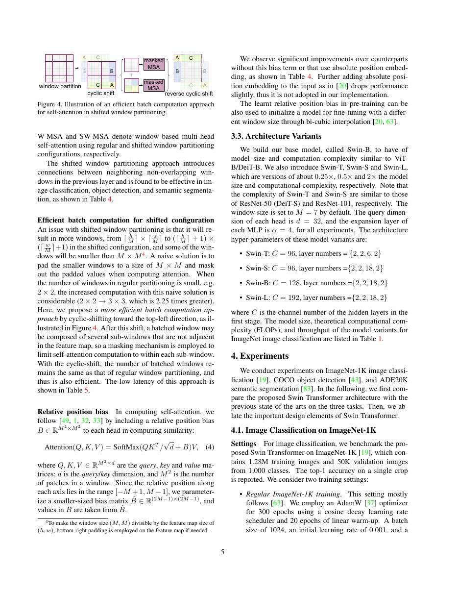

# 论文中文解读：《Swin Transformer: Hierarchical Vision Transformer using Shifted Windows》

## 一、它解决了什么

Swin 将 self-attention 限制在局部窗口，并在相邻层平移窗口，构造类似 CNN 的分层多尺度视觉主干。

## 二、核心机制

window attention 让复杂度随图像大小近似线性；shifted windows 让上一层不同窗口的 token 在下一层通信。patch merging 逐阶段降低分辨率、增加通道，适配检测与分割金字塔。

## 三、为什么成为主线

它让 Transformer 成为通用视觉 backbone，而不只做固定分辨率分类，并被检测、分割和多模态系统广泛采用。

## 四、证据应该怎样读

速度、显存、精度或 benchmark 数字只在论文给定的模型、数据、硬件、kernel 版本和评测预算下成立。跨论文比较前要统一训练 tokens、输入长度、batch、精度、采样/思考预算与是否使用工具。

## 五、局限与易误读点

窗口大小和 shift pattern 是强结构先验；实现需处理 cyclic shift、mask 和不规则分辨率。局部窗口仍可能限制远距全局关系。

## 六、放进十年演进史

与 ViT 的全局扁平序列对照；与 Longformer 类比局部稀疏 attention，但视觉还需要层级特征。

## 七、原文入口

[官方论文/页面](https://arxiv.org/abs/2103.14030)

## 八、原文论证链

标准 ViT 的全局 attention 随图像 token 数平方增长，且单尺度输出不便直接接入检测和分割。Swin Transformer 构造层次化特征：局部窗口内做 self-attention，若干 stage 之间用 patch merging 降低分辨率、增加通道；相邻 block 交替使用普通窗口和移位窗口，使跨窗口信息连接。这样，计算对像素数近似线性，又能输出类似 CNN 金字塔的多尺度特征。

> 原文定位：[PDF 文件第 1 页](paper.pdf#page=1) · [对应截图](rendered_figures/page-1.jpg)

## 九、窗口与移位

窗口大小为 $M\times M$ 时，每个窗口 attention 成本与 $M^4$ 有关，但窗口数约 $hw/M^2$，总成本约 $O(hwM^2)$；当 $M$ 固定，对图像面积线性。若每层窗口边界不变，不同窗口永远隔离。下一层平移 $M/2$ 后重新分窗，原来相邻窗口的 token 进入同一窗口。

高效实现采用 cyclic shift 加 attention mask，避免真的构造不规则窗口。相对位置 bias 在窗口内按二维位移索引。

> 原文定位：[PDF 文件第 3 页](paper.pdf#page=3) · [对应截图](rendered_figures/page-3.jpg)

## 十、实验怎样读

ImageNet 分类验证骨干表征；COCO 检测和 ADE20K 分割证明层次特征能服务 dense prediction。比较时需核对预训练数据、输入尺度、检测器 head 和多尺度测试。消融中 shifted window、相对位置 bias 和模型尺度分别支持各组件，而最终 SOTA 不能只归于其中一个。

> 原文定位：[PDF 文件第 2 页](paper.pdf#page=2) · [对应截图](rendered_figures/page-2.jpg)

## 十一、复现检查

- cyclic shift 后的 mask 必须阻止图像两端错误相连。
- patch merging 的 reshape、四邻域拼接和 LayerNorm 顺序要一致。
- 相对位置索引是二维到一维映射，需单元测试窗口角点。
- 实际吞吐受窗口 kernel 和内存布局影响，FLOPs 相近不代表速度相近。

## 十二、常见误读

shifted window 不是滑动卷积，也不是每个 token 每层都看全图；全局交互通过多层逐步形成。Swin 的优势来自稀疏局部 attention、层次下采样和视觉任务接口的组合。

> 原文定位：[PDF 文件第 5 页](paper.pdf#page=5) · [对应截图](rendered_figures/page-5.jpg)

## 原文证据导航

以下页码按仓库内 PDF 的**文件页码**计，不等同于论文印刷页码。建议先读本节所指原文，再回看上面的中文解释。

- [打开原始 PDF](paper.pdf)
- [打开可检索文本](paper.txt)

| 中文笔记中的证据 | 原文位置 | 复核重点 |
|---|---|---|
| 原文首页、摘要与问题定义 | [PDF 文件第 1 页](paper.pdf#page=1) · [截图](rendered_figures/page-1.jpg) | 回到该页上下文，复核定义、图表或实验论证 |
| 核心方法、架构或算法定义所在关键页 | [PDF 文件第 3 页](paper.pdf#page=3) · [截图](rendered_figures/page-3.jpg) | 回到该页上下文，复核定义、图表或实验论证 |
| 实验、结果或关键分析所在原文页 | [PDF 文件第 2 页](paper.pdf#page=2) · [截图](rendered_figures/page-2.jpg) | 回到该页上下文，复核定义、图表或实验论证 |
| 讨论、结论或补充分析所在原文页 | [PDF 文件第 5 页](paper.pdf#page=5) · [截图](rendered_figures/page-5.jpg) | 回到该页上下文，复核定义、图表或实验论证 |
