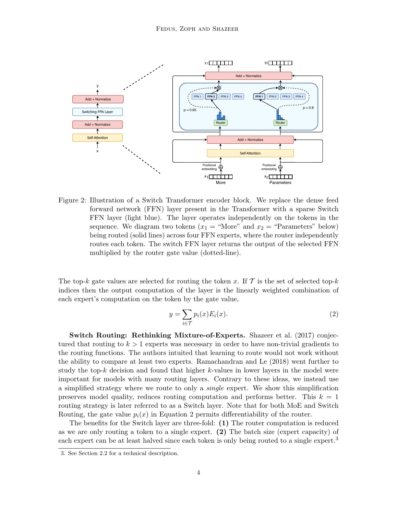
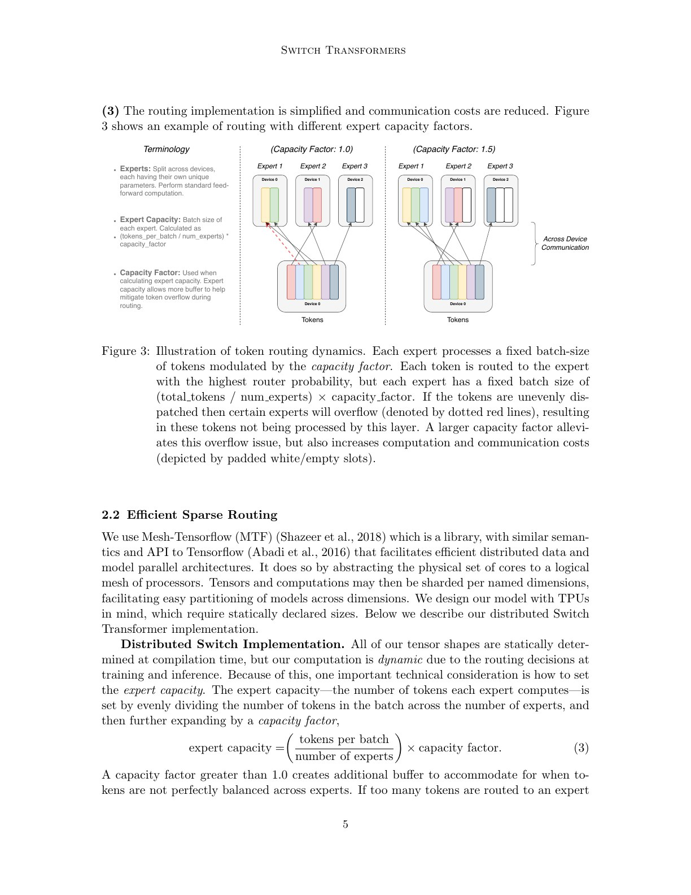
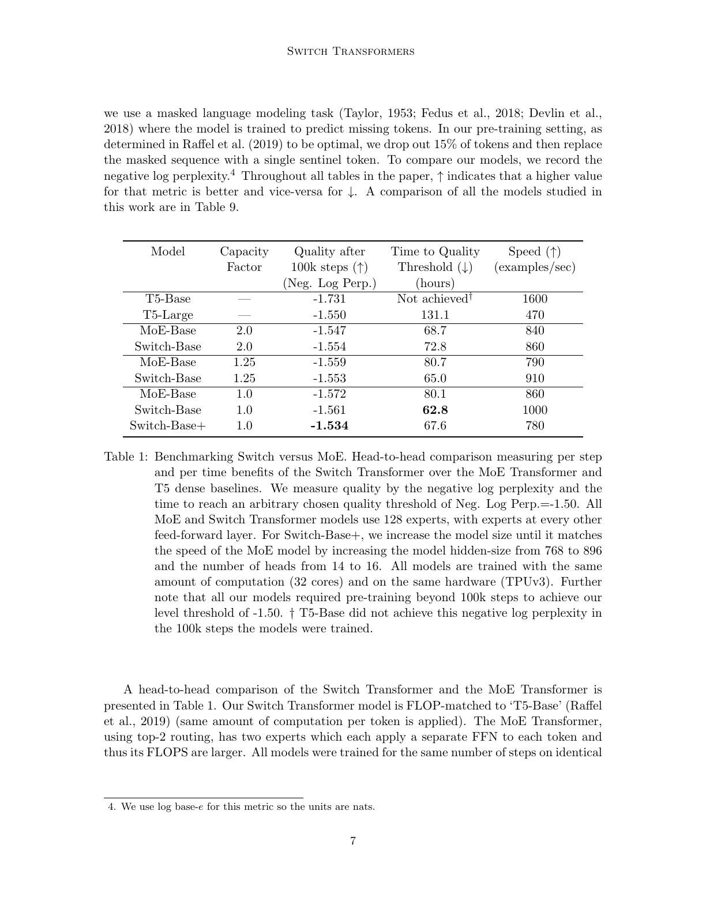
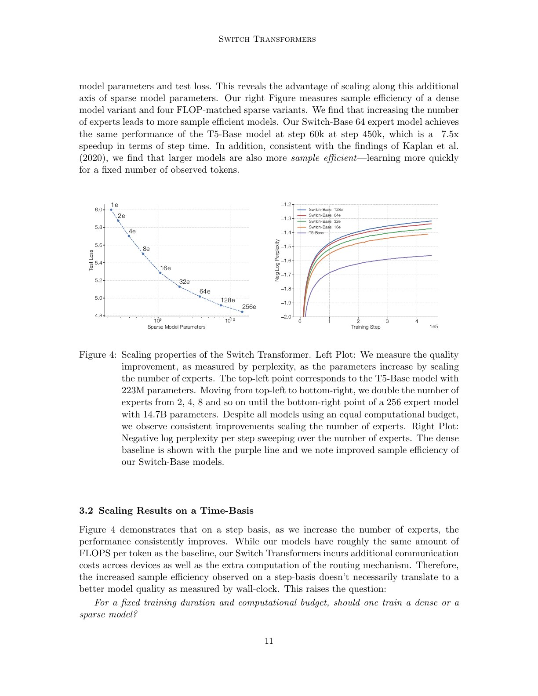
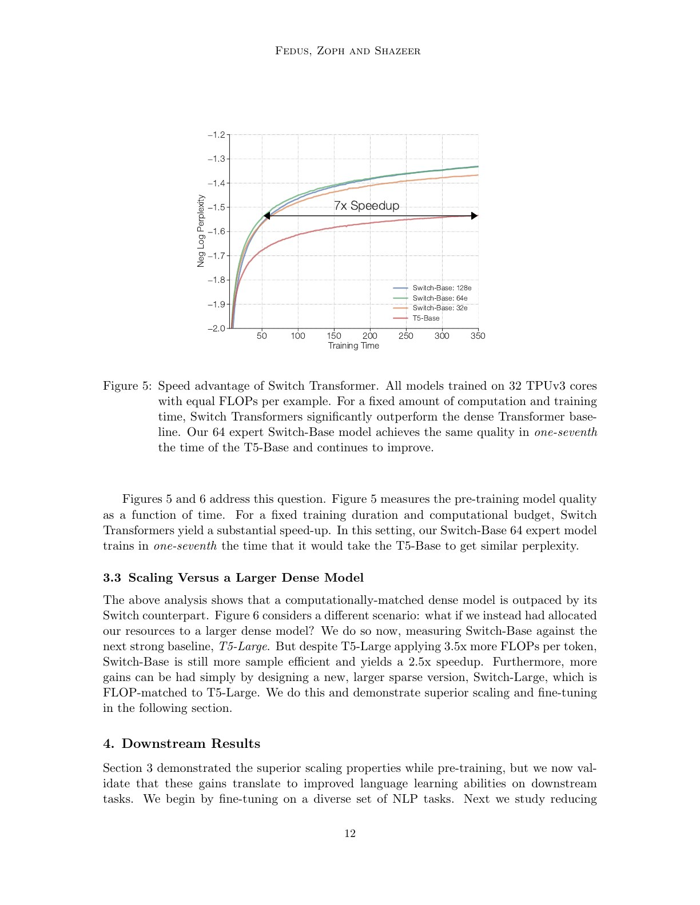
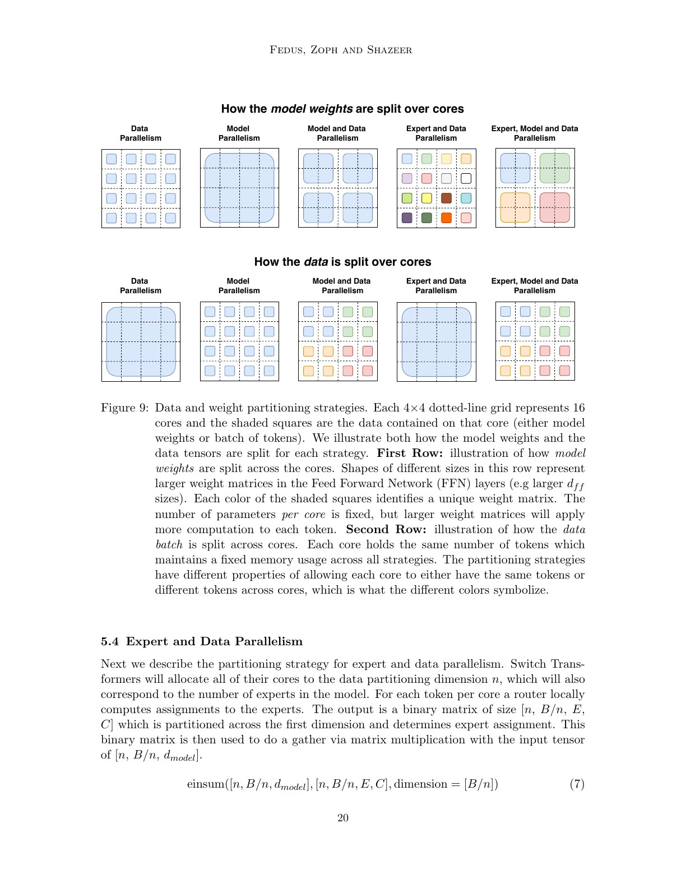
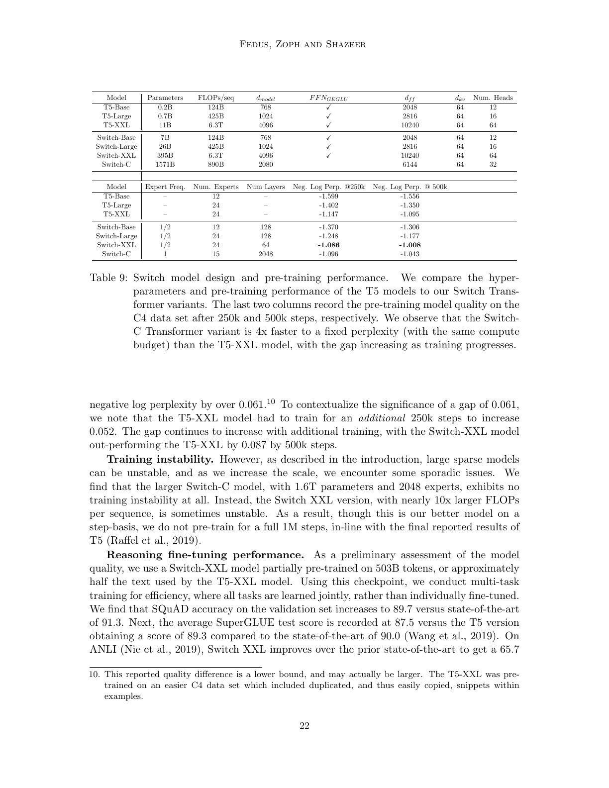
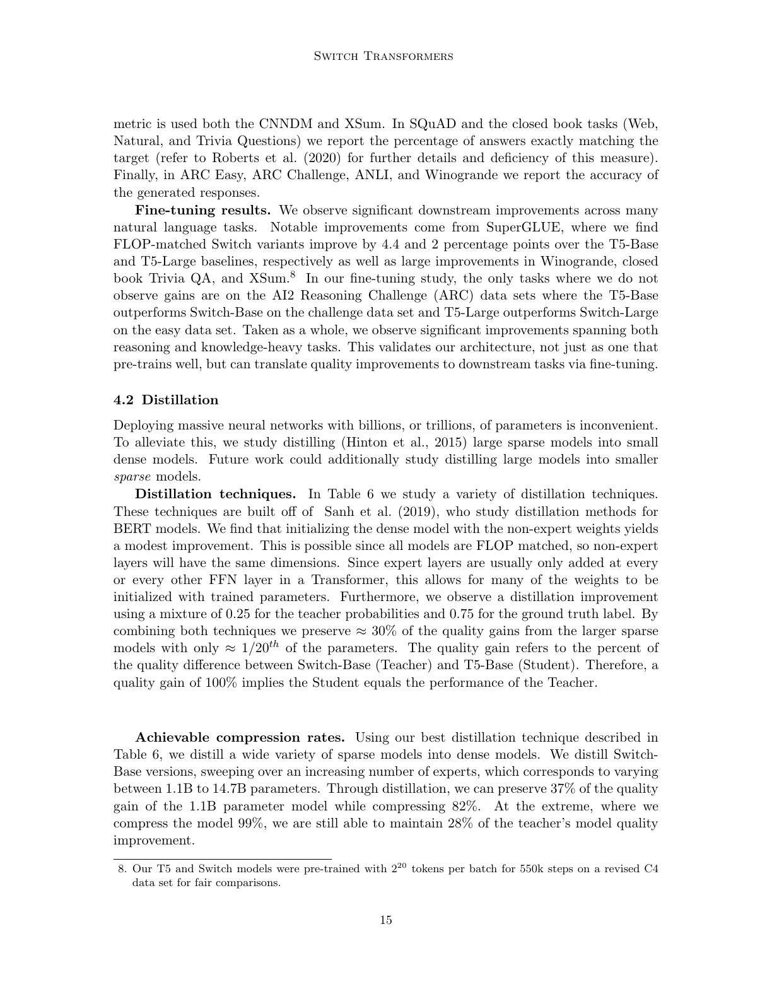

# Switch Transformer 中文精读

## 1. 它简化了什么

原始 Sparsely-Gated MoE 常用 top-$k$，一个 token 访问多个 experts。Switch 令 $k=1$：

$$
i^*(x)=\arg\max_i p_i(x),\qquad
y=p_{i^*}(x)E_{i^*}(x).
$$

这带来：

- token 只发送到一个 expert，通信更少；
- expert capacity 至少可减半；
- combine 简单；
- 但选中操作离散，对负载与稳定性更敏感。

## 2. Capacity factor 与 token dropping

每个 expert 预留固定 buffer：

$$
C=\frac{T}{N}\cdot c,
$$

$T$ 是 batch 内 token 数，$N$ 是 experts，$c$ 是 capacity factor。若某 expert 收到超过 $C$ 个 token，溢出 token 不执行该 expert，而通过 residual connection 前进。

这是系统效率与模型质量的直接交换：

- $c$ 大：少 drop，但 padding/内存/计算浪费增加；
- $c$ 小：硬件高效，但路由偏斜会丢 token。

论文报告合理 auxiliary loss 下通常 drop 少于 1%，但这是其 batch、模型与训练设置的观察，不是保证。

## 3. 单一辅助损失

对 batch 中第 $i$ 个 expert：

$$
f_i=\frac{1}{T}\sum_x \mathbf{1}[\arg\max p(x)=i],
\qquad
P_i=\frac{1}{T}\sum_x p_i(x).
$$

$$
L_{aux}=\alpha N\sum_i f_iP_i.
$$

$f_i$ 是不可微的实际 dispatch 比例，$P_i$ 可微。均匀路由时两者均为 $1/N$，损失最小。论文用 $\alpha=10^{-2}$。

和 2017 MoE 的 importance+load 两项相比，它更简单，但仍不是“强制每个 expert 完全相等”；梯度通过 $P_i$ 间接调整 router。

## 4. 稳定训练的工程组合

关键并非只有 top-1：

- selective precision：router 的局部计算用 FP32，其余保持 bfloat16；
- 缩小初始化尺度，减少深层/大 expert 数时激活与梯度爆炸；
- fine-tuning 对 expert 层使用更高 dropout；
- capacity 与 auxiliary loss 联合控制 overflow；
- expert、data、model parallelism 联合布局。

少掉任何一项，都可能把“稀疏模型不稳定”误归因于架构本身。

## 5. 参数扩展与时间扩展

固定每 token FLOPs、增加 experts，训练 loss 改善；这支持参数容量是一条独立 scaling axis。

但 speedup 有不同定义：

- 相同步数下质量更好；
- 达到同一 loss 所需时间更短；
- 与更大 dense 模型比较 wall-clock；
- 固定 FLOPs 的 sample efficiency。

摘要的“最高 7×”和“相对 T5-XXL 4×”来自不同模型/目标，不应合成“所有 Switch 都快 7×”。

## 6. 万亿参数模型

论文组合 data、expert 和 model parallelism。Experts 分布在设备上，token 通过 all-to-all 送往目标 expert；dense attention/其他层还可能使用 model parallel all-reduce。最佳映射依赖：

- weights 能否放入每设备内存；
- tokens/expert 是否足够大；
- all-to-all 与 all-reduce 是否冲突；
- batch 与 mesh 维度。

1.6T 是总参数，单 token 不执行全部参数。读表时必须同时看 FLOPs/sequence、experts、active expert 和硬件。

## 7. 下游与蒸馏

论文还研究把稀疏 Switch 蒸馏回 dense student，可将稀疏模型 footprint 大幅压缩，但通常损失部分质量。这和仓库中的知识蒸馏路线相连：MoE 用稀疏参数提升训练容量，部署时可以再用 KD 换取更简单的 runtime。

## 8. 论文没有解决的 kernel 问题

Switch 的固定 capacity 让所有 expert batch 变成相同 shape，便于 batched GEMM，却带来 padding 或 token dropping。它优化的是可执行性，不是动态路由的理想表达。

[MegaBlocks](../megablocks/论文中文解读.md) 正是从这里接手：不再强制 equal-size expert batches，而用 block-sparse kernel 直接计算动态、负载不均的 expert assignments。

## 9. 常见误读

### “Top-1 一定比 top-2 好”

论文证明 top-1 在所测 scale 下更简单高效且质量有竞争力，不是对所有模型/任务的普遍定理。

### “Dropped token 被彻底丢掉”

它跳过 MoE expert computation，但 residual connection 仍传递表示。

### “万亿参数等于万亿参数 dense 模型的算力”

错误。总容量巨大，active computation 稀疏；存储与通信仍非常昂贵。

## 10. 复现检查点

- 报告总参数、active parameters 和 FLOPs/token。
- 记录每层 token-drop rate、expert load histogram 和 auxiliary loss。
- 固定 capacity factor、batch token 数、expert parallel world size。
- router logits/softmax 使用相同精度。
- 区分 step-based 与 wall-clock 曲线。
- 给出 all-to-all 占比和 expert GEMM shape。

## 11. 最终判断

Switch 的贡献不是一个复杂路由公式，而是把 MoE 收敛成可大规模训练的系统配方。其固定容量设计也清楚暴露了下一代 MoE kernel 的问题：硬件喜欢规则矩阵，数据驱动路由却天然不规则。
