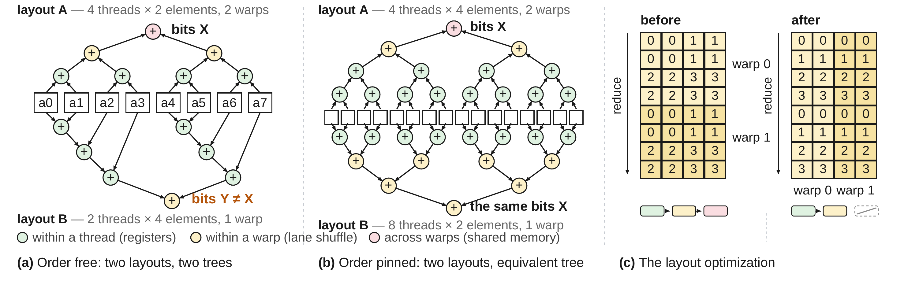
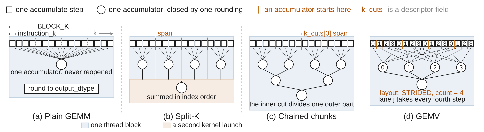
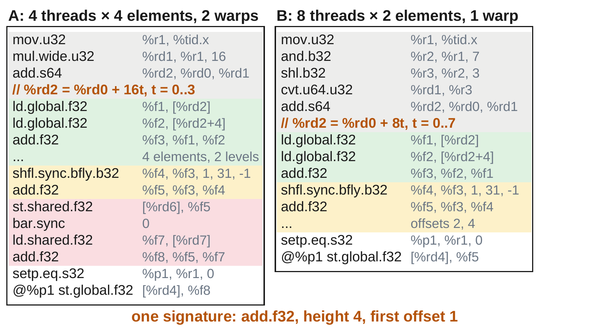
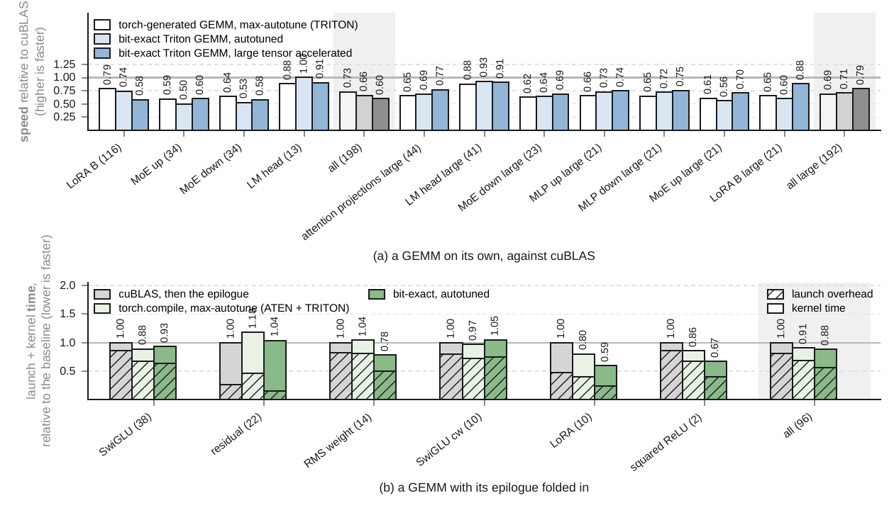
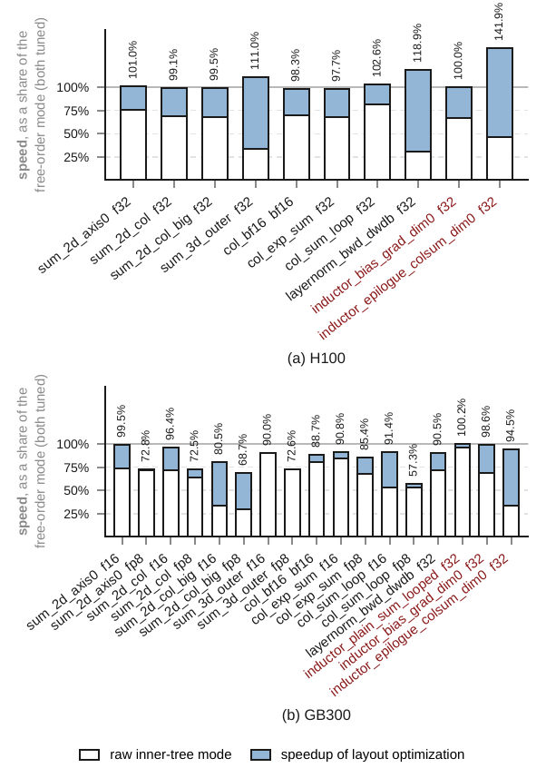
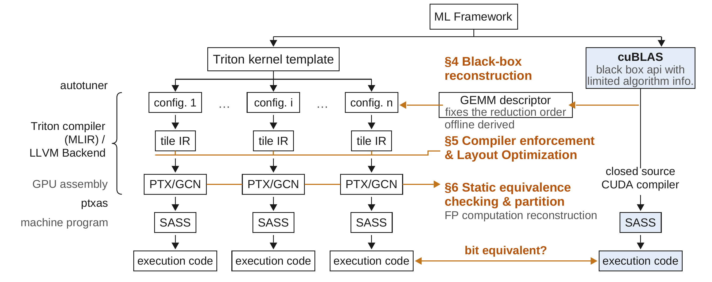
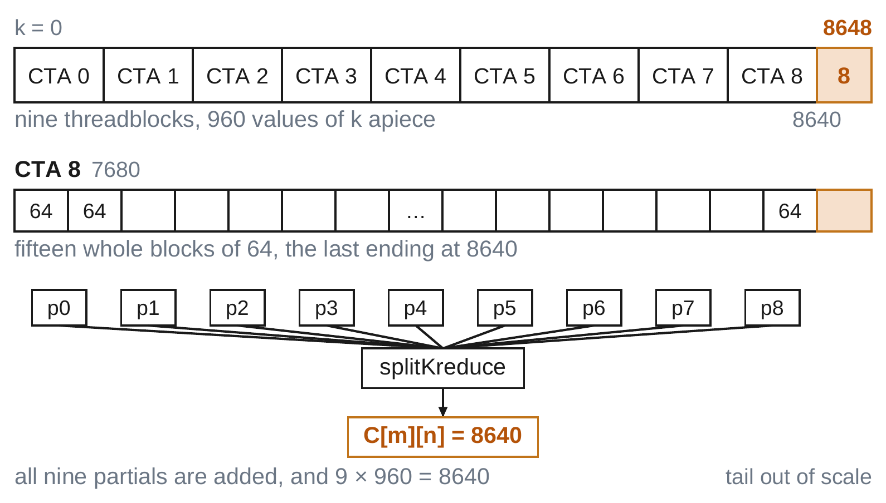

# 论文中文解读：用 Tensor Core 驯服 GPU Kernel 的逐位行为

> **图表阅读约定**：只保留独立的架构图、流程图、曲线图或数据图表；论文摘要、正文段落和说明页不使用截图。图中的英文标签在相邻正文中译成中文，专有名词保留英文。

> 原文：[Taming Bitwise Behavior in GPU Kernels with Tensor Core: Black-Box Reconstruction, Compiler Enforcement, and Static Verification](https://arxiv.org/abs/2609.11356)（arXiv:2609.11356）
>
> 作者：Ziteng Yang（Georgia Tech）、Nicholas J. Riasanovsky（Meta）、Warren Deng（Meta）、Vivek Sarkar（Georgia Tech）
>
> 本文档把原文的论证、公式、实验和图表改写成可独立阅读的中文解释，不用英文段落截图代替讲解。专有名词保留英文，便于回查原文。

> [!IMPORTANT]
> **版本提示**：本文对应 arXiv v1（2026-09-10）。公开 LaTeX 源码仍有 20 处 `TODO` / `task` 标记，其中明确写着两个尚未补完的附录：1,400 个性能 fuzz shape 的生成细节，以及静态检查器把未建模指令转成 opaque syntax 的实例。因此，下文会把“论文已经给出完整证据”“实验观察”“作者据此作出的推广”分开写，不能把 v1 的所有主张都当作已经完成 artifact evaluation 的定论。

本地材料：[`PDF`](paper.pdf) · [`提取文本`](paper.txt) · [`LaTeX 源码`](source/main.tex) · [`原始图`](source/figures/) · [`独立图表`](rendered_figures/)

## 阅读路线

- **5 分钟抓主线**：读第 0、2、12 节，先理解问题、贡献和证据边界。
- **系统学习方法**：按第 3–10 节顺序读，覆盖理论、黑盒重建、编译器实现、静态检查和实验。
- **重点研读图表**：直接进入第 11 节，逐张解释 Figure 1–8、Table 1–6 与 Algorithm 1。
- **面向工程落地**：读第 13–15 节，关注工作流、易混概念和可操作约束。

---

## 0. 一句话先说清整篇论文在干什么

GPU 上两个「确定性」kernel 仍然可能**逐位（bit-for-bit）不一致**。根因几乎总是浮点归约（reduction）的**加法顺序**不同：浮点加法可交换、不可结合，顺序一变，舍入就变，最终比特就变。

这篇论文不走「用超高精度把误差消掉」或「关掉调优保确定性」的老路，而是把「决定比特」的结构变成可操作对象，做了三件事：

1. **黑盒重建**：从闭源库 cuBLAS 里把「它到底按什么顺序算」挖出来，写成描述符 `GEMMDesc`，再用 Triton 重写出一套与 cuBLAS **逐位相同**的 GEMM 族。
2. **编译器强制**：在 Triton 后端强制平衡树归约，并做数据布局优化，尽量把「钉死顺序」的性能损失拿回来。
3. **静态判定**：从编译后的 PTX / AMD GCN 汇编里静态判断两个 kernel 是否逐位等价，并接到 Triton autotuner 上，让搜索只在同一个等价类里进行。

一句话：**把「比特由谁决定」写下来、从闭源库里挖出来、在编译器里钉死、在汇编上静态检查。**

---

## 1. 为什么这个问题值得做

### 1.1 确定性 ≠ 逐位一致

「确定性」通常只保证：同一台机器、同一条代码路径、同样输入，多次运行结果一样。它**不保证**：

- 换一个 tile 形状（`BLOCK_M/N/K`）
- 换一个 batch size（一起服务的请求变多/变少）
- 换一个 vendor library 的启发式选择
- 换一套编译参数

结果仍是同一串比特。

浮点加法不满足结合律：

```math
(a \oplus_{\mathrm{fp32}} b) \oplus_{\mathrm{fp32}} c \neq a \oplus_{\mathrm{fp32}} (b \oplus_{\mathrm{fp32}} c)
```

所以「数学上同一个求和」可以对应很多棵不同的加法树，每棵树给出不同的比特。

### 1.2 这对训练 / 推理 / RL 意味着什么

论文把后果落到三个场景：

| 场景 | 发生了什么 | 后果 |
| --- | --- | --- |
| LLM 推理 | 同一次请求和别的请求拼进同一个 batch，归约行数变了，加法树变了 | 同一权重、同一 seed，答案可以变。一篇引用工作测过：7B bf16 模型上，精度最多差 9 个百分点，生成长度能差几千 token |
| 训练 | 两次「同一配置」只差这些微小效应 | 收敛到不同模型；重训后对个别样本对错翻转 |
| 强化学习 | rollout 引擎生成 token，训练引擎打分 | 两边对同一 token 的 log-prob 不一致时，优化的目标已经不是写下的那个目标 |

论文特别强调 **batch invariance（批不变性）**：一个请求的输出不该取决于「它和谁拼在同一个 batch 里」。现役 serving kernel 往往没有这个性质。

### 1.3 比特还会被什么东西推动

归约顺序是主因，但不是唯一因素：

- 部分和（partial sum）用什么精度存
- 乘加是否融合成一条 FMA
- 舍入发生在哪一步（指令内部一次，还是先乘再加两次）
- 输出类型在哪里截断

这些选择可能写在手写 CUDA 里，也可能被 Triton 这类 block-level 语言交给编译器，还可能被 cuBLAS / rocBLAS 这类闭源库藏在启发式后面。**为性能选的 tile 形状，同时选了算术。**

### 1.4 现有做法各自缺什么

论文把业界对策分成四类，并指出各自的代价：

1. **提高精度**
   例如用两千多比特的定点累加器，或 Ozaki 方案把输入拆成 int8、用整数矩阵单元精确乘、int32 累加。正确，但工作量是原来的数倍。

2. **库模式开关**
   Intel oneMKL 的「条件数值可复现」要求可执行文件、指令集路径、线程数都固定，而且钉死路径可能让速度腰斩。PyTorch deterministic mode 换成确定性算子，没有就报错，保证范围还限定在「某一发行版、某一平台」。代价是调用方必须守住这些条件。

3. **重写 kernel**
   Thinking Machines 把推理里随 batch 变的归约顺序钉死，相对 cuBLAS 大约丢 20% GEMM 吞吐。RepDL、LayerCast、DeepSeek-V4 各自从 rounding、精度、训练栈端到端确定性入手。DeepSeek-V4 甚至自己做了一套矩阵乘库、去掉随 batch 启用的 split-K、给每个 SM 单独缓冲再按固定顺序求和、默认关 fast-math。**但没有人复现闭源库自己那一套算术纪律。**

4. **对齐两套引擎**
   RL 里把整条流水线从 bf16 改成 fp16，用舍入余量换 rollout / train 一致。这是算法层妥协，不是 kernel 层解法。

### 1.5 本文只解决「GPU kernel 这一层」

论文明确划了范围。上面还有训练算法、下面还有 assembler / driver 在加载时重排加法。本文只管 kernel：

- 厂商库不公开算术细节，外面写的 kernel 很难对齐。
- 限制计算顺序会牺牲并行调优空间；对不上就只能让速度。
- Autotuner 搜几百个配置时，根本不知道哪些配置是同一等价类。

---

## 2. 论文声称的四项贡献

读后面各节时，可以用这四条当目录。

### 贡献 1：逐位行为的机制刻画（第 3 节）

证明浮点归约顺序是决定比特的主因，并给出 reduction / GEMM 的理论刻画。核心产物是 **`GEMMDesc`**：只记录决定归约顺序的参数（例如 split-K 在 K 轴哪里切开），不记录纯速度旋钮。两台机器拿到同一份描述符，就欠对方同一串比特。

### 贡献 2：第一套与闭源库逐位相同的 Triton GEMM 族（第 4 节）

对 cuBLAS 做黑盒重建：运行时 profiling + 数值探测，恢复函数

```math
(\text{SM 版本},\;\text{张量形状}) \mapsto \texttt{GEMMDesc}
```

再用 Triton 实现 fp16 / bf16 / fp8 e4m3 的 GEMM 族。在 GB300、GB200、H100 上，对「cuBLAS 自己算完全部求和」的 shape，**逐位匹配率 100%**（排除附录 D 发现的 cuBLAS 自身 bug）。顺带挖出了 cuBLAS split-K 丢尾巴的逻辑错误。

### 贡献 3：Triton 里第一次强制平衡树归约 + 布局优化（第 5 节）

在 Triton 编译器后端实现 `inner_tree` 模式，并加一条数据布局 pass。GB300 + H100 上 27 个 kernel 中，19 个进入自由顺序模式的 10% 以内；H100 上 10 个里有 5 个甚至超过自由顺序。

### 贡献 4：第一个针对已编译 GPU kernel 的可靠静态等价检查器（第 6 节）

分别读 NVIDIA PTX 和 AMD GCN，从构造上保证 sound（判定「等价」时不会把不等价的判成等价）。接到 Triton autotuner 的 pruning predicate：搜索只在一个逐位等价类里进行。在 GEMM 族和 Inductor 融合 kernel 上能恢复精确划分；reduction / normalization 上划分粒度大约是真实划分的 1.0–2.5 倍。

---

## 3. 第 2 节在讲什么：读后面需要的背景

这一节不是新贡献，是把后文用到的名词对齐。

### 3.1 第 2.1 节：GPU 编程模型与 Triton 流水线

需要记住三层并行和三种内存：

- **Grid → Thread Block → Warp/Wavefront**
  NVIDIA：block 最多 1024 线程，整块落到一个 SM；warp = 32。AMD CDNA：CU + wavefront 64。

- **寄存器**私有；**shared memory** 是块内暂存；**global memory** 大约慢 20 倍。
- 块内同步要 `__syncthreads()`；warp 内 shuffle 几乎免费；grid 级顺序只能靠 kernel 结束。

两种写 kernel 的方式：

| 方式 | 你写什么 | 谁决定算术 |
| --- | --- | --- |
| 线程级（CUDA C++） | 单个线程的身体 | 你自己，或你调用的闭源库 |
| 块级（Triton / TileLang / cuTile） | 一块线程覆盖一块 tile | 编译器：tile IR 上的 layout 决定「哪个 lane、哪个寄存器拿哪个元素」 |

编译流水线：tile 操作 → tile-level IR（layout 在这里第一次让归约顺序可见）→ LLVM 按线程降低 → **PTX / AMDGCN**（本文能读到的最底层文本）。

**Autotuning** 是后文第 6 节要接管的对象。一个 kernel template 有很多旋钮（tile 大小、`num_stages`、warp 数），一组赋值是一个 configuration，编出来是一个 instance。Autotuner 靠实测挑最快的。**同一模板的两个 instance 算的是同一道数学题，但不一定是同一串比特。**

### 3.2 第 2.2 节：编译正确性相关工作为什么不够

三类经典路线，论文说它们都没回答「两个已编译 GPU kernel 是否逐位相同」，更没有接到 autotuner：

1. **Correct by construction**（CompCert 等）：整条编译器带机器检查证明。代价是证明量和独立工具链。
2. **Translation validation**（Alive2、MLIR-TV）：不证明编译器，只检查这一次编译。浮点和 reduction 往往被过近似，才能让求解器在有限时间内结束。
3. **Fuzzing**（Csmith、MLIRSmith）：能找到真 bug，找不到不等于没有。

所以第 6 节要另起炉灶：不编码成 SMT，而是从汇编抽出依赖树，比签名。

---

## 4. 第 3 节在讲什么：GPU 并行下，比特到底由谁决定

这是整篇的理论内核。后面三节都建立在这里。

### 4.1 第 3.1 节：归约的依赖树（Dependence Tree）

把一次归约画成 DAG：

- **数据结点**：一个浮点值
- **运算结点**：一次浮点加法
- **边**：数据依赖，值往哪走

对单个输出，这张图通常是一棵树（或能展开成树），叫做**依赖树**。归约顺序就是这棵树。交换一个运算结点两条入边，得到的是**等价树**（加法可交换），比特不变；换结合方式则是另一棵树，比特可能变。

一个 kernel 有多个输出，记 $\mathcal{T}(K)$ 为所有输出依赖树的族。两个 kernel 对同一输入逐位相同，当且仅当每个输出坐标上的树等价。

这棵树同时决定并行度：$n$ 个数永远是 $n-1$ 次加法；并行度 = 工作量 / 最长依赖链。左折叠链长 $n-1$、并行度 1；平衡树链长 $\lceil\log_2 n\rceil$。第 5 节钉死的就是平衡树：**理论上不牺牲并行机会，还保住数据局部性。**

GPU 上这棵树分三层拼出来：

```math
\mathcal{T} = \mathcal{T}_{\mathrm{smem}} \circ \mathcal{T}_{\mathrm{warp}} \circ \mathcal{T}_{\mathrm{reg}}
```

1. 线程在自己的寄存器里按 index 折叠
2. warp 内用 lane shuffle 折部分和
3. warp 之间走 shared memory

线程数、每线程拿几个元素、warp 数，都会改「哪些结点共享同一个累加器」，从而改树。论文用图说明：同样 8 个数、两种 layout，根可以不同；同样 16 个数、线程数翻倍，根也可以相同。所以「layout 变了比特一定变」并不成立，关键看树等不等价。

两个**不影响树**的常见优化（后文加速会用到）：

- **软件流水 `num_stages`**：只改 load 到达时间，第 $i$ 轮仍按原顺序累进同一累加器。前提是流水线只挪 load、不挪累加链。
- **Warp specialization**：一部分 warp 只做异步拷贝（producer），一部分做算术（consumer）。Producer 不做浮点加法，不往树里加点；tile 到 lane 的映射也不变。前提是编译器不要在 specialize 时把计算 warp 变少、重切 tile。

### 4.2 第 3.2.1 节：Tensor Core 的语义假设

一条矩阵指令吃一块 $A$、一块 $B$，乘完加进已有累加器。指令内部舍入是黑盒。对 fp16 / bf16 / tf32，论文采用并被第 7 节实验支持的假设是：

```math
\mathrm{acc} \leftarrow \mathrm{acc} \oplus_{\mathrm{fp32}} \Bigl(\sum_{j < \mathtt{instruction\_k}}^{\text{精确}} a_j b_j\Bigr)
```

也就是：**一条指令把 `instruction_k` 个乘积和旧累加器折成一次 fp32 舍入**。指令内部的乘积没有自己的顺序；真正留下的归约顺序，是指令与指令之间那条 $\oplus_{\mathrm{fp32}}$ 链。

对照：标量路径每个元素一次 `fma`（一次舍入），乘加不融合则两次。

NVIDIA 上三条矩阵路径：

- `mma.sync`：一个 warp
- `wgmma`：Hopper 的 warpgroup
- `tcgen05.mma`：Blackwell 单线程，累加器在 tensor memory

在 GB300 上，fp16/bf16 时 `mma.sync` 与 `tcgen05.mma` 逐位等价；**fp8 不等价**（低精度累加 + 提升节奏可能对不齐）。所以描述符必须**逐条点名指令**，不能只写一个「用了 Tensor Core」。

### 4.3 第 3.2.2 节：四类 GEMM 算法，以及 `GEMMDesc` 记什么

区分不同 GEMM 的，是**收缩轴 K 在哪里被切开、每一刀之后发生什么**。论文用四类覆盖库里实际在用的全部 kernel。

#### Plain GEMM（不切 K）

一个 threadblock 拿一块输出 tile，每个元素一个累加器，在块内走完整条 K。决定顺序的三件事：

| 字段 | 含义 | 为什么影响比特 |
| --- | --- | --- |
| `instruction_k` | 一条矩阵指令折进一次舍入的乘积个数 | 决定舍入链有多长 |
| `use_fast_accum` | 指令结果是并进同一次舍入，还是再单独加一次 | 每步一次舍入 vs 两次 |
| `k_loop_step` | 主循环步长除不尽 K 时，短的那一截放在开头还是结尾 | 哪些乘积共享第一次舍入，后面所有部分和都跟着变 |

**不是**决定顺序的（纯速度旋钮）：

- `BLOCK_M` / `BLOCK_N`：只改「哪个线程拥有哪个输出」，每个输出仍有自己的累加器，链不变。
- `BLOCK_K`：只改一圈主循环发几条指令；累加器跨圈携带，按 3.2.1 的语义，指令结果仍按同一顺序到达。所以描述符记 `instruction_k`，不记 `BLOCK_K`。

#### Split-K

把 K 切成连续几段，每段一个 threadblock、各自从 0 累加，再由第二个 kernel 合并。要记：

- `span`：每一层切出来的段长
- `k_cuts`：嵌套切分（可能在一段里再关一次累加器），从外到内
- `partial_dtype` / `merge_dtype`：段结果写什么类型、合并用什么类型（两者独立：段 fp32 + 合并 fp32、段输出类型 + 合并 fp32、两者都是输出类型）

#### Chained chunks（块内两级切）

仍在一个 threadblock 里。多个线程共享一个输出元素：外层给每个线程一段连续 K，内层再把这段切成累加器一次关完的子块。标量路径常见——没有矩阵指令帮你打包乘积，累加是显式 FMA 链。

#### GEMV（矩阵 × 向量）

每行只有一个输出，没法靠输出 tile 分活，只能把**折叠本身**摊到线程上，顺序最暴露。Warp 内各 lane 往往拿**隔若干个 tile 的跨步切片**而不是连续段（记为 `layout`）。各 lane 再用 shuffle 折到一起：butterfly 按 2 的幂配对，是平衡树；offset 从大往小数，等价于对 bit-reverse 后的 lane 做平衡树。这两种和不同。这些 kernel 用的是后者，所以描述符把每一轮记成一次两段切，而不是「整棵 lane 树」。

**`GEMMDesc` 就是把上面整套因素冻成一条记录，不含任何纯速度旋钮。** 两条相等的记录彼此欠同一串比特。

### 4.4 第 3.3 节：Attention 先挂起来

Flash Attention 更复杂：中间还有带缩放因子的在线 softmax 累加。正文只给指针，完整理论描述放在附录 F，**实现留空**。读到这里只要知道：GEMM 的描述符不够覆盖 attention，但分析框架还是「依赖树 + 舍入落点」。

---

## 5. 第 4 节在讲什么：黑盒重建 cuBLAS 的算术

### 5.1 要恢复的不是「某一个 shape 的描述符」

cuBLAS 的 cost model API 会告诉你「这个 shape 走哪类算法」，但停在第 3.2.2 那些真正钉死比特的参数之前。

论文恢复的是一整代库计算的**函数**：

```math
(\text{SM 版本},\;\text{张量形状}) \mapsto \texttt{GEMMDesc}
```

单个 shape 的描述符只是这个函数上的一个点。对 cuBLAS 12 和 13 分别恢复。

### 5.2 两件仪器

**仪器 1：运行时 profiling（便宜，定家族）**
看库实际 launch 了几个 kernel、grid 多大、有没有 workspace。先把 shape 收窄到某一算法家族。

**仪器 2：数值实验（贵，定算术）**
在一条本来全空的轴上放三个数：极大值 $+L$、相反数 $-L$、极小值 $r$。对 fp16，$L=1024$，$r=2^{-15}$（小于 $L$ 处半个 fp32 ulp）。

原理：$+L$ 与 $-L$ 精确抵消。若 $r$ 先遇到已经抵消完的累加器，它会完整出现在输出；若它先遇到还握着半个 $L$ 的累加器，会被吞掉，输出为 0。Tensor Core 会先在指令内部折完自己的 $k$，所以 $r$ 要放在「隔一个指令组」的位置，而不是紧挨着 $L$。

两种放置读两种分组：

1. **连续分组**（例如 $(a_0+a_1+a_2+a_3)+(a_4+\cdots)$）
   $r$ 钉在下标 0，让 $+L,-L$ 作为相邻对沿轴走。对还在 $r$ 同一组里时，输出为 0；整对跨进下一组后，该组自己抵消，$r$ 完整出来。第一次吐出 $r$ 的位置就是组边界。

2. **跨步分组**（例如偶数一组、奇数一组）
   对钉住，$r$ 走。把 $+L$ 放在猜想组的第一项、$-L$ 放最后一项，该组全程握着未抵消的 $L$。$r$ 落在组内就被吞，落在组外就活。活/死的周期直接给出 stride 和组集合。猜错 layout 时周期会破，说明假设错了。

**以 split-K 为例**：profiling 定不了 `k_cuts`、`span`、`partial_dtype`、`merge_dtype`。在 GB300 上对 $K=576$ 的一行做一次走查：$r$ 在 $k=0$，对在 $m,m+1$。$m=1\ldots191$ 输出为 0（对和 $r$ 同段）；从 192 起 $r$ 活下来；仅在 $m=383$ 再次为 0（对骑在下一条边界上，两半分开进 merge，$+L$ 在 merge 处吞掉 $r$）。一次走查得到两段边界：轴被切成 3 段，每段 192。

恢复一个点的顺序：profiling 收窄家族 → 用 $+L,-L,r$ 读剩下的分组 → 还剩候选就用各自的走查对着库跑新鲜随机输入，直到只活下一个。

### 5.3 从「点」变成「函数」：arch profile

shape 空间无界，cost model 每个 shape 都可以换答案。函数之所以有限，是因为描述符对 shape 的依赖**只经过 cost model 的答案**，而答案种类有限。于是恢复函数 = 为每个可达答案恢复一条描述符 = 一张表，叫做 **arch profile**。

他们为 fp16 / bf16 / fp8 e4m3，在 GB300 / GB200 / H100 上，对 cuBLAS 12 和 13，按 SM 版本 × 库代数各建一张表。表的键是枚举出来的，不是抽样：对向量长度扫到 $10^6$，825 万次 cost-model 查询，找出向量家族会走到的全部答案（其中 7 个只在极长向量或极深 K 出现）。

### 5.4 重建结果（第 4 节里先报摘要，细节在第 7 节）

排除已定位的 cuBLAS bug 后：在 GB300 / GB200 / H100 上，凡是 cuBLAS kernel **算完了全部求和**的 shape，Triton 重建给出 cuBLAS 自己的字节，保持 100%。

性能上的关键观察（和「钉死顺序一定慢 20%」的常见预期对着干）：

| 设定 | torch.compile 的自由顺序 Triton GEMM | 本文逐位对齐的 Triton GEMM |
| --- | --- | --- |
| 单独 GEMM，&gt; 5 GFLOP | cuBLAS 的 61–88% | 56–93%；大张量加速版 69–91% |
| 单独 GEMM，&lt; 5 GFLOP | 59–88% | 50–100%（这里钉顺序更贵） |
| 真实 LLM shape + 融合 epilogue（96 个） | 相对「cuBLAS GEMM + 第二个 epilogue kernel」的 85–125% | **95–168%** |

融合后反而能赢，因为省掉一次 launch（基线里 launch 能占 82%）。结论：**逐位一致和性能可以一起追，不必先交 20% 税。**

---

## 6. 第 5 节在讲什么：编译器强制平衡树，再用布局把性能拿回

### 6.1 问题

Triton 原来没有平衡树归约。降低时，线程对自己寄存器里的值从左到右一个一个折；layout 决定这些值是谁。Autotuner 每换一个 layout，树就可能变，比特就可能变。

### 6.2 第 5.1 节：后端怎么钉树

树是在 lane 交换（shuffle）里长出来的。两种模式走**同一串 shuffle-xor 步**，只是方向相反：

- **钉死模式（inner tree）**：offset 从 1 往上数 → 先配对邻居 → **不论 warp 数，树形状一样**
- **默认模式**：offset 从一半 lane 往下数

这种「只改计数方向」的开关，装在第 3.1 节那三层的每一层：线程内折叠、warp 间阶段，同一套钉法。

进入钉死路径有两条：

1. 算子上的属性（显式要求 inner tree）
2. 某种 layout：归约轴上「寄存器 × lane」范围仍大于 1，默认降低表达不了，只能走同一条钉死路径

AMD 用不同指令到达同一棵树。wave64 行内用 `row_shr`，默认 8,4,2,1 往下，钉死 1,2,4,8 往上；跨行 broadcast 两种模式一样。wave32 或部分 warp 时，假设不成立，后端放弃指令级路径，改走共享的「往上数」shuffle 树——同一棵树，只是更慢。

### 6.3 第 5.2 节：为什么钉死后才能放心改 layout

归约轴跨多个 warp 时，必须付跨 warp 税：两次 barrier、一次 shared memory 往返、第二串 shuffle。把操作数改到「轴落在一个 warp 里」的 layout，就能逃掉这级，但**通常会把树一起搬走**，逃掉的代价是丢掉逐位等价。

钉死后，结合方式与「元素住在哪」脱钩，**整个合法 layout 空间变成纯性能旋钮**。附录 B 的 Algorithm 1 就是花掉这个旋钮的 pass：

1. 构造「轴在一个 warp 内归约」的理想 layout：lane 先铺到轴上，其余铺到保留维；warp 只铺在保留维；轴上剩的长度放进寄存器做线程内折叠
2. 问：插入一次 `convert_layout` 是否划算
3. 算子、轴、长度、顺序一律不动 → **构造上逐位相同**

pass 会拒绝「直接按归约友好 layout 去 load」：跨步 load 每次 launch 都付，转换每个 tile 只付一次。

效果摘要：GB300 上拿回约束吃掉的大部分；H100 上 10 个 kernel 里 6 个达到或超过无序模式（详见第 7.3 节）。

---

## 7. 第 6 节在讲什么：从汇编静态判断「这两个 kernel 是否逐位等价」

### 7.1 问题收得很窄

给定两个**已编译** kernel，它们是否逐位等价？静态地从汇编回答。NVIDIA 读 PTX，AMD 读 AMDGCN。

### 7.2 第 6.1 节：算法——走一遍，抽出依赖树，比签名

对入口函数按程序序走一个**符号线程**（线程号保持为符号），手里拿一张「寄存器 → 结点」的图。每条指令是这张图上的转移函数：查操作数、往目的寄存器写结点。

| 汇编现象 | 变成树上的什么 |
| --- | --- |
| 全局 load | 数据结点，带着读到的地址 |
| 浮点 combine | 算术结点，孩子是操作数寄存器已有的结点 |
| lane shuffle 再与被 shuffle 的部分和 combine | 一个 warp 内交换结点 |
| shared store → barrier → load | 一个跨 warp 交换结点 |
| 循环往携带寄存器上累加 | 对「一轮贡献」的 fold |
| 谓词只是线程/块坐标的函数 | 丢掉（谁跑是 launch 事实） |
| 谓词带着 load 进来的数据 | 当数据；它守护的入口按 configuration 分别比 |

到达全局 store 的结点是根，每个输出元素一棵依赖树。

**地址用符号求值。** 整数寄存器落在仿射形式 $c_0 + \sum c_s s$，或落成不透明 token $\top_e$。加减、字面量移位按系数做；位运算只在能证明精确时才收（用公共尾零个数判断右移是否整除、mask 是否恒等、不交叠的 or 当加法）。叶子的身份是它读到的地址仿射式：两个 kernel 用不同下标算术走到同一元素，仍是同一片叶子。不透明 token 只和完全相同的 token 相等——这会把类拆开，不会错误合并。这是 **sound** 的来源之一。

**规范化**：每个可交换结点的孩子排序，恰好对应第 3.1 节允许的交换。自底向上哈希得到一个 **signature**，签名相同则判为逐位等价。

**平衡树再塌一步。** 形状由逻辑元素顺序决定，塌后的结点只留四件事：combine 及其舍入、叶子计算（坐标抹掉）、归约高度 $\log_2(\text{折进去的元素数})$、最靠近叶子的 butterfly offset。丢掉「交换了几次、哪个线程拿哪个元素」。Shared memory 交换只搬家、不 combine，不加高度，所以 warp 数变了高度仍可相同。图 1(b) 那两种 layout（16 个元素、4 线程 2 warp vs 8 线程 1 warp）会读出同一签名。卫兵是「每次 combine 两边高度相等」——左折叠不满足，继续带着物理结构，自己一类。

走不了的构造变成 **opaque syntax**，按指令文本匹配。宁可拆开，不乱合并，从而保持 sound。

### 7.3 第 6.2 节：实现与接到 autotuner

- NVIDIA 检查器：约 2500 行 Python，架在 PTX parser 上（遍历、符号地址、树与规范形、循环摘要）。
- AMDGCN 检查器：同一套树，换地址求值和交换识别，用自己的语料打分。

Triton autotuner 本来就收 pruning predicate，PTX 检查器直接插进去：**只保留与某个参考配置逐位等价的 configuration**（参考可以是搜索的第一个，也可以是调用方编好送来的），再只对它们测速。这是第一次在「真正开跑 pruning 之前」做静态剪枝。

循环的处理：

- 识别「目的寄存器也是源」的 MMA / combine（如 `fma.rn.f32 %f5, %f1, %f2, %f5`），收成对 chunk 的单个 fold，丢掉循环前 seed（同一 kernel 各配置共享）。
- fold 的键是循环步长（例如分块 reduction 的 `BLOCK_N`），因为改分块就是改分组。
- 对满足 3.2.1「Tensor Core 精确累加、循环结束前没有外人碰累加器」的 K 循环，键拿掉：`BLOCK_K` 不同的配置可以合并。
- 重建失败的入口用 launch 几何当签名，避免两个「什么都没重建出来」的 kernel 被合成一类。
- 跨回边的嵌套 fold 不敢瞎摘要，把 trip 常数放进签名，split 次数不同的会分开。

健全性：GB300 上 51,152 个已编译配置、gfx942 上 4,500 个，以及 GB200/H100 小规模，**检查器认证等价的，硬件字节比较也全部等价**（没有假阳性合并）。多数 kernel（含 TorchInductor 生成的）给出的类数是真实类数的 1.0–2.5 倍，即偏保守地拆得更细。

---

## 8. 第 7 节在讲什么：实验怎么评、数字怎么读

评测分两半：**先问对比特有没有说对，再问保住比特要付多少性能。**

主平台是 GB300（sm_103）。重建和检查器健全性也在 GB200（sm_100）、H100（sm_90）上跑；布局优化还在 H100 上跑；AMDGCN 检查器在 gfx942（CDNA3）上用独立语料。软件栈：cuBLAS 13、Triton 3.8、PyTorch 2.12、CUDA 13。逐位相同 = 每次随机输入输出字节完全一致。

### 8.1 第 7.1 节：测什么 shape、哪些 kernel

两套 shape：

1. **真实静态集**：从 16 个开源权重模型的 `config.json` 读出 390 个 fp16 $(M,N,K)$，并带上该层后面的 epilogue。覆盖 attention 投影、MLP up/down、MoE up/down、LM head、LoRA B。模型包括 Qwen3.8、DeepSeek-V4 Pro/Flash、Kimi-K2.6/K3、GLM-5.2、gpt-oss、MiniMax-M2 等（附录 C 有完整表）。
2. **模糊集**：随机，覆盖层表到不了的角落（$M=1$、$K$ 到几十万）。重建用 110,813 个 shape，性能工作用 1,400 个。

三类 kernel：为本文写的微内核、TorchInductor 原样吐出的 Triton、从开源复杂基准改编的 97 个 zoo kernel（含 Flash Attention）。

### 8.2 第 7.2 节：逐位正确性与检查器健全性

**重建 cuBLAS（GB300，fp16，110,813 随机 shape × 10 组输入）**

| cuBLAS 算法家族 | 测试 | 逐位相同 | 实为 cuBLAS bug |
| --- | --- | --- | ---: |
| 单遍累加（nvjet） | 19,449 | 19,449 | 0 |
| Split-K（nvjet） | 18,636 | 18,576 | 60 |
| 每条 MMA 累加（CUTLASS） | 13,473 | 13,473 | 0 |
| Split-K + 每条 MMA（CUTLASS） | 33,677 | 33,677 | 0 |
| 三级链（gemmSN_NN） | 4,731 | 4,731 | 0 |
| Lane-tree GEMV | 14,897 | 14,897 | 0 |
| 连续切片 GEMV | 1,722 | 1,722 | 0 |
| Workspace GEMV | 4,228 | 4,228 | 0 |
| **合计** | **110,813** | **110,753** | **60** |

那 60 个不是重建失败：cuBLAS 在极深 K 上按整块求和、丢掉尾巴。附录 D 可以在完全不经过 Triton 的情况下复现。fp8 以及另外两代卡上，**除掉这个缺陷后同样 100%**。跨代粗数字：

| 架构 | 测试 shape | 逐位（按字节比较） | 对应 cuBLAS bug |
| --- | ---: | ---: | ---: |
| GB300, fp8 | 42,793 | 99.93% | 0.07% |
| GB200, fp16+fp8 | 626,522 | 99.81% | 0.19% |
| H100, fp16+fp8 | 648,720 | 99.82% | 0.18% |

**检查器**：GB300 上 47 个 Triton kernel、5 种浮点格式、51,152 配置，认证等价的全部硬件一致。目标 kernel（reduction / GEMM）过拆倍数 1.0–2.5，GEMM 族精确；非重点的几个（`gemm_kgroup`、Flash Attention 等）到 6.7–23.0。**over-merges 全程为 0**——从未把不等价的合成一类。

### 8.3 第 7.3 节：性能代价

1. **单独 GEMM**（390 个真实 shape，以 5 GFLOP = $2MNK$ 切开）
   大 shape 上逐位核与自由顺序 Triton 同量级，略有起伏；小 shape 上钉顺序更贵。大张量加速（附录 E）把大 shape 拉到 cuBLAS 的 69–91%。注意：torch.compile 吐的是它自己的 Triton GEMM，并不复现 cuBLAS 算法，所以它不一定是「更快的那个」。

2. **GEMM + 融合 epilogue**（96 个 shape、6 组 epilogue）
   基线是 cuBLAS GEMM + 第二个 epilogue kernel，其中 launch 占 82%。逐位融合核相对该基线 95–168%，高于 torch.compile 的 85–125%。设备时间可以是基线 kernel 半边的 1.8 倍，但去掉一次 launch 后整对仍赢。

3. **强制归约顺序 + 布局优化**（相对自由顺序，两边各自调到最好）
   27 根柱子里 19 根进入自由顺序的 10% 以内。H100 上 10 个里 6 个达到或超过，矩阵乘 epilogue 的列求和最多超 42%。GB300 上超过一次，其余为自由顺序的 57%–99%。

---

## 9. 第 8、9 节在讲什么：限制、未来、收束

### 9.1 第 8 节：作者自己承认还没做完的事

1. **跨机器稳健性没测。** `GEMMDesc` 字段不写机器名，切分写在描述符里而不是从硬件读，按理能挺过「SM 数量一变、cuBLAS 自己的逐位保证就失效」那种变化。资源不够，没做跨机实验。
2. **没往系统层走。** 从单个 GEMM 到「很多 GEMM 拼成的训练 / RL 作业」贡献有多大，没测。
3. **没往更底层走。** 健全性相对的是 PTX / AMDGCN，不是 ptxas 吐出的 SASS。读 SASS 能补上 assembler / driver 这一层，但格式厂商不公开。
4. **Attention 和会改归约顺序的 GEMM 融合**只有附录 F 的理论，没有实现。
5. **原则可以长进自动生成器。** 例如 TorchInductor 可以钉死自己发出的顺序，并在一个等价类里调。

### 9.2 第 9 节：结论（重述机制）

GPU kernel 的逐位语义由浮点累加结构决定，这个结构是编译器和硬件映射选的，不是写 kernel 的人选的。本文把这个结构变成可操作对象：

- **写下来**（描述符）
- **从闭源库挖出来**（黑盒重建，三代 GPU 上复现 cuBLAS 字节）
- **变成编译器要求**（强制平衡树，损失可接受地拿回）
- **从已编译代码静态判定**（两家指令集、数万 autotuner 配置），再把判定交回 autotuner，让搜索待在一个类里

性能评估的结论是：强制数值正确性的代价，比社区通常担心的要小得多。

---

## 10. 附录各自在补充什么

正文读完后，六个附录分别补一块「主文放不下、但论证需要」的材料。

### 附录 A：总图

把四套机制画在「从 kernel 模板到最终字节」的路径上，旁边对照第 4 节重建的闭源库。适合当作读完全文后的一张路线图。

### 附录 B：布局优化的完整算法

Algorithm 1 的输入除了模块，还有 warp 大小 $w$、每线程元素上限 $c$、铺开因子 $u$。每条检查都是 skip：放不下去就原样留下。

跳过条件：

- 不是 blocked layout
- 归约跨 thread block（超出范围）
- 已经在一个 warp 内（没必要动）
- 重排后每线程元素会超 $c$（会 spill）
- 理想 layout 并不比当前在轴上多铺 lane
- 轴已经被铺得够开（$\mathrm{extent}(\mathrm{axis}) < u \cdot L.\mathrm{lanes}(\mathrm{axis})$）

否则：把操作数转到理想 layout，在其上克隆归约，再把结果转回去。

### 附录 C：390 个静态 shape 从哪些模型来

一张 16 模型的 `hidden / FFN / expert / experts / active / vocab` 表。规则：

- $N$ = 该层权重输出宽，$K$ = 输入宽，$M$ = token 数
- Attention 投影看 hidden 和头数
- MLP 上看 FFN 输出、下看 FFN 输入
- MoE 用 expert 宽替换 FFN
- LM head 的 $N$ 是词表（所以表 1 里最宽的那些来自这里）
- LoRA B 的 $K$ 是 adapter rank，所以能小到 8；这是唯一「模型配置不钉死收缩维」的层组

数字来自 2026-08-16 当天 Hugging Face 上各模型自己的 `config.json`。

### 附录 D：cuBLAS split-K 丢尾巴的 bug（重建时的「意外收获」）

缺陷在 cuBLASLt 走到 `ALGO_ID = 66` 的 **nvjet split-K** 路径。GB200 / GB300 / H100，cuBLAS 12.8.5 和 13.1.1 都能复现。哪个 shape 丢尾巴，随架构和库版本一起变。

**怎么看见：** 把 $A,B$ 填成 1。每个 $C$ 元素必须精确等于 $K$（$K$ 个 $1\times 1$，fp32 累加、fp32 输出在 $2^{24}$ 以下是精确整数）。有的 shape 少一个整数，就是少了那么多项。

**$K=8648$ 时发生了什么：** 该 fp16 家族每块 K 步长 64，8648 = 135 个整步 + 8。库拆成 9 个 block，$135/9=15$，每块正好 15 个整步 = 960，覆盖 $[0,8640)$，**最后 8 个 $k$ 谁也不拿**。合并只加这 9 个部分和，尾巴蒸发。

**充要条件：**

```math
\texttt{ALGO\_ID}=66 \;\wedge\; t\neq 0 \;\wedge\; q \bmod s = 0 \;\wedge\; s > t
```

其中 $b$ 为 K 步长，$q=\lfloor K/b\rfloor$，$t=K \bmod b$，$s$ 为 split 数。$K=8648$ 时 $q=135,t=8,s=9$。最后一条保证「整步被均匀分光、尾巴没人认领」；若拆得不均匀，会有一个 block 拿到短步并把它算进去。`ALGO_ID` 也必要：H100 上 $1\times 2\times 1032$ 满足三条算术条件但走 CUTLASS（ID 23），不丢。在 H100 上对每个库 1,542,555 个真实 GEMM，四条件零假阳零假阴；拿掉 `ALGO_ID` 会误分类 3,557 个。

复现必须直接调 cuBLASLt（`torch.matmul` 自己走不到这条算法）。workspace 是 split-K 写部分和的地方，workspace 为 0 则库不拆、结果正确。输出必须用 fp32：深 K 时 fp16 自己就会把 $64q+8$ 这种数舍下去。

规模：观察到的 5,709 次丢失全部恰好是 $K \bmod 64$。不只瘦长 shape，$32\times 32$、$64\times 64$、$128\times 128$ 在 $K=11528$ 时都丢 8。

**读这一节的意义：** 论文报的「100%」排除的就是这个库自身缺陷；重建方法强到能把闭源库的逻辑错误钉死成可预测条件。

### 附录 E：GB300 上的大张量加速

描述符只钉算术，不钉调度。同一 `GEMMDesc` 可以换任意调度，字节仍相同。加速臂只在 sm_103 上走新分支（tile swizzle、tensor-memory descriptor、persistent grid + warp specialization、更深流水、32-bit 索引、免拷路径、split-K 一次 launch 等），另外两代仍跑原 kernel。

相对 cuBLAS kernel 时间的几何平均（大于 1 表示比 cuBLAS 快；快的都出现在未对齐情形，靠重打包恢复对齐）：

| plan mode | 参考实现 | 加速后 |
| --- | ---: | ---: |
| 单遍累加 | 0.303 | 0.802 |
| Split-K | 0.426 | 0.857 |
| Split-K, grouped | 0.624 | **1.639** |
| 每条 MMA 累加 | 0.654 | **2.086** |
| 三级链 | 0.184 | 0.998 |
| Lane-tree GEMV | 0.210 | 0.843 |
| 连续切片 GEMV | 0.596 | 0.962 |
| Workspace GEMV | 0.853 | **1.057** |

唯一需要论证「值没有被挪走」的改动：每条 MMA 方案按 KPD 个真实 $k$ 一组。参考核每组一次 `tl.dot`；加速核一次 `tl.dot` 吃 $G$ 组。$k$ 范围为 $16G$ 的 `tl.dot` 会降低成 $G$ 条链式 $k=16$ MMA，共用一个 fp32 累加器、按递增 $k$，每条舍入一次。因此宽 dot 的 lane $[16g,16g+16)$ 正好是第 $g$ 个窄 dot 做过的那次更新。KPD=8 时每组尾巴 mask 成 0，与窄核已经在用的占位相同。残余 tile 仍一组一次 dot，因为最后一组可能短。

154,904 次字节比较零差异；其中硬核部分是直接扫 plan 参数空间（7,868 组 × 10 次输入），而不是只扫 cuBLAS 启发式会点到的角落。描述符路径主机侧大约 100µs / 次（相对指针 launch 约 20µs），设备时间看不见，对小于约 100µs 的 GEMM 调用方会看见。

### 附录 F：Attention 的归约顺序（理论，未实现）

一个 attention kernel 里有三次归约：

1. $Q$ 对 $K$ 在 head 维上收缩 → 分数矩阵（GEMM，归第 3.2 节）
2. 概率对 $V$ 在 key 轴上收缩 → 输出（又是 GEMM）
3. **中间**：带缩放的在线累加——这是 attention 和普通 reduction 的分水岭

Flash Attention 式递推：把一行 key 切成宽 $w$ 的块。维护 fp32 的行最大 $m_j$、分母 $\ell_j$、输出行 $O_j$。块 $j$ 先把块内最大折进运行最大，再把已有量乘 $\alpha_j = 2^{m_{j-1}-m_j}$ 后相加（底数为 2，因为把 $\log_2 e$ 折进分数缩放，走硬件的 exp2）。最终 $O_B / \ell_B$。

要点：

- **每个块边界都是一次舍入。** $\alpha_j O_{j-1}$ 是对整行输出的一次乘法。$N$ 个 key 付 $\lceil N/w\rceil$ 次。Triton 里的 `BLOCK_N` 在这里是算术的一部分，不像 GEMM 里的 `BLOCK_K` 只是速度旋钮。
- **因果 mask 让 `BLOCK_M` 也进入算术。** 无 mask 时边界只是 $w$ 的倍数，`BLOCK_M` 只决定哪些行共享实例。因果 mask 把行走分成「完全在对角线下」和「骑在对角线上的一块」（线上部偏置 $-10^6$，概率下溢到 0）。分界是 `BLOCK_M` 的倍数，所以只改 `BLOCK_M` 的两个因果配置会在不同边界上累加。
- 块内行最大只做选择、不舍入，树自由；块内行求和是普通 $w$ 元求和，完全是第 3.1 节的对象，随线程数和 lane layout 动。
- 概率在第二次 matmul 前要从 fp32 收窄到 fp16/bf16/fp8，这次舍入夹在两次归约之间，操作数类型和累加器类型同等重要。

**Attention 描述符应包含：** key 块宽、mask 约定（开 mask 时加上 query 块宽）、块内行求和的树、概率收窄类型、两次 matmul 各自的 `GEMMDesc`、最终除法的位置。这就是第 3.3 节说「理论有了、实现未做」的全部内容。

---

## 11. 逐图逐表精读：每张图真正提供了什么证据

这一节不再按论文段落复述，而是把所有图表当成“证据对象”来读。一个实用原则是：**示意图说明机制，表格说明覆盖，性能图说明代价；三者不能互相替代。**

### 11.1 Figure 1：layout 为什么通常会改树，以及钉树后为什么可以自由换 layout



> **图中文字翻译**：`Free order` 是“自由归约顺序”，`Pinned inner tree` 是“固定内部加法树”，`Layout A/B` 是“布局 A/B”，`thread-local` 是“线程内归约”，`warp shuffle` 是“warp 内交换”，`shared memory` 是“共享内存合并”，`before/after` 是“优化前/优化后”，`bits X/Y` 表示最终得到的不同浮点比特。

图中颜色编码了归约的三个物理层级：绿色是线程内寄存器加法，黄色是 warp 内 lane shuffle，粉色是跨 warp shared-memory 合并。叶子是逻辑输入 $a_0,a_1,\ldots$，根旁边的 `bits X/Y` 是最终浮点比特。

**Panel (a)：自由顺序。**

- Layout A：4 个线程、每线程 2 个元素、2 个 warp。先在线程内合并两项，再在 warp 内合并，最后跨 warp。
- Layout B：2 个线程、每线程 4 个元素、1 个 warp。每个线程先形成更长的局部链，再在 warp 内合并。
- 两边叶子相同、数学和相同，但括号结构不同，所以根分别为 `bits X` 与 `bits Y`。图的目的不是说“线程越少越不准”，而是说明 **layout 改变了哪些叶子先共享累加器**。

**Panel (b)：inner-tree 钉死顺序。**

- Layout A：4 线程 × 4 元素、2 warp；Layout B：8 线程 × 2 元素、1 warp。
- 两边的线程/warp 分界不同，物理交换次数也不同，但逻辑叶子先按相邻项构成高度一致的平衡子树，最后得到同一棵等价树，所以都是 `bits X`。
- 这正是第 6 节检查器要识别的情况：**物理实现不同，逻辑树相同**。若检查器只比较指令序列或 warp 数，它会错误地把这两者拆开。

**Panel (c)：布局优化。**

- `before` 中归约轴跨越两个 warp；同一行的编号分散在 warp 0 和 warp 1，因此需要 shared-memory 往返、barrier 和第二轮 shuffle。
- `after` 把每个完整归约放进一个 warp；warp 0 负责一组行，warp 1 负责另一组，跨 warp 阶段消失。
- 这项重排只有在树已经由 `inner_tree` 固定后才安全。否则，“把轴塞进一个 warp”同时会改变括号结构。

**这张图能证明什么：**给出机制性反例和优化直觉。**不能单独证明什么：**不能证明编译器对所有 layout 都保持同一树；那个保证还依赖第 5 节 lowering 规则、Algorithm 1 的 guard，以及第 7 节的字节测试。

### 11.2 Figure 2：四种 GEMM 家族到底在哪里“关掉”累加器



> **图中文字翻译**：`Plain GEMM` 是“普通 GEMM”，`Split-K` 是“沿 K 维切分后再合并”，`Chained chunks` 是“同一线程块内分段累加”，`GEMV` 是“矩阵—向量乘”，`accumulator` 是“累加器”，`partial result` 是“局部结果”，`merge` 是“合并”。橙色切分表示描述符必须记录的算术边界。

这张图横轴都是收缩维 $K$，关键图例是：灰色小格表示一次 accumulate step；圆角框表示一个累加器的生命周期；框闭合意味着发生舍入、写回或进入下一层合并；橙色标记的是 `GEMMDesc` 必须记录的切分。

| Panel | 图上结构 | 真正决定比特的量 | 容易误读之处 |
| --- | --- | --- | --- |
| (a) Plain GEMM | 一个 accumulator 从 $k=0$ 活到结尾，最后转输出类型 | `instruction_k`、`use_fast_accum`、短 K-loop 在首还是尾 | `BLOCK_K` 画在循环上，但按论文的 Tensor Core 语义，它通常只重分循环，不重分累加链 |
| (b) Split-K | 多个 threadblock 各自从 0 开始，第二个 kernel 按 index order 合并 partial | 外层 `span`、嵌套 `k_cuts`、partial/merge dtype | “第二次 launch 是调度细节”是错的；它引入新的归约层和新的舍入精度 |
| (c) Chained chunks | 一个 threadblock 内有外切和内切，每层都会关闭局部 accumulator | 两层或多层 `span` 的嵌套 | 它不是 split-K 的同义词，因为不跨 block、也不一定写 workspace |
| (d) GEMV | lane $j$ 每隔 `count=4` 取一个 tile，再做 lane tree | `layout=STRIDED`、`count`、butterfly 方向 | 这里的切片不连续；只记录“4 个 lane”不足以恢复哪几个 $k$ 先相加 |

可以把 `GEMMDesc` 心智模型写成下面这个非正式 schema：

```text
GEMMDesc
├── instruction / instruction_k / accumulator behavior
├── ordered list of K cuts
│   ├── span
│   ├── contiguous or strided layout
│   └── count / merge order
├── partial_dtype
├── merge_dtype
└── output rounding point
```

论文没有在正文给出一段正式的数据结构定义；它是由第 3 节各字段的文字定义共同构成的。因此“描述符完整”主要由三类证据支撑：省略的速度旋钮被论证为不改树；保留的字段能被数值探测区分；最终重建在测试集上逐字节命中。

### 11.3 Figure 3：`inner_tree` 在后端实际上只改了什么

Figure 3 不是性能图，而是一段 Triton C++ lowering 代码。核心循环是：

```cpp
for (unsigned N = 1; N <= nLane / 2; N <<= 1)
    shfl = shuffleXor(acc, N * interleave);
```

默认路径使用相反方向的 offset；新路径从 1 开始递增。读这段代码要抓住三点：

1. `shuffleXor` 的集合没变，变的是执行顺序；浮点 combine 的括号因此改变。
2. “邻居先配对”让最底层子树由逻辑相邻元素决定，更容易跨 layout 保持。
3. 只修 warp 内循环不够，所以正文强调同一开关也要作用于线程内 fold 和跨 warp 阶段。

AMD 后端并不复用相同指令：wave64 用 `row_shr` 的 1,2,4,8 顺序实现同一逻辑树；wave32 或 partial wave 退回较慢的 shared shuffle 路径。这说明论文承诺的是**逻辑依赖树**，不是指令文本一致。

### 11.4 Figure 4：检查器怎样把两段不同 PTX 收敛成一个签名



> **图中文字翻译**：`Kernel A/B` 是“内核 A/B”，`threads` 是“线程数”，`warps` 是“warp 数”，`shared memory` 是“共享内存”，`same signature` 是“签名相同”，`reduction height` 是“归约树高度”，`nearest-leaf offset` 是“最近叶节点偏移”。图的重点是：机器指令和执行布局不同，也可能代表同一逻辑加法树。

左侧 kernel A 是 4 线程 × 4 元素、2 warp：地址是 `%rd0 + 16t`，线程内先形成 4 元素、2 层的小树，之后做一次 warp shuffle，再经 shared store/barrier/load 合并另一个 warp。右侧 kernel B 是 8 线程 × 2 元素、1 warp：地址是 `%rd0 + 8t`，线程内只加一对，随后做 offset 1、2、4 的 butterfly。

表面差异非常大：

- 地址计算指令不同：乘 16 vs mask 后乘 8；
- 线程内工作量不同；
- A 有 shared memory 和 barrier，B 没有；
- launch geometry 不同。

检查器不比较这些表面结构，而是恢复叶子地址与 combine 关系。两边最终都得到：

```text
combine = add.f32
reduction height = 4        # 2^4 = 16 个逻辑输入
nearest-leaf offset = 1
```

所以签名相同。这里 `height=4` 不是“做了 4 条 shuffle”，而是树从叶到根有 4 层。Shared-memory exchange 只搬运 partial、不执行 combine，因此不增加高度。

这张图也解释了 soundness / completeness 的取舍：能证明为同一逻辑树的合并；不能识别的语法变成 opaque token，导致多拆而不是误合并。

### 11.5 Figure 5：不要只看柱高，要先看分母是什么



> **图中文字翻译**：`Relative performance` 是“相对性能”，1.0 表示与基线一样快；`cuBLAS` 是对比基线，`torch.compile` 是自由顺序实现，`bit-exact` 是“逐位一致实现”，`accelerated` 是“大张量加速版本”，`epilogue` 是 GEMM 后的激活、归一化或逐元素尾处理，`launch overhead` 是“内核启动开销”。

**Panel (a)：单独 GEMM。**纵轴是“相对 cuBLAS 的速度”，1.0 才等于 cuBLAS。横轴先按小于/大于 5 GFLOP 分区，再按层类型分组；括号是该组 shape 数量。三种柱分别是 torch.compile 生成的自由顺序 Triton GEMM、本文 bit-exact Triton GEMM、GB300 大张量加速版。

正确读法：

- 柱子从 0.6 升到 0.8，表示缩小与 cuBLAS 的差距，不表示比 cuBLAS 快 20%。
- bit-exact 柱偶尔高于自由顺序柱，说明“允许任意顺序”只扩大搜索空间，不保证 autotuner/代码生成一定找到更快实现。
- 这组比较混合了两个差异：是否逐位复现 cuBLAS，以及作者 kernel 与 torch.compile kernel 的工程质量。因此不能把全部差值解释成“逐位约束税”。

**Panel (b)：GEMM + epilogue。**纵轴仍相对基线，但基线改成“cuBLAS GEMM + 单独 epilogue kernel”的完整调用时间，包含两次 launch。论文给出 launch 占该基线的 82%。融合核即使设备执行部分更慢，只要省下一次 launch，端到端仍可能达到 1.68×。

因此 Figure 5 支持的是：**在可以融合的真实计算图里，逐位约束可以被 launch/memory traffic 的系统级收益盖过。**它不支持“本文单独 GEMM 普遍快于 cuBLAS”。Panel (a) 恰好显示大多数单独 GEMM 仍慢于 cuBLAS。

### 11.6 Figure 6：白色是约束损失，彩色是 layout pass 拿回的部分



> **图中文字翻译**：`Free-order baseline` 是“自由顺序基线”，固定为 100%；`raw pinned` 是“只固定归约树、尚未优化布局”，`layout optimized` 是“再做布局优化后的总性能”。白色表示保留下来的基础性能，彩色增量表示布局优化拿回的部分；柱顶百分数才是最终结果。

每根柱以“自由顺序、独立 autotune 后的最佳速度”为 100%。白色部分是只开启 raw `inner_tree` 的速度，叠加的彩色部分是 layout optimization 后增加的速度；最终柱顶数字才是优化后的总比例。

**H100（10 个 kernel）：**最终分别约为 101.0%、99.1%、99.5%、111.0%、98.3%、97.7%、102.6%、118.9%、100.0%、141.9%。其中 6 个达到或超过 100%，严格超过 100% 的是 5 个；141.9% 对应 GEMM epilogue 的列归约，正是摘要所说“最多快 42%”的来源。

**GB300（17 个 kernel）：**最终范围约 57.3%–100.2%，只有一个略过 100%。多组 fp16/fp8 同名 kernel 成对出现，说明 dtype 会改变寄存器压力、可用指令和 convert-layout 成本，不能从 H100 的收益直接外推到 Blackwell。

图中 27 根柱有 19 根落在 90% 以上。但还应看到长尾：GB300 最差项只剩 57.3%。所以更准确的结论是“多数 kernel 的成本能收回到 10% 内，少数形状仍很贵”，而不是“强制顺序基本免费”。

### 11.7 Figure 7：四项贡献分别插在编译链的哪个位置



> **图中文字翻译**：`template` 是“内核模板”，`autotuner configuration` 是“自动调优候选配置”，`tile IR` 是“分块中间表示”，`PTX/GCN` 是 GPU 汇编层，`SASS` 是 NVIDIA 机器指令，`black-box reconstruction` 是“黑盒重建”，`compiler enforcement` 是“编译器强制固定顺序”，`static checker` 是“静态等价检查器”，`execution` 是“实际执行与字节验证”。

左边是开放 Triton 路径：template → 多个 autotuner configuration → tile IR → PTX/GCN → SASS → execution code。右边是闭源 cuBLAS 路径：有限算法信息的 API → 闭源 CUDA compiler → SASS。中间四层对应论文贡献：

1. 第 4 节从 cuBLAS 黑盒反推出 `GEMMDesc`；这是 offline reconstruction，不是每次调用现场探测。
2. 第 5 节在 tile IR 到后端 lowering 之间强制归约树并优化 layout。
3. 第 6 节在 PTX/GCN 层比较 configuration，发生在 `ptxas` 之前。
4. 执行时再做字节比较验证，但静态 soundness 最终只相对于 PTX/GCN；图上 PTX→SASS 的箭头就是论文尚未检查的信任边界。

### 11.8 Figure 8：cuBLAS 丢尾巴不是舍入误差，而是少算了 8 项



> **图中文字翻译**：`CTA` 是“线程块”，`K dimension` 是“收缩维 K”，`splitKreduce` 是“把多个 K 分片的局部结果合并”，`computed` 是“已经参与计算的区间”，`missing tail` 是“漏算的尾部”。图中 9 个线程块各算 960 项，只覆盖 8640 项，而真实 K=8648，所以最后 8 项完全没有进入求和。

图把 $K=8648$ 切给 9 个 CTA。每个 CTA 处理 15 个完整的 64-wide block，即 $15\times64=960$ 项；9 个 partial 全部被 `splitKreduce` 合并，因此输出是 $9\times960=8640$。问题是覆盖区间只到 $[0,8640)$，尾部 8 项从未分配给任何 CTA。

这里用全 1 输入非常关键：fp32 可以精确表示 $8648<2^{24}$ 的整数和，所以 8640 不可能由舍入偶然产生，它就是参与求和的项数。Figure 8 因而是一个**逻辑覆盖 bug**的直接证据，而非普通数值不稳定。

### 11.9 Table 1：390 个“真实 shape”覆盖了什么，没覆盖什么

| 层类型 | 数量 | $M$ | $N$ | $K$ | 对性能的主要压力 |
| --- | ---: | ---: | ---: | ---: | --- |
| Attention projections | 45 | 256–16,384 | 2,048–18,432 | 2,048–16,384 | 三维都较大，典型吞吐型 GEMM |
| MLP up | 21 | 256–16,384 | 6,144–33,792 | 2,048–7,168 | 输出宽、适合融合激活 |
| MLP down | 21 | 256–16,384 | 2,048–7,168 | 6,144–33,792 | 深 K，考验 K-loop/分块 |
| MoE up | 55 | 16–3,072 | 512–3,072 | 2,048–8,192 | 小 M，launch 与利用率敏感 |
| MoE down | 57 | 16–6,144 | 2,048–8,192 | 512–3,072 | routing 后尺寸更碎 |
| LM head | 54 | 1–256 | 100,352–248,320 | 2,048–8,192 | 极宽 N、小 M，接近 GEMV |
| LoRA B | 137 | 80–16,384 | 768–32,768 | 8–64 | 极浅 K，固定开销占主导 |

这套静态集很有代表性，但不是 workload trace：$M$ 是选取的 token 数范围，不含请求到达分布、动态 batching 频率、序列长度分布和多 GPU 通信。因此它适合比较 kernel 形状，不足以直接推导端到端 serving 吞吐。

### 11.10 Table 2：100% 命中的分母必须先排除库自身错误

GB300 fp16 的原始结果是 110,813 个 shape 中 110,753 个逐字节相同，表面比例约 99.946%。剩余 60 个全部落在 nvjet split-K 尾部缺失 bug。论文的“100%”定义是：**在 cuBLAS 确实计算完整 $K$ 的 shape 中，重建全部命中。**

跨架构行也是同样口径：GB300 fp8 99.93%、GB200 99.81%、H100 99.82% 是包含 bug 的原始字节命中率；把已定位 bug 排除后才是 100%。这不是偷偷删异常点，因为作者给出了不用 Triton 的独立复现和充要预测条件；但它意味着“复现 cuBLAS 的逐位行为”与“复现 cuBLAS 的错误输出”被有意区分。重建 kernel 选择实现预期的完整 GEMM，而不是刻意复制漏算。

### 11.11 Table 3：检查器的完整精度画像

下面保留最关键的 PTX 数字；`checker/bytes` 是静态类数与硬件真实类数，二者之比就是 over-split。所有行的 over-merge 都是 0。

| Kernel | 配置数 | 静态类 | 字节真实类 | 过拆倍数 |
| --- | ---: | ---: | ---: | ---: |
| 16 个不同维/轴 reduction | 2,304 | 204 | 81 | 2.5× |
| softmax | 144 | 8 | 4 | 2.0× |
| layernorm | 144 | 19 | 9 | 2.1× |
| rmsnorm | 144 | 17 | 8 | 2.1× |
| gemm | 6,304 | 1 | 1 | **1.0×** |
| gemm+bias+relu fusion | 192 | 1 | 1 | **1.0×** |
| gemm_kgroup | 1,152 | 138 | 6 | 23.0× |
| gemm_reduce_sum | 270 | 60 | 9 | 6.7× |
| gemm_softmax | 270 | 60 | 9 | 6.7× |
| gemm_tma_store | 18 | 1 | 1 | **1.0×** |
| Inductor sum loop | 20 | 20 | 20 | **1.0×** |
| Inductor split-K GEMM | 4 | 4 | 4 | **1.0×** |
| Flash Attention | 2,720 | 2,655 | 266 | 10.0× |

如何理解：

- 对普通 GEMM，6,304 个配置全部属于同一真实类，检查器也正好合成一类。这直接验证了论文关于 `BLOCK_M/N/K` 等速度旋钮不改该 GEMM 算术的判断。
- 对 Inductor sum/split-K，类数很多但 1.0×，表示检查器不是“一律合并”；真实树不同就能精确拆开。
- 对 `gemm_kgroup` 和 Flash Attention，检查器非常保守，分别多拆 23× 和 10×。接到 autotuner 后仍然安全，但可能错过大量本可参与测速的等价配置，因而损失最优性能。
- AMD 结果不是 PTX 数字的简单复刻，而是独立 gfx942 corpus。普通 GEMM 仍为 1.0×，但 AMD 的 softmax/layernorm/rmsnorm 分别过拆 3.3×/6.7×/6.7×，说明前端算法相同不代表两套 ISA 上同样容易恢复。

最重要的统计边界：表里的 0 over-merge 是相对于“所测配置 × 所测随机输入的字节分组”，不是形式化证明所有可能输入都等价。论文的 soundness 论证来自检查器构造：无法证明的表达式不合并；实验是在大语料上寻找反例，二者共同构成证据。

### 11.12 Table 4–6 与 Algorithm 1：附录中的三条补充证据

**Table 4（模型配置）**解释 Table 1 的来源，但只记录 config 维度，不是运行 trace。16 个模型取自 2026-08-16 Hugging Face 榜单；这也意味着后续模型结构变化不会自动进入 shape 集。

**Table 5（cuBLAS bug 的版本/架构矩阵）**说明 bug 触发取决于“架构 × 库版本 × heuristic”：$K=8648$ 在 GB300 13.1.x 丢 8，在 GB300 12.8.5 正常；$K=57608$ 恰好相反。不能靠维护一张固定的坏 $K$ 黑名单解决。

**Table 6（GB300 加速）**的数值是 `cuBLAS time / 本文 kernel time`，大于 1 才是本文更快。per-MMA 2.086×、grouped split-K 1.639× 的胜出都在未对齐场景，主要收益来自重打包恢复对齐；它不代表常规对齐 GEMM 普遍快两倍。加速路径做了 154,904 次字节比较零差异，但每次调用约 100 µs 的 host descriptor 开销仍显著高于普通指针 launch 的约 20 µs，小 GEMM 会看见这部分成本。

**Algorithm 1（layout pass）**是一个保守 rewrite：不是 blocked layout、跨 block、已经 warp-synchronous、预计每线程元素超过上限、候选没有增加轴上 lane 数、或轴已经铺得足够开，都会 skip。这个结构很重要：论文性能图里的长尾并非 pass 错了，而往往是 pass 为避免 spill/无效转换而拒绝改写。

---

## 12. 论文的证据强度、尚未闭合之处与我的判断

### 12.1 最强的部分

1. **cuBLAS 黑盒重建有很强的交叉验证。**不是只做随机输出拟合，而是 profiling 定家族、构造数值探针读边界、cost-model answer 全枚举，再用超过百万级 shape campaign 做字节验证；还能独立发现并预测 vendor bug。
2. **描述符与优化的分离非常有工程价值。**先冻结算术语义，再允许 persistent grid、warp specialization、pipeline、swizzle 等调度变化。这比“打开 deterministic mode 后停止调优”更可扩展。
3. **检查器的错误方向选得正确。**宁可 over-split 也不 over-merge，符合数值可复现的安全需求。Table 3 明确暴露了保守性，没有只报告 0 假阳性。

### 12.2 需要保留意见的部分

1. **Tensor Core 语义是经实验支持的建模假设，不是公开 ISA 的完整形式语义。**尤其 fp8 已经出现 `mma.sync` 与 `tcgen05.mma` 不等价，未来硬件或 microcode 可能引入新 cadence。
2. **静态 soundness 截止到 PTX/AMDGCN。**`ptxas`、driver JIT 和最终 SASS 没进 checker；论文自己承认这是信任边界。
3. **性能比较不是纯粹的 ablation。**作者 kernel、torch.compile kernel、cuBLAS 的实现质量与功能边界不同；融合实验又改变了 kernel 数量。结果能证明“约束不必然慢”，不能精确量化“仅固定归约树的平均税率”。Figure 6 才更接近这个 ablation。
4. **跨机器 descriptor 稳健性尚未实验。**字段设计看起来与机器无关，不等于已经证明同一 descriptor 在不同 GPU/driver 上逐位一致。
5. **Attention 仍是理论草图。**Table 3 的 Flash Attention 检查结果表明 checker 能处理一部分已编译实例，但完整 Attention descriptor、compiler enforcement 与 bit-exact reconstruction 都没有实现。
6. **v1 artifact 描述不完整。**源码明确欠缺随机性能 shape 生成附录和 opaque-syntax 示例；Table 3 还预留了 bf16/fp32/fp8/fp8e5m2 的完整分 dtype 数据位置。因此复现时不能只依赖论文当前文本。

### 12.3 我认为最值得学习的研究方法

这篇论文最有价值的不只是“做了一个 deterministic GEMM”，而是一套研究闭源数值语义的方法：

1. 先把不可见的行为压缩成**最小机制描述符**，避免直接模仿庞大的实现细节。
2. 为描述符的每个字段设计能产生离散输出的**对抗性数值探针**，把浮点舍入当成观测仪器。
3. 把黑盒启发式的无限 shape 空间，经由有限 cost-model answer 压成可枚举的 arch profile。
4. 用静态 checker 验证编译后实例仍处于同一语义类，再让 autotuner 只优化类内调度。
5. 当 vendor 输出异常时，不急着把它当作模型错误，而是构造全 1 等“可精确计数”的输入，区分舍入差异与漏算逻辑 bug。

---

## 13. 把三件事串成一条工作流

读完全文后，可以按时间线这样理解作者实际在做的系统：

```text
shape + SM + 库版本
        │
        ▼
  cuBLAS cost model  →  算法家族
        │
        ▼
  profiling + (+L,-L,r) 数值走查
        │
        ▼
     GEMMDesc          ← 只含「决定比特」的字段
        │
        ├──────────────►  Triton 实现（可换调度，附录 E）
        │                      │
        │                      ▼
        │                 与 cuBLAS 逐位比对
        │
        ▼
  Triton 编译（可选 inner_tree + 布局 pass）
        │
        ▼
     PTX / AMDGCN
        │
        ▼
  静态检查器 → signature → 等价类
        │
        ▼
  Autotuner 只在该类里测速
```

四层对应四句口号：

1. **描述**：比特是树，树由切分和舍入落点决定。
2. **重建**：闭源库可以用 profiling + 抵消探测读出这棵树。
3. **强制**：编译器可以钉死平衡树，layout 变成安全的性能旋钮。
4. **检查**：汇编可以抽出同一棵树的签名，autotuner 不必在「会改比特」的配置之间乱搜。

---

## 14. 阅读时容易混的几组概念

| 容易混在一起的 | 实际区别 |
| --- | --- |
| 确定性 vs 逐位一致 | 前者是「同样条件多次运行一样」；后者是「换 tile / batch / 实现仍一样」 |
| `BLOCK_K` vs `instruction_k` | 前者是主循环一圈发多少指令（速度）；后者是一条指令折进一次舍入的乘积数（比特） |
| GEMM 的 `BLOCK_K` vs Attention 的 `BLOCK_N` | 前者按 3.2.1 不改顺序；后者每个块边界都是一次缩放舍入，是算术的一部分 |
| 流水深度 / warp specialization vs 归约顺序 | 前两者在论文给出的前提下不改树 |
| sound vs 精确划分 | 检查器保证「判等价 ⇒ 真等价」（从不合并错）；可以多拆（over-split），所以偏保守 |
| 重建 100% vs 表上的 99.8x% | 100% 排除 cuBLAS 自己丢尾巴的 shape；带 bug 的字节比较才会落到 99.8x% |
| 钉死顺序的 20% 税 vs 本文数字 | 20% 来自「重写 kernel 保 batch invariance」的先前工作；本文用融合和布局优化说明税不是注定的 |

---

## 15. 和本仓库可能相关的读法（可选）

如果从动态 kernel 生成 / Triton / GEMM 实现的角度读这篇，最值得带走的不是「他们比了多少 TFLOP」，而是这几条可操作约束：

1. **先写描述符，再写调度。** 决定比特的字段和决定速度的字段要分开；同一 `GEMMDesc` 可以换 persistent grid、warp specialization、更深 `num_stages` 而不改字节。
2. **Autotune 必须先划等价类。** 否则「最快配置」可能默默换了一棵加法树，serving 时 batch 一变就复现不了。
3. **闭源库可以对着测，但不要假设它算完了。** 附录 D 说明启发式选中的 split-K 可能根本没覆盖完整 K。
4. **Attention 不能直接套 GEMM 描述符。** 在线 softmax 的块宽、因果 mask、概率收窄都是一等公民。

---

## 参考资料

### 在线版本

- 论文摘要页：<https://arxiv.org/abs/2609.11356>
- 论文 PDF：<https://arxiv.org/pdf/2609.11356>
- HTML 全文：<https://arxiv.org/html/2609.11356v1>

### 本地材料

- PDF：[`paper.pdf`](paper.pdf)
- 提取文本：[`paper.txt`](paper.txt)
- LaTeX 源码：[`source/main.tex`](source/main.tex)
- 原始图片：[`source/figures/`](source/figures/)
- 独立图表：[`rendered_figures/`](rendered_figures/)

## 原文证据导航

正文已经用中文重建论文的问题、方法、公式、实验和证据边界，不保留文字页面截图。

- [原论文 PDF](paper.pdf)
- [原文提取文本](paper.txt)
