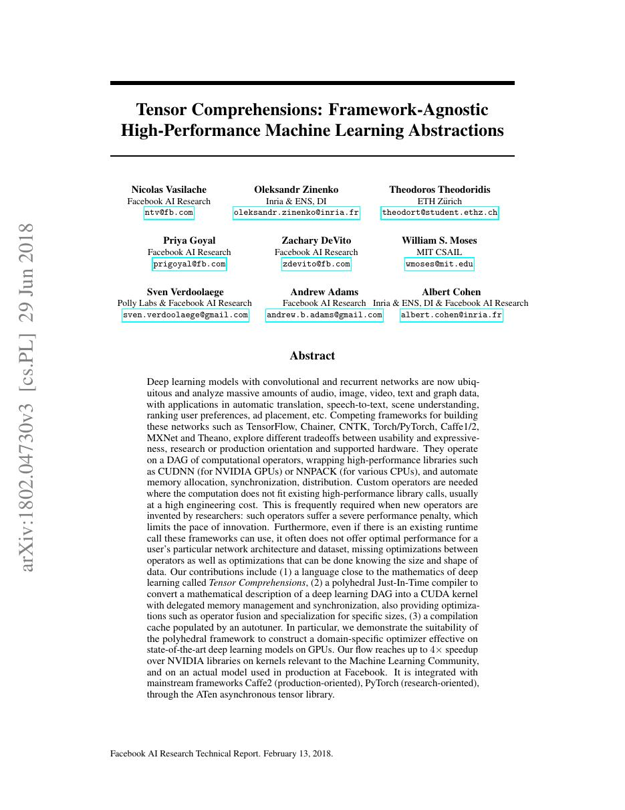
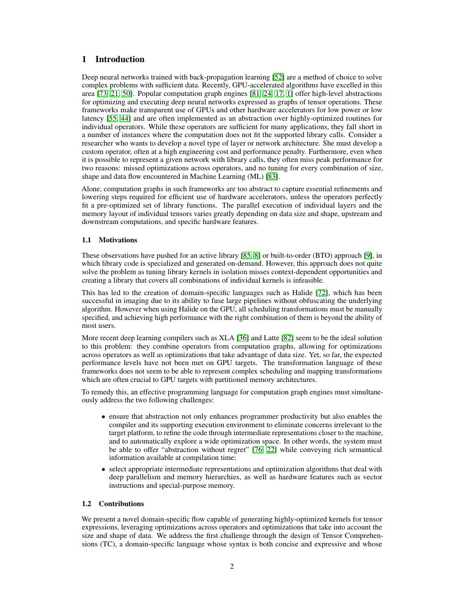
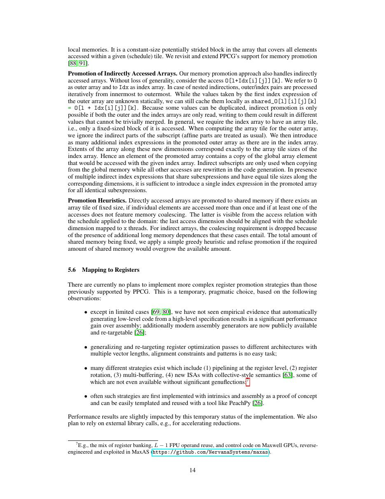
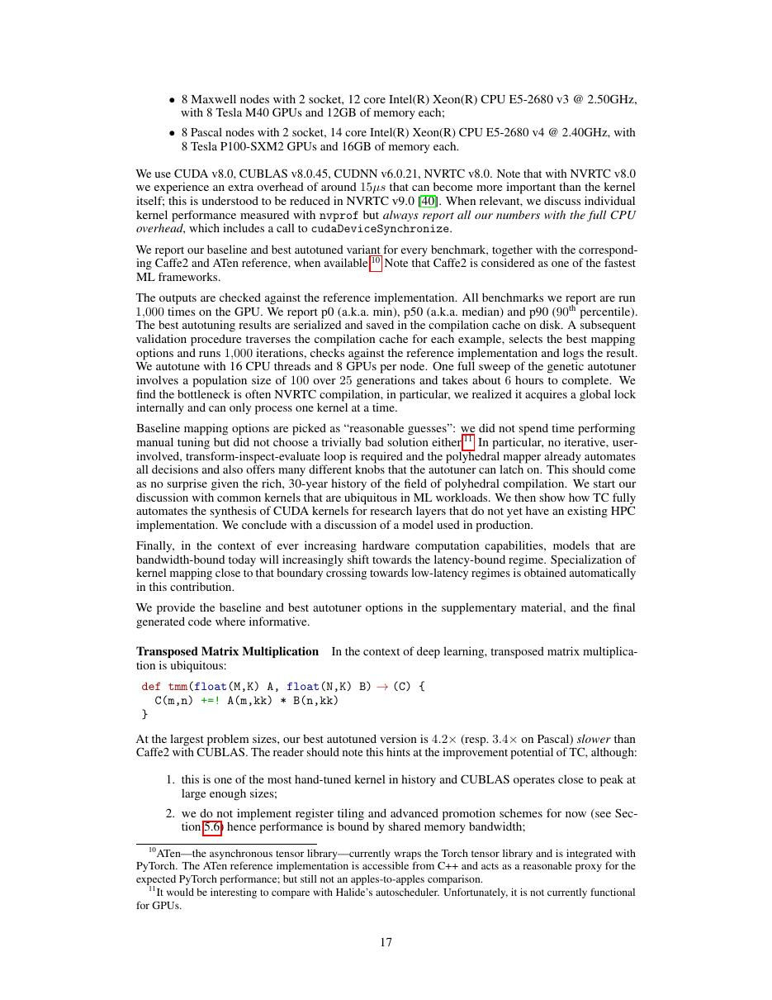

# 中文精读：《Tensor Comprehensions: Framework-Agnostic High-Performance Machine Learning Abstractions》

## 一、它解决了什么

Tensor Comprehensions 用接近数学的张量 DSL 描述算子，通过 polyhedral JIT、fusion、特化和 autotuning 生成 CUDA kernel。

## 二、编译抽象与优化路径

用户写索引表达式与 reduction，编译器构建 polyhedral 表示，搜索 tiling、mapping、memory placement 等调度；缓存为具体 shape 调优后的代码。它试图把“算子实现”从手写 CUDA 变成声明式数学+搜索。

## 三、为什么影响后续系统

TC 是自动生成融合 tensor kernel 的早期工业探索，影响 schedule language、autotuning 与后来的 Triton/TVM 讨论。

## 四、怎样读性能结果

编译器结果必须同时记录 frontend、shape、batch、精度、目标硬件、vendor library、调优预算和编译时间。单算子加速不等于端到端同倍加速，首次编译延迟也不能与缓存命中后的 steady-state 混为一谈。

## 五、局限与工程边界

polyhedral 分析和搜索成本高，对不规则控制流、动态 shape 与现代 tensor-core pipeline 表达有限；项目生态没有像 TVM/Triton 持续扩大。

## 六、放进十年编译器演进史

与 TVM 比较同年两种抽象；与 Triton 比较自动 schedule 搜索和程序员显式 tile 控制的取舍。

## 七、原文入口

[论文/官方页面](https://arxiv.org/abs/1802.04730)

## 八、原文论证链

Tensor Comprehensions（TC）认为手写 CUDA 把数学语义、循环调度和硬件细节绑在一起。用户应只写接近 Einstein notation 的索引与 reduction；编译器把它转成 polyhedral 表示，再决定 fusion、tiling、线程映射、内存层次和同步。由于解析成本模型难精确，系统对 mapping options 做 autotuning，并缓存给定 shape/硬件的最佳实现。

论文用框架无关 DSL 接入 Caffe2/PyTorch 等前端，展示单算子和融合 workload 可接近或超过已有库。论点是“声明式计算 + 编译/搜索”能缩短新算子到高性能实现的路径，而不是自动生成永远优于 cuDNN。

> 原文定位：[PDF 文件第 1 页](paper.pdf#page=1) · [对应截图](rendered_figures/page-1.jpg)

## 九、计算与调度为何分离

卷积可写成索引关系：
$$
O(n,k,y,x) {+}{=} I(n,c,y+r,x+s)W(k,c,r,s).
$$
这只定义迭代域和访问函数；同一语义可对应大量 schedule：循环交换、tile、shared-memory staging、thread/block binding、unroll。polyhedral 模型用仿射集合/映射分析依赖并合法重排，autotuner 再在合法空间中用实际设备时间选择。

具体 shape 是重要编译参数。tile 在一个形状上匹配 shared memory，换形状后可能浪费线程或越界，因此缓存 key 必须包含尺寸、dtype、设备等。

> 原文定位：[PDF 文件第 2 页](paper.pdf#page=2) · [对应截图](rendered_figures/page-2.jpg)

## 十、实验怎样读

区分 compile/tune time、首次运行和 steady-state kernel time。论文展示的 tuning 后峰值不等于在线第一次调用延迟；与 vendor library 比较还应确认是否包含 layout conversion。融合收益既来自少 launch，也来自中间 tensor 不落 HBM。

> 原文定位：[PDF 文件第 14 页](paper.pdf#page=14) · [对应截图](rendered_figures/page-14.jpg)

## 十一、复现检查

- 核对 DSL reduction 的初始化与浮点结合顺序。
- 报告候选数、测量次数、搜索预算和缓存复用。
- 检查生成代码的 shared memory、register spill 与 occupancy。
- 动态 shape 应评估重新调优成本，而非只测固定尺寸。

## 十二、常见误读

polyhedral 合法性主要针对仿射循环与理想语义；浮点重排不保证逐位一致。不规则控制流、现代异步 tensor-core pipeline 也不自然落入早期抽象，这解释了后来 tile DSL 的兴起。

> 原文定位：[PDF 文件第 17 页](paper.pdf#page=17) · [对应截图](rendered_figures/page-17.jpg)

## 原文证据导航

以下页码按仓库内 PDF 的**文件页码**计，不等同于论文印刷页码。建议先读本节所指原文，再回看上面的中文解释。

- [打开原始 PDF](paper.pdf)
- [打开可检索文本](paper.txt)

| 中文笔记中的证据 | 原文位置 | 复核重点 |
|---|---|---|
| 原文首页、摘要或官方架构概览 | [PDF 文件第 1 页](paper.pdf#page=1) · [截图](rendered_figures/page-1.jpg) | 回到该页上下文，复核定义、图表或实验论证 |
| IR、架构、搜索空间或执行模型关键页 | [PDF 文件第 2 页](paper.pdf#page=2) · [截图](rendered_figures/page-2.jpg) | 回到该页上下文，复核定义、图表或实验论证 |
| 实验、性能或设计分析所在原文页 | [PDF 文件第 14 页](paper.pdf#page=14) · [截图](rendered_figures/page-14.jpg) | 回到该页上下文，复核定义、图表或实验论证 |
| 讨论、结论或补充设计所在原文页 | [PDF 文件第 17 页](paper.pdf#page=17) · [截图](rendered_figures/page-17.jpg) | 回到该页上下文，复核定义、图表或实验论证 |
