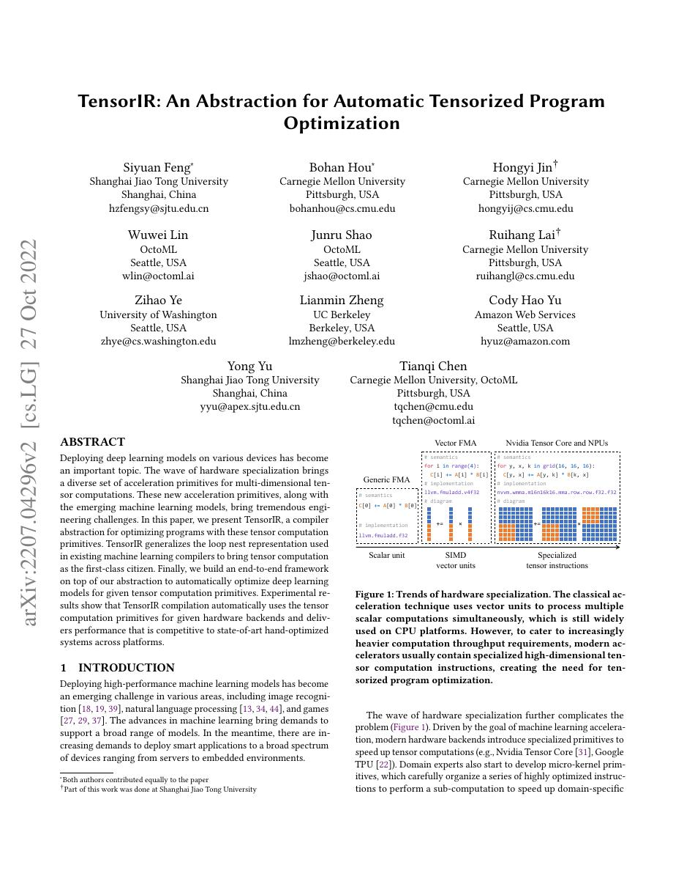
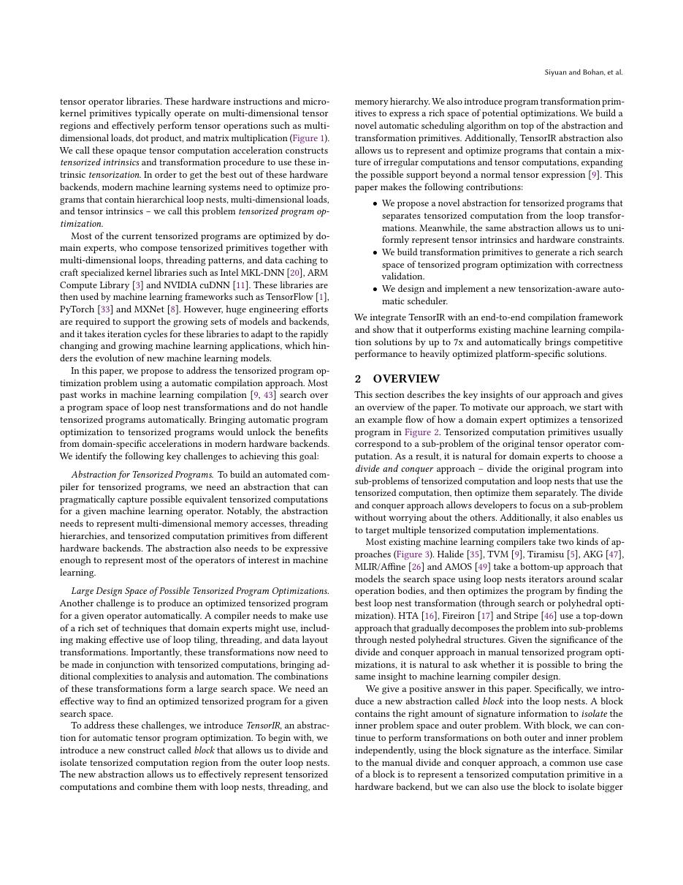
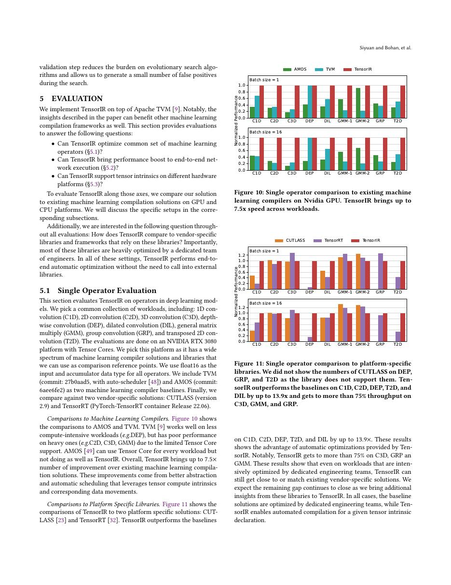
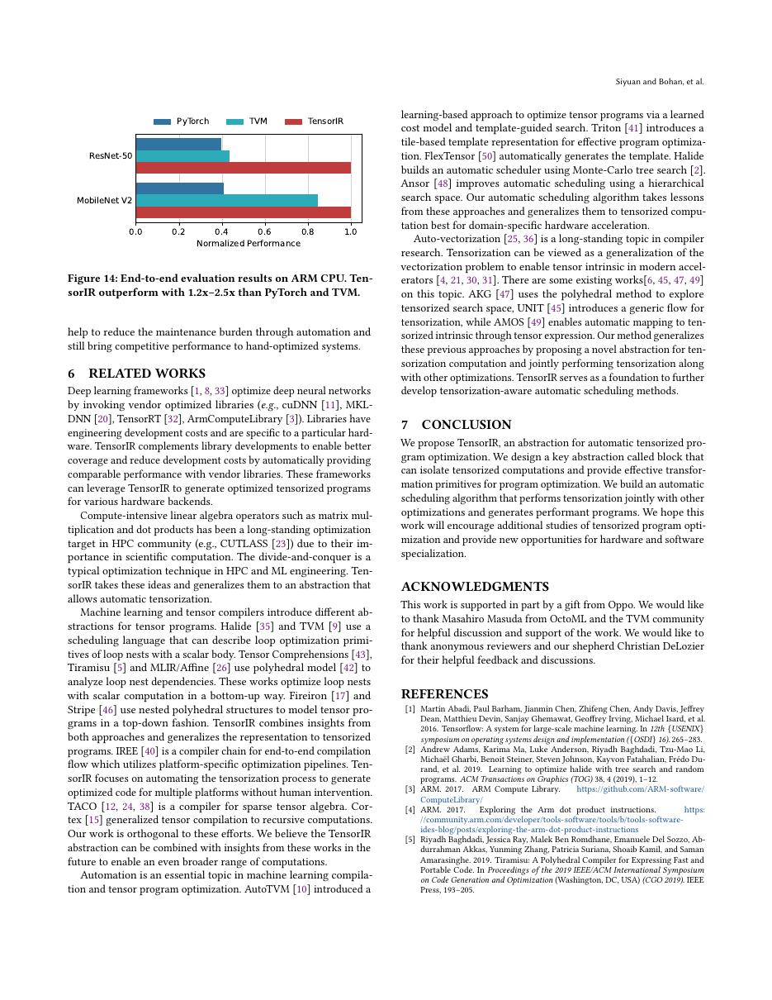

# 中文精读：《TensorIR: An Abstraction for Automatic Tensorized Program Optimization》

## 一、它解决了什么

TensorIR 把 tensor computation block 作为一等公民，在循环级可调度性和 tensor intrinsic 语义之间建立统一 IR。

## 二、编译抽象与优化路径

block 显式描述读写 region、迭代变量与归约，让依赖分析、变换验证和 tensorization 更可靠；schedule primitives 生成新的合法 IR，匹配 GPU tensor core、CPU vector 等硬件 intrinsic。

## 三、为什么影响后续系统

它取代 TVM 早期 Tensor Expression/TIR 的部分职责，并支撑 MetaSchedule、Relax/TVM Unity 的低层优化。

## 四、怎样读性能结果

编译器结果必须同时记录 frontend、shape、batch、精度、目标硬件、vendor library、调优预算和编译时间。单算子加速不等于端到端同倍加速，首次编译延迟也不能与缓存命中后的 steady-state 混为一谈。

## 五、局限与工程边界

高层模型语义仍需其他 IR 保存；写好 block/intrinsic 和 backend 规则需要专家。合法变换空间大，最终性能仍依搜索与 codegen。

## 六、放进十年编译器演进史

TVM→Ansor→MetaSchedule+TensorIR 构成一条连续演进；再与 MLIR Linalg/Transform dialect 比较多级 IR 设计。

## 七、原文入口

[论文/官方页面](https://arxiv.org/abs/2207.04296)

## 八、原文论证链

早期 tensor expression 易描述计算，但经过调度后，循环与原始 tensor 语义关系可能变得隐含，自动验证和 tensorization 困难。TensorIR 把 block 作为一等结构，显式记录迭代变量、read/write region、init 与 reduction。schedule primitive 对 IR 做可检查变换，编译器能判断依赖和合法性，并把 block 匹配到 tensor-core/vector intrinsic。

> 原文定位：[PDF 文件第 1 页](paper.pdf#page=1) · [对应截图](rendered_figures/page-1.jpg)

## 九、block 为什么关键

一个 block 不只是语法作用域。其 iter vars 区分 spatial/reduction，region 描述访问集合。例如 matmul block 明确
$$
C[i,j] {+}{=} A[i,k]B[k,j],
$$
以及 $C$ 的 init。split/reorder/blockize 后，这些语义仍可追踪，便于检查 compute-at 是否越过依赖、缓存 region 是否完整。

tensorization 将一段 block/loop 与声明过的 intrinsic pattern 匹配，再替换为目标指令。抽象既要足够结构化用于匹配，又要足够低层表达 shared memory 和线程绑定。

> 原文定位：[PDF 文件第 2 页](paper.pdf#page=2) · [对应截图](rendered_figures/page-2.jpg)

## 十、实验怎样读

论文的证据包括表达典型 schedule、自动优化结果和在多硬件上的性能。最终速度还依 MetaSchedule 等搜索和后端，所以 TensorIR 的贡献应同时看“能表达/验证哪些变换”，不能把全部 speedup 当作 IR 单独效果。

> 原文定位：[PDF 文件第 10 页](paper.pdf#page=10) · [对应截图](rendered_figures/page-10.jpg)

## 十一、复现检查

- 每个 block 的 read/write region 与 reduction init 必须准确。
- schedule 变换后运行 verifier，并保存 trace 以便重放。
- intrinsic 描述同时核对语义、dtype、layout 与对齐。
- 与旧 TIR/TE 比较时分开 IR 能力和搜索策略变量。

## 十二、常见误读

TensorIR 不是替代所有高层模型 IR；它聚焦 tensor program 优化。block 也不是普通代码块，而是给依赖分析和 tensorization 的语义契约。

> 原文定位：[PDF 文件第 12 页](paper.pdf#page=12) · [对应截图](rendered_figures/page-12.jpg)

## 原文证据导航

以下页码按仓库内 PDF 的**文件页码**计，不等同于论文印刷页码。建议先读本节所指原文，再回看上面的中文解释。

- [打开原始 PDF](paper.pdf)
- [打开可检索文本](paper.txt)

| 中文笔记中的证据 | 原文位置 | 复核重点 |
|---|---|---|
| 原文首页、摘要或官方架构概览 | [PDF 文件第 1 页](paper.pdf#page=1) · [截图](rendered_figures/page-1.jpg) | 回到该页上下文，复核定义、图表或实验论证 |
| IR、架构、搜索空间或执行模型关键页 | [PDF 文件第 2 页](paper.pdf#page=2) · [截图](rendered_figures/page-2.jpg) | 回到该页上下文，复核定义、图表或实验论证 |
| 实验、性能或设计分析所在原文页 | [PDF 文件第 10 页](paper.pdf#page=10) · [截图](rendered_figures/page-10.jpg) | 回到该页上下文，复核定义、图表或实验论证 |
| 讨论、结论或补充设计所在原文页 | [PDF 文件第 12 页](paper.pdf#page=12) · [截图](rendered_figures/page-12.jpg) | 回到该页上下文，复核定义、图表或实验论证 |
