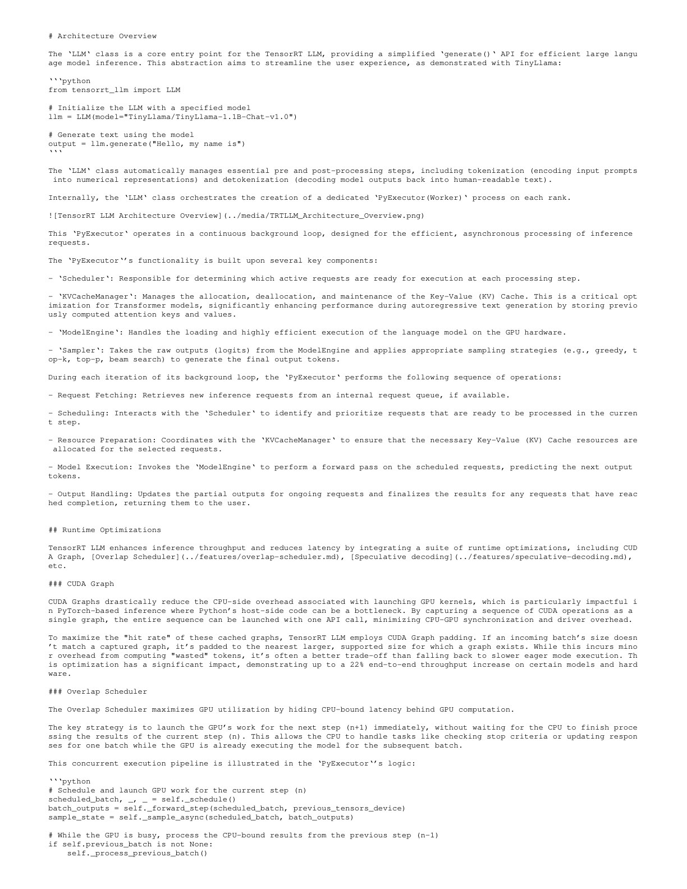
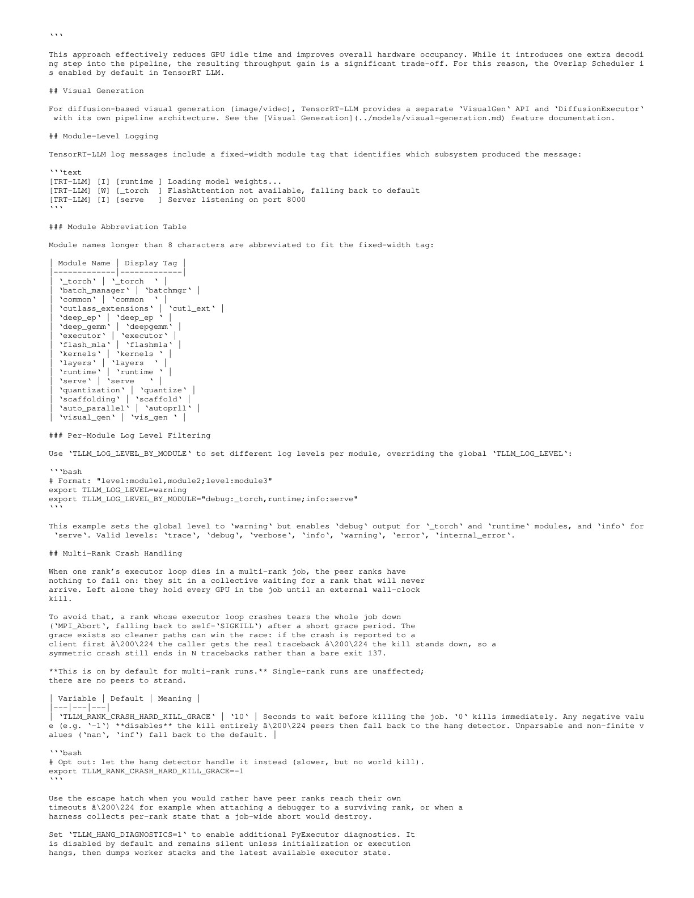
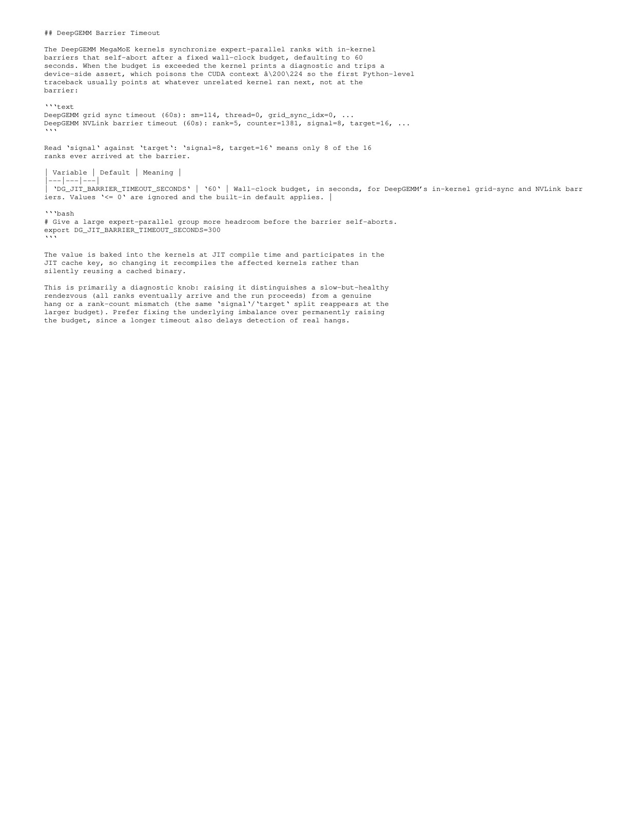

# TensorRT-LLM Architecture 官方资料精读

## 1. 先澄清资料性质

截至本仓库快照，TensorRT-LLM 没有一篇能完整、稳定覆盖当前架构的正式系统论文。因此这里保存 NVIDIA 官方 Architecture Overview、README 和性能说明，并明确标为工程资料。

- paper.txt：Architecture Overview 原始 Markdown。
- paper.pdf：为统一阅读格式生成的 PDF。
- source_readme.md：功能与版本入口。
- source_perf_overview.md：官方 benchmark 方法与注意事项。

文档会随 main 分支变化，本文所有“当前”均指 2026-10-03 快照。

## 2. 从 API 到执行器

用户入口是 LLM 类，但性能关键在每个 rank 的 PyExecutor background loop。核心组件：

- Scheduler：本轮选择哪些 requests/tokens；
- KVCacheManager：KV block 生命周期与映射；
- ModelEngine：模型 forward 与 kernels；
- Sampler：greedy/top-k/top-p/beam 等解码；
- request/output queues：连接 API 与异步 workers。

主循环可以写成：

1. fetch 新请求；
2. schedule 本轮 batch；
3. 准备 KV 资源；
4. forward；
5. sample；
6. 更新请求状态并返回完成结果。

这说明 TensorRT-LLM 性能不能只用某个 GEMM kernel 解释。调度、KV、采样和 CPU/GPU pipeline 都在每 token 路径上。

## 3. Prefill 与 decode

### Prefill

- 一次处理整段 prompt；
- GEMM 较大，算术强度高；
- 更关注吞吐和 attention/KV 写入。

### Decode

- 每轮通常每 request 一个新 token；
- GEMM 的 M 维小，权重每轮重读；
- kernel launch、CPU scheduling 和 memory bandwidth 更突出。

这也是 [Ada-MK](../ada_mk/论文中文解读.md) 只替换 decode、保留 TensorRT-LLM prefill 的原因。

## 4. CUDA Graph 与 padding

CUDA Graph 将一串 GPU operations 捕获并低开销 replay。TensorRT-LLM 为提高命中率，会把实际 batch pad 到相邻已捕获 graph size。

权衡是：

$$
Benefit\approx LaunchSavings-PaddedTokenCompute-GraphMemory.
$$

官方架构文档在特定模型/硬件上提到最高约 22% 端到端吞吐提升，但这不是跨模型保证。Dynamic batch 越碎，capture set 与 padding policy 越重要。

## 5. Overlap Scheduler

基本流水线是：

- GPU 已开始执行 step $n+1$；
- CPU 同时处理 step $n$ 的 stop condition、output 和 request state。

这隐藏 host work，但会引入额外一个 decode step 的 pipeline 状态。它改善 throughput，不保证每种请求模式下最低单请求 latency。

## 6. KV cache 是 runtime 的中心资源

自回归解码若每步重算整个 prefix，成本不可接受。KV cache 保存历史 token 的 attention keys/values；paged cache 将其切成 blocks，以支持：

- 不同 sequence length；
- 请求动态加入/退出；
- block 复用/回收；
- prefix reuse；
- prefill/decode 分离时的 KV transfer。

因此 Scheduler 选择 batch 时必须同时考虑 GPU compute 与可用 KV blocks。仅 benchmark kernel 而忽略 KV pressure，无法代表 serving。

## 7. Kernel 层

官方 README 将 attention、GEMM、MoE 等专用 kernels 与 runtime optimizations 并列。可能的实现来源包括：

- TensorRT-LLM 自有 CUDA/CUTLASS kernels；
- FlashAttention/FlashInfer 类 attention；
- DeepGEMM 或 grouped GEMM；
- Triton kernels；
- CuTe DSL kernels；
- quantized plugins。

“使用 TensorRT-LLM”不代表所有 operator 都由 TensorRT compiler 自动 fusion，也不代表只使用一种 DSL。

## 8. MoE 与多 rank 的工程风险

快照中的 DeepGEMM MegaMoE 使用 in-kernel barriers 同步 expert-parallel ranks，并设置超时。若一个 rank 未到达，device assert 会污染 CUDA context，Python 看到的第一个错误可能出现在后续无关 kernel。

这段文档很有价值：复杂 fused/MegaMoE kernel 的问题不仅是速度，还有 deadlock、错误定位和多 rank failure propagation。生产系统需要：

- barrier timeout；
- rank crash hard-kill；
- per-module logs；
- signal/target 诊断；
- 一致的 JIT cache key。

## 9. TensorRT-LLM 与几个相近名词

| 名称 | 主要职责 |
| --- | --- |
| TensorRT | 通用 NVIDIA inference optimizer/runtime |
| TensorRT-LLM | LLM/VLM 专用模型、kernel、KV、scheduler 与 runtime |
| Triton Inference Server | 模型服务进程，可加载 TensorRT-LLM backend |
| OpenAI Triton | 编写 GPU kernel 的语言/编译器 |
| CUDA Graph | 捕获与 replay kernel 序列的 CUDA 机制 |

“Triton”在这里最容易混淆：Inference Server 和 OpenAI Triton 不是同一项目。

## 10. 如何正确 benchmark

至少锁定：

- TensorRT-LLM commit/release 和 backend；
- GPU、driver、CUDA、clock/power；
- model revision 与 quantization；
- tensor/expert/pipeline parallel；
- input/output length distribution；
- concurrency、batch policy；
- offline throughput 或 online arrival；
- TTFT、TPOT、throughput、P50/P99；
- prefix cache/speculative decoding/CUDA Graph 开关。

官方 perf 文档也提醒参考数字不是可无条件复现的峰值。

## 11. 与本专题论文的连接

- [FusionStitching](../fusion_stitching/论文中文解读.md)：解释局部 fusion 的收益与资源代价。
- [MegaBlocks](../megablocks/论文中文解读.md)：解释动态 MoE expert batches 的 kernel 化。
- [MPK](../mirage_persistent_kernel/论文中文解读.md)：解释把调度迁入 persistent megakernel。
- [Ada-MK](../ada_mk/论文中文解读.md)：直接把 MegaKernel 作为 plugin 嵌入 TensorRT-LLM。
- [CuTeDSL TorchInductor](../cutedsl_torchinductor/论文中文解读.md)：说明现代 runtime 会并存多个 kernel backends。

## 12. 最终判断

理解 TensorRT-LLM 应采用分层模型：API/serving、request scheduler、KV manager、model executor、kernel backend、distributed runtime。它没有一个可永久冻结的“算法”，所以官方版本化文档比强行寻找一篇总括论文更可靠。
