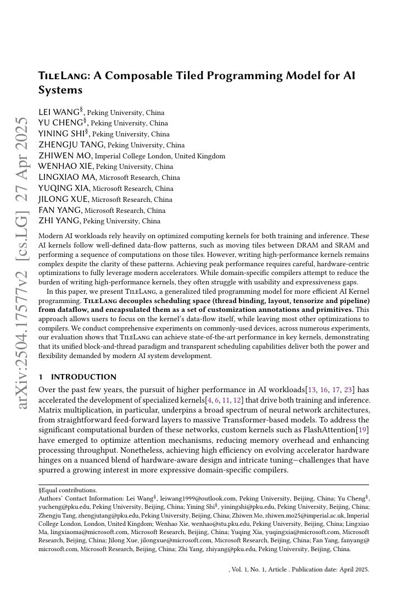
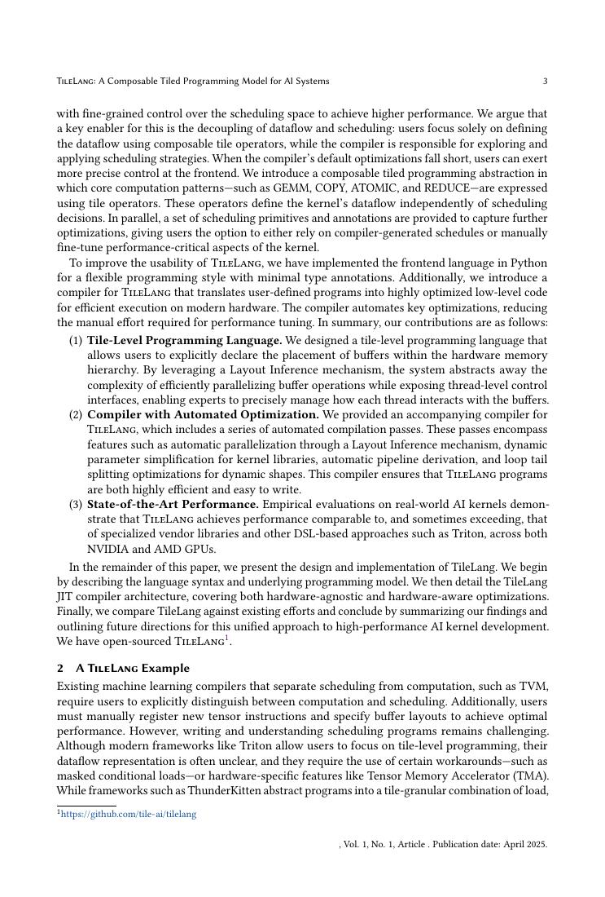
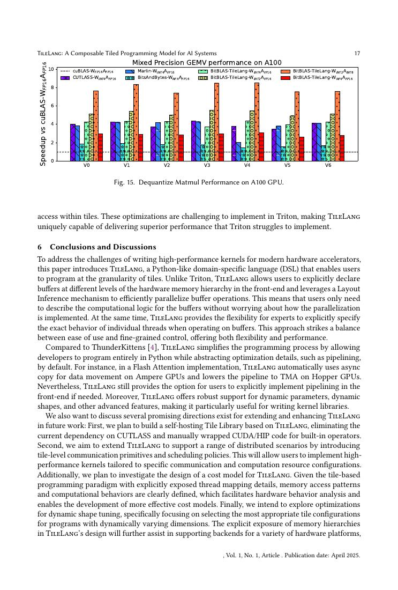
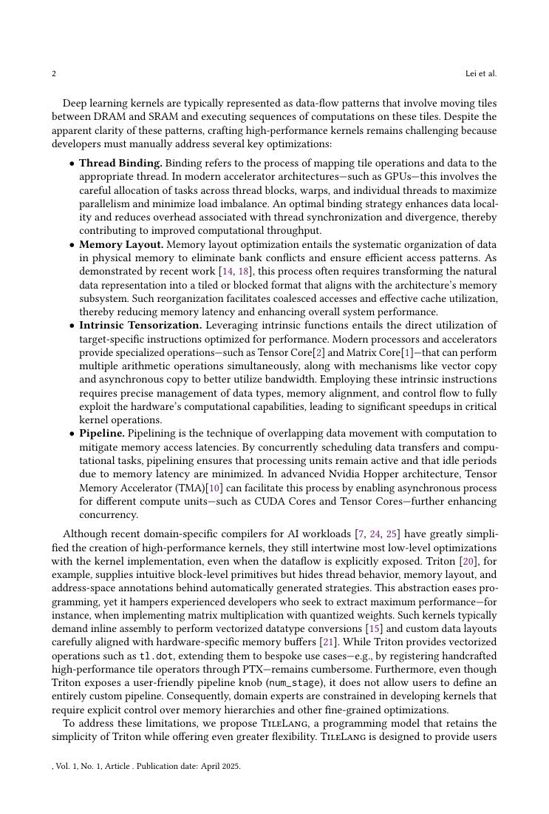

# 中文精读：《TileLang: A Composable Tiled Programming Model for AI Systems》

## 一、它解决了什么

TileLang 以 tile 为核心描述 AI kernel 数据流，把 thread binding、layout、tensorize 和 pipeline 等调度作为可组合注解。

## 二、编译抽象与优化路径

程序员主要写 DRAM↔SRAM tile 搬运和 tile 计算；编译器依据 target 处理更底层映射。统一 block/thread paradigm 试图同时保留接近 Python 的可读性和现代 GPU pipeline 表达力。

## 三、为什么影响后续系统

它代表 2025 年 kernel compiler 趋势：不再追求完全自动从任意图生成峰值代码，而是给专家更高层、可移植、可组合的硬件控制。

## 四、怎样读性能结果

编译器结果必须同时记录 frontend、shape、batch、精度、目标硬件、vendor library、调优预算和编译时间。单算子加速不等于端到端同倍加速，首次编译延迟也不能与缓存命中后的 steady-state 混为一谈。

## 五、局限与工程边界

达到峰值仍需要理解 tile、layout、pipeline 和硬件；论文 benchmark 是精选 kernels，新算子、动态 shape 与调试生态需要长期验证。

## 六、放进十年编译器演进史

把 Triton、Hidet、TileLang、CuTeDSL 与 FA4 连读：抽象逐渐靠近 tile/layout/pipeline，算法作者与编译器共同决定性能。

## 七、原文入口

[论文/官方页面](https://arxiv.org/abs/2504.17577)

## 八、原文论证链

TileLang 顺应现代 AI kernel 的共同结构：从 global memory 搬 tile 到片上，执行 tile MMA/reduction，再写回；高性能依赖 layout、thread binding、异步 pipeline 和 tensorize。系统让程序员主要写 tile 级数据流，用可组合注解表达底层调度，编译器负责映射到 CUDA/相关后端。目标是在 Python 风格可读性与接近专家 kernel 的控制力之间取平衡。

> 原文定位：[PDF 文件第 1 页](paper.pdf#page=1) · [对应截图](rendered_figures/page-1.jpg)

## 九、tile 抽象为何合适

tile 同时是计算和数据移动单位。矩阵乘可写成 K 维循环，每轮异步加载 $A_{tile},B_{tile}$，等待后执行 MMA 并在寄存器累积。多 stage pipeline 试图满足
$$
T_{\rm load}\ \text{与}\ T_{\rm compute}\ \text{重叠},
$$
而 layout 注解决定逻辑坐标如何分布到 bank、lane 和寄存器。

相比逐 thread CUDA，tile 隐藏机械索引；相比完全自动编译，它允许算法作者控制 attention、GEMM、quantization 等关键 dataflow。

> 原文定位：[PDF 文件第 3 页](paper.pdf#page=3) · [对应截图](rendered_figures/page-3.jpg)

## 十、实验怎样读

论文 benchmark 包括精选 AI kernels，并比较 Triton/CUTLASS/手写实现。阅读峰值时核对 shape、dtype、GPU、是否包含 autotune 与编译时间。DSL 能表达一个快实现不等于编译器可自动从朴素代码找到它；示例中仍包含专家 tile 选择。

> 原文定位：[PDF 文件第 17 页](paper.pdf#page=17) · [对应截图](rendered_figures/page-17.jpg)

## 十一、复现检查

- 保存 tile shape、layout、pipeline stage、num warps 与 target。
- 测试非整除边界、动态 shape 和极端数值。
- 用 profiler 检查 bank conflict、stall、occupancy 与异步重叠。
- 对比时统一 epilogue、精度、warmup 和输入布局。

## 十二、常见误读

TileLang 不消除硬件知识，而是把知识提升到较可组合的 tile 层。它代表编译器与 kernel 作者的协作接口，不是“任意 Python 自动达到峰值”。

> 原文定位：[PDF 文件第 2 页](paper.pdf#page=2) · [对应截图](rendered_figures/page-2.jpg)

## 原文证据导航

以下页码按仓库内 PDF 的**文件页码**计，不等同于论文印刷页码。建议先读本节所指原文，再回看上面的中文解释。

- [打开原始 PDF](paper.pdf)
- [打开可检索文本](paper.txt)

| 中文笔记中的证据 | 原文位置 | 复核重点 |
|---|---|---|
| 原文首页、摘要或官方架构概览 | [PDF 文件第 1 页](paper.pdf#page=1) · [截图](rendered_figures/page-1.jpg) | 回到该页上下文，复核定义、图表或实验论证 |
| IR、架构、搜索空间或执行模型关键页 | [PDF 文件第 3 页](paper.pdf#page=3) · [截图](rendered_figures/page-3.jpg) | 回到该页上下文，复核定义、图表或实验论证 |
| 实验、性能或设计分析所在原文页 | [PDF 文件第 17 页](paper.pdf#page=17) · [截图](rendered_figures/page-17.jpg) | 回到该页上下文，复核定义、图表或实验论证 |
| 讨论、结论或补充设计所在原文页 | [PDF 文件第 2 页](paper.pdf#page=2) · [截图](rendered_figures/page-2.jpg) | 回到该页上下文，复核定义、图表或实验论证 |
