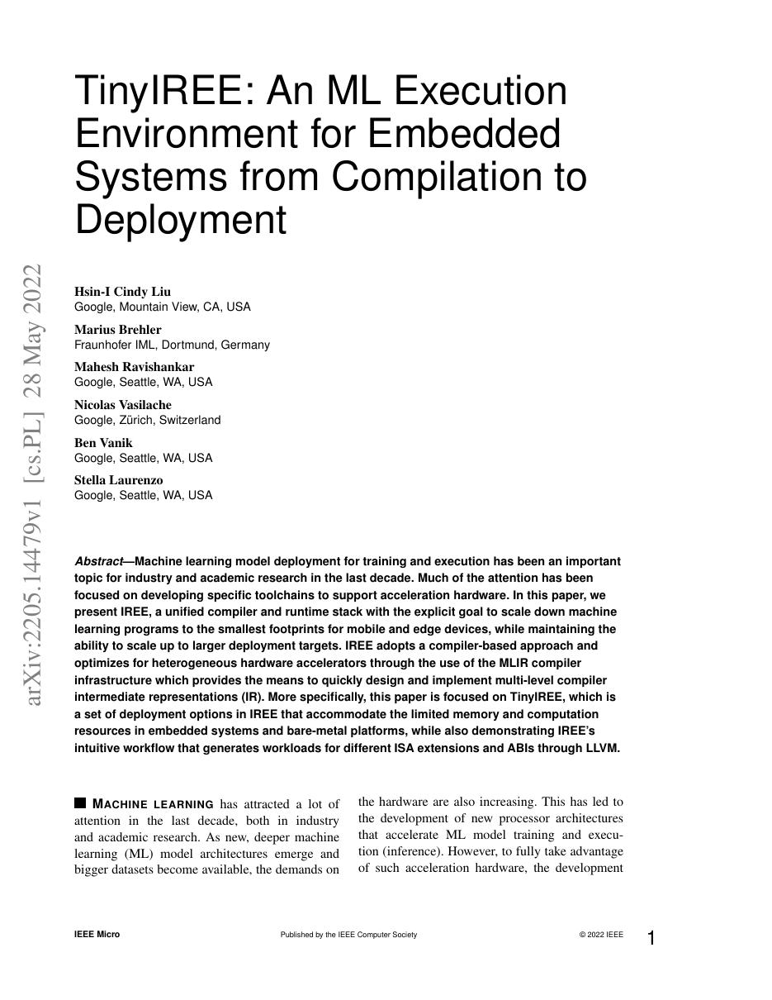
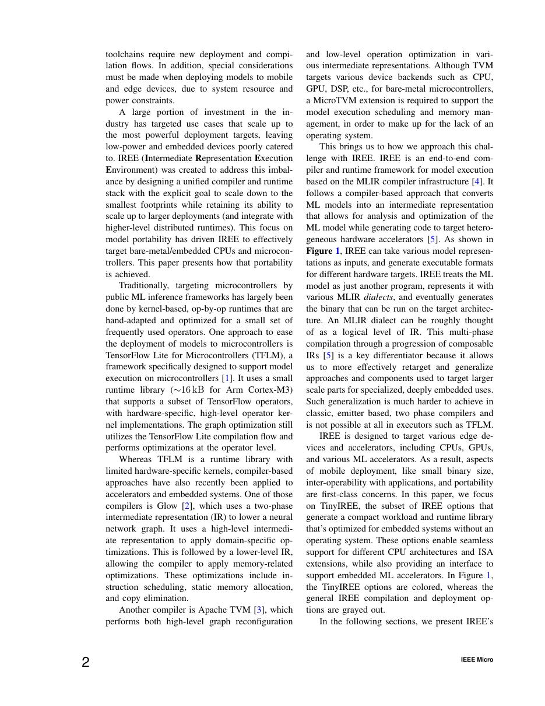
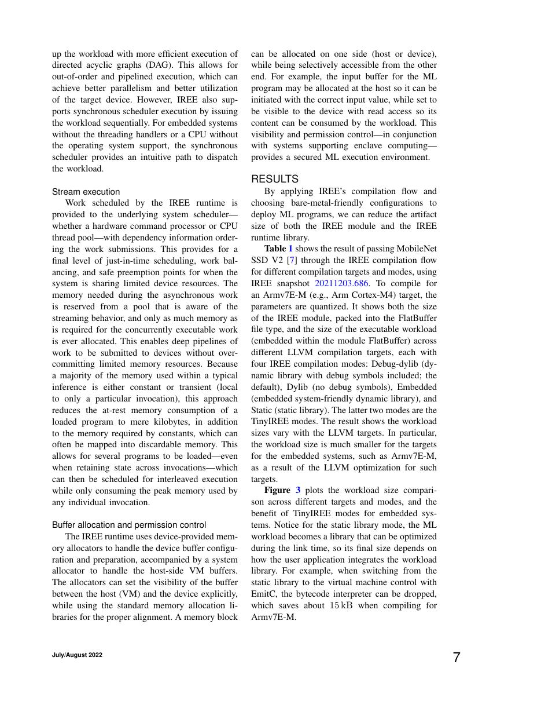
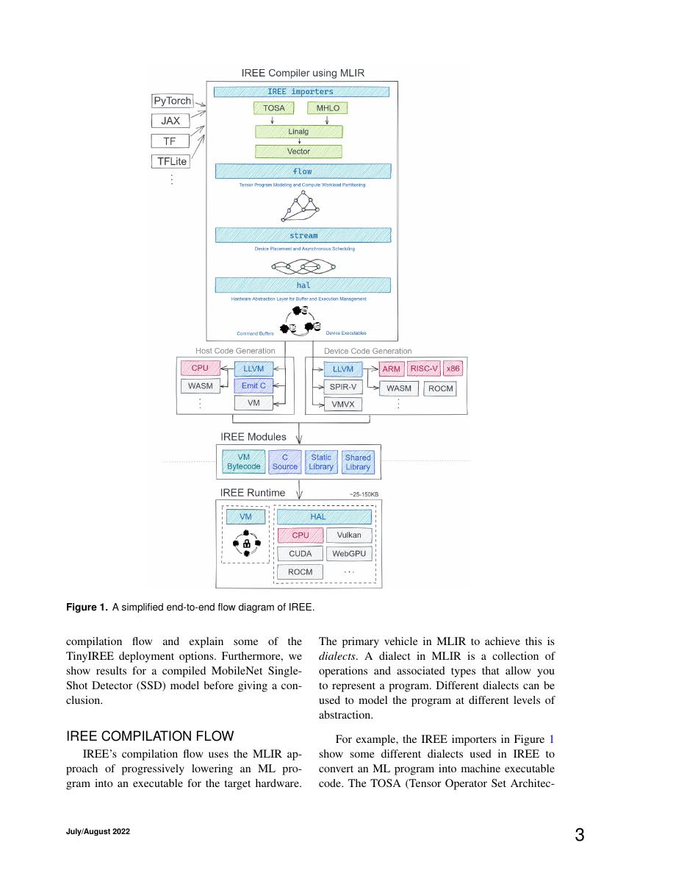

# 中文精读：《TinyIREE: An ML Execution Environment for Embedded Systems from Compilation to Deployment》

## 一、它解决了什么

IREE 以 MLIR 为基础把模型编译成小型、可移植的 runtime artifact；TinyIREE 聚焦 bare-metal 与嵌入式内存约束。

## 二、编译抽象与优化路径

模型经多级 dialect lowering 到 HAL/目标代码，VM bytecode 与精简 runtime 管理调用和 buffer；同一 compiler stack 可面向 CPU/GPU/accelerator，并通过部署选项裁剪依赖。

## 三、为什么影响后续系统

它把 AI compiler 视为“编译器+运行时+部署 ABI”整体，说明高性能之外还要解决可移植封装和小 footprint。

## 四、怎样读性能结果

编译器结果必须同时记录 frontend、shape、batch、精度、目标硬件、vendor library、调优预算和编译时间。单算子加速不等于端到端同倍加速，首次编译延迟也不能与缓存命中后的 steady-state 混为一谈。

## 五、局限与工程边界

本文重点是嵌入式，不代表 IREE 所有大模型/GPU 能力；算子覆盖、driver、动态内存和目标后端成熟度决定实际可用性。

## 六、放进十年编译器演进史

MLIR 提供基础设施，IREE 展示端到端产品化；与 TensorRT-LLM 比较通用部署编译器和 LLM 专用 runtime。

## 七、原文入口

[论文/官方页面](https://arxiv.org/abs/2205.14479)

## 八、原文论证链

TinyIREE 把问题从“生成一个快 kernel”扩大到嵌入式完整部署：模型如何编译、序列化、加载、调度和管理 buffer，并在 bare-metal/微控制器的小内存和有限系统库中运行。它继承 IREE 基于 MLIR 的多级 lowering，把模型变成 VM bytecode/目标代码与 HAL 接口，再裁剪 runtime 特性降低 footprint。

> 原文定位：[PDF 文件第 1 页](paper.pdf#page=1) · [对应截图](rendered_figures/page-1.jpg)

## 九、编译器与 runtime 分工

前端模型经高层 dialect、flow/stream 等阶段划分执行与资源，再 lower 到 HAL 和目标 backend。编译期尽可能决定 shape、dispatch 与内存计划；runtime 只保留设备抽象、命令提交、VM 调用和必要的 buffer 管理。

嵌入式约束下，总成本包括
$$
{\rm flash\ code}+{\rm weights}+{\rm peak\ SRAM}+{\rm runtime\ metadata},
$$
不能只报告 operator latency。bytecode 提高可移植和紧凑性，但解释/调度也有开销，AOT 程度需权衡。

> 原文定位：[PDF 文件第 2 页](paper.pdf#page=2) · [对应截图](rendered_figures/page-2.jpg)

## 十、实验怎样读

论文比较模型可运行性、二进制/运行时大小、内存和性能。应检查具体 board、编译 flags、是否有 RTOS、模型量化及外部 kernel 库。TinyIREE 的结果证明端到端部署可行，不代表完整 IREE 在服务器 GPU 的所有能力由本文评估。

> 原文定位：[PDF 文件第 7 页](paper.pdf#page=7) · [对应截图](rendered_figures/page-7.jpg)

## 十一、复现检查

- 报告 flash、常驻 RAM、峰值 arena 与 stack 四类内存。
- 确认动态分配是否禁用、buffer 是否由静态计划复用。
- 保存 MLIR pipeline、target triple 和裁剪 feature flags。
- 在真实板卡而非只在模拟器测延迟和功耗。

## 十二、常见误读

TinyIREE 不是一个新神经网络，也不仅是“把 IREE 缩小”。论文强调编译 artifact、ABI、HAL 和 runtime 共同构成部署系统；算子覆盖和驱动成熟度仍决定能否落地。

> 原文定位：[PDF 文件第 3 页](paper.pdf#page=3) · [对应截图](rendered_figures/page-3.jpg)

## 原文证据导航

以下页码按仓库内 PDF 的**文件页码**计，不等同于论文印刷页码。建议先读本节所指原文，再回看上面的中文解释。

- [打开原始 PDF](paper.pdf)
- [打开可检索文本](paper.txt)

| 中文笔记中的证据 | 原文位置 | 复核重点 |
|---|---|---|
| 原文首页、摘要或官方架构概览 | [PDF 文件第 1 页](paper.pdf#page=1) · [截图](rendered_figures/page-1.jpg) | 回到该页上下文，复核定义、图表或实验论证 |
| IR、架构、搜索空间或执行模型关键页 | [PDF 文件第 2 页](paper.pdf#page=2) · [截图](rendered_figures/page-2.jpg) | 回到该页上下文，复核定义、图表或实验论证 |
| 实验、性能或设计分析所在原文页 | [PDF 文件第 7 页](paper.pdf#page=7) · [截图](rendered_figures/page-7.jpg) | 回到该页上下文，复核定义、图表或实验论证 |
| 讨论、结论或补充设计所在原文页 | [PDF 文件第 3 页](paper.pdf#page=3) · [截图](rendered_figures/page-3.jpg) | 回到该页上下文，复核定义、图表或实验论证 |
