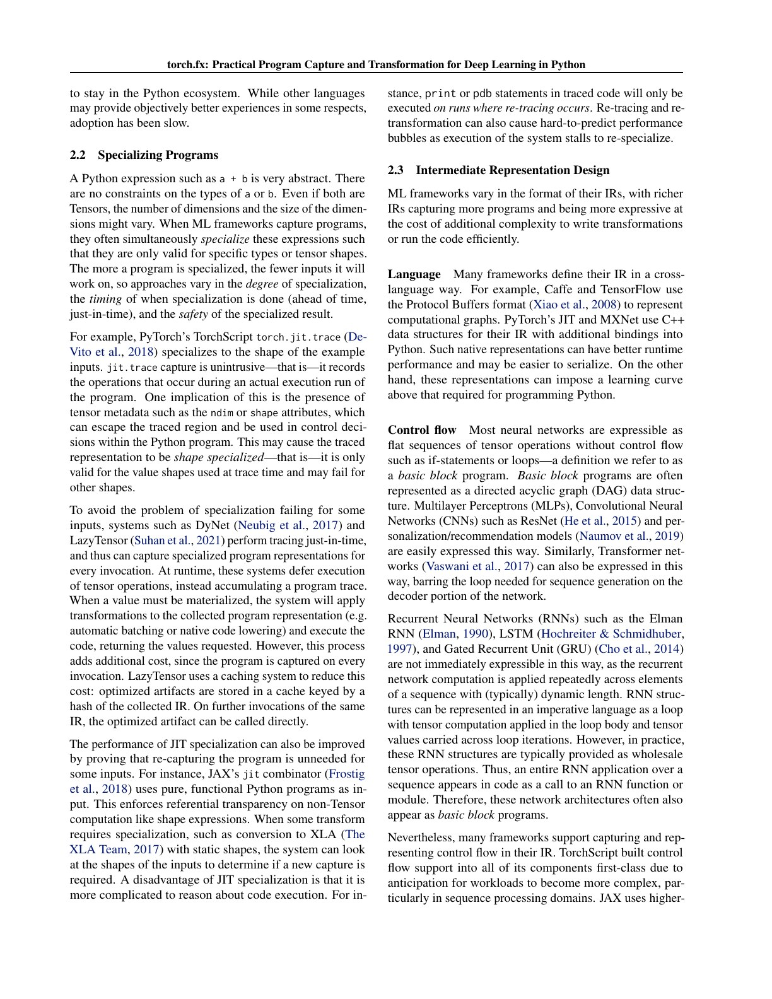
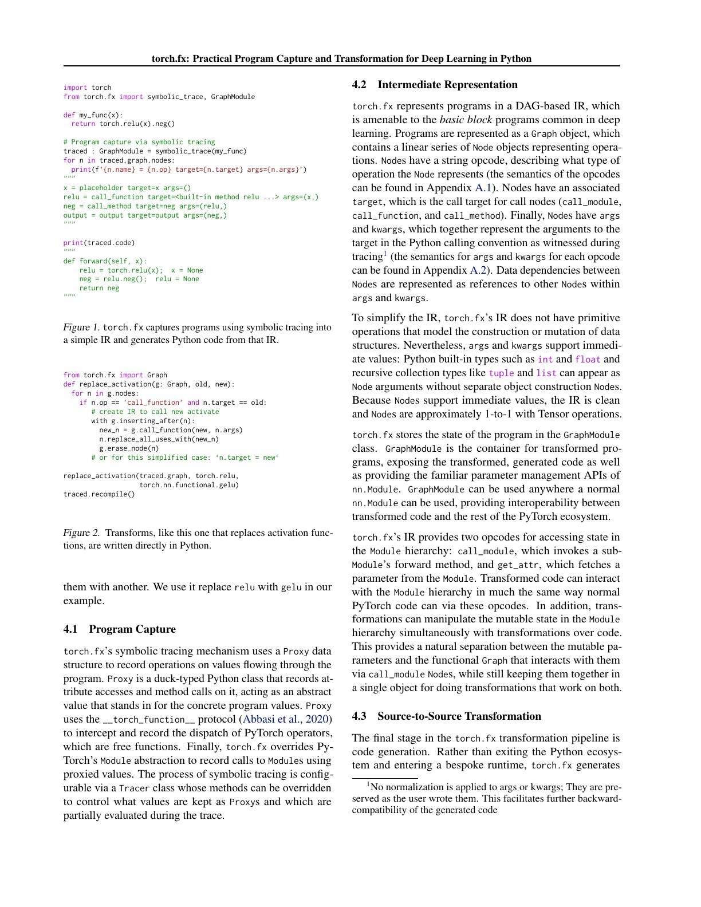
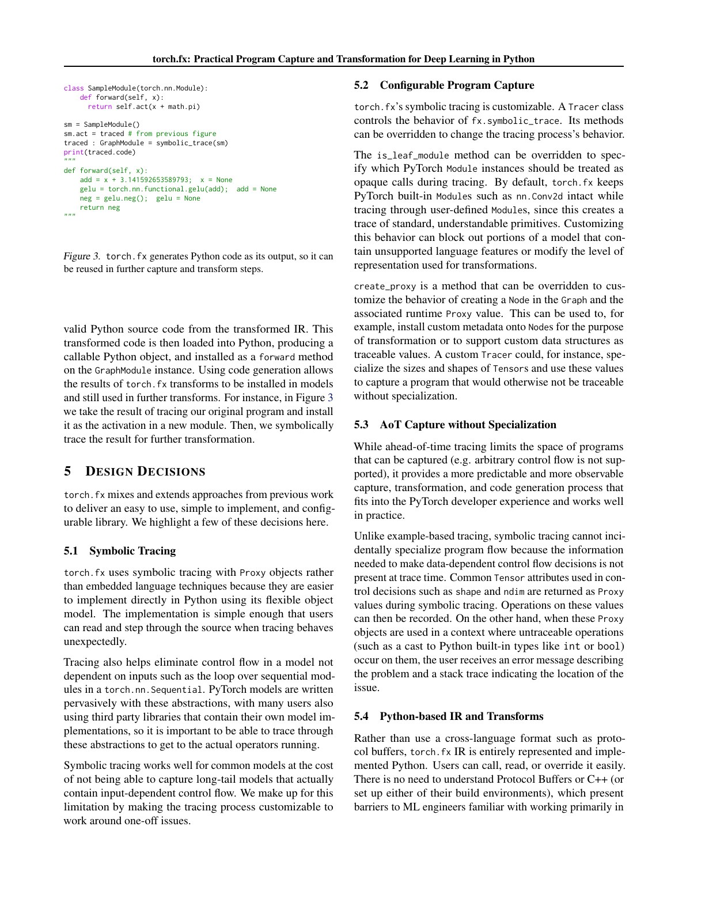
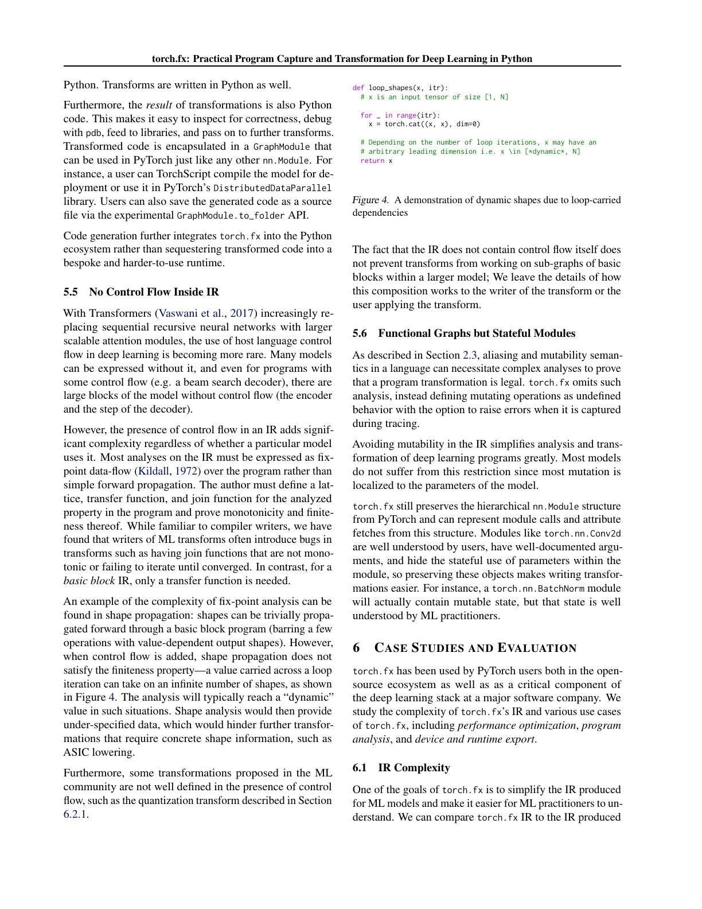
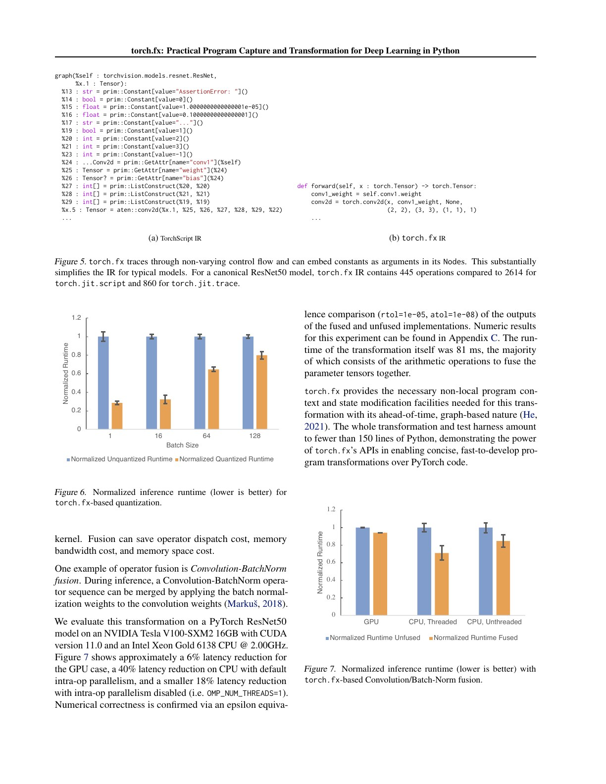
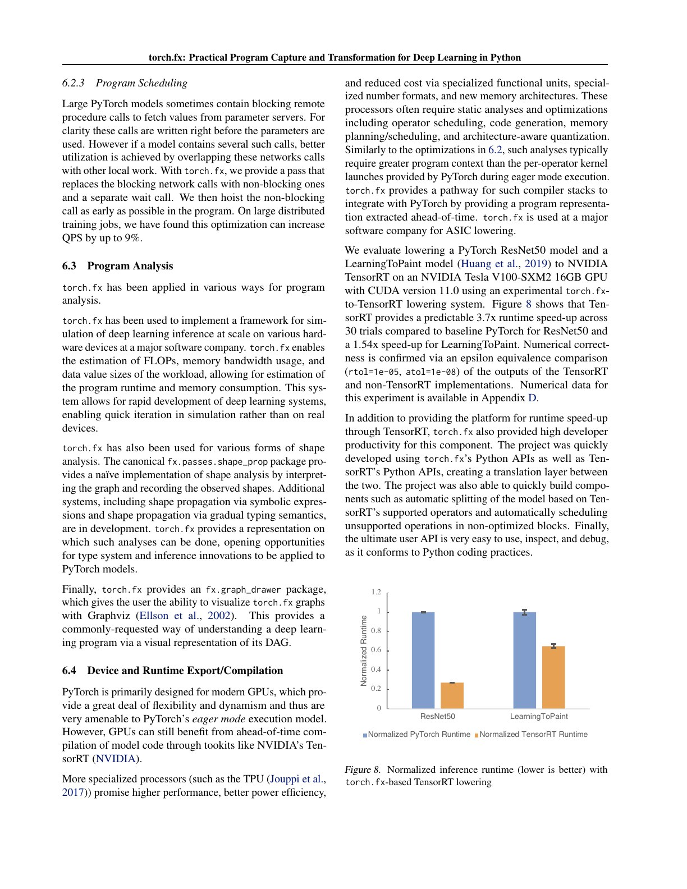

# torch.fx 中文精读：为什么 Eager 之上还需要一张图

## 1. Autograd 能求导，但不够做全局变换

eager autograd 关注 backward correctness。量化、fusion、设备 lowering、FLOP analysis 等任务需要：

- 遍历 forward program；
- 查找 operator pattern；
- 替换/插入 nodes；
- 读取 module parameters 和 hierarchy；
- 重新生成可执行程序。

这需要一个显式、稳定、可编辑的 IR。torch.fx 的目标不是表示整个 Python，而是捕获常见 neural module 的高层 DAG。

## 2. 三个设计维度

论文把 program capture 系统拆成：

1. Capture mechanism：tracing、source/bytecode analysis 或显式 graph-building。
2. Specialization policy：哪些值固定，哪些保留 input。
3. IR design：控制流、mutation、module state 和 data model 表达到什么程度。

完整建模 Python 会使 IR 和 pass writer 极其复杂。FX 的选择是覆盖常见 DAG，并让用户定制 tracer 处理边缘情况。

## 3. Symbolic tracing 怎样工作

Tracer 用 Proxy 代替真实 tensor 调用 module forward：

- Proxy 的 operator overload 不计算数据；
- 每次 operation 在 Graph 中新增 Node；
- Node output 再包装成 Proxy；
- module parameter/buffer 通过 get_attr 表示；
- 最终 Graph 与原 module state 组成 GraphModule。

Graph 的主要 opcode 很少：

- placeholder；
- call_function；
- call_method；
- call_module；
- get_attr；
- output。

小 IR 降低 pass 编写难度，但也意味着复杂语义在 trace 时必须专门化、封装成 leaf，或拒绝。

## 4. Tracer customization 与 leaf module

如果一路 trace 进所有 module：

- graph 可能过低层；
- implementation detail 泄漏；
- C++/custom op 无法展开；
- transform 很难保留 module boundary。

Tracer 的 is_leaf_module 等 hook 决定某个 module：

- 展开内部 forward；
- 还是保留一个 call_module node。

同一模型可以按量化、分析或 backend lowering 的需求得到不同抽象层级的 graph。

## 5. 为什么重新生成 Python code

FX 不依赖一个复杂的独立 graph VM，而是从 Graph 生成可读 Python forward：

- 可用普通 debugger；
- stack trace 与 source 容易理解；
- Python interpreter 自然执行；
- transform 后 graph 可查看、保存和调用。

这也是工程生产力设计：IR 对 compiler pass 友好，输出仍对 ML 工程师友好。

## 6. 控制流与 mutation 的边界

若 Python branch 条件是普通 static value，trace 直接走一侧并把选择专门化。

若条件依赖 Proxy：

    if x.sum() > 0:

Python 需要把 Proxy 转 bool，但 tracer 不知道 runtime value，通常报错。FX IR 故意不直接包含任意 Python control flow。

类似地：

- list/dict mutation；
- tensor alias；
- object construction；
- state update；

都可能使简单 DAG 不再足以表示语义。FX 倾向 graph functional、module stateful：tensor flow 尽量函数式，parameter/buffer 仍留在 Module。

## 7. 量化和 fusion 案例

Graph mode quantization 需要：

- pattern matching；
- observer insertion；
- calibration 后替换 quantized op；
- 保留 module 参数和调用层次。

Conv-BN inference fusion 则把 BatchNorm 参数折叠进 Conv weights，再删除 BN node。

论文报告 ResNet-50：

- V100 GPU latency 约降低 6%；
- CPU 默认 intra-op threads 约降低 40%；
- CPU 单线程约降低 18%。

这不是 FX 自动提供的加速，而是 FX 让对应 transform 更容易实现。

## 8. 调度、分析和硬件 lowering

FX 被用于：

- 把 blocking parameter-server RPC 拆成 async start/wait，并尽早 hoist；
- FLOPs、bandwidth、tensor size 和 memory analysis；
- Graphviz visualization；
- ASIC/accelerator lowering；
- 切分 backend 支持和不支持的 subgraphs。

论文报告：

- 某大型分布式训练任务 QPS 最高提升约 9%；
- FX-to-TensorRT 的 ResNet-50 约 3.7×；
- LearningToPaint 约 1.54×。

这些结果分别来自不同系统，不能把它们相加，也不能视为通用 FX speedup。

## 9. FX Graph 与动态图的关系

autograd graph：

- 由真实 tensor execution 产生；
- 目标是 backward；
- node 多为 backward functions 与 saved tensors；
- 生命周期常与一次 iteration 绑定。

FX graph：

- 由 symbolic tracing/capture 产生；
- 目标是 forward program transform；
- node 是高层 module/function/method call；
- 可以编辑并重新 codegen。

Dynamo graph：

- IR 形式仍是 FX Graph；
- 捕获机制不是传统 FX symbolic_trace；
- 通过 bytecode analysis、guards 和 graph breaks 覆盖更多 Python。

所以“都是 FX graph”不代表捕获语义完全相同。

## 10. 与 torch.compile 的位置关系

现代 PT2 pipeline 可简化为：

    TorchDynamo
        -> FX graph + guards + residual bytecode
        -> AOTAutograd/functionalization/decomposition
        -> forward/backward FX graphs
        -> Inductor

torch.fx 提供可操作 graph data structure 和 transformation 基础；Dynamo 扩展 frontend capture，AOTAutograd 和 backend 进一步规范化/降低。

## 11. 常见误读

### “symbolic_trace 能捕获任意 PyTorch”

它只执行一条 symbolic path。数据相关 Python control flow、复杂 mutation 和部分 custom objects 需要改写或定制。

### “GraphModule 是静态二进制”

它仍是 Python module，通常执行重新生成的 Python code。

### “FX 优化模型”

FX 本身主要是基础设施。性能来自写在它之上的 quantization、fusion、scheduler 或 backend。

## 12. 最终判断

torch.fx 证明不必完整实现 Python compiler，也能为大量神经网络变换提供实用 IR。它是从 eager/autograd 走向 PyTorch 2 compiler stack 的关键中间层。
