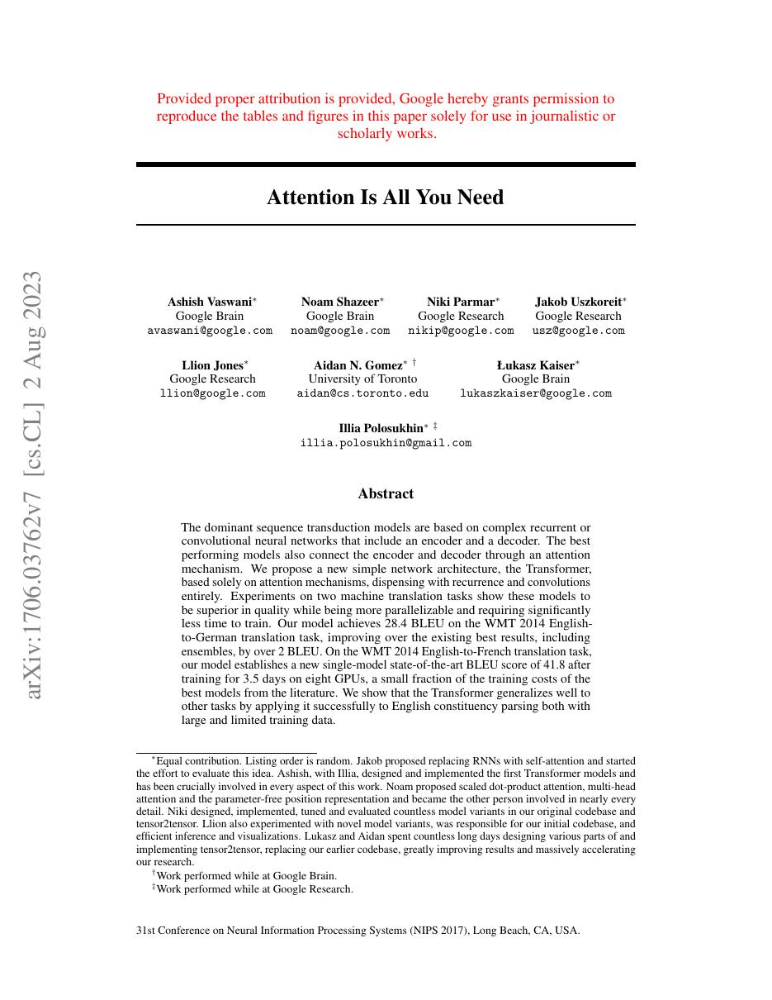
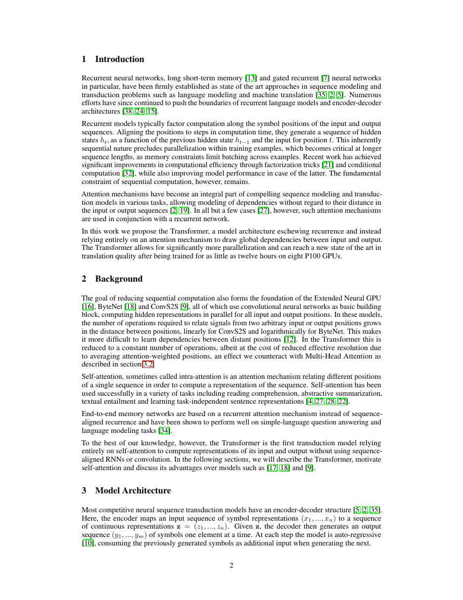
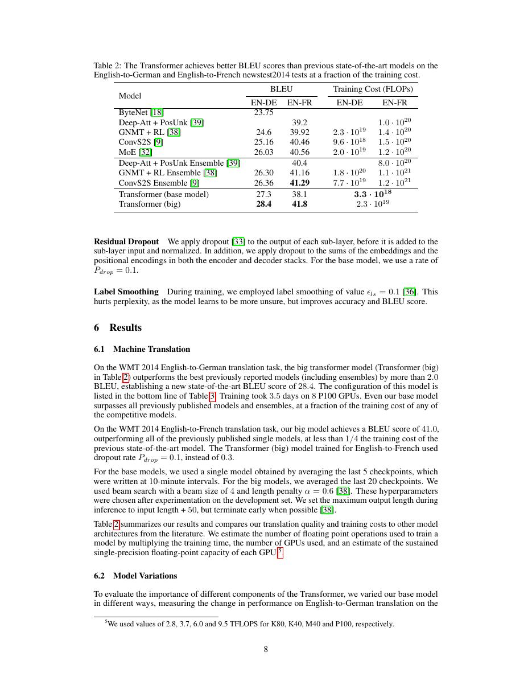
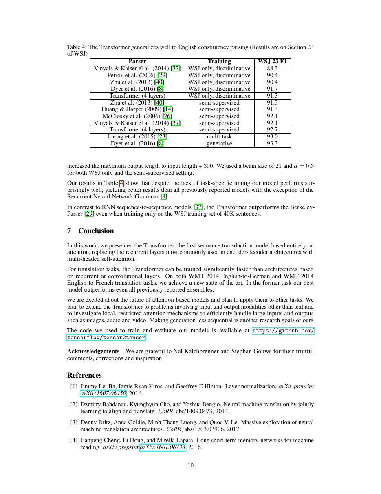

# 论文中文解读：《Attention Is All You Need》

## 一、它解决了什么

Transformer 用多头 self-attention 与前馈网络完全替代序列递归，使训练能在 token 维并行，并建立今天 foundation model 的主干。

## 二、核心机制

scaled dot-product attention 计算 softmax(QKᵀ/√d)V；multi-head 让不同子空间并行建模关系。位置编码注入顺序，encoder 双向、decoder 使用 causal mask，并通过 cross-attention读取 encoder。原版是 post-LN encoder–decoder，不应与今天常见 pre-LN decoder-only 混同。

## 三、为什么成为主线

它把序列依赖路径缩到常数级，支持大规模并行训练，并统一语言、视觉、语音、多模态与生成模型。

## 四、应该怎样读证据

论文里的结果首先证明方法在当时数据、模型规模、硬件和评测协议下成立。跨年代比较时要统一参数量、训练 tokens、数据质量、上下文长度、推理预算与系统实现，不能只横比单个最佳分数。

## 五、局限与易误读点

attention 矩阵时间和显存通常为 O(n²)；位置、归一化和训练稳定性在大规模下需要后续改造。翻译 BLEU 不能等同通用智能。

## 六、放进十年演进史

后续主线包括 BERT/GPT/T5 的预训练范式、MQA/GQA/MLA 的推理优化、稀疏/线性 attention，以及 FlashAttention 的 IO 优化。

## 七、原文入口

[官方论文/页面](https://arxiv.org/abs/1706.03762)

## 八、原文论证链

RNN 难并行且长依赖路径长；卷积可并行但扩大感受野要堆多层；attention 让任意位置一步交互。论文因此移除 recurrence/convolution，用 self-attention 建模序列，用 encoder–decoder attention 读取源句，以位置编码补回顺序。完整系统还包括多头、FFN、残差、LayerNorm、mask、warmup、label smoothing 和 beam search。

> 原文定位：[PDF 文件第 1 页](paper.pdf#page=1) · [对应截图](rendered_figures/page-1.jpg)

## 九、公式逐步解释

$$
\operatorname{Attention}(Q,K,V)
=\operatorname{softmax}\!\left(
\frac{QK^\top}{\sqrt{d_k}}\right)V.
$$
点积方差随 $d_k$ 增大；除以 $\sqrt{d_k}$ 避免 softmax 过饱和。多头为
$$
\operatorname{head}_i
=\operatorname{Attention}(QW_i^Q,KW_i^K,VW_i^V),
$$
$$
\operatorname{MHA}
=\operatorname{Concat}(\operatorname{head}_1,\ldots,\operatorname{head}_h)W^O.
$$
decoder self-attention 加 causal mask，cross-attention 的 query 来自 decoder、key/value 来自 encoder。正弦位置编码与 attention 是两套不同功能。

> 原文定位：[PDF 文件第 2 页](paper.pdf#page=2) · [对应截图](rendered_figures/page-2.jpg)

## 十、复杂度与实验怎样读

self-attention 每层算术量约 $O(n^2d)$，最大顺序操作数与路径长度为 $O(1)$。这解释并行和长依赖优势，也预示长序列的二次内存问题。WMT 翻译结果、复杂度表与 head/维度/位置消融共同构成证据；最终 BLEU 不能只归因一个算子。

> 原文定位：[PDF 文件第 8 页](paper.pdf#page=8) · [对应截图](rendered_figures/page-8.jpg)

## 十一、复现检查

- causal mask 和 padding mask 分开处理并在 softmax 前应用。
- 原文是 post-norm；现代 pre-norm 不可冒充原配方。
- warmup、label smoothing、token batching 和 checkpoint averaging 很关键。
- 报告 beam、长度惩罚、分词与 BLEU 脚本。

## 十二、常见误读

Transformer 不等于只有 self-attention，FFN、残差、归一化和位置表示同样关键。GPT/BERT 预训练、RoPE、RMSNorm 与 GQA 都是后续发展。

> 原文定位：[PDF 文件第 10 页](paper.pdf#page=10) · [对应截图](rendered_figures/page-10.jpg)

## 原文证据导航

以下页码按仓库内 PDF 的**文件页码**计，不等同于论文印刷页码。建议先读本节所指原文，再回看上面的中文解释。

- [打开原始 PDF](paper.pdf)
- [打开可检索文本](paper.txt)

| 中文笔记中的证据 | 原文位置 | 复核重点 |
|---|---|---|
| 原文首页、摘要与问题定义 | [PDF 文件第 1 页](paper.pdf#page=1) · [截图](rendered_figures/page-1.jpg) | 回到该页上下文，复核定义、图表或实验论证 |
| 核心方法、架构或算法定义所在关键页 | [PDF 文件第 2 页](paper.pdf#page=2) · [截图](rendered_figures/page-2.jpg) | 回到该页上下文，复核定义、图表或实验论证 |
| 实验、结果或关键分析所在原文页 | [PDF 文件第 8 页](paper.pdf#page=8) · [截图](rendered_figures/page-8.jpg) | 回到该页上下文，复核定义、图表或实验论证 |
| 讨论、结论或补充分析所在原文页 | [PDF 文件第 10 页](paper.pdf#page=10) · [截图](rendered_figures/page-10.jpg) | 回到该页上下文，复核定义、图表或实验论证 |
