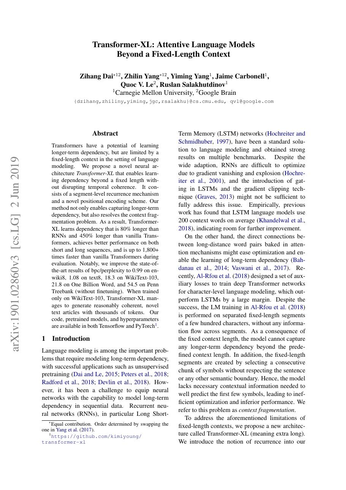
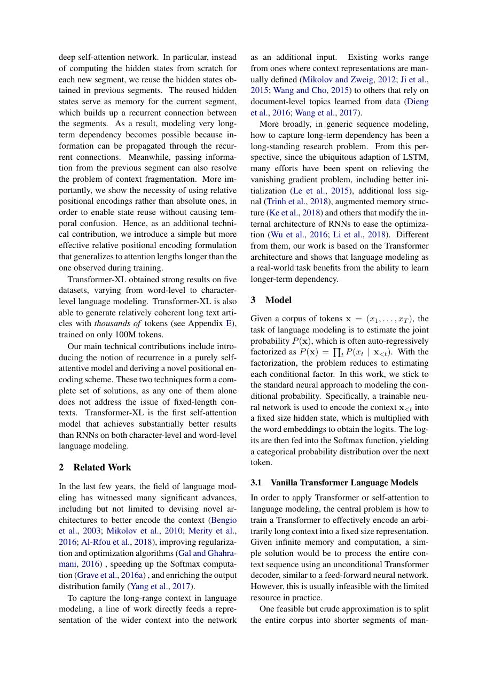
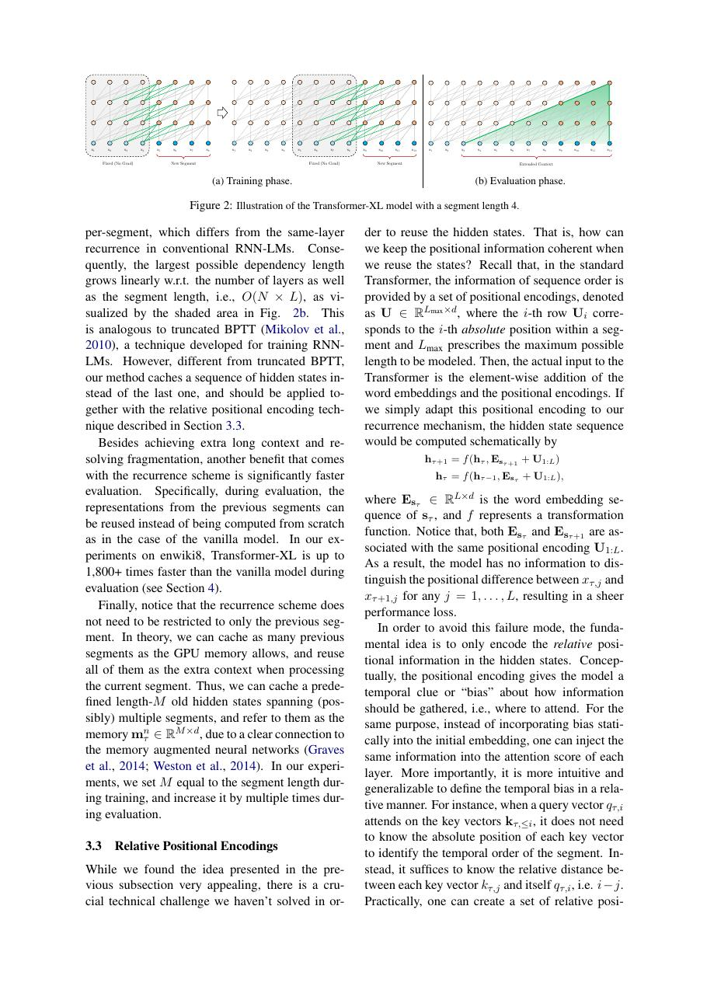
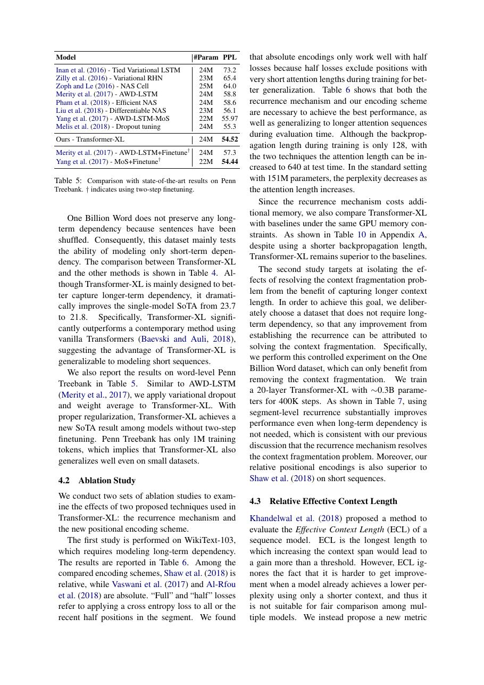

# 论文中文解读：《Transformer-XL: Attentive Language Models Beyond a Fixed-Length Context》

## 一、它解决了什么

Transformer-XL 用 segment recurrence 复用前一段隐藏状态，并设计相对位置编码，突破固定窗口和跨段上下文断裂。

## 二、核心机制

上一 segment 的 hidden states 作为停止梯度的 memory，当前 token 可注意更早历史而无需重复计算。相对位置项区分内容—内容、内容—位置等交互，避免绝对位置在跨段复用时错位。

## 三、为什么成为主线

它是长上下文 Transformer 的早期关键路线，影响缓存式自回归、相对位置表示与后续 XLNet。

## 四、应该怎样读证据

论文里的结果首先证明方法在当时数据、模型规模、硬件和评测协议下成立。跨年代比较时要统一参数量、训练 tokens、数据质量、上下文长度、推理预算与系统实现，不能只横比单个最佳分数。

## 五、局限与易误读点

memory 不回传跨段梯度，能读历史不等于端到端学习无限依赖；训练仍在局部窗口，推理 memory 随设计受限。

## 六、放进十年演进史

Longformer/BigBird 从稀疏连接降低长序列成本；RoPE/ALiBi从位置编码外推；现代 KV cache 则把 recurrence 落到 serving 系统。

## 七、原文入口

[官方论文/页面](https://arxiv.org/abs/1901.02860)

## 八、原文论证链

固定长度 Transformer 把长文本切成独立片段，会造成两类问题：跨片段依赖被截断；每个片段开头缺少历史上下文。Transformer-XL 缓存上一段各层 hidden states，当前段把缓存当作额外 key/value，从而把上下文延伸到片段之外。缓存状态 stop-gradient，训练成本仍可控。

直接复用绝对位置会产生歧义：同一缓存状态在不同段组合时，绝对编号不一致。论文于是把注意力分数重参数化为内容—内容、内容—位置及全局偏置项，只依赖相对距离，使 segment-level recurrence 可以跨段复用。

> 原文定位：[PDF 文件第 1 页](paper.pdf#page=1) · [对应截图](rendered_figures/page-1.jpg)

## 九、相对位置注意力

标准分数 $(q_i)^\top k_j$ 同时含内容和绝对位置。Transformer-XL 改写后可概括为
$$
q_i^\top k_j+q_i^\top r_{i-j}
+u^\top k_j+v^\top r_{i-j},
$$
其中 $r_{i-j}$ 编码相对距离，$u,v$ 是可学习全局偏置。实际实现还使用 relative shift 高效对齐相对位置矩阵。缓存只扩展 K/V 上下文，query 仍来自当前段，因此不会为旧 token 重算表示。

> 原文定位：[PDF 文件第 2 页](paper.pdf#page=2) · [对应截图](rendered_figures/page-2.jpg)

## 十、实验怎样读

WikiText-103、enwik8、text8、One Billion Word 等覆盖词级和字符级语言建模。困惑度/bpc 改善支持长上下文有效；论文还测量 evaluation speed，缓存避免滑窗推理反复计算，带来数量级加速。有效上下文分析比单一困惑度更直接，但它依赖特定扰动与评测定义。

> 原文定位：[PDF 文件第 4 页](paper.pdf#page=4) · [对应截图](rendered_figures/page-4.jpg)

## 十一、复现检查

- memory 应在 batch 内沿同一文档顺序传递，跨文档必须清空。
- 缓存状态要 detach，否则计算图和显存随段数增长。
- 训练 memory length 与评估 memory length需分别记录。
- relative shift 极易出现下标错位，应以小矩阵单元测试验证因果方向。

## 十二、常见误读

segment recurrence 不是 RNN 式压缩成一个状态，而是缓存多位置、多层表示；它也没有消除 attention 对当前长度乘历史长度的成本。相对位置和缓存是相互配合的两项贡献，不能只复制缓存而仍沿用冲突的绝对位置。

> 原文定位：[PDF 文件第 7 页](paper.pdf#page=7) · [对应截图](rendered_figures/page-7.jpg)

## 原文证据导航

以下页码按仓库内 PDF 的**文件页码**计，不等同于论文印刷页码。建议先读本节所指原文，再回看上面的中文解释。

- [打开原始 PDF](paper.pdf)
- [打开可检索文本](paper.txt)

| 中文笔记中的证据 | 原文位置 | 复核重点 |
|---|---|---|
| 原文首页、摘要与问题定义 | [PDF 文件第 1 页](paper.pdf#page=1) · [截图](rendered_figures/page-1.jpg) | 回到该页上下文，复核定义、图表或实验论证 |
| 核心方法、架构或算法定义所在关键页 | [PDF 文件第 2 页](paper.pdf#page=2) · [截图](rendered_figures/page-2.jpg) | 回到该页上下文，复核定义、图表或实验论证 |
| 实验、结果或关键分析所在原文页 | [PDF 文件第 4 页](paper.pdf#page=4) · [截图](rendered_figures/page-4.jpg) | 回到该页上下文，复核定义、图表或实验论证 |
| 讨论、结论或补充分析所在原文页 | [PDF 文件第 7 页](paper.pdf#page=7) · [截图](rendered_figures/page-7.jpg) | 回到该页上下文，复核定义、图表或实验论证 |
