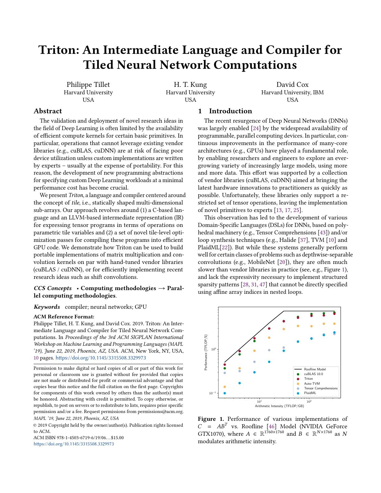
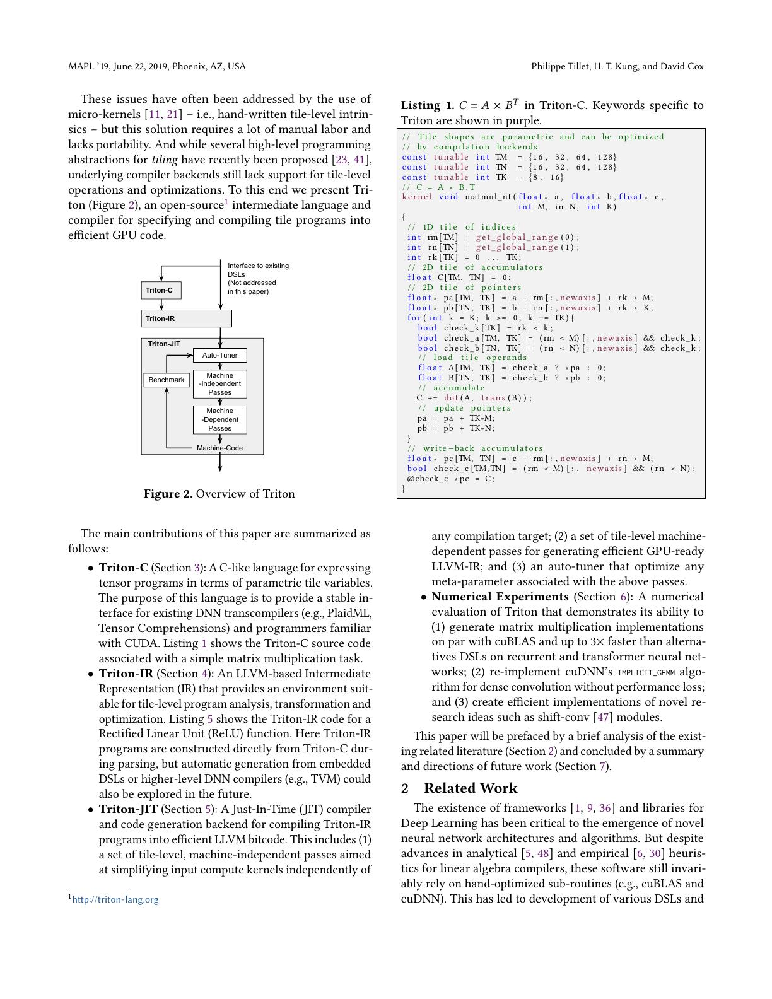
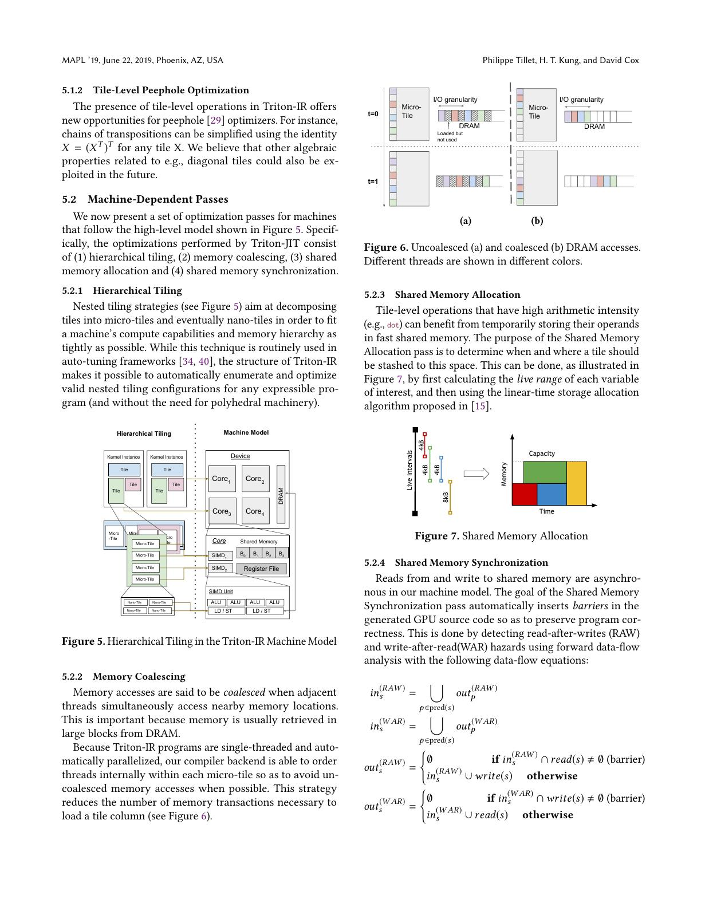
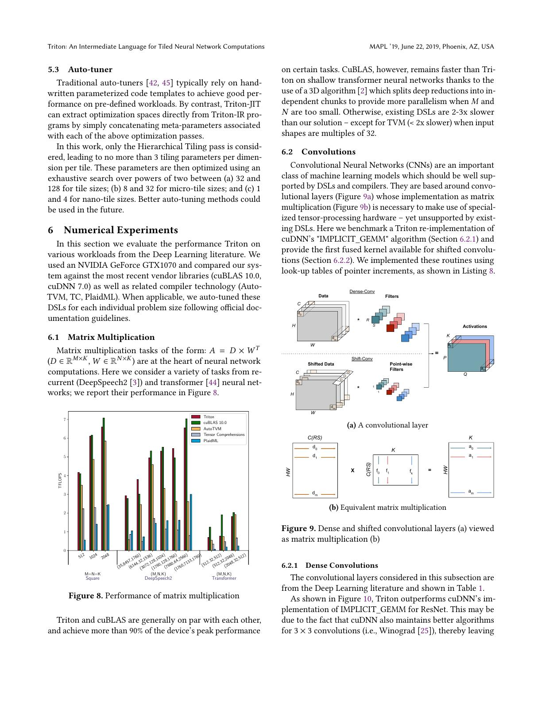
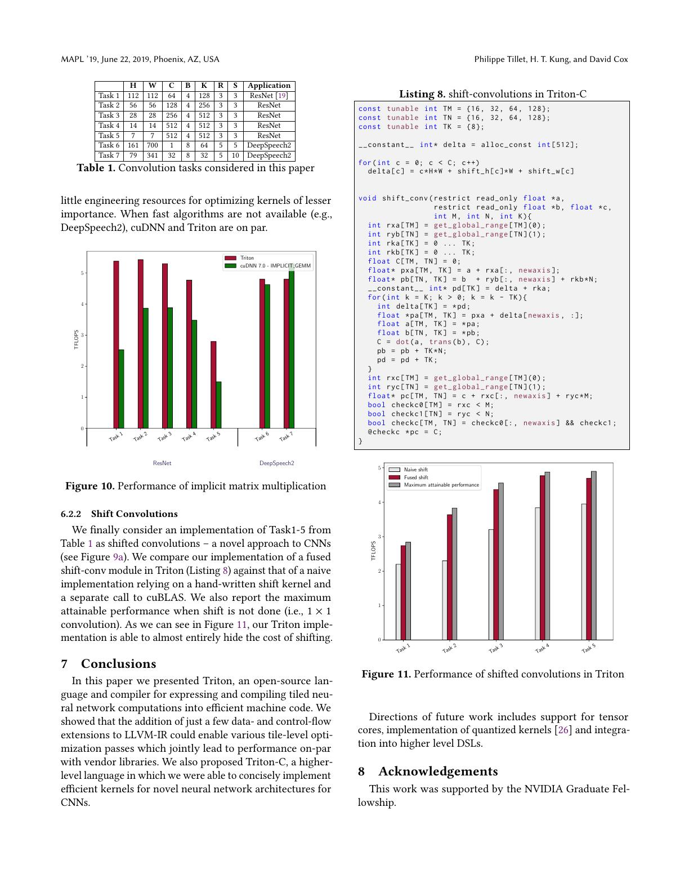

# 论文中文解读：《Triton: An Intermediate Language and Compiler for Tiled Neural Network Computations》

## 一、先给结论

Triton 最重要的发明不是一套更短的 CUDA 语法，而是重新划分了人和编译器的责任：

- 人负责把算法写成 tile 之间的计算与数据流；
- 编译器负责把 tile 拆到 warp、thread、寄存器和 shared memory；
- autotuner 负责在若干 tile 层级参数中选实现。

这个抽象让 kernel 保留足够多的结构信息，编译器可以自动做访存合并、共享内存分配和同步插入；同时又比完全从高层计算图推导 kernel 更显式、更可控。现代 Triton 的 Python DSL、MLIR 后端和 tensor-core 支持与 2019 原型已经不同，但其 tile-level 哲学基本延续至今。

论文信息：Philippe Tillet、H. T. Kung、David Cox，MAPL 2019，DOI `10.1145/3315508.3329973`。本地可查看 [PDF](paper.pdf)、[提取文本](paper.txt) 与 [概要](论文概要.md)。

## 二、问题背景：库、CUDA 与高层 DSL 之间的空档



深度学习系统通常有三种获得 GPU kernel 的方式：

1. 调用 cuBLAS、cuDNN 等厂商库；
2. 专家手写 CUDA；
3. 用 TVM、Tensor Comprehensions、PlaidML 等编译系统生成。

厂商库对标准 GEMM、卷积非常强，但只覆盖固定接口。研究人员一旦提出新稀疏结构、新融合或新数据布局，就可能离开库的适用域。CUDA 能表达一切，却要求程序员同时处理算法和机器细节：thread/block 布局、coalescing、shared-memory 生命周期、同步、bank conflict 和寄存器压力。

2019 年的高层 DSL 已能从循环或多面体表示生成 GPU 代码，但论文认为它们在两方面不足：

- 对某些实际矩阵乘仍显著慢于厂商库；
- 依赖仿射数组索引的系统难以表达某些 structured sparsity。

Triton 选择的不是“再往上抽象”，而是在 CUDA 与图编译器之间插入一个 tile-level 层。它既可以给人写，也可作为上层 DSL 的目标 IR。

## 三、Figure 2：系统由哪几层组成



论文原型的流水线是：

```text
Triton-C / 未来的上层 DSL
          ↓
       Triton-IR
          ↓
       Triton-JIT
      ↙          ↘
autotuner     编译 passes
                  ↓
               machine code
```

需要特别标注历史差异：

- 论文中的前端是 **Triton-C**，不是今天最常见的 Python 装饰器 API；
- IR 当时直接扩展 LLVM，现代 Triton 后端使用 MLIR 体系；
- 论文把 tensor core、量化和更高层 DSL 集成写在 future work 中；
- 因而这篇论文解释“为什么有 Triton”，不是当前版本的操作手册。

## 四、第 3 节：Triton-C 语言

### 4.1 Tile 是带静态形状的多维子数组

在标量 IR 中，一个值通常是单个 `float` 或 `int`。Triton 允许值本身是形如 `[TM, TK]` 的 tile。加法、比较、load、store、dot、transpose 等指令都可作用于整个 tile。

矩阵乘可概括为：

```text
rm = 当前 program 负责的 M 方向索引 tile
rn = 当前 program 负责的 N 方向索引 tile
rk = 0 ... TK-1
C  = zeros([TM, TN])

for k in range(0, K, TK):
    A = masked_load(a[rm, k + rk])
    B = masked_load(b[rn, k + rk])
    C += dot(A, transpose(B))

masked_store(c[rm, rn], C)
```

程序员仍要说明每个 program instance 覆盖哪个输出块，并沿 K 维怎样迭代；但没有显式写出每个 thread 加载哪个元素，也没有手动排 barrier。

### 4.2 参数化 tile 是调优接口

Listing 1 把 `TM`、`TN`、`TK` 声明为 tunable 候选。算法代码只有一份，编译器可对不同 tile 形状专门化。

这体现了 Triton 的性能可移植性含义：不是一份二进制在所有设备上自动最优，而是同一份 tile-level 程序允许 backend 与 autotuner重新选择映射。

### 4.3 Mask 不是附属语法

当 `M`、`N`、`K` 不能整除 tile 大小时，边界 tile 中有一部分逻辑元素越界。Triton 用逐元素 predicate 控制 load/store，越界 load 可填零，越界 store 被屏蔽。

这让主循环保持规则，不必为边界另写一套 kernel；代价是生成代码必须正确维护 predicate，且掩码会影响向量化和控制流成本。

## 五、第 3.3 节：Triton 与 CUDA 的编程模型差在哪

CUDA kernel 通常是 SPMD：每个线程执行一份标量程序，线程通过共享内存和 barrier 协作。Triton 也启动许多 program instance，但每个 instance 的语义像“对一块 tile 执行单线程程序”。

可把两层并行分开：

- **tile 间并行**：用户用全局 range / program id 决定；
- **tile 内并行**：编译器把 tile 映射到设备线程。

这个差别非常关键。若用户已经把每个元素绑定到具体 `threadIdx.x`，编译器很难在不改变语义的情况下重新布局。若 IR 只说“加载这块 `[TM,TK]` tile 并做 dot”，编译器仍可选择哪些元素共用 warp、哪些进 shared memory、哪个维度连续。

但 Triton 并未消除所有性能责任。tile 之间怎样分工、数据是否重用、算法是否适合融合，仍由程序或上层生成器决定。

## 六、第 4 节：为什么需要新的 IR

### 6.1 LLVM IR 本来是标量/向量导向

LLVM 能很好表示标量 SSA 和固定向量，但深度学习 kernel 的优化往往需要知道二维或更高维 tile 的形状、broadcast 关系和矩阵运算。若太早把 tile 降成标量指令，这些信息会丢失。

Triton-IR 因而加入：

- 多维 tile type；
- reshape、broadcast、transpose；
- tile 级 load/store；
- dot 等计算；
- 对 tile 内不同元素生效的 predicate。

IR 的价值不只是承载前端，而是为 tile-level data-flow analysis 提供对象。

### 6.2 PSSA：一个 tile 内允许不同控制流

普通 SSA 中，一个基本块里的值沿单一控制路径定义。tile 的各元素可能因边界或条件走不同分支，若为每个元素拆控制流，优化又回到 thread-level。

论文引入 Predicated SSA。可以把每条 tile 指令理解为带一个同形 predicate：只有 predicate 为真的 lane/元素更新。控制流合并处使用类似 `psi` 的语义，按 predicate 选取值。

这带来两个效果：

1. 边界和 if/else 仍可在 tile 级分析；
2. 编译器能在不破坏屏蔽语义的前提下移动、合并或改写 tile 指令。

它也预示了今天 Triton 中 mask 的核心地位：mask 不只是避免越界，而是向量化控制流的语义载体。

## 七、第 5 节：编译器如何把 tile 变成 GPU 代码



### 7.1 机器无关优化

#### 软件预取

编译器可把后续迭代的 load 提前，使内存延迟与当前迭代的计算重叠。tile IR 暴露了规则循环和加载对象，便于识别这种流水。

#### Tile-level peephole

一些多维操作组合可以代数化简，例如相邻 transpose、broadcast 与 reshape 的冗余组合。越晚降为标量，越容易看到这些结构。

### 7.2 Hierarchical tiling

一个逻辑 tile 继续分解为：

```text
tile
  └─ micro-tile（分配给线程组/warp）
       └─ nano-tile（单线程处理的小块）
```

不同层级决定线程数量、每线程数据量、并行度和局部性。大 tile 增加重用，但消耗更多寄存器/shared memory；小 tile 占用率可能高，却增加加载和调度开销。

论文的 autotuner 对若干 2 的幂候选做穷举：tile 约在 32–128、micro-tile 约在 8–32、nano-tile 约在 1–4 范围。它没有搜索所有算法变体，因此“自动调优”不等于发现全局最优 kernel。

### 7.3 Memory coalescing

全局内存喜欢一个 warp 的相邻线程访问相邻地址。图 6 展示同一 tile 若线程排列不当，会形成分散 transaction；调整 thread order 后可合并。

在 CUDA 中这个映射常由程序员写死。Triton 编译器知道 tile 的连续维度与访问表达式，可以排列线程，使 lane 沿最连续的内存维展开。

### 7.4 Shared-memory allocation

高算术强度的 tile 常先搬进 shared memory。论文不是为每个临时 tile 固定分配一块空间，而是计算 live range：生命周期不重叠的 tile 可以复用 shared-memory 区域。

这类似寄存器分配，但目标是片上共享存储。收益是能容纳更大的工作集；风险是别名、predicate 与同步必须同时正确。

### 7.5 自动插入同步

当不同线程通过 shared memory 交换数据，RAW（read after write）或 WAR（write after read）依赖可能要求 barrier。论文从数据流集合推导读写冲突并插入同步。

“用户不写 barrier”并不表示没有 barrier，而是把正确插入 barrier 的责任转给编译器。若分析过于保守，会插太多导致慢；若漏掉，会产生竞态。这正是高层抽象必须由强 backend 支撑的原因。



## 八、第 6.1 节：矩阵乘实验怎样读

### 8.1 实验设置

硬件是 NVIDIA GeForce GTX 1070，软件基线包括 cuBLAS 10、AutoTVM、Tensor Comprehensions 和 PlaidML。任务既有方阵，也取自 DeepSpeech2 和 Transformer 中的实际形状。

这是一张 2019 年的单卡快照。它适合验证设计可行性，不足以证明对后来的 A100/H100、tensor core、FP8 和 AMD GPU 的普遍结论。

### 8.2 Figure 8 的主要信息

Triton 在多组矩阵乘上与 cuBLAS 大体接近，并在部分任务达到设备峰值的 90% 以上。论文称，相比其他被测 DSL，Triton 在 recurrent/Transformer 任务上可快到约 3×。

这支持两个判断：

- tile IR 没有因为抽象更高而必然损失大量性能；
- 自动生成的 coalescing、shared-memory 使用和层次化 tiling 确实能达到实用水准。

但 cuBLAS 在某些浅矩阵 Transformer 形状上仍更快。论文指出一个原因是 cuBLAS 使用 3D / split-K 式分解，而 Triton 当时的搜索只覆盖 hierarchical tiling。这不是调几个 tile 参数就一定能弥补的算法空间差异。

### 8.3 不能只看峰值 TFLOP/s

矩阵形状决定 arithmetic intensity、并行度和尾部浪费。单个点接近 roofline 不代表所有形状都稳健；不同系统是否用了 tensor core、数据类型和累加方式也必须一致。论文的结论应限定在其 FP32、GTX 1070 与给定形状范围。

## 九、第 6.2 节：卷积和 shifted convolution



### 9.1 把卷积视为隐式矩阵乘

显式 `im2col` 会把输入展开成大矩阵，产生额外内存。implicit GEMM 在 kernel 内按需计算卷积窗口地址，把卷积映射成矩阵乘而不物化完整中间矩阵。

Triton 的非仿射/参数化索引能力让地址生成与 tile dot 能写在同一 kernel 中。实验在 ResNet 与 DeepSpeech2 的若干卷积形状上比较 Triton 和 cuDNN 的 implicit-GEMM 路径。

Triton 对某些 ResNet 形状优于 cuDNN 的该路径，在 DeepSpeech2 上大体相当。但 cuDNN 是多算法库：若 Winograd 等算法适用，最终最快的 cuDNN 方案仍可能胜出。因此准确说法是“Triton 重现了有竞争力的 implicit-GEMM”，不是“Triton 全面超过 cuDNN”。

### 9.2 Shift convolution 为什么是更有说服力的案例

shift convolution 先按 channel 对空间位置做 shift，再做 `1×1` convolution。朴素实现需要：

1. 单独启动 shift kernel；
2. 写回中间张量；
3. 再调用 GEMM/卷积。

Triton 可以在加载 tile 时直接加入 shift 后的地址计算，与后续 dot 融成一个 kernel。Figure 11 显示融合实现几乎隐藏了 shift 的成本，接近“不做 shift”的理论上限。

这是 Triton 相比固定函数库最典型的优势：并非每个标准 GEMM 都要击败 cuBLAS，而是在非标准索引和融合场景中避免中间内存流量。

## 十、贡献逐条评价

### 10.1 Triton-C

优点是程序比 CUDA 短，tile 参数可调，并能表达非规则索引。局限是它仍是一门受限 DSL；论文没有展示如何稳定承接任意上层框架语义。

后来的 Python frontend 证明 tile 编程模型有生命力，但也说明 C 风格接口本身不是论文最持久的部分。

### 10.2 Triton-IR

这是最核心的研究贡献。多维 tile type 与 PSSA 保留了张量结构，让优化发生在“比线程高、比整图低”的层次。现代实现虽换了基础设施，保留结构化 tile IR 的思想仍在。

### 10.3 Triton-JIT 与 autotuner

JIT 可按实际 shape 和硬件专门化，autotuner 避免用户手挑全部参数。不过论文的搜索空间小、成本模型有限；现代 kernel 的 `num_warps`、pipeline stage、tensor-core layout 等选择远更复杂。

### 10.4 数值实验

实验足以说明原型不是玩具，并展示标准算子与新算子两类场景。但单 GPU、少数算子、当年基线限制了外部有效性。

## 十一、论文没有证明什么

1. 没有证明 Triton 对所有 kernel 都比 CUDA 或厂商库快。
2. 没有证明 tile 参数搜索能自动发现所有高级算法，如 split-K、Winograd。
3. 没有证明同一 kernel 无需重新调优即可跨 GPU 达到同样性能。
4. 没有覆盖现代 tensor core、异步拷贝、TMA、FP8 与多 CTA 协作。
5. 没有评估编译时间、调优成本或大规模部署中的缓存行为。

## 十二、从 2019 到现代 Triton：哪些没变，哪些变了

### 没变的核心

- program instance 处理 block/tile；
- shape、mask 和 pointer arithmetic 显式存在；
- tile 内线程映射主要交给编译器；
- JIT specialization 与 autotuning 是性能路径的一部分；
- 对融合和自定义算子尤其有价值。

### 已显著变化的工程实现

- 前端从 Triton-C 演化为 Python DSL；
- IR/编译基础设施迁移到 MLIR 体系；
- 加入 tensor core、更多 dtype 和多代 NVIDIA/AMD 后端；
- Triton 被 TorchInductor 等上层编译器大规模自动生成；
- layout 表示后来成为独立的复杂研究问题，见本目录的 Linear Layouts 解读。

因此阅读时要把“设计原理”与“历史 API/性能数字”分开保存。

## 十三、对实际 kernel 开发的启示

### 13.1 先决定 program decomposition

最重要的选择通常不是某条语句，而是一个 program instance 负责哪块输出、沿哪个轴并行、哪个轴循环。错误的分解会导致并行度不足或重复加载，后续微调难以挽救。

### 13.2 用 mask 表达完整语义

不要只在常用整除形状上验证。边界 tile、零长度维度、非连续 stride 和 dtype promotion 都可能让“看似正确”的 kernel 出错。

### 13.3 把融合收益与单算子算力区分

融合 kernel 的优势常来自少一次全局内存读写，而不是更高的 matmul 峰值。benchmark 应同时报告端到端延迟、字节流量和正确基线。

### 13.4 Autotune 需要受控搜索

候选过少会漏掉好配置，候选过多会让首次编译/调优成本失控。候选还必须受寄存器、shared memory、warp 数和输入 shape 约束。

## 十四、推荐精读原文的位置

- 第 1–2 页：问题、Figure 1、系统概览与 Listing 1；
- 第 3 节：programming model，理解与 CUDA 的责任边界；
- 第 4.2 节：tile-level data-flow 和 PSSA；
- 第 5.2 节：hierarchical tiling、coalescing、shared memory 与同步；
- Figure 8：矩阵乘主结果及 cuBLAS 优势案例；
- Figure 10–11：标准卷积与融合新算子的差别。

## 十五、最终评价

这篇只有十页的论文真正建立的是一种编译器契约：用户提供结构化 tile 程序，编译器承诺把未写死的细粒度映射变成高效 GPU 代码。它成功的原因不是把硬件完全藏起来，而是选择了一个恰到好处的抽象边界。

实验数据已经过时，Triton-C 也不是今天的接口；但若想理解为什么 Triton 能同时服务手写 kernel 和 TorchInductor 这类代码生成器，这仍是时间线上不可替代的第一篇。

## 十六、原文与关联阅读

- [作者公开 PDF](https://www.eecs.harvard.edu/~htk/publication/2019-mapl-tillet-kung-cox.pdf)
- [IBM Research 论文页](https://research.ibm.com/publications/triton-an-intermediate-language-and-compiler-for-tiled-neural-network-computations)
- [本目录 Triton 时间线](../Triton论文阅读索引.md)
- 下一篇：[PyTorch 2 中文解读](../pytorch_2/论文中文解读.md)
