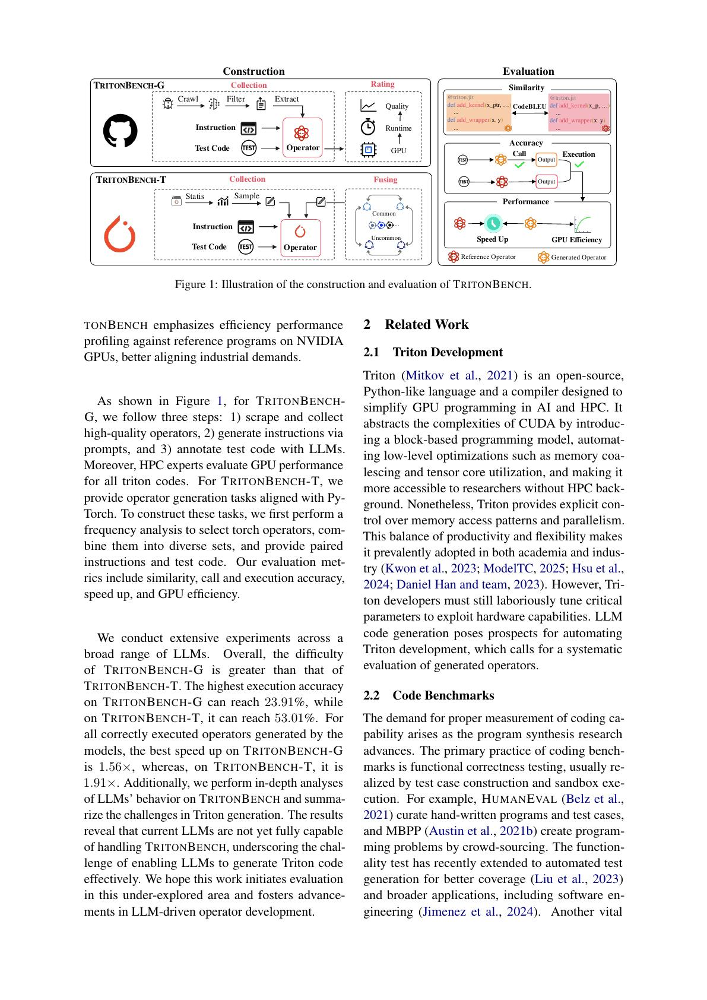
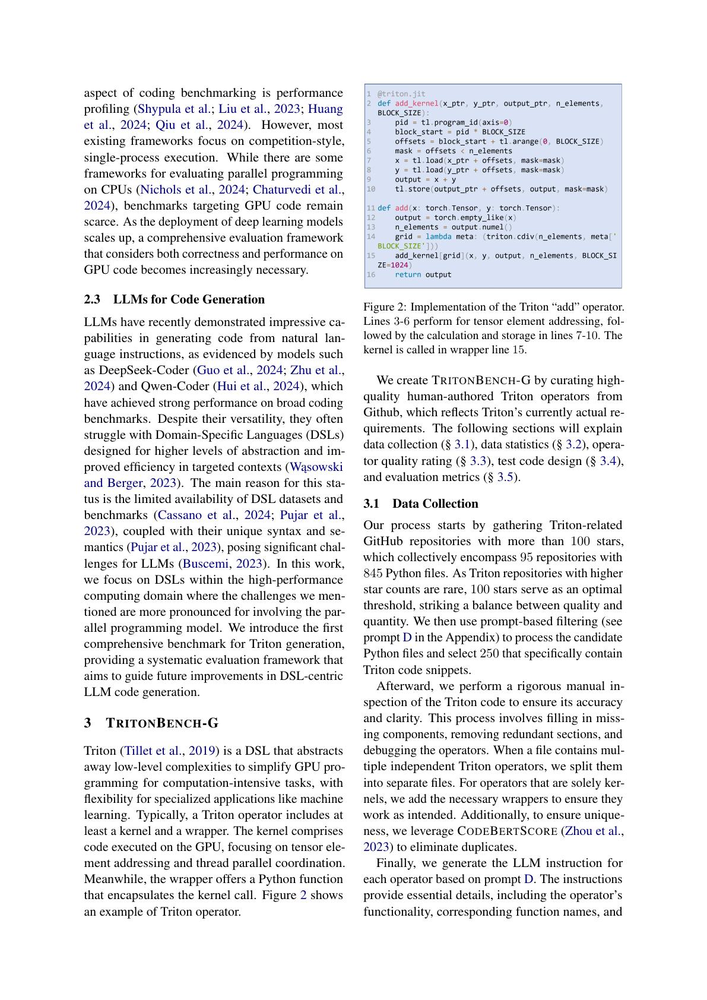
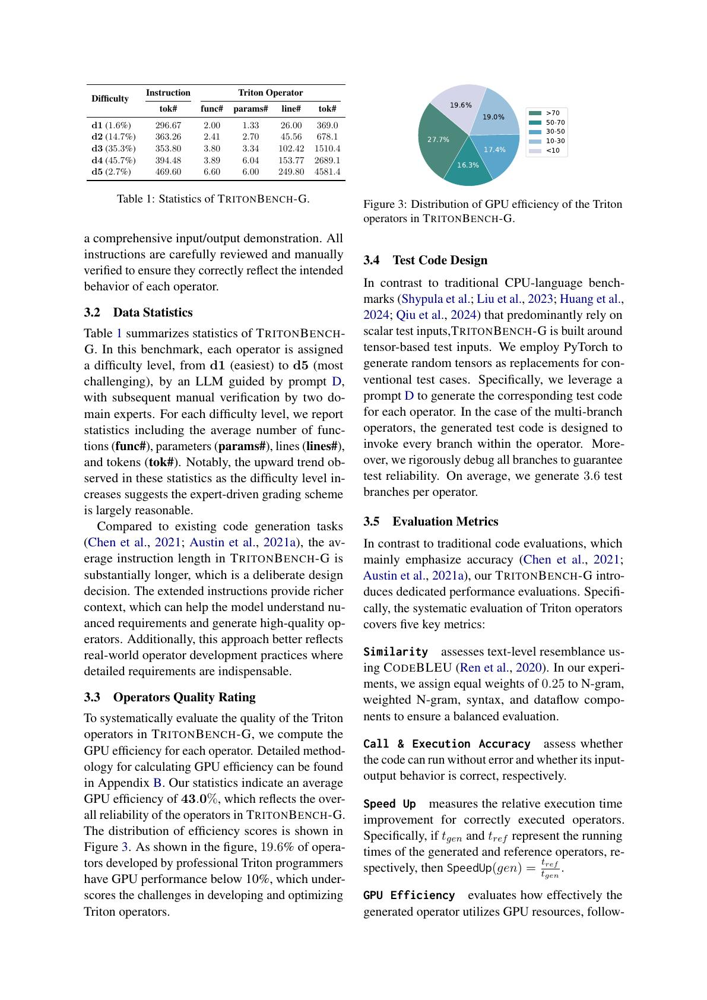
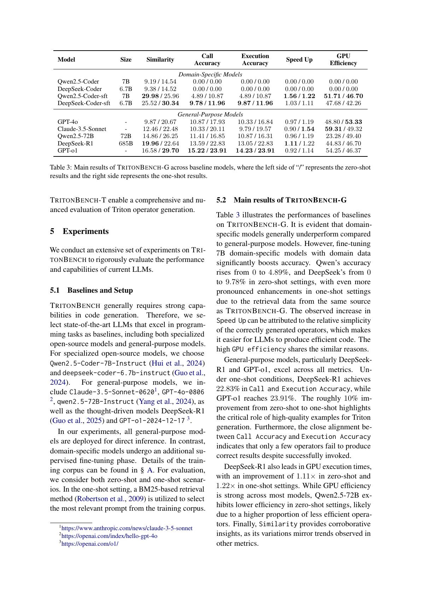
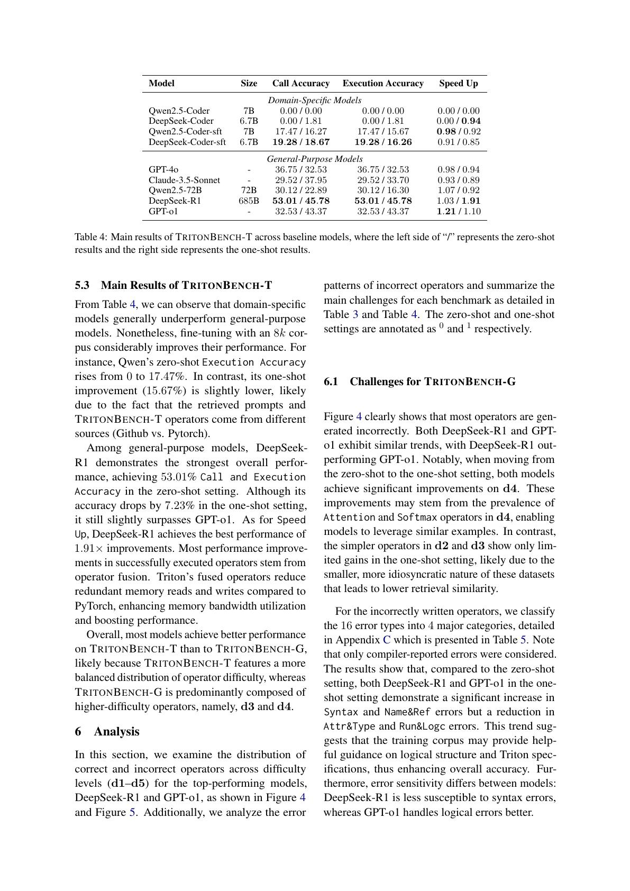

# 论文中文解读：《TritonBench: Benchmarking Large Language Model Capabilities for Generating Triton Operators》

## 一、先给结论

TritonBench 最值得保留的不是一张很快过时的模型排行榜，而是它把“会生成 Triton”拆成了四个不同问题：

1. 生成代码看起来像不像参考实现？
2. wrapper 和 kernel 能不能被正确调用？
3. 在测试输入上结果是否正确？
4. 正确以后，是否真的比参考路径快？

在 184 个真实 GitHub 算子组成的 TritonBench-G 上，当时最好 one-shot 执行正确率只有 23.91%；即使在语义更规整的 166 个 PyTorch 对齐/融合任务 TritonBench-T 上，最好 zero-shot 也只有 53.01%。这说明 LLM 可以快速产出候选，但距离自动生成可直接部署的高性能 kernel 仍有明显差距。

论文由 Jianling Li 等人于 2025-02-20 首次公开，arXiv:2502.14752。本地包括 [PDF](paper.pdf)、[提取文本](paper.txt) 与 [概要](论文概要.md)。

## 二、为什么普通代码生成基准不够

一般 Python 题目主要关心输入输出是否匹配。GPU DSL 还多出并行与性能维度：

- 线程/program grid 是否覆盖全部元素；
- mask 是否在非整除 shape 上安全；
- stride 与非连续张量是否正确；
- reduction 是否有竞态和数值误差；
- dtype promotion 与累加精度是否一致；
- block size、warp 数和访存模式是否高效；
- launch overhead 是否抵消融合收益。

一段 Triton 代码可能语法正确、能启动，却在某些边界 shape 上静默算错；也可能完全正确，却比 PyTorch 调用的成熟库更慢。因此只用 CodeBLEU 或一次单元测试远远不够。

## 三、Figure 1：双通道基准设计



论文没有把所有任务混在一个集合，而是建立两个互补通道：

| 通道 | 来源 | 任务性质 | 主要考查 |
|---|---|---|---|
| TritonBench-G | 开源 GitHub 中已有 Triton 算子 | 实现复杂、接口和风格多样 | 能否重建真实工程 kernel |
| TritonBench-T | PyTorch operator 与有效融合组合 | 语义参考清晰、接口规整 | 能否把高层算子翻译/融合成 Triton |

G 更贴近真实 Triton 代码分布，T 更接近编译器 lowering 或“根据 PyTorch 参考实现写融合 kernel”。二者难度、数据源和评测项不同，不能把准确率直接合并。

## 四、第 3 节：TritonBench-G 怎样构造

### 4.1 从 95 个仓库到 184 个算子

作者先选取超过 100 stars 的 Triton 相关 GitHub 仓库，共 95 个、845 个 Python 文件。通过 prompt 筛选出 250 个候选后，再人工：

- 补缺失组件；
- 删除冗余部分；
- 调试 kernel；
- 把一个文件中的独立算子拆开；
- 为只有 kernel 的样本补 wrapper；
- 用 CodeBERTScore 辅助去重；
- 生成并人工核验任务 instruction。

最后得到 184 个算子。这个流程比直接爬代码可靠，但也带来选择偏差：只有作者能够修复、构造测试和清楚描述的样本会留下。

### 4.2 Triton operator 不只是一段 kernel



论文把完整 operator 看成至少两层：

- GPU 上运行的 `@triton.jit` kernel；
- Python wrapper，负责检查/创建输出、计算 grid、选择 meta-parameters 并 launch。

这解释了为什么有 Call Accuracy：模型可能写出了局部正确的 kernel，却用错函数名、参数、grid 或返回值，导致调用失败。对实际部署而言 wrapper 错误同样是失败。

### 4.3 难度分布

两名领域专家复核 d1–d5 难度。G 集主要集中于：

- d1：1.6%；
- d2：14.7%；
- d3：35.3%；
- d4：45.7%；
- d5：2.7%。

d4 占比最高，说明这不是大量 toy add/relu 组成的简单集合。难度升高时，函数数、参数数、代码行数与 token 数总体增长。最高 d5 很少，也意味着基准对极端复杂 kernel 的估计不稳定。

### 4.4 算子类别

G 集来自实际仓库，attention 占约 20.0%，matmul 10.9%，layer norm 6.5%，softmax 3.8%。分布反映当时高性能 LLM/深度学习代码的热点，但不代表所有 Triton 应用的自然分布。

## 五、测试设计：平均 3.6 个分支意味着什么

作者用 PyTorch 生成随机 tensor 输入，并为 multi-branch operator 尽量调用每个分支；平均每个算子 3.6 条测试分支，且人工调试测试。

这比只测一个固定 shape 强，但仍不能构成形式证明。一个 kernel 的输入空间可能同时包含：

- 不同 rank/shape 与不能整除 block 的尾部；
- contiguous、transposed、sliced 等 stride；
- FP32/BF16/FP16/整数和混合 dtype；
- 空 tensor、极小 tensor、超大 tensor；
- NaN、Inf、溢出、极端 reduction 长度；
- 对齐与非对齐地址；
- 不同 GPU architecture。

平均 3.6 个分支很难覆盖这些笛卡尔积。因此 Execution Accuracy 的精确定义是“通过该基准现有测试”，不是“对 operator 全定义域证明正确”。

## 六、Figure 3：人类参考实现也并不都快



作者估算 G 集参考算子的 GPU efficiency，均值为 43.0%；19.6% 低于 10%。论文把这用于说明专业开发者优化 Triton 也很难。

这个结果还有第二层含义：参考实现不是硬件最优 oracle。若生成 kernel 达到 1.5× speedup，可能因为它很优秀，也可能因为对应参考实现很差。最好同时报告：

- 对 reference 的相对 speedup；
- 绝对 latency；
- 对理论内存带宽/FLOP 上界的 efficiency；
- 与厂商库或其他强实现的对照。

GPU efficiency 本身也依赖论文如何估算 bytes、FLOPs 和 bottleneck；复杂融合算子的理论工作量并不总是唯一。

## 七、五个指标应怎样读

### 7.1 Similarity / CodeBLEU

论文把 n-gram、weighted n-gram、syntax 与 dataflow 各设 0.25 权重。它回答“生成代码和参考文本/结构有多像”。

一个 Triton operator 可以有多种等价 tiling、索引和融合实现，低相似度仍可能正确且更快；高相似度也可能只改错一个 mask。因而 Similarity 适合观察模型是否学到领域代码形态，不适合作为部署门槛。

### 7.2 Call Accuracy

能否成功构造输入、调用 wrapper、编译/launch 并得到输出。它会捕获语法、名称、参数、API 和部分编译错误。

### 7.3 Execution Accuracy

调用成功后，输出是否与 reference 在规定容差内匹配。Call 与 Execution 接近时，说明许多失败在启动前已暴露；两者差距大时，表示有较多“能跑但算错”。

### 7.4 Speed Up

论文定义：

```text
SpeedUp = t_ref / t_gen
```

大于 1 表示生成实现更快。关键限定是只对 **correctly executed operators** 计算，因此它是条件统计：

```text
P(速度 | 已生成正确)
```

不能把 20% 正确率模型的 1.5× 与 50% 正确率模型的 1.1× 只按速度排名。两者成功样本集合可能完全不同。

### 7.5 GPU Efficiency

根据 tensor 字节、FLOPs、运行时间和设备上界估算资源利用。它帮助区分“超过弱 reference”和“接近硬件上限”，但在融合/混合瓶颈 kernel 上应谨慎解释。

## 八、第 4 节：TritonBench-T 怎样构造

作者从 PyTorch 2.6.0 范围中选择需要 GPU 交互的 operator，再依据 The Stack V2 中 PyTorch 相关代码的使用概率，抽取 40 个高频与 40 个低频 operator。

随后构造三类有效组合：

- 高频 + 高频；
- 高频 + 低频；
- 低频 + 低频。

前一 operator 输出必须能作为后一 operator 输入，最后形成 166 个单算子/融合任务。每个任务带标准 PyTorch call 与文档描述。

### 8.1 T 集为什么往往更容易

- 语义由 PyTorch reference 明确给出；
- wrapper 接口更一致；
- 代码不要求重现某个真实仓库的大型手工 kernel；
- 难度分布更平滑：d1 13.3%、d2 22.3%、d3 32.5%、d4 29.5%、d5 2.4%。

但 T 集有自己的难点：融合必须保持 PyTorch dtype/broadcast/reduction 语义，且只有减少中间 memory traffic 才可能产生性能收益。

## 九、第 5.1 节：模型与提示设置

论文评估了两类模型。

领域代码模型：

- Qwen2.5-Coder-7B-Instruct；
- DeepSeek-Coder-6.7B-Instruct；
- 二者使用约 8K Triton 语料监督微调后的版本。

通用模型：

- GPT-4o；
- Claude 3.5 Sonnet；
- Qwen2.5-72B-Instruct；
- DeepSeek-R1；
- GPT-o1。

zero-shot 只给任务；one-shot 用 BM25 从训练语料检索一个相似例子。表中的模型/版本是 2024–2025 快照，不能作为今天能力排名。

微调语料由 GitHub Triton 和 Ninetoothed 合成数据各约 4K 构成，并用 CodeBERTScore 排除与 G 集过于相似样本。这样的去泄漏措施有价值，但相似度过滤无法证明预训练阶段完全没有见过公开 GitHub 代码。

## 十、第 5.2 节：G 集主结果



### 10.1 最强模型也只解决约四分之一

G 集 one-shot：

- GPT-o1：Call 23.91%，Execution 23.91%；
- DeepSeek-R1：Call 22.83%，Execution 22.83%；
- Claude 3.5 Sonnet：Call 20.11%，Execution 19.57%；
- GPT-4o：Call 17.93%，Execution 16.84%。

即使最好模型也有约 76% 任务未通过。这个结果支持“真实 Triton operator 仍是困难代码生成任务”。

### 10.2 One-shot 通常有效，但不是稳定规律

GPT-o1 从 zero-shot Execution 14.23% 提升到 23.91%，DeepSeek-R1 从 13.05% 到 22.83%。作者认为同源 GitHub 示例能提供结构和 API 线索。

但检索示例也会带入错误名称、shape 假设或无关模式。后面的错误统计显示 one-shot 虽减少运行/逻辑错误，却可能增加 syntax 与 name/reference 错误。

### 10.3 微调模型的 speedup 不能脱离低成功率

Qwen2.5-Coder-SFT zero-shot 的 speedup 为 1.56×，看起来高于强通用模型；但它的 Execution Accuracy 只有 4.89%。论文也指出，成功生成的往往是更简单、较易优化的 operator。

这正是条件选择效应：失败的复杂任务没有进入速度均值，留下来的简单任务可能同时更容易超过 reference。

### 10.4 Call 与 Execution 很接近

多数模型一旦成功调用，数值测试也常通过。这不表示语义错误少，而可能表示很多逻辑/API 错误已在编译或 launch 阶段暴露；同时有限测试也可能漏掉静默错误。

## 十一、第 5.3 节：T 集主结果

TritonBench-T 的代表结果：

| 模型 | 设置 | Call / Execution | Speedup |
|---|---|---:|---:|
| DeepSeek-R1 | zero-shot | 53.01% / 53.01% | 1.03× |
| DeepSeek-R1 | one-shot | 45.78% / 45.78% | 1.91× |
| GPT-o1 | zero-shot | 32.53% / 32.53% | 1.21× |
| GPT-o1 | one-shot | 43.37% / 43.37% | 1.10× |
| Claude 3.5 Sonnet | one-shot | 37.95% / 33.70% | 0.89× |

### 11.1 正确率为什么高于 G

T 的接口、描述与 reference 更规范，难度分布不像 G 那样集中在 d3/d4。模型更容易根据明确的 PyTorch 组合直接实现等价计算。

### 11.2 DeepSeek-R1 one-shot 的“准确率降、速度升”

DeepSeek-R1 从 zero-shot 53.01% 降到 one-shot 45.78%，但正确样本平均 speedup 从 1.03× 升到 1.91×。

这不能解读成 one-shot 整体更优。更可能是检索示例改变了成功任务组成：部分任务被干扰而失败，剩余正确任务里融合收益较高。没有配对逐题分析和置信区间，不能断言示例导致普遍性能翻倍。

### 11.3 融合的收益来源

T 集的生成 kernel 可把连续 PyTorch operator 合并，避免中间 tensor 写回和再次读取。大多数收益来自 memory traffic 与 launch 数下降，而不是单条算术指令更快。

若融合扩大寄存器压力、破坏库中高效 GEMM 或计算量很小，speedup 也可能低于 1。

## 十二、第 6 节：错误分析



作者把 16 个具体错误归并为四类：

1. **Syntax**：`SyntaxError`、缩进等；
2. **Attr&Type**：属性、类型、未实现 API；
3. **Name&Ref**：名称、key、引用问题；
4. **Run&Logc**：运行时和逻辑错误。

### 12.1 One-shot 的双刃效应

G 集中，DeepSeek-R1 的 Run&Logc 占失败比例从 zero-shot 39.34% 降到 one-shot 21.85%，但 Name&Ref 从 16.39% 升到 35.76%，Syntax 从 1.64% 升到 9.27%。GPT-o1 也出现类似方向。

合理解释是：示例提供了较好的整体算法骨架，减少深层逻辑失败；同时模型复制/改写示例时带入不匹配名称和局部结构。

这提示检索系统不能只按 BM25 文本相似度选例子，还应检查 API、dtype、shape、Triton 版本和硬件约束。

### 12.2 论文错误统计的边界

作者明确只统计 compiler-reported errors。未被 compiler 报告、但输出在未覆盖输入上错误的情况不会进入分类；性能退化也不是“错误”。因此这些比例不能当成所有失败根因的完整分布。

## 十三、实验与论文局限

### 13.1 只有 NVIDIA A100

论文主要 limitation 就是全部评测在 A100。Triton performance 对 architecture 非常敏感：tensor core 代际、shared memory、warp primitive、编译 backend 都会改变最优实现。A100 上 1.2× 不代表 H100、消费卡或 AMD 上同样快。

### 13.2 有限测试无法证明正确性

随机 tensor + 平均 3.6 分支是工程测试，不是等价性证明。尤其是 mask、stride、极端数值与非确定性场景。

### 13.3 Difficulty 标签含主观性

LLM 初分、两位专家复核比纯自动可靠，但 difficulty 同时受代码长度、数学复杂性、Triton API 熟悉度和优化难度影响，单个 d1–d5 难以完全分离。

### 13.4 reference 质量不齐

约五分之一参考 kernel 的 GPU efficiency 低于 10%，让 speedup 基线变弱。另一方面，低 efficiency 也可能是问题规模小或算子天生 latency-bound，不一定都是实现差。

### 13.5 统计信息不足

表格主要给点估计，未充分报告 bootstrap 置信区间、每任务配对变化或速度方差。正确样本数很小时，平均 speedup 对个别任务非常敏感。

### 13.6 排行榜会快速过时

模型、Triton API 和 compiler 都在快速更新。论文最稳健的产物是 dataset/evaluation protocol，不是 GPT-o1 与 DeepSeek-R1 的历史名次。

## 十四、复现实验时应补的检查

若把这套 benchmark 用于新模型，建议至少记录：

- Triton、PyTorch、CUDA/ROCm、driver 与 GPU 精确版本；
- prompt、temperature、采样次数和推理预算；
- compile failure、runtime failure、wrong answer、timeout 分开统计；
- 每任务 zero/one-shot 配对结果，而非只给均值；
- warm-up、计时重复次数、median/percentile 与同步方式；
- 正确率分母和 speedup 条件分母；
- 多 shape、dtype、stride 和边界 case；
- 跨 GPU architecture 的 correctness 与 retuning。

对数值正确性，还应根据算子设定绝对/相对误差，避免统一容差掩盖低精度 reduction 的问题。

## 十五、怎样把 LLM 安全地用于 Triton 开发

合理工作流是：

```text
明确 PyTorch/数学 reference
        ↓
LLM 生成多个 Triton 候选
        ↓
静态检查 + 编译
        ↓
property-based tests（shape/dtype/stride/边界）
        ↓
数值差异与 race 检查
        ↓
多配置 benchmark / autotune
        ↓
与强基线、硬件上界比较
        ↓
人工审查后部署
```

LLM 最适合减少初始样板、提出 tiling 候选和解释错误；测试、基准和 compiler feedback 必须进入闭环。单次生成通过几个随机样本，不足以授予生产可信度。

## 十六、与前两篇论文的关系

- Triton 2019 说明 tile-level DSL 为什么能表达高性能 kernel；
- PyTorch 2 说明编译器怎样自动生成大量 Triton kernel；
- TritonBench 则量化另一条路径：LLM 能否从自然语言/PyTorch 语义生成 Triton。

三者共同显示，Triton 把 thread-level 细节交给 compiler，并没有消除算法分解、边界语义和性能搜索的困难。生成代码更短，不代表验证成本消失。

## 十七、最终评价

TritonBench 是一篇“问题定义和测量框架比历史榜单更重要”的论文。双通道设计很有价值：G 防止只在规整 toy task 上乐观，T 又提供明确语义和融合场景。Call、Execution、Speedup 分离，也是高性能代码生成评测应有的基本纪律。

它的局限同样明显：单一 A100、有限测试、弱 reference 与条件 speedup 会影响结论强度。最稳妥的总结是：2025 年初的强模型已经能生成一部分正确且有加速的 Triton operator，但真实复杂任务的可靠性远不足以摆脱测试、编译器反馈和专家审查。

## 十八、原文与关联阅读

- [arXiv 摘要页](https://arxiv.org/abs/2502.14752)
- [arXiv PDF](https://arxiv.org/pdf/2502.14752)
- [本目录 Triton 时间线](../Triton论文阅读索引.md)
- 上一篇：[PyTorch 2 中文解读](../pytorch_2/论文中文解读.md)
- 下一篇：[Linear Layouts 中文解读](../linear_layouts/论文中文解读.md)
