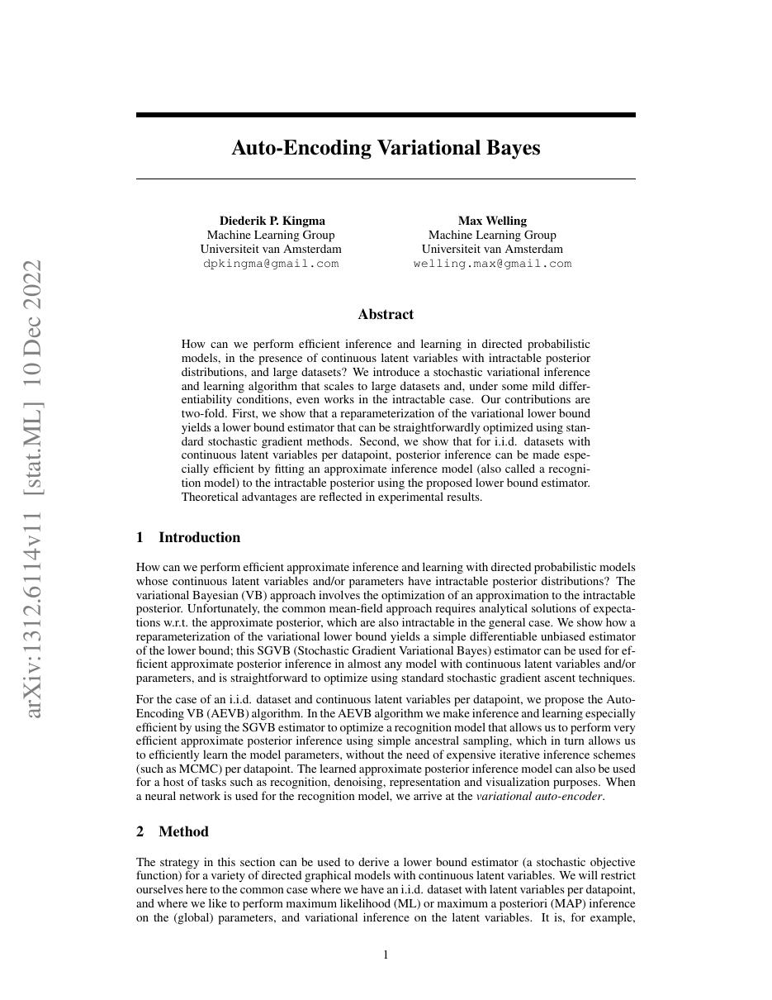
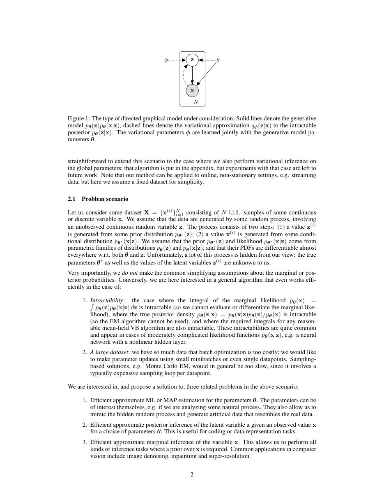
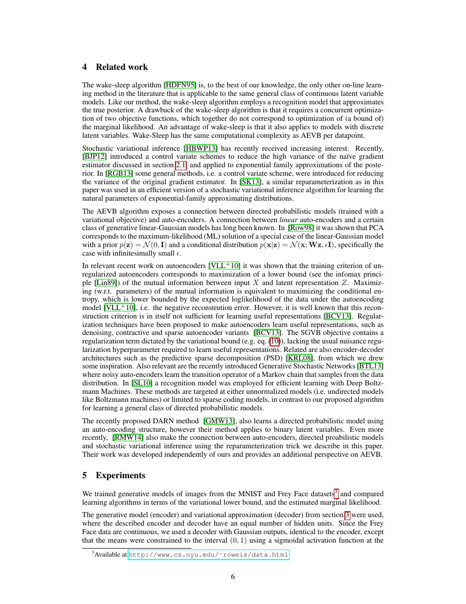
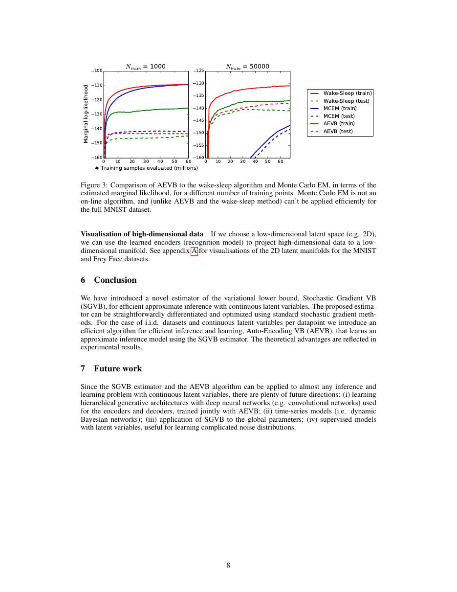

# 论文中文解读：《Auto-Encoding Variational Bayes》

## 一、它解决了什么

VAE 把生成模型学习改写为可微的变分推断问题：用编码器近似难算的后验，再用解码器学习数据分布。它是现代隐变量生成模型和 latent diffusion 的重要前身。

## 二、核心机制

核心目标是最大化 ELBO：重构项鼓励潜变量保留样本信息，KL 项把近似后验拉向先验。重参数化技巧把随机采样写成 μ+σ⊙ε，使梯度能穿过采样节点；同一个推断网络摊销了每个样本单独优化后验的成本。

## 三、为什么成为主线

VAE 建立了“神经网络参数化概率模型 + 端到端变分推断”的通用模板，后来被层次 VAE、离散 VAE、VQ-VAE 和潜空间扩散广泛继承。

## 四、应该怎样读证据

论文里的结果首先证明方法在当时数据、模型规模、硬件和评测协议下成立。跨年代比较时要统一参数量、训练 tokens、数据质量、上下文长度、推理预算与系统实现，不能只横比单个最佳分数。

## 五、局限与易误读点

简单高斯后验和像素级似然常导致模糊样本；强解码器可能忽略潜变量，出现 posterior collapse。ELBO 是下界，不等于真实似然或感知质量。

## 六、放进十年演进史

先读 VAE，再读 DDPM 与 Latent Diffusion，可看清生成建模从显式潜变量、逐步去噪到压缩潜空间的变化。

## 七、原文入口

[官方论文/页面](https://arxiv.org/abs/1312.6114)

## 八、原文论证链

论文先指出连续隐变量模型的困难：边缘似然 $p_\theta(x)=\int p_\theta(x,z)\,dz$ 和真实后验 $p_\theta(z\mid x)$ 通常不可积。作者用 recognition model $q_\phi(z\mid x)$ 摊销每个样本的推断，再通过重参数化让随机样本对参数可微。论证依次是：推导可优化的变分下界；构造 SGVB 估计器；在 MNIST 和 Frey Face 上比较下界、似然估计和收敛。结论不是泛泛的“自编码器可生成”，而是生成模型与近似推断网络可以用同一套随机梯度联合训练。

> 原文定位：[PDF 文件第 1 页](paper.pdf#page=1) · [对应截图](rendered_figures/page-1.jpg)

## 九、公式逐步解释

恒等式为
$$
\log p_\theta(x)=\mathcal L(\theta,\phi;x)
+D_{\mathrm{KL}}\!\left(q_\phi(z\mid x)\Vert p_\theta(z\mid x)\right).
$$
KL 非负，所以
$$
\mathcal L=
\mathbb E_{q_\phi(z\mid x)}[\log p_\theta(x\mid z)]
-D_{\mathrm{KL}}(q_\phi(z\mid x)\Vert p_\theta(z))
$$
是对数似然下界。第一项要求 latent 足以解释样本；第二项使编码分布接近先验，以便从先验生成。

对角高斯后验采用
$$
\epsilon\sim\mathcal N(0,I),\qquad
z=\mu_\phi(x)+\sigma_\phi(x)\odot\epsilon.
$$
随机性被移到参数无关的 $\epsilon$，梯度可穿过 $\mu,\sigma$。常说的“重构损失 + KL”不是随意拼接，而是负 ELBO 的两部分。

> 原文定位：[PDF 文件第 2 页](paper.pdf#page=2) · [对应截图](rendered_figures/page-2.jpg)

## 十、实验怎样读

不要只看生成样本。下界回答目标是否改善，重要性采样近似的似然回答概率模型是否变好，训练时间曲线回答估计器是否实用。二维 latent 的平滑图只说明局部结构，不能单独证明高维密度估计优越。

> 原文定位：[PDF 文件第 6 页](paper.pdf#page=6) · [对应截图](rendered_figures/page-6.jpg)

## 十一、复现检查

- 输出 $\log\sigma^2$ 并使用数值稳定的 KL 公式。
- 明确重构项和 KL 的 sum/mean 口径。
- 训练从 $q_\phi(z\mid x)$ 采样，生成从 $p(z)$ 采样。
- posterior collapse 要同时检查解码器容量、KL 权重和 latent 使用率。

## 十二、常见误读

重参数化没有消除随机性，只改变随机变量的表达。ELBO 更高首先意味着似然下界更好，不自动等于感知样本更好；$\beta$-VAE 等是后续变化。

> 原文定位：[PDF 文件第 8 页](paper.pdf#page=8) · [对应截图](rendered_figures/page-8.jpg)

## 原文证据导航

以下页码按仓库内 PDF 的**文件页码**计，不等同于论文印刷页码。建议先读本节所指原文，再回看上面的中文解释。

- [打开原始 PDF](paper.pdf)
- [打开可检索文本](paper.txt)

| 中文笔记中的证据 | 原文位置 | 复核重点 |
|---|---|---|
| 原文首页、摘要与问题定义 | [PDF 文件第 1 页](paper.pdf#page=1) · [截图](rendered_figures/page-1.jpg) | 回到该页上下文，复核定义、图表或实验论证 |
| 核心方法、架构或算法定义所在关键页 | [PDF 文件第 2 页](paper.pdf#page=2) · [截图](rendered_figures/page-2.jpg) | 回到该页上下文，复核定义、图表或实验论证 |
| 实验、结果或关键分析所在原文页 | [PDF 文件第 6 页](paper.pdf#page=6) · [截图](rendered_figures/page-6.jpg) | 回到该页上下文，复核定义、图表或实验论证 |
| 讨论、结论或补充分析所在原文页 | [PDF 文件第 8 页](paper.pdf#page=8) · [截图](rendered_figures/page-8.jpg) | 回到该页上下文，复核定义、图表或实验论证 |
