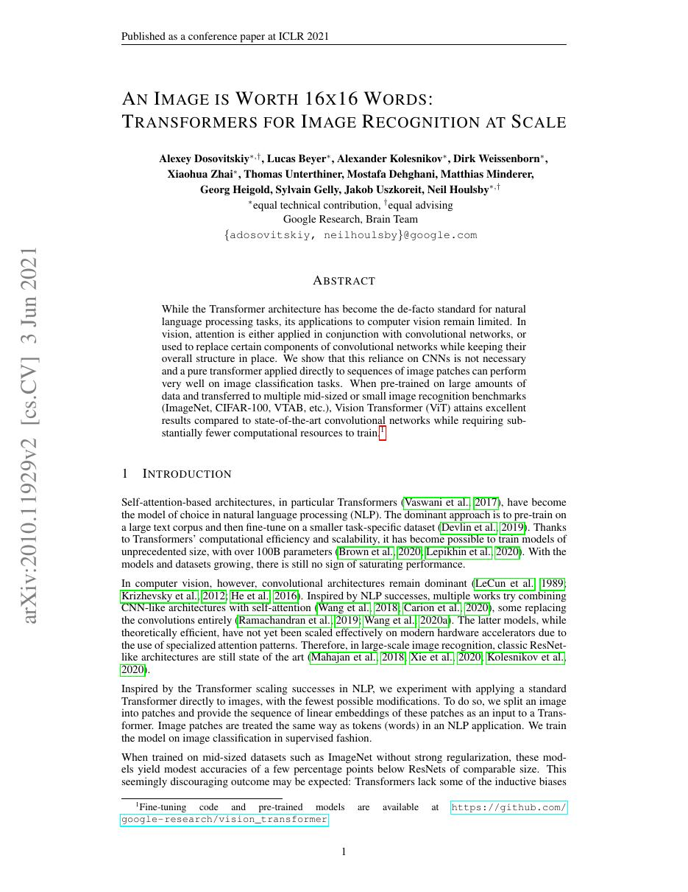
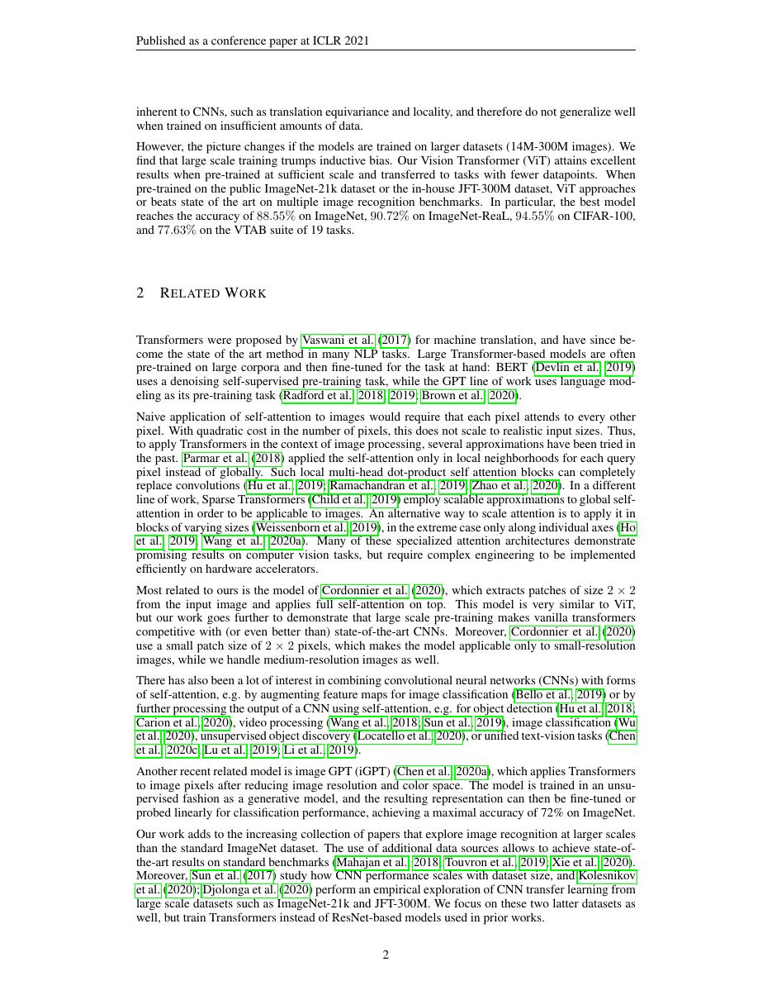
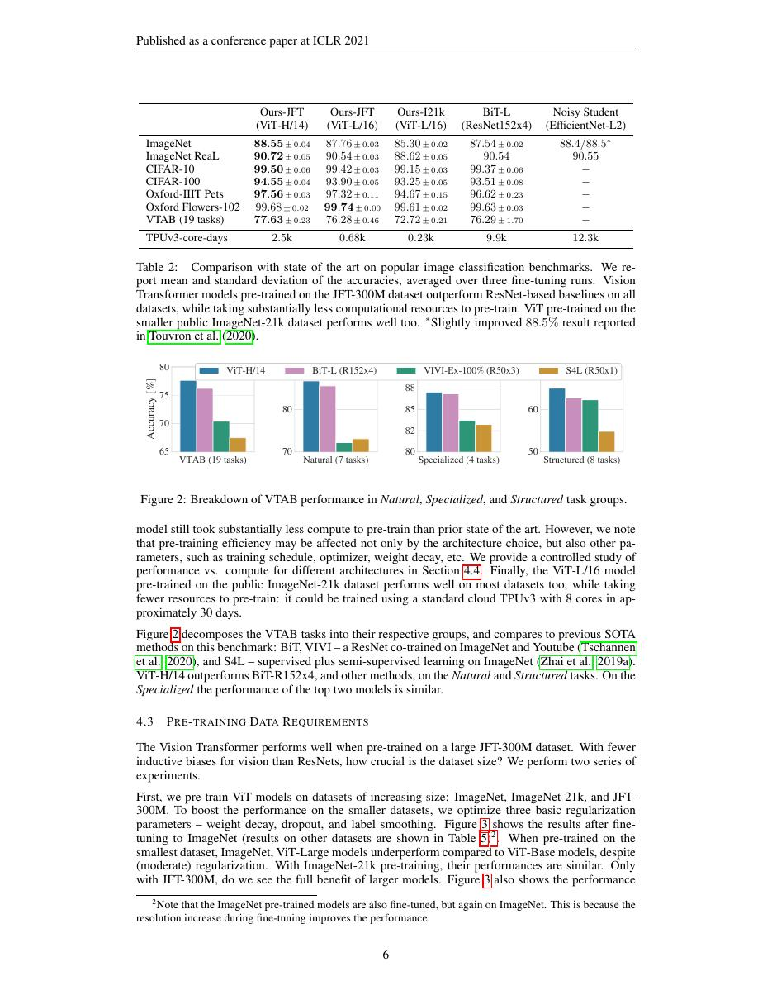
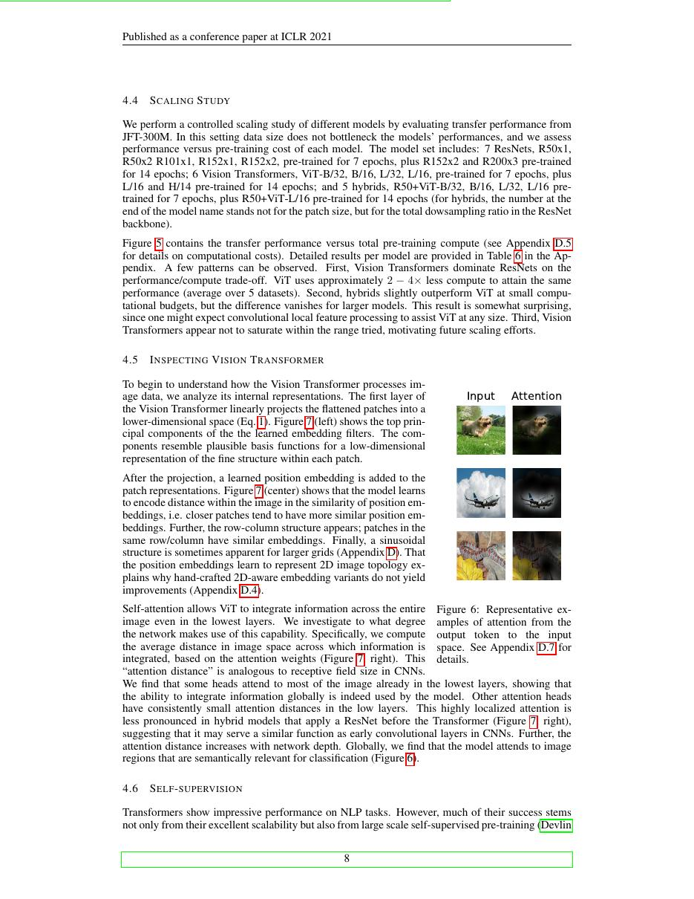

# 论文中文解读：《An Image is Worth 16×16 Words: Transformers for Image Recognition at Scale》

## 一、它解决了什么

ViT 把图像切成固定 patch 并当作 token 序列交给标准 Transformer encoder，证明卷积并非视觉主干的必要条件。

## 二、核心机制

每个 patch 展平后线性投影，加 class token 与位置编码；其余几乎沿用 Transformer。缺少局部和平移归纳偏置使小数据训练吃亏，但在 JFT 等大数据预训练后可超过强 CNN。

## 三、为什么成为主线

ViT 打通语言与视觉的统一 token/Transformer 范式，成为 CLIP、扩散 Transformer 和多模态模型的基础。

## 四、证据应该怎样读

速度、显存、精度或 benchmark 数字只在论文给定的模型、数据、硬件、kernel 版本和评测预算下成立。跨论文比较前要统一训练 tokens、输入长度、batch、精度、采样/思考预算与是否使用工具。

## 五、局限与易误读点

全局 attention 随 patch 数平方增长，高分辨率成本高；结果依赖大规模私有预训练数据。patch 化还可能损失细粒度边界。

## 六、放进十年演进史

Swin 用分层 shifted windows 恢复局部性和多尺度；CLIP 改变监督信号；DiT 把 ViT 风格块用于扩散生成。

## 七、原文入口

[官方论文/页面](https://arxiv.org/abs/2010.11929)

## 八、原文论证链

ViT 询问：如果把图像切成固定大小 patch，并把每个 patch 当作 token，标准 Transformer encoder 能否在大规模数据上替代卷积网络？作者将展平 patch 线性投影，加上位置 embedding 与分类 token，然后几乎原样使用 Transformer。核心结论带有条件：在中等规模数据上，卷积的局部性和平移等变先验更省样本；在 JFT-300M 等大数据预训练后，较弱先验的 ViT 能以规模换取更强迁移性能。

> 原文定位：[PDF 文件第 1 页](paper.pdf#page=1) · [对应截图](rendered_figures/page-1.jpg)

## 九、token 化与复杂度

图像 $x\in\mathbb R^{H\times W\times C}$ 被切成 $N=HW/P^2$ 个 $P\times P$ patch。初始序列为
$$
z_0=[x_{\rm class};x_p^1E;\ldots;x_p^NE]+E_{\rm pos}.
$$
每层是 MSA 与 MLP 的 pre-norm 残差块，最终用 class token 分类。attention 对 token 数是 $O(N^2)$，所以 patch 变小会平方增加交互成本；例如空间边长减半，token 数变四倍，attention 配对变十六倍。

> 原文定位：[PDF 文件第 2 页](paper.pdf#page=2) · [对应截图](rendered_figures/page-2.jpg)

## 十、实验怎样读

应把 ImageNet 从头训练、ImageNet-21k 预训练和 JFT 预训练分开看。ViT 的优势随数据规模增长，直接支持“归纳偏置—数据量”论点。线性探测不同层的位置/纹理信息与 attention distance 图用于解释行为，但不是因果证明。与 ResNet 比较还应核对预训练计算和数据。

> 原文定位：[PDF 文件第 6 页](paper.pdf#page=6) · [对应截图](rendered_figures/page-6.jpg)

## 十一、复现检查

- patch projection 可用 stride 等于 patch size 的卷积等价实现。
- 更换分辨率时位置 embedding 需二维插值，并记录方法。
- 数据增强、正则化和预训练规模对小数据结果影响很大。
- 比较吞吐时同时报告 patch size、输入分辨率和 token 数。

## 十二、常见误读

ViT 不是证明图像不需要任何空间先验：patch 切分、位置编码和增强本身仍注入结构。论文也没有声称小数据上天然优于 CNN；相反，数据规模依赖是其重要实验结论。

> 原文定位：[PDF 文件第 8 页](paper.pdf#page=8) · [对应截图](rendered_figures/page-8.jpg)

## 原文证据导航

以下页码按仓库内 PDF 的**文件页码**计，不等同于论文印刷页码。建议先读本节所指原文，再回看上面的中文解释。

- [打开原始 PDF](paper.pdf)
- [打开可检索文本](paper.txt)

| 中文笔记中的证据 | 原文位置 | 复核重点 |
|---|---|---|
| 原文首页、摘要与问题定义 | [PDF 文件第 1 页](paper.pdf#page=1) · [截图](rendered_figures/page-1.jpg) | 回到该页上下文，复核定义、图表或实验论证 |
| 核心方法、架构或算法定义所在关键页 | [PDF 文件第 2 页](paper.pdf#page=2) · [截图](rendered_figures/page-2.jpg) | 回到该页上下文，复核定义、图表或实验论证 |
| 实验、结果或关键分析所在原文页 | [PDF 文件第 6 页](paper.pdf#page=6) · [截图](rendered_figures/page-6.jpg) | 回到该页上下文，复核定义、图表或实验论证 |
| 讨论、结论或补充分析所在原文页 | [PDF 文件第 8 页](paper.pdf#page=8) · [截图](rendered_figures/page-8.jpg) | 回到该页上下文，复核定义、图表或实验论证 |
