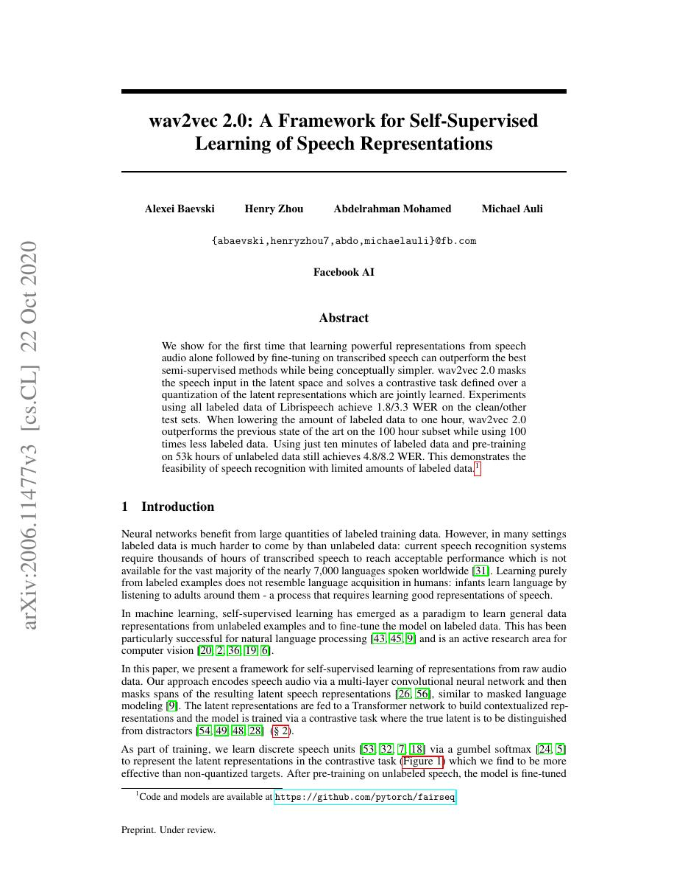
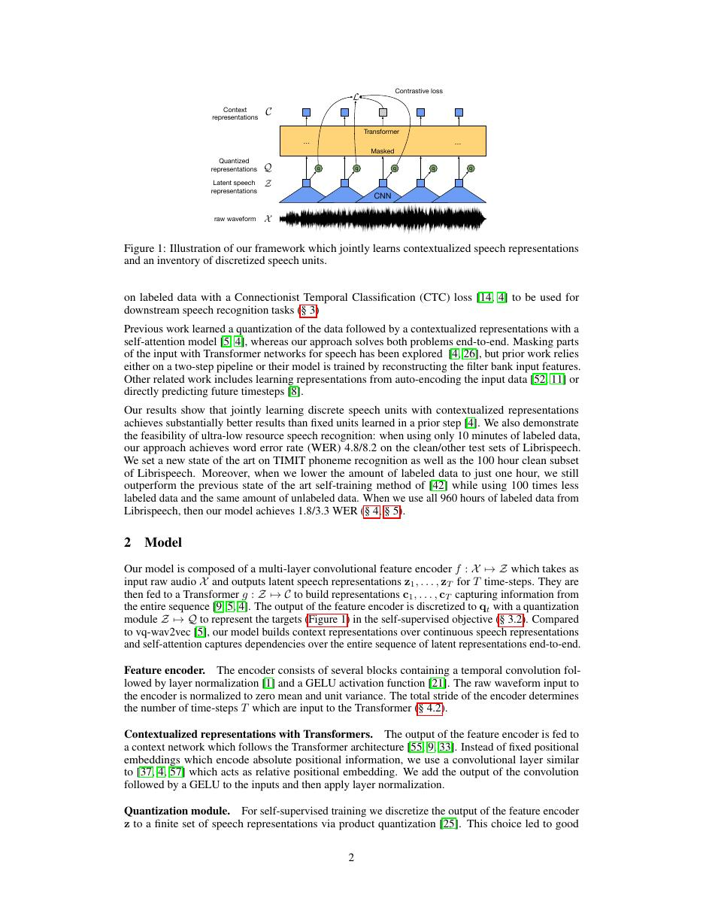
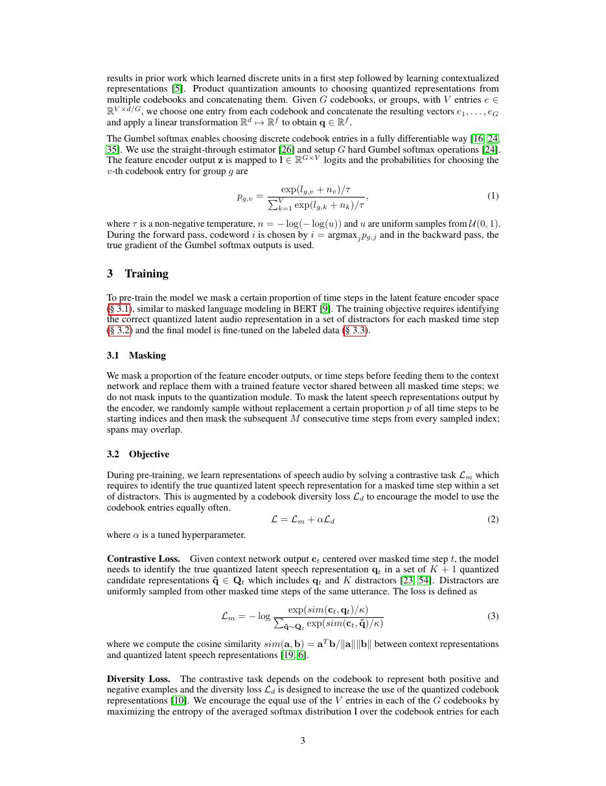
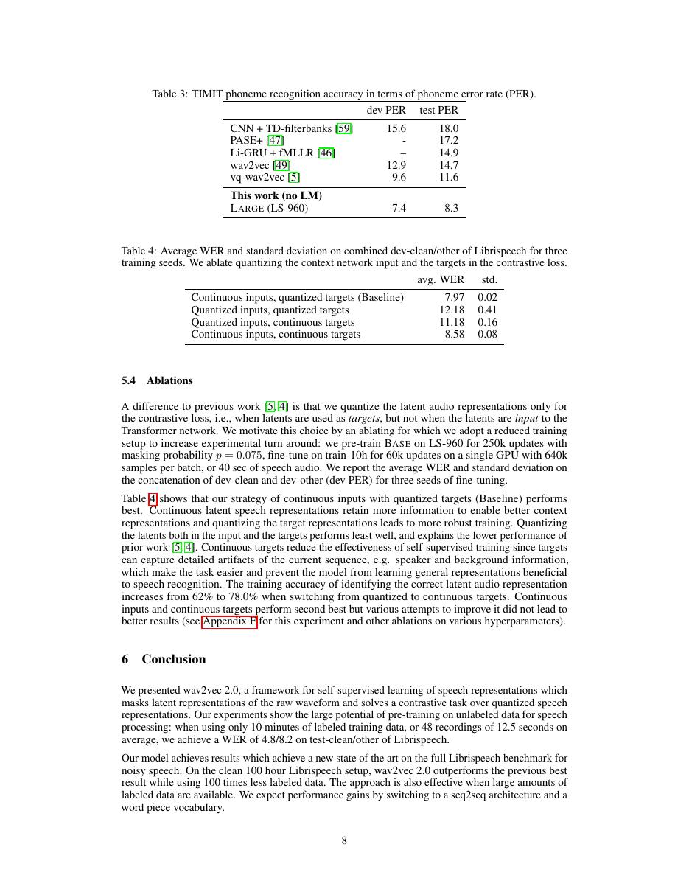

# 论文中文解读：《wav2vec 2.0: A Framework for Self-Supervised Learning of Speech Representations》

## 一、它解决了什么

wav2vec 2.0 在原始语音上做自监督预训练，再用少量转写微调，显著降低 ASR 对标注音频的依赖。

## 二、核心机制

卷积 encoder 把 waveform 变成 latent，随机 mask 后由 Transformer 建模上下文；离散量化模块提供 contrastive targets，模型从负样本中识别真实量化表示。微调通常接 CTC head。

## 三、为什么成为主线

它把 BERT 式遮盖预训练迁移到连续语音，是现代 speech foundation model 的关键起点。

## 四、证据应该怎样读

速度、显存、精度或 benchmark 数字只在论文给定的模型、数据、硬件、kernel 版本和评测预算下成立。跨论文比较前要统一训练 tokens、输入长度、batch、精度、采样/思考预算与是否使用工具。

## 五、局限与易误读点

量化 codebook、负采样和大规模无标注音频决定效果；预训练数据语言/口音偏差会传到下游。CTC 解码仍需语言模型或搜索补强。

## 六、放进十年演进史

Whisper 走另一条路线：用海量弱监督转写直接训练多任务 encoder–decoder，而非先自监督表征再 CTC。

## 七、原文入口

[官方论文/页面](https://arxiv.org/abs/2006.11477)

## 八、原文论证链

wav2vec 2.0 的问题是：语音有大量无标注音频，却缺少转写。模型先用卷积编码器把波形压为潜在帧，再随机遮蔽一段连续帧；Transformer 根据双向上下文恢复被遮位置的离散语音单元。离散目标不是人工标签，而是对潜在表示做 product quantization 得到，训练采用对比学习。之后只需少量转写数据，用 CTC 微调即可识别文本。

> 原文定位：[PDF 文件第 1 页](paper.pdf#page=1) · [对应截图](rendered_figures/page-1.jpg)

## 九、量化与对比目标

量化器从多个 codebook group 各选一个条目并拼接，Gumbel-softmax 使选择可训练。对被遮位置 $t$，上下文表示 $c_t$ 要在真实量化目标 $q_t$ 和同句其他位置的负样本中辨认正确项：
$$
L_m=-\log\frac{\exp(\operatorname{sim}(c_t,q_t)/\kappa)}
{\sum_{\tilde q\in Q_t}\exp(\operatorname{sim}(c_t,\tilde q)/\kappa)}.
$$
另加 diversity loss 鼓励 codebook 被均匀使用，避免只选择少数码字。mask 发生在潜在序列，不是直接把原始波形置零。

> 原文定位：[PDF 文件第 2 页](paper.pdf#page=2) · [对应截图](rendered_figures/page-2.jpg)

## 十、实验怎样读

论文用 10 分钟、1 小时、10 小时、100 小时等不同标注量微调，关键证据是标注越少，预训练相对优势越大。在 LibriSpeech 上还分别报告有无外部语言模型的 WER；语言模型能显著改善解码，比较时不能混在一起。大模型使用更多无标注语音，增益同时来自架构和数据。

> 原文定位：[PDF 文件第 3 页](paper.pdf#page=3) · [对应截图](rendered_figures/page-3.jpg)

## 十一、复现检查

- 卷积下采样决定每个 latent step 对应的毫秒数，mask span 要在该尺度配置。
- CTC 词表、blank、重复折叠和 beam decoder 必须明确。
- 监控 codebook perplexity，过低通常表示量化坍塌。
- 预训练与微调音频归一化、采样率必须一致。

## 十二、常见误读

模型并不是把语音直接“翻译成离散 token”后训练普通 BERT；连续上下文网络、量化目标和对比损失共同作用。低标注 WER 也不是零标注语音识别，最终仍使用转写数据微调。

> 原文定位：[PDF 文件第 8 页](paper.pdf#page=8) · [对应截图](rendered_figures/page-8.jpg)

## 原文证据导航

以下页码按仓库内 PDF 的**文件页码**计，不等同于论文印刷页码。建议先读本节所指原文，再回看上面的中文解释。

- [打开原始 PDF](paper.pdf)
- [打开可检索文本](paper.txt)

| 中文笔记中的证据 | 原文位置 | 复核重点 |
|---|---|---|
| 原文首页、摘要与问题定义 | [PDF 文件第 1 页](paper.pdf#page=1) · [截图](rendered_figures/page-1.jpg) | 回到该页上下文，复核定义、图表或实验论证 |
| 核心方法、架构或算法定义所在关键页 | [PDF 文件第 2 页](paper.pdf#page=2) · [截图](rendered_figures/page-2.jpg) | 回到该页上下文，复核定义、图表或实验论证 |
| 实验、结果或关键分析所在原文页 | [PDF 文件第 3 页](paper.pdf#page=3) · [截图](rendered_figures/page-3.jpg) | 回到该页上下文，复核定义、图表或实验论证 |
| 讨论、结论或补充分析所在原文页 | [PDF 文件第 8 页](paper.pdf#page=8) · [截图](rendered_figures/page-8.jpg) | 回到该页上下文，复核定义、图表或实验论证 |
