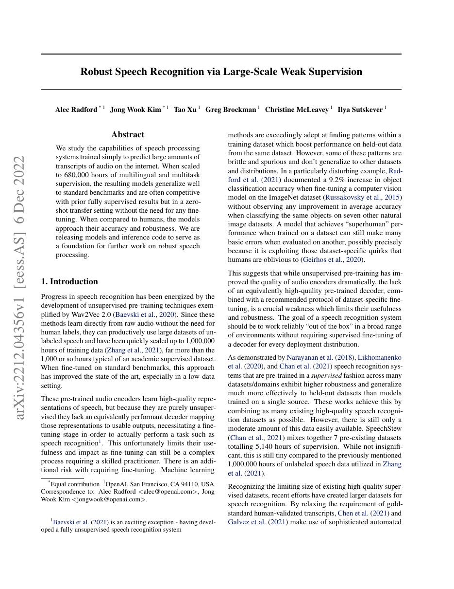
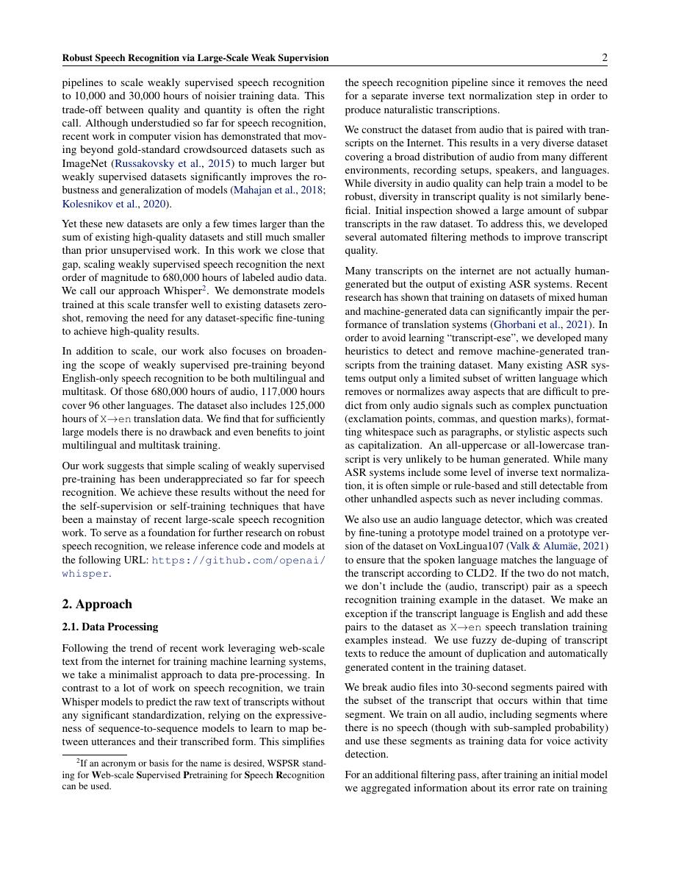
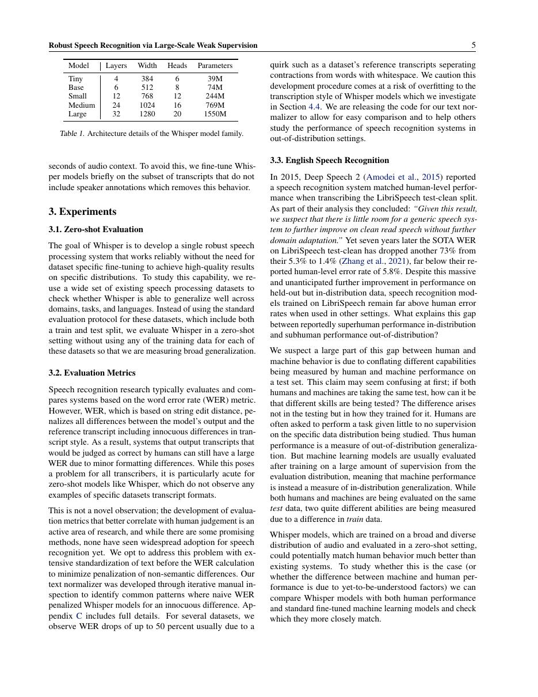
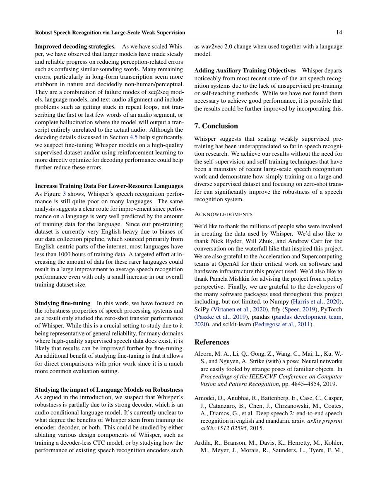

# 论文中文解读：《Robust Speech Recognition via Large-Scale Weak Supervision》

## 一、它解决了什么

Whisper 用 68 万小时弱监督多语言音频训练统一 encoder–decoder Transformer，强调跨数据集鲁棒性而非只刷单一 ASR benchmark。

## 二、核心机制

log-Mel spectrogram 送入 audio encoder，text decoder 通过特殊 token 统一语言识别、转写、翻译、时间戳等任务。大规模噪声标签和多任务混合减少对精细标注与特定数据集微调的依赖。

## 三、为什么成为主线

它成为开放语音 foundation model 的代表，展示弱监督规模可换取 zero-shot robustness。

## 四、证据应该怎样读

速度、显存、精度或 benchmark 数字只在论文给定的模型、数据、硬件、kernel 版本和评测预算下成立。跨论文比较前要统一训练 tokens、输入长度、batch、精度、采样/思考预算与是否使用工具。

## 五、局限与易误读点

训练数据不可完整复现，弱标签含错字、语言和地域偏差；自回归 decoder 会幻觉并增加延迟。zero-shot 不代表所有口音和低资源语言公平。

## 六、放进十年演进史

与 wav2vec 2.0 比较自监督表征+CTC 和弱监督 seq2seq 两条路线；与 Transformer 原文联系 encoder–decoder 结构。

## 七、原文入口

[官方论文/页面](https://arxiv.org/abs/2212.04356)

## 八、原文论证链

Whisper 研究弱监督规模能否替代精细的语音任务专用管线。作者从互联网收集约 68 万小时多语言、多任务音频—文本对，用统一 encoder–decoder Transformer 训练语音识别、语音翻译、语言识别和时间戳预测。任务、语言和是否转写通过特殊 token 指定，所有输出都表示为文本 token 序列。

中心证据不是某个标准集上的最高分，而是无需数据集专门微调时，对多种口音、噪声和领域的鲁棒零样本泛化。大规模弱标签有错误，但覆盖范围带来迁移优势。

> 原文定位：[PDF 文件第 1 页](paper.pdf#page=1) · [对应截图](rendered_figures/page-1.jpg)

## 九、输入输出接口

音频重采样后转为 log-Mel spectrogram，encoder 生成声学表示；decoder 自回归预测
$$
p(y\mid x)=\prod_t p(y_t\mid y_{<t},\operatorname{Enc}(x)).
$$
序列前缀含 start-of-transcript、语言、任务、是否带时间戳等 token。时间戳也量化成离散 token，因此模型无需独立的 CTC 对齐头。

训练数据经启发式过滤、语言识别和去重。弱监督的“弱”指转写来自已有互联网元数据/模型而非全部人工精标，不等于没有监督。

> 原文定位：[PDF 文件第 2 页](paper.pdf#page=2) · [对应截图](rendered_figures/page-2.jpg)

## 十、实验怎样读

论文在多个 ASR benchmark 上零样本评测，并与监督模型比较 WER；还按数据集、语言和模型尺寸分析。阅读结果要区分英文转写、多语转写与翻译。部分标准集上专用微调模型更强，而 Whisper 在跨域平均和长尾场景更稳，这正是论文论点。

> 原文定位：[PDF 文件第 5 页](paper.pdf#page=5) · [对应截图](rendered_figures/page-5.jpg)

## 十一、复现检查

- 固定 30 秒切片、Mel 参数、采样率和文本规范化。
- 解码需记录 beam/temperature fallback、no-speech 阈值和时间戳规则。
- WER 对大小写、标点、数字规范化极敏感，必须使用相同 normalizer。
- 多语数据比例与伪标签过滤决定低资源语言效果。

## 十二、常见误读

Whisper 不是纯自监督模型，它使用海量音频—文本监督；“zero-shot”是下游数据集不微调。鲁棒性也不代表不会幻觉，静音、背景音乐或分段错误可能诱发与音频无关的文本。

> 原文定位：[PDF 文件第 14 页](paper.pdf#page=14) · [对应截图](rendered_figures/page-14.jpg)

## 原文证据导航

以下页码按仓库内 PDF 的**文件页码**计，不等同于论文印刷页码。建议先读本节所指原文，再回看上面的中文解释。

- [打开原始 PDF](paper.pdf)
- [打开可检索文本](paper.txt)

| 中文笔记中的证据 | 原文位置 | 复核重点 |
|---|---|---|
| 原文首页、摘要与问题定义 | [PDF 文件第 1 页](paper.pdf#page=1) · [截图](rendered_figures/page-1.jpg) | 回到该页上下文，复核定义、图表或实验论证 |
| 核心方法、架构或算法定义所在关键页 | [PDF 文件第 2 页](paper.pdf#page=2) · [截图](rendered_figures/page-2.jpg) | 回到该页上下文，复核定义、图表或实验论证 |
| 实验、结果或关键分析所在原文页 | [PDF 文件第 5 页](paper.pdf#page=5) · [截图](rendered_figures/page-5.jpg) | 回到该页上下文，复核定义、图表或实验论证 |
| 讨论、结论或补充分析所在原文页 | [PDF 文件第 14 页](paper.pdf#page=14) · [截图](rendered_figures/page-14.jpg) | 回到该页上下文，复核定义、图表或实验论证 |
