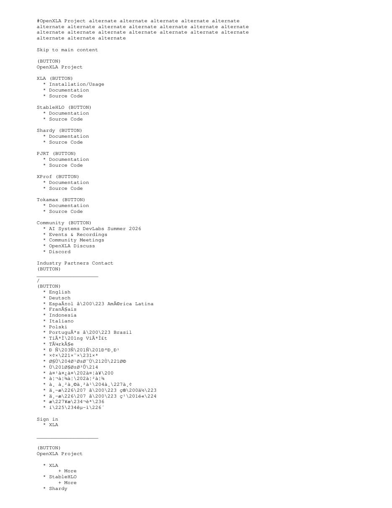
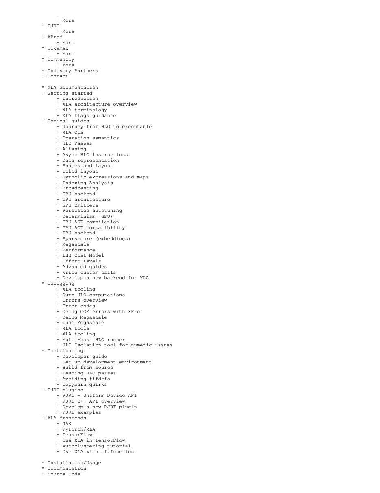
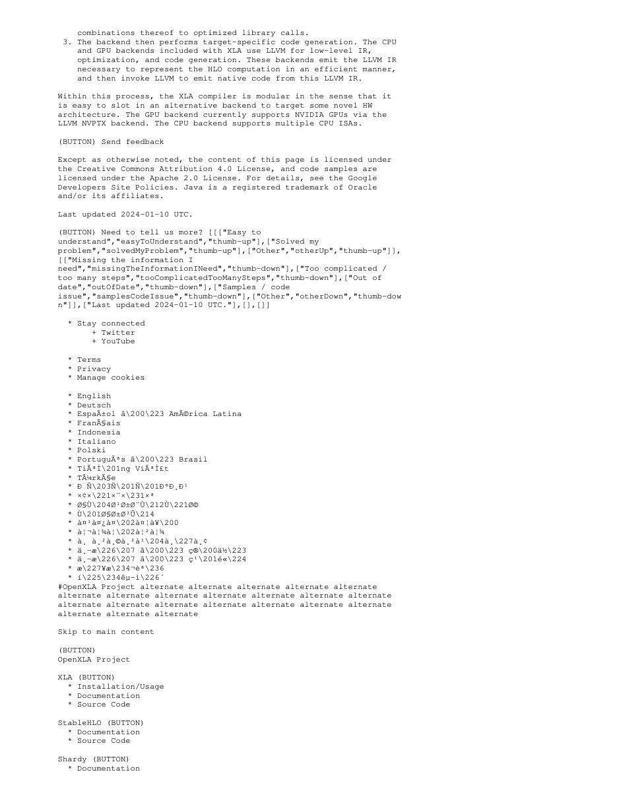
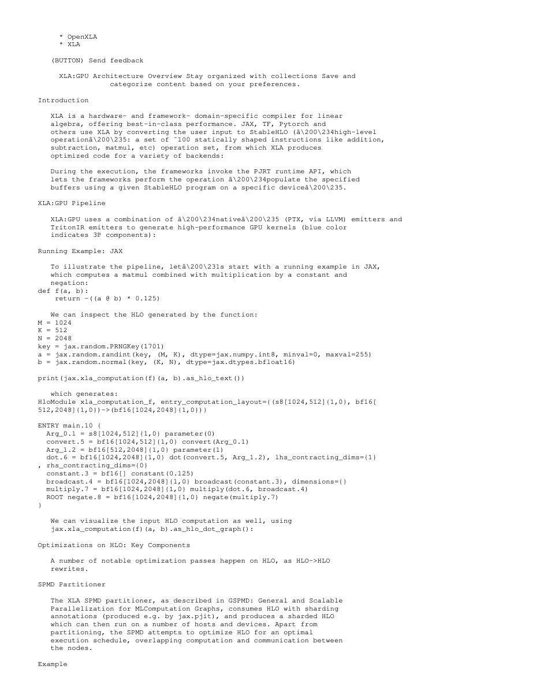

# 中文精读：《XLA / OpenXLA Architecture》

## 一、它解决了什么

XLA 把框架图转换为 HLO/StableHLO，进行全图分析、fusion、buffer assignment 与目标相关 codegen，是 TensorFlow/JAX 以及部分 PyTorch 路线的重要生产编译器。

## 二、编译抽象与优化路径

现代流程由前端产生 StableHLO，XLA 转内部 HLO 做 CSE、代数化简、fusion、layout、sharding 和内存规划；GPU 后端在库调用、LLVM/PTX emitter 与 Triton emitter 间选择，经 PJRT 执行。当前目录的 PDF 是官方 architecture 与 GPU architecture 页面在 2026-10-05 的文本快照，不是学术论文。

## 三、为什么影响后续系统

XLA 代表从逐 op runtime 转向 whole-subgraph specialization：已知 shape/type 后可消除中间张量、减少 kernel launch，并通过统一 IR 接入 TPU/CPU/GPU。

## 四、怎样读性能结果

编译器结果必须同时记录 frontend、shape、batch、精度、目标硬件、vendor library、调优预算和编译时间。单算子加速不等于端到端同倍加速，首次编译延迟也不能与缓存命中后的 steady-state 混为一谈。

## 五、局限与工程边界

静态/符号 shape、编译时间、图切分和动态控制流仍会限制覆盖；fusion 越大也可能增加寄存器压力。官方架构随版本变化，结果与今天实现不能倒推 2017 XLA。

## 六、放进十年编译器演进史

时间线上先看 XLA 的 HLO/后端模式，再看 MLIR 的多 dialect 基础设施；PyTorch 2 用 Dynamo 捕获动态图、Inductor/Triton 生成 kernel。

## 七、原文入口

[论文/官方页面](https://openxla.org/xla/architecture)

## 八、把编译链按原始语义拆开

XLA 的核心不是“把 TensorFlow 转成 CUDA”一句话，而是先把框架计算转换为 HLO/StableHLO 这类显式描述张量 shape、element type、layout 与控制流的 IR，再在全图范围做代数化简、常量折叠、CSE、fusion、layout assignment 和 buffer assignment，最后交给 CPU/GPU/TPU 后端。whole-graph 视角使编译器能消除框架逐 op 执行产生的中间张量和 launch 边界。

当前目录保存的是官方架构文档快照，不是某一年的固定论文。阅读时应区分早期 TensorFlow XLA、今日 OpenXLA/StableHLO、GPU Triton emitter 与 PJRT runtime；不能把 2026 文档里的组件全部倒推成 2017 已存在。

> 原文定位：[PDF 文件第 1 页](paper.pdf#page=1) · [对应截图](rendered_figures/page-1.jpg)

## 九、HLO、fusion 与内存规划

HLO 保留高层张量算子，便于证明 shape 和语义；fusion 把 producer/consumer 包进一个融合 computation，使中间值停留在寄存器或片上存储。收益近似来自减少
$$
T_{\rm launch}+{\rm bytes}_{\rm HBM}/BW
$$
而不一定减少数学 FLOPs。过度融合又会增加寄存器、降低 occupancy，或阻止调用高效 vendor library。

buffer assignment 根据 live range 复用物理存储；layout pass 决定逻辑维度如何映射物理内存。后端在库调用、LLVM/PTX、Triton 等 codegen 路径中选择，runtime/PJRT 负责设备、可执行文件与 buffer 生命周期。

> 原文定位：[PDF 文件第 2 页](paper.pdf#page=2) · [对应截图](rendered_figures/page-2.jpg)

## 十、怎样验证“优化有效”

不能只看 HLO 数量变少。应同时查看 fusion 前后 HLO、生成 kernel 数、HBM 流量、峰值显存、编译时间与端到端延迟。算子 microbenchmark 变快但图切分产生额外 copy/同步时，整体可能变慢。动态 shape 和 recompilation cache 命中率也属于性能结论。

> 原文定位：[PDF 文件第 4 页](paper.pdf#page=4) · [对应截图](rendered_figures/page-4.jpg)

## 十一、工程审核清单

- 保存 StableHLO/HLO dump 和 pass pipeline，确保比较的是同一版本。
- 检查图断点、host callback、unsupported op 与 device transfer。
- 记录静态/动态 shape、编译缓存、warmup 和首次编译延迟。
- fusion 回归要看寄存器、spill、occupancy 与数值一致性。

## 十二、常见误读

XLA 是编译器系统而非一个 AI 模型；采用 XLA 也不自动得到最优 kernel。高层图优化、低层代码生成、运行时和硬件库共同决定结果。

> 原文定位：[PDF 文件第 7 页](paper.pdf#page=7) · [对应截图](rendered_figures/page-7.jpg)

## 原文证据导航

以下页码按仓库内 PDF 的**文件页码**计，不等同于论文印刷页码。建议先读本节所指原文，再回看上面的中文解释。

- [打开原始 PDF](paper.pdf)
- [打开可检索文本](paper.txt)

| 中文笔记中的证据 | 原文位置 | 复核重点 |
|---|---|---|
| 原文首页、摘要或官方架构概览 | [PDF 文件第 1 页](paper.pdf#page=1) · [截图](rendered_figures/page-1.jpg) | 回到该页上下文，复核定义、图表或实验论证 |
| IR、架构、搜索空间或执行模型关键页 | [PDF 文件第 2 页](paper.pdf#page=2) · [截图](rendered_figures/page-2.jpg) | 回到该页上下文，复核定义、图表或实验论证 |
| 实验、性能或设计分析所在原文页 | [PDF 文件第 4 页](paper.pdf#page=4) · [截图](rendered_figures/page-4.jpg) | 回到该页上下文，复核定义、图表或实验论证 |
| 讨论、结论或补充设计所在原文页 | [PDF 文件第 7 页](paper.pdf#page=7) · [截图](rendered_figures/page-7.jpg) | 回到该页上下文，复核定义、图表或实验论证 |
